```{r setup, include=FALSE}
knitr::opts_chunk$set(echo = F,
                      message =F,
                      warning =F,
                      fig.height=3)
#library("tidyverse")
#library("mosaic")
#library("ggrepel")
#update_geom_defaults("label", list(family = "Fira Sans Condensed"))
```

**Note:** Answers may be longer than I would deem sufficient on an exam. Some might vary slightly based on points of interest, examples, or personal experience. These suggested answers are designed to give you both the answer and a short explanation of why it is the answer.

# Concepts

## Question 1

#### Explain, in your own words, what a strategy means in (sequential) games. 

A (pure) strategy is a *complete* list of choices for a player to make in response to each possible contingency (in terms of a game tree, each possible decision node for a player). 

Note (for later, when we learn about mixed strategies) that strategies are "pure" if the choices made at each respective contingency are always the same, conditional on reaching that contigency.

## Question 2

#### Draw a simple game tree between two players (come up with any simple scenario, even an abstract one). Define, and indicate on the tree: 

- The root node
- Decision nodes
- Terminal nodes
- Decisions available to each player
- Payoffs for each player
- Strategies available to each player

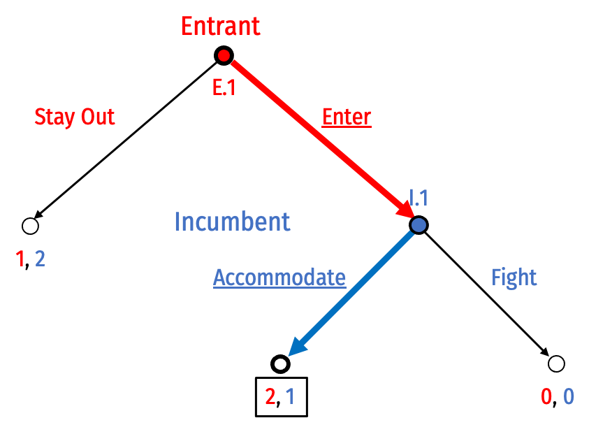

Note that all I was looking for here was you to fully draw a game tree and be familiar with all the features of one. You did not need to solve your game, as I did. Fully labeled tree is fine, you don't need to write out everything as I did.

- Root node: E.1
- Decision nodes (and decisions available):
  - Entrant at E.1: decides to Stay Out or Enter
  - Incumbent at I.1: decides to Fight or Accommodate
- Terminal nodes (and payoffs):
  - (Stay Out) where players earn (1,2)
  - (Enter, Accommodate) where players earn (2,1)
  - (Enter, Fight) where players earn (0,0)
- Strategies possible:
  - For Entrant: Enter or Stay Out (at E.1)
  - For Incumbent: Fight or Accommodate (at I.1)

I have highlighted the rollback equilibrium on the tree: (Enter, Accommodate).

# Problems

3. In an alternate version of the *Century Mark* game we played in class, two players take turns choosing a number between 1—10 (inclusive) to add to the count (starting at 0). The first player to bring the count to 100 *loses* this game.

> Describe *Player 2*'s optimal strategy, and fully describe your reasoning. Does this game have a first-mover advantage or a second-mover advantage?

1. Player 2 needs to bring the total to 99 on their final turn. Then any number Player 1 chooses (1-10) brings the count to at least 100.
2. To ensure the count gets to 99 in Player 2's last turn, they need to bring the count in their previous turn to 88. That way, regardless of what number Player 1 chooses to add to 88, Player 2 can choose a number (1-10) to add to the count (89-98) to bring it to 99.
3. To ensure the count gets to 88 in Player 2's penultimate turn, they need to bring the count in their previous turn to 77. That way, regardless of what number Player 1 chooses to add to 77, Player 2 can choose a number (1-10) to add to the count (78-87) to bring it to 88. 
4. Follow this logic backward to 66, 55, 44, 33, 22, 11...
5. On the first turn, Player 1 will choose any number between 1-10 bringing the count to anything from 1-10. Player 2 must choose anything (1-10) and bring the count to 11. Regardless of what Player 1 has chosen, they lose the game if Player 2 sticks to this strategy.

## Question 4

#### Suppose two players, *Hansel* and *Gretel*, play a sequential-move game. Hansel moves first, Gretel moves second, and each player moves only once.

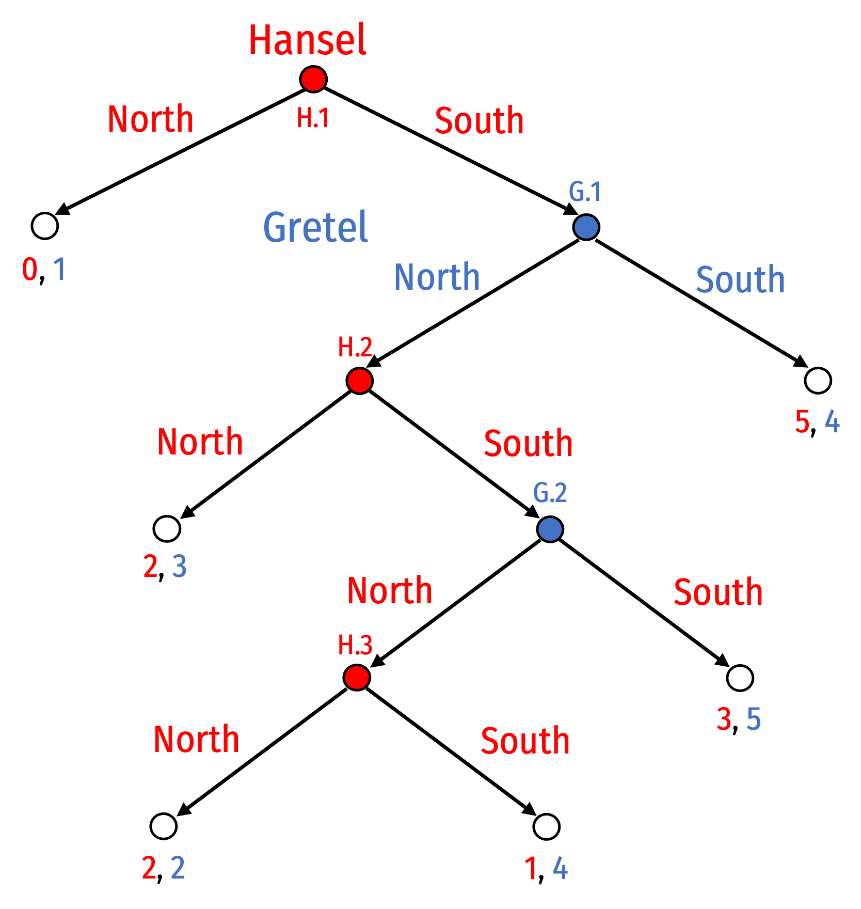

####Part A

#### List all of Hansel's possible strategies.

Hansel faces three decision nodes, and in each node, he can choose among two options (North or South), thus he has $2^6$ possible strategies. For notation simplicity, I will report them as ordered tuples, where each element in the tuple is the decision made at each respective decision node, i.e. (H.1, H.2, H.3). So for example (North, South, North) means choose North at his first decision node, choose South at his second decision node, and North at his third decision node.

Note these are all *possible* strategies, they do not mean he will play all of them - for example, if he chooses South at the first node, the game ends, and he (or Gretel) will make no more decisions.

1. <span style=color:red;>(North, North, North)</span>
2. <span style=color:red;>(North, South, North)</span>
3. <span style=color:red;>(North, South, South)</span>
4. <span style=color:red;>(South, North, North)</span>
5. <span style=color:red;>(South, South, North)</span>
6. <span style=color:red;>(South, South, South)</span>

### Part B

#### List all of Gretel's possible strategies.

Gretel faces two decision nodes, and in each node, she can choose among two options (North or South), thus she has $2^2=4$ possible strategies. I will use similar notation to (a), so Gretel's possible strategies are ordered pairs for her choice at her first decision node, and her second decision node, i.e. (G.1, G.2). 

1. <span style=color:blue;>(North, North)</span>
2. <span style=color:blue;>(North, South)</span>
3. <span style=color:blue;>(South, North)</span>
4. <span style=color:blue;>(South, South)</span>

### Part C

#### Using backward induction, find is the Rollback equilibrium. Prune the branches on the game tree as you are doing so. What strategy is each player playing in equilibrium?

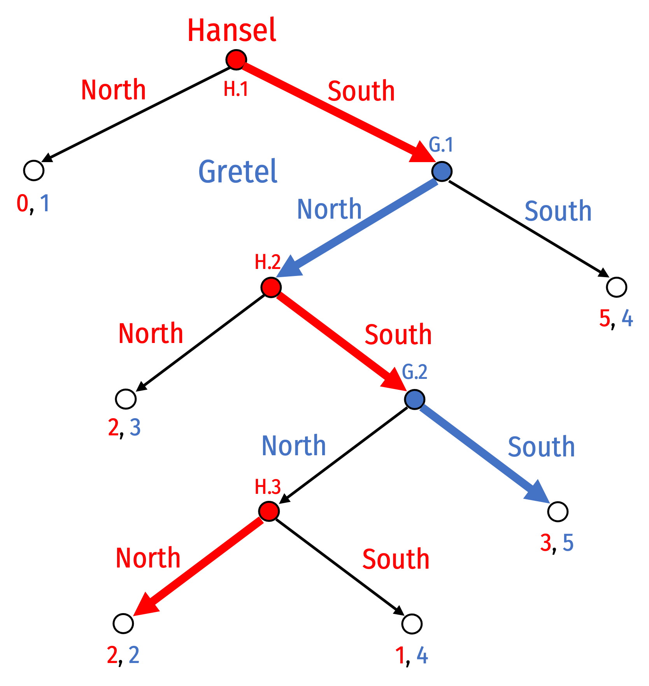

{<span style=color:red;>(South, South, North)</span>, <span style=color:blue;>(North, South)</span>}

## Question 5

#### Suppose Airbus and Boeing are rival companies seeking to develop a new commercial jetliner. Suppose Boeing is ahead in the development process and Airbus is considering whether to enter the market. If Airbus stays out, it earns 0 profit, whereas Boeing enjoys a monopoly and earns a profit of <span>&#36;</span>1 billion. If Airbus enters, Boeing must decide whether to accommodate Airbus peaceably or to wage a price war. In the event of peaceful competition, each firm would earn a profit of <span>&#36;</span>300 million. If there is a price war, each will lose <span>&#36;</span>100 million since they will push the price lower than the development costs.

### Part A

#### Draw this game in extensive form.

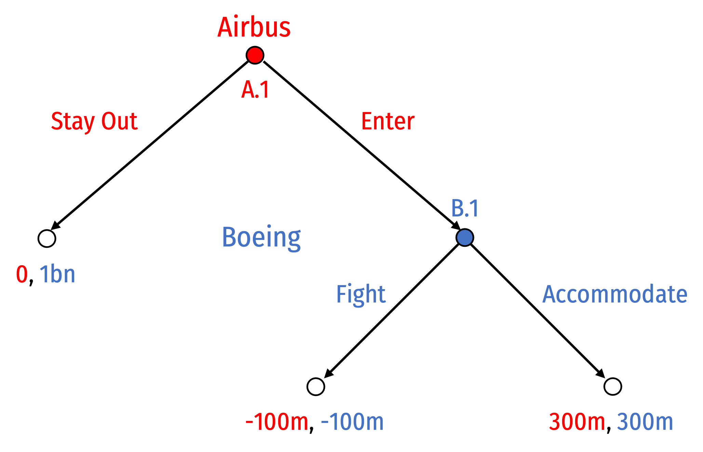

### Part B

#### List all of Airbus' possible strategies.

At (A.1):
1. <span style=color:red;>Enter</span>
2. <span style=color:red;>Stay Out</span>

### Part C

#### List all of Boeing's possible strategies.

At (B.1):
1. <span style=color:blue;>Accommodate</span>
2. <span style=color:blue;>Fight</span>

### Part D

#### Using backward induction, find is the Rollback equilibrium. Prune the branches on the game tree as you are doing so. What strategy is each firm playing in equilibrium?

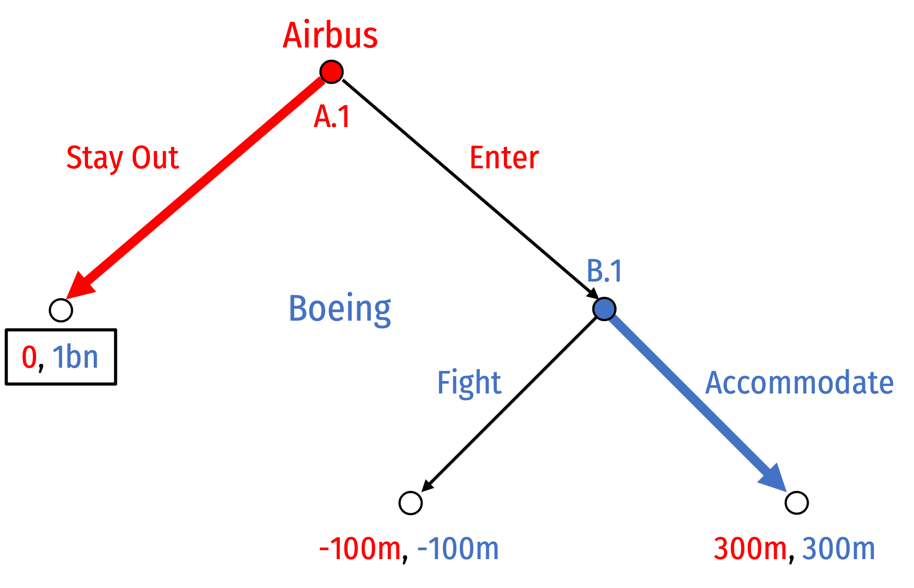

(Enter, Accomodate)

## Question 6

#### The game tree below shows a game between an Inventor and a potential Copycat under existing patent law.

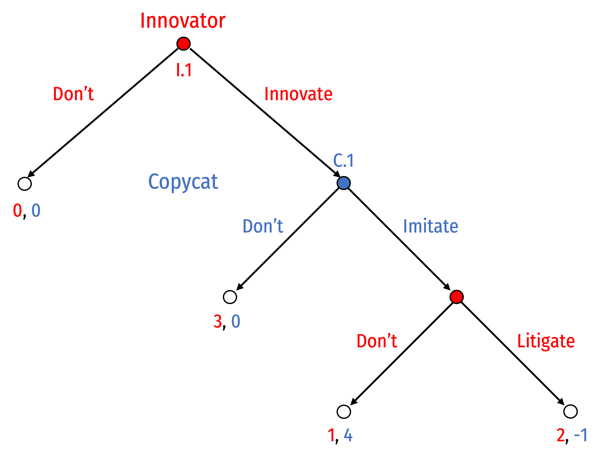

### Part A

#### List all of Inventor's possible strategies.

Inventor has two possible decision nodes (I.1, I.2), with two choices at each node, so there are 4 possible strategies:

1. <span style=color:red;>(Don't, Litigate)</span>
2. <span style=color:red;>(Don't, Don't)</span>
3. <span style=color:red;>(Innovate, Litigate)</span>
4. <span style=color:red;>(Innovate, Don't)</span>

### Part B

#### List all of Copycat's possible strategies.

Copycat has one possible decision nodes (C.1, C.2), with two choices at this node, so there are 2 possible strategies:

1. <span style=color:blue;>Don't</span>
2. <span style=color:blue;>Copy</span>

### Part C

#### Using backward induction, find is the Rollback equilibrium. Prune the branches on the game tree as you are doing so. What strategy is each player playing in equilibrium?

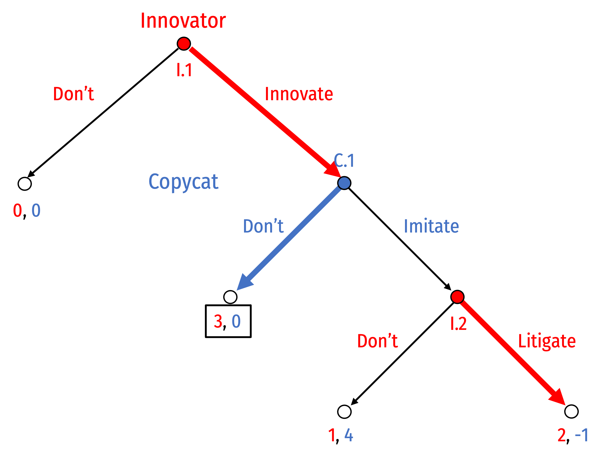

{<span style=color:red;>(Innovate, Litigate)</span>, <span style=color:blue;>Don't</span>}

### Part C

#### Suppose patent litigation has become prohibitively expensive, lowering Inventor's litigation payoff to $0.5$. Solve for the new Rollback equilibrium (state it below), and draw a new tree, pruning the branches.

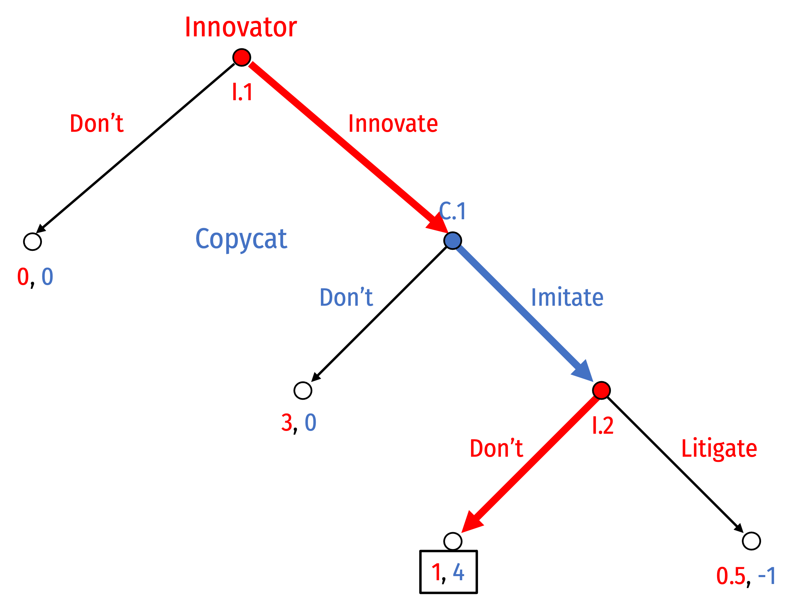

{<span style=color:red;>(Innovate, Don't)</span>, <span style=color:blue;>Imitate</span>}

## Question 7

#### Two distinct bills, $A$ and $B$, are being debated in Washington. Congress prefers proposal A, and the president prefers proposal $B$, but both would prefer *something* gets passed, and both would suffer the most if *nothing* gets passed. The proposals are *not* mutually exclusive; *either*, *both*, *neither* proposal may become law. Thus, there are four possible outcomes, and the payoffs to the two parties are as follows (a larger number represents a higher payoff):

| Outcome            | Congress      |  President  |
|--------------------|:--------------|:------------|
| A becomes law      | 4             | 1           |
| B becomes law      | 1             | 4           |
| Both become law    | 3             | 3           |
| Neither become law | 2             | 2           |

### Part A

#### Draw a game tree as follows: first Congress can pass a bill that can contain A, B, or both A & B, or pass nothing at all. If no bill is passed, the game ends. If any bill is passed, the president decides to sign or veto the bill. Congress does not have enough votes to override a veto, so the game ends with the bill becoming a law if the president signs.

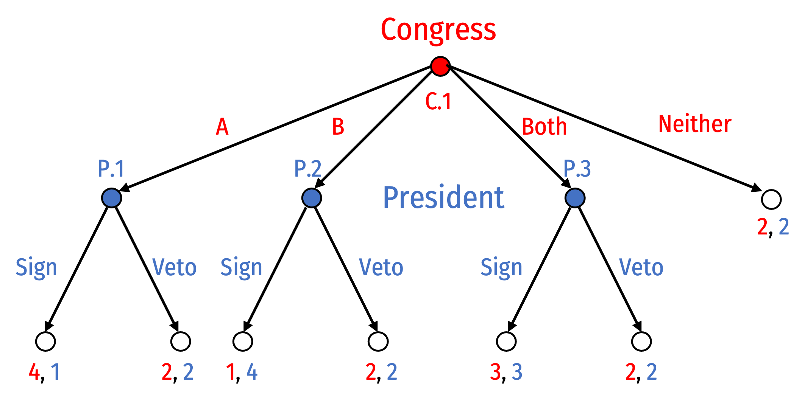

### Part B

#### Solve for the rollback equilibrium (state it below), and prune the branches on the tree above. What strategy is Congress playing, and is the president playing in equilibrium?

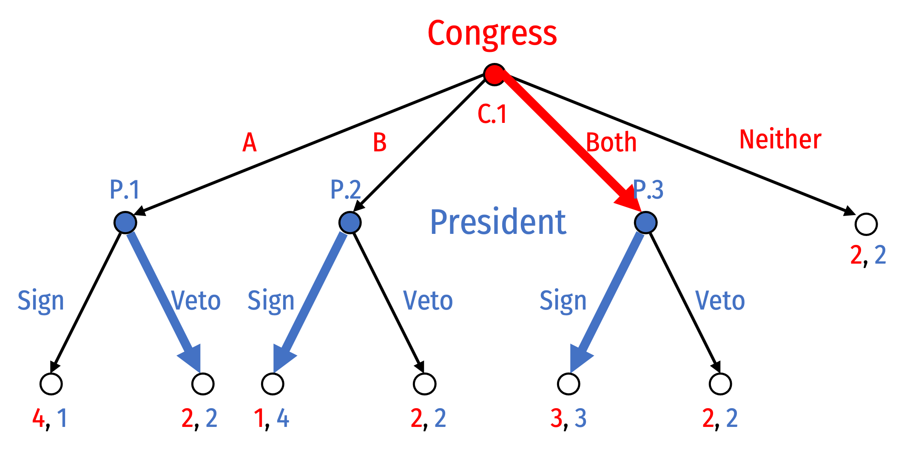

{<span style=color:red;>Both</span>, <span style=color:blue;>(Veto, Sign, Sign)</span>}

### Part C

#### Now suppose the rules of the game are changed in only one respect: the president is given the extra power of a *Line-Item Veto*. Thus, if Congress passes a bill containing both A and B, the president may choose not only to sign or veto the bill as a whole, but also to veto just one of the two proposals. Redraw the new tree and find the rollback equilibrium.

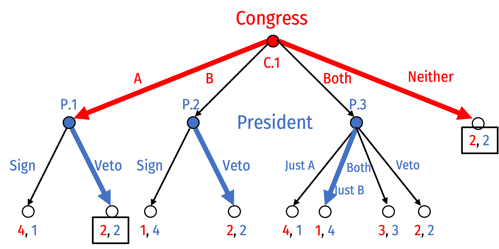

1. {<span style=color:red;>A</span>, <span style=color:blue;>(Veto, Sign, Just B)</span>}
2. {<span style=color:red;>Nothing</span>, <span style=color:blue;>(Veto, Sign, Just B)</span>}

There are two rollback equilibria. Both lead to both Congress and the President earning 2, since nothing will get passed (or its equivalent, bill A being passed and then the bill vetoed).

### Part D

#### Compare the results of the equilibrium *without* the Line Item Veto and *with* the Line Item Veto. Explain intuitively the logic behind the difference. 

The president’s payoff is worse with the line-item veto (LIV) than without it. This outcome arises because Congress knows that without the LIV, they can get their preferred proposal to become law by passing it in the same bill with the president’s preferred proposal. Thus, both proposals become law in equilibrium with no LIV. However, when the president has the LIV, he can always guarantee that Congress’s preferred proposal does not become law. In this case, Congress has no incentive to pass a proposal containing B in order to get A passed also, so they pass either A or nothing and the final equilibrium is the status quo.