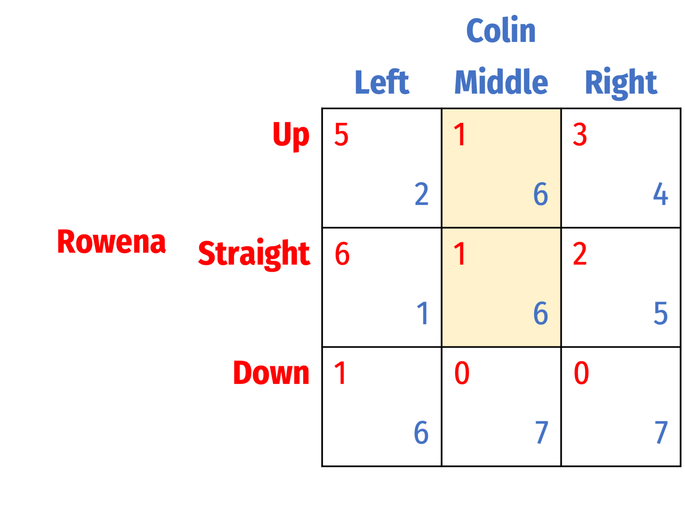
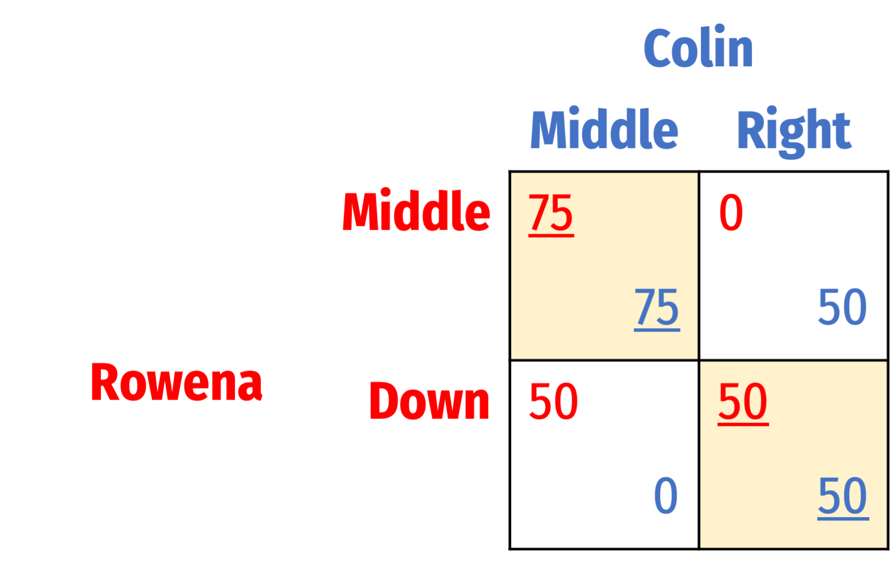

```{r setup, include=FALSE}
knitr::opts_chunk$set(echo = F,
                      message =F,
                      warning =F,
                      fig.height=3)
#library("tidyverse")
#library("mosaic")
#library("ggrepel")
#update_geom_defaults("label", list(family = "Fira Sans Condensed"))
```

**Note:** Answers may be longer than I would deem sufficient on an exam. Some might vary slightly based on points of interest, examples, or personal experience. These suggested answers are designed to give you both the answer and a short explanation of why it is the answer.

# Concepts

## Question 1

#### Define Nash Equilibrium, and describe three separate methods that we can use to find a Nash equilibrium in simultaneous games.

Nash equilibrium is any outcome of a game where no player can improve their payoff by switching strategies, given the strategies of all other players. Another way to consider it is that all players are playing a strategy that is their best response to all other players' strategies. 

We can find Nash equilibrium several different ways: 

1. Dominant strategies: if some players have dominant strategies, we might be able to discover the Nash equilibrium. If two players each have a dominant strategy, the Nash equilibrium is where each player plays their dominant strategy (as in the Prisoners' dilemma, where both defect). If all but one player has a dominant strategy, we can observe what the best response is for the remaining player, when the other players play their dominant strategies, which will be the NE (for example, the Congress-Fed game). This method only works when dominant strategies are present. 
2. Successive elimination of dominated strategies: we can eliminate *dominated* strategies that each player will *never* play, if they *always* yield a lower payoff than playing some other strategy. If we are able to continually do this and yield a unique outcome, that is a Nash equilibrium and the game is "dominance-solvable." This method may not yield a unique outcome, and may overlook other Nash equilibria.
3. Best-response: for each player playing against a particular (rival's) strategy, find the best response for that player. Continue for all players and all strategies, and all outcomes for which all players are playing their best response are Nash equilibria. 
4. Cell-by-cell inspection: look at each outcome cell in a payoff matrix and ask, is there any player that can increase their payoff by switching strategies (holding all other players' strategies constant)? If the answer is no, this outcome is a Nash equilibrium. This is the most tedious, but is foolproof. 

## Question 2

#### List the four types of coordination games and describe the major features of each—such as the general types of outcomes, preferences of the players over the outcomes, and the Nash equilibria. Drawing payoff matrices may help, but is not required.

All coordination games have two pure strategy Nash equilibria. 

1. **(Pure) Coordination Game** features players that get their highest payoffs if they all play the same strategy, otherwise, they gain nothing. In a game with two players and two strategies each, the 2 Nash equilibria are where both players play the same strategy. The 2 Nash equilibria are where each player picks the same strategy.


In the example above, both (<span style=color:red;>Whitaker</span>, <span style=color:blue;>Whitaker</span>) and (<span style=color:red;>Starbucks</span>, <span style=color:blue;>Starbucks</span>) are Nash equilibria, and no player has a strong preferences between one or the other outcomes.  

2. **Assurance Game** (or **Stag Hunt**) features players that get good payoffs if they play the same strategy, but both prefer one particular coordinated-strategy over others. Otherwise, they gain nothing by failing to coordinate (choosing different strategies). The 2 Nash equilibria are again where each player picks the same strategy.


In the example above, both (<span style=color:red;>Whitaker</span>, <span style=color:blue;>Whitaker</span>) and (<span style=color:red;>Starbucks</span>, <span style=color:blue;>Starbucks</span>) are Nash equilibria, but both players prefer (<span style=color:red;>Whitaker</span>, <span style=color:blue;>Whitaker</span>).

3. **Battle of the Sexes** features players that get good payoffs if they play the same strategy, but each player prefers a different coordinated-strategy over others. Otherwise, they gain nothing by failing to coordinate (choosing different strategies). The 2 Nash equilibria are where each player picks the same strategy.


In the example above, both (<span style=color:red;>Hockey</span>, <span style=color:blue;>Hockey</span>) and (<span style=color:red;>Ballet</span>, <span style=color:blue;>Ballet</span>) are Nash equilibria, but <span style=color:red;>Harry</span> prefers (<span style=color:red;>Hockey</span>, <span style=color:blue;>Hockey</span>) and <span style=color:blue;>Sally</span> prefers (<span style=color:red;>Ballet</span>, <span style=color:blue;>Ballet</span>). 
4. **Chicken** (or **Hawk-Dove**) features players that must choose between some "tough" strategy and a strategy where they "back down". Each player prefers that they act tough and the other players back down. If both back down, nothing happens, whereas if they both act tough, they both suffer the worst consequence from a destructive conflict. The two Nash equilibria are where one player acts tough and the other acts cowardly. Since the equilibria are where each player chooses a *different* strategy, this is often considered an "anti-coordination game."


In the example above, both (<span style=color:red;>Tough</span>, <span style=color:blue;>Back Down</span>) and (<span style=color:red;>Back Down</span>, <span style=color:blue;>Tough</span>) are Nash equilibria, but <span style=color:red;>Player 1</span> prefers (<span style=color:red;>Tough</span>, <span style=color:blue;>Back Down</span>) and <span style=color:blue;>Player 2</span> prefers (<span style=color:red;>Back Down</span>, <span style=color:blue;>Tough</span>).

## Question 3

#### Explain what "focal points" are, and their role in coordination games.

A focal point is a method of picking among alternative Nash equilibria in a coordination game. For players to achieve a good payout in a coordination game, their expectations of what each other will do need to converge on a common outcome. If there are multiple Nash equilibria, particularly if all are equally attractive, there may be no objective criterion on which to choose one for all players to coordinate around. However, there are often outcomes that, although apparently arbitrary and subjective, players "naturally" may converge on, due to cultural norms, beliefs, or "unwritten rules." For example, when people are walking down a crowded path in both directions, they need to coordinate their behavior around a common rule to avoid bumping into each other. They can all keep left or all keep right, and neither outcome is particularly better than another, but we have common experience (at least in this country) since we drive on the right side of the road, that most people will end up keeping to the right. 

## Question 4

#### Describe the concept of *rationalizability.* How is it different from Nash equilibrium?

An outcome is *rationalizable* if each player will play their particular strategy under *some* belief about what the other player is playing (i.e. if their chosen strategy is a best response to the strategy chosen by their opponent, and they believe that their opponent will play it).

We can eliminate some strategies as being *not* rationalizable if a strategy is *never* a best response to any opponents' strategies. 

# Problems

## Question 5

A university is contemplating whether to build a new lab or a new theater on campus. The science faculty would rather see a new lab built, and the humanities faculty would prefer a new theater. However, the funding for the project (whichever it may turn out to be) is contingent on unanimous support from the faculty. If there is disagreement, neither project will go forward, leaving each group with no new building and their worst payoff. The meetings of the two separate faculty groups on which proposal to support occur simultaneously, with payoffs given in the following table:


## Part A

#### Find any and all Nash equilibria of this game.


The two pure strategy Nash equilibria are (<span style=color:red;>Lab</span>, \textcolor{blue}{Lab}) and (<span style=color:red;>Theater</span>, \textcolor{blue}{Theater}). They are underlined in the matrix above.

### Part B

#### Which type of coordination game is this situation most similar to? Explain your reasoning.

This is a Battle of the Sexes type coordination game, since there are two pure strategy Nash equilibria (each where both players play the same strategy), and each player prefers a different PSNE over the other. 

## Question 6

Suppose it's the early 2000's and two Hollywood studios — Sony Pictures and Paramount Pictures — are each holding separate board meetings to strategize on how to keep up with the latest video technology. Two new advanced DVD standards are emerging on the market, HD-DVD and Blu Ray. Both firms would like to adopt a standard such that all other firms are using the same standard.

### Part A

#### Suppose there is no clear standard emerging yet, and no firms have any strong preferences. What type of game is this? Draw the payoff matrix and find all Nash equilibria.


This is a pure coordination game. The two Nash equilibria are (<span style=color:red;>HD-DVD</span>, <span style=color:blue;>HD-DVD</span>) and (<span style=color:red;>Blue Ray</span>, <span style=color:blue;>Blue Ray</span>). 

### Part B

#### Suppose both firms hear rumors that another top film studio, Warner Brothers, has already committed to distributing its movies on HD-DVDs. If Sony and Paramount again must simultaneously choose a standard, what type of game is thus? Draw the new payoff matrix and find all Nash equilibria.


This is an assurance game. The two Nash equilibria are still (<span style=color:red;>HD-DVD</span>, <span style=color:blue;>HD-DVD</span>) and (<span style=color:red;>Blue Ray</span>, <span style=color:blue;>Blue Ray</span>), both firms prefer (<span style=color:red;>HD-DVD</span>, <span style=color:blue;>HD-DVD</span>). 

### Part C

#### Suppose instead that Sony's parent company actually has a stake in the company that produces Blue Rays. Additionally, Paramount's board are informed that their marketing department has already told all of Paramount's buyers that they have adopted HD-DVD, and reversing would be too embarassing. What type of game is thus? Draw the new payoff matrix and find all Nash equilibria.


This is a Battle of the Sexes game. The two Nash equilibria are still (<span style=color:red;>HD-DVD</span>, <span style=color:blue;>HD-DVD</span>) and (<span style=color:red;>Blue Ray</span>, <span style=color:blue;>Blue Ray</span>), but Sony prefers (<span style=color:red;>HD-DVD</span>, <span style=color:blue;>HD-DVD</span>) and Paramount prefers (<span style=color:red;>Blue Ray</span>, <span style=color:blue;>Blue Ray</span>). 

## Question 7

Management and labor for a major transportation company are renegotiating their collective bargaining agreement before the crucial holiday travel season. Both labor and management will benefit from reaching *any* agreement, and would both suffer if no deal is reached and the company goes out of business. Each party certaintly wants to gain the most concessions from the other. Each can bargain Hard and obtain maximal concessions from the other party, or bargain Soft and ask for minimal concessions. If both bargain Hard, it is impossible for them to reach a deal.

### Part A

#### Draw the payoff matrix for this game.


### Part B

#### Which type of coordination game is this situation most similar to? Explain your reasoning.

This is a Chicken/Hawk-Dove game. If one player bargains Hard and the other Soft, both gain something but the Hard bargainer gains more. If both play Soft, they benefit mildly, and if they both play Hard, neither benefits at all. 

### Part C

#### Find any and all Nash equilibria of this game.

Both (<span style=color:red;>Hard</span>, <span style=color:blue;>Soft</span>) and (<span style=color:red;>Soft</span>, <span style=color:blue;>Hard</span>) are Nash equilibria, but <span style=color:red;>Labor</span> prefers (<span style=color:red;>Hard</span>, <span style=color:blue;>Soft</span>) and <span style=color:blue;>Management</span> prefers (<span style=color:red;>Soft</span>, <span style=color:blue;>Hard</span>).

## Question 8

Find all Nash equilibria for the following games. First, check for dominant strategies. If there are none, solve using iterated elimination of dominant strategies. Describe your process (you can simply mark up the table, but describe what you are eliminating in what order, and why).

### Part A


1. For <span style=color:red;>Rowena</span>, <span style=color:red;>Down</span> is dominated by <span style=color:red;>Up</span>. We can delete that row.
2. For <span style=color:blue;>Colin</span>, <span style=color:blue;>Left</span> is dominated by <span style=color:blue;>Right</span>. We can delete that column.


We are thus left with (<span style=color:red;>Up</span>, <span style=color:blue;>Right</span>).


### Part B


1. For <span style=color:blue;>Colin</span>, <span style=color:blue;>Right</span> is dominated by <span style=color:blue;>Left</span>. We can delete that column.


Given this, <span style=color:red;>Rowena</span> would play <span style=color:red;>Down</span>. We are thus left with (<span style=color:red;>Down</span>, <span style=color:blue;>Left</span>).


### Part C


1. For <span style=color:blue;>Colin</span>, both <span style=color:blue;>Middle</span> and <span style=color:blue;>Right</span> are dominated by <span style=color:blue;>Left</span>. We can delete both columns.

Note if we had looked at <span style=color:red;>Rowena</span>, <span style=color:red;>Straight</span> *weakly* dominates <span style=color:red;>Down</span>, since she would be indifferent between them.

This leaves us with:


Given this, <span style=color:red;>Rowena</span> would play <span style=color:red;>Straight</span>. We are thus left with (<span style=color:red;>Straight</span>, <span style=color:blue;>Left</span>).


### Part D


1. For <span style=color:red;>Rowena</span>, <span style=color:red;>Down</span> is dominated by both and <span style=color:red;>Straight</span> and <span style=color:red;>Up</span>. We can delete this row. This leaves us with:


2. For <span style=color:blue;>Colin</span>, both <span style=color:blue;>Left</span> and <span style=color:blue;>Right</span> are dominated by <span style=color:blue;>Middle</span>, so we can delete these two columns. This leaves us with: 


From here, we are unable to eliminate any more strategies, since <span style=color:red;>Rowena</span> would be indifferent between playing <span style=color:red;>Up</span> or <span style=color:red;>Straight</span> in response to <span style=color:blue;>Middle</span>.



There are thus *two* Nash equilibria: (<span style=color:red;>Up</span>, <span style=color:blue;>Middle</span>) and (<span style=color:red;>Straight</span>, <span style=color:blue;>Middle</span>)

### Part E


1. For <span style=color:purple;>Player 3</span>, <span style=color:purple;>Left</span> is dominated by <span style=color:purple;>Right</span>, so we can delete the entire left table. This leaves us with:


2. For <span style=color:red;>Player 1</span>, <span style=color:red;>Up</span> is dominated by <span style=color:red;>Down</span>, so we can delete that row. This leaves us with:


Given this, <span style=color:blue;>Player 2</span> will play <span style=color:blue;>Right</span>. This leaves us with the Nash equilibrium: (<span style=color:red;>Down</span>, <span style=color:blue;>Right</span>, <span style=color:purple;>Right</span>)


## Question 9

Solve the following games, for which there are no strictly dominated strategies. Describe your process (you can simply mark up the table).

### Part A


I have underlined each player's best response to the other player(s)'s strategies. Any outcome where all players are playing a best response is a Nash equilibrium.

Nash Equilibrium:  (<span style=color:red;>North</span>, <span style=color:blue;>Right</span>)

### Part B


I have underlined each player's best response to the other player(s)'s strategies. Any outcome where all players are playing a best response is a Nash equilibrium.

Nash Equilibria:

1. (<span style=color:red;>North</span>, <span style=color:blue;>Right</span>)
2. (<span style=color:red;>South</span>, <span style=color:blue;>Middle</span>)
3. (<span style=color:red;>East</span>, <span style=color:blue;>Left</span>)

### Part C


I have underlined each player's best response to the other player(s)'s strategies. Any outcome where all players are playing a best response is a Nash equilibrium.

Nash Equilibrium:  (<span style=color:red;>Down</span>, <span style=color:blue;>Right</span>, <span style=color:purple;>Right</span>)

## Question 10

Consider the following game:


## Part A

#### Find all Nash equilibria.


The two Nash equilibria are (<span style=color:red;>Middle</span>, <span style=color:blue;>Middle</span>) and (<span style=color:red;>Down</span>, <span style=color:blue;>Right</span>).

## Part B

#### Which equilibrium/equilibria is/are *Pareto efficient*? Why?

(<span style=color:red;>Middle</span>, <span style=color:blue;>Middle</span>) is the only Pareto efficient equilibrium, as it is a Pareto improvement from (<span style=color:red;>Down</span>, <span style=color:blue;>Right</span>) as both players gain. But there are no possible improvements over (<span style=color:red;>Middle</span>, <span style=color:blue;>Middle</span>).

## Part C

#### Which equilibrium/equilibria is/are *payoff dominant*? Why?

(<span style=color:red;>Middle</span>, <span style=color:blue;>Middle</span>) is where both players earn their highest payoff from the set of Nash equilibria.

## Part D

#### Which equilibrium/equilibria is/are *risk dominant*? Why?

(<span style=color:red;>Down</span>, <span style=color:blue;>Right</span>) is risk dominant, since each player guarantees themselves a payoff of 50 if they play right, regardless of what the other player does. 

Playing Middle is riskier, as it requires the other player to play Middle to attain the payoff dominant Nash equilibrium, otherwise a player might be stuck earning 0. 

## Part E

Which outcome(s) is/are *rationalizable*, and under what beliefs by each player?

- <span style=color:red;>Rowena</span> will never play <span style=color:red;>Up</span>, since it is never a best response (<span style=color:red;>Down</span> is the best response to <span style=color:blue;>Left</span>, <span style=color:red;>Middle</span> is the best response to <span style=color:blue;>Middle</span> and <span style=color:red;>Right</span> is the best response to <span style=color:blue;>Right</span>). Thus, we can eliminate that row. 
- Symmetrically, <span style=color:blue;>Colin</span> will never play <span style=color:blue;>Left</span>, since it is never a best response (<span style=color:blue;>Right</span> is the best response to <span style=color:red;>Up</span>, <span style=color:blue;>Middle</span> is the best response to <span style=color:red;>Middle</span> and <span style=color:blue;>Right</span> is the best response to <span style=color:red;>Down</span>). Thus, we can eliminate that column. 



We can go no further in eliminating strategies, since each remaining strategy for each player (Middle or Right) is a best response to some opposing strategy by the other player.

1. (<span style=color:red;>Middle</span>, <span style=color:blue;>Middle</span>)
  - <span style=color:red;>Rowena</span> can rationalize playing <span style=color:red;>Middle</span> if they believe <span style=color:blue;>Colin</span> will play <span style=color:blue;>Middle</span> (it's their best response).
  - <span style=color:blue;>Colin</span> can rationalize playing <span style=color:blue;>Middle</span> if they believe <span style=color:red;>Rowena</span> will play <span style=color:red;>Middle</span> (it's their best response).
2. (<span style=color:red;>Middle</span>, <span style=color:blue;>Right</span>)
  - <span style=color:red;>Rowena</span> can rationalize playing <span style=color:red;>Middle</span> if they believe <span style=color:blue;>Colin</span> will play <span style=color:blue;>Middle</span> (it's their best response)
  - <span style=color:blue;>Colin</span> can rationalize playing <span style=color:blue;>Right</span> if they believe <span style=color:red;>Rowena</span> will play <span style=color:red;>Right</span> (it's their best response).
3. (<span style=color:red;>Down</span>, <span style=color:blue;>Middle</span>)
  - <span style=color:red;>Rowena</span> can rationalize playing <span style=color:red;>Down</span> if they believe <span style=color:blue;>Colin</span> will play <span style=color:blue;>Right</span> (it's their best response).
  - <span style=color:blue;>Colin</span> can rationalize playing <span style=color:blue;>Middle</span> if they believe <span style=color:red;>Rowena</span> will play <span style=color:red;>Middle</span> (it's their best response).
4. (<span style=color:red;>Down</span>, <span style=color:blue;>Right</span>)
  - <span style=color:red;>Rowena</span> can rationalize playing <span style=color:red;>Down</span> if they believe <span style=color:blue;>Colin</span> will play <span style=color:blue;>Right</span> (it's their best response).
  - <span style=color:blue;>Colin</span> can rationalize playing <span style=color:blue;>Right</span> if they believe <span style=color:red;>Rowena</span> will play <span style=color:red;>Right</span> (it's their best response).

Hence, **all four remaining outcomes are rationalizable** under a certain set of beliefs by each player. Note that among these, only (<span style=color:red;>Middle</span>, <span style=color:blue;>Middle</span>) and (<span style=color:red;>Right</span>, <span style=color:blue;>Right</span>) are Nash equilibria! 
