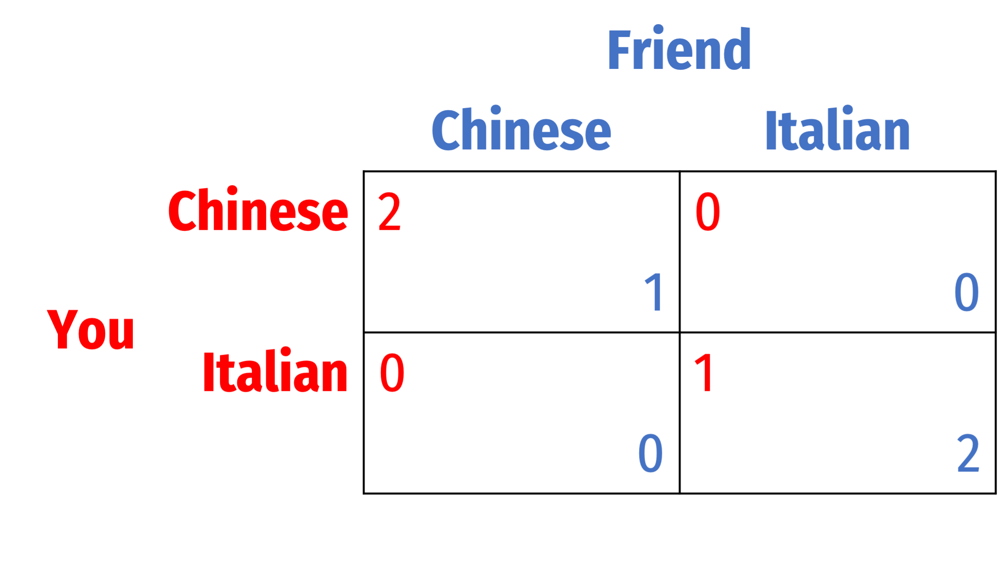

```{r setup, include=FALSE}
knitr::opts_chunk$set(echo = F,
                      message =F,
                      warning =F,
                      fig.retina = 3,
                      fig.width = 8,
                      fig.asp = 0.618)
library("tidyverse")
#library("mosaic")
#library("ggrepel")
ggplot2::theme_set(theme_light(base_family = "Fira Sans Condensed", base_size = 16))
update_geom_defaults("text", list(family = "Fira Sans Condensed"))
update_geom_defaults("label", list(family = "Fira Sans Condensed"))
```

**Note**: Answers may be longer than I would deem sufficient on an exam. Some might vary slightly based on points of interest, examples, or personal experience. These suggested answers are designed to give you both the answer and a short explanation of why it is the answer.

# Concepts

## Question 1

#### Consider the simple hand game of "odds and evens," where two players simultaneously hold out one or two of their fingers, and add up the sum. Suppose Player 1 has chosen Odds, and Player 2 has chosen Evens, such that the sum is odd, Player 1 wins; if the sum is even, Player 2 wins. Let a win be a payoff of 1, and a loss be a payoff of $-1$. The payoff table is below:


## Part A

#### Find any pure strategy Nash equilibria (PSNE).

There are no PSNE, in every outcome, at least one player can do better by changing their strategy. Best-response analysis also shows that in no outcome are both players playing a best response. 

## Part B

#### Let <span style=color:red;>p</span> be the probability <span style=color:red;>Odds</span> plays <span style=color:red;>One</span>. Write out <span style=color:blue;>Evens</span>' expected payoffs of playing <span style=color:blue;>One</span> and playing <span style=color:blue;>Two</span> given this. 


We must find the expected payoffs for <span style=color:blue;>Evens</span>, given that <span style=color:red;>Odds</span> plays <span style=color:red;>One</span> with probability $p$. 

To find <span style=color:blue;>Evens</span>' expected payoff for playing <span style=color:blue;>One</span>, we add the two payoffs <span style=color:blue;>Evens</span> gets for playing <span style=color:blue;>One</span>, weighted by the probability <span style=color:red;>Odds</span> plays each of their strategies. 

$$\begin{align*}
E[\color{blue}{One}]&=\color{blue}{1}(\color{red}{p})+(\color{red}{1-p})\color{blue}{-1} \\
E[\color{blue}{One}]&=p-1+p \\
E[\color{blue}{One}]&=2p-1\\
\end{align*}$$

To find <span style=color:blue;>Evens</span>' expected payoff for playing <span style=color:blue;>Two</span>, we add the two payoffs <span style=color:blue;>Evens</span> gets for playing <span style=color:blue;>Two</span>, weighted by the probability <span style=color:red;>Odds</span> plays each of their strategies. 

$$\begin{align*}
E[\color{blue}{Two}]&=\color{blue}{-1}(\color{red}{p})+(\color{red}{1-p})\color{blue}{1} \\
E[\color{blue}{Two}]&=-p+1-p \\
E[\color{blue}{Two}]&=1-2p\\
\end{align*}$$

## Part C

#### Solve for the optimal value of p that makes <span style=color:blue;>Evens</span> indifferent between playing <span style=color:blue;>One</span> and playing <span style=color:blue;>Two</span>.

Here, we want <span style=color:blue;>Evens</span>' expected payoff from playing <span style=color:blue;>One</span> to be equal to their expected payoff of playing <span style=color:blue;>Two</span>, so we set their expected payoffs equal to each other, so we can find the value of $p$ that equalizes them. 

$$\begin{align*}
E[\color{blue}{One}]&=E[\color{blue}{Two}] && \text{Opponent indifference principle}\\
2p-1&=1-2p && \text{Plugging in}\\
4p-1&=1 && \text{Adding }2p \text{ to both sides}\\
4p&=2 && \text{Adding 1 to both sides}\\
p&=0.50 && \text{Dividing both sides by 2}\\
\end{align*}$$

## Part D

#### Let <span style=color:blue;>q</span> be the probability <span style=color:blue;>Evens</span> plays <span style=color:blue;>One</span>. Write out <span style=color:red;>Odds</span>' expected payoffs of playing <span style=color:red;>One</span> and playing <span style=color:red;>Two</span> given this. 

We must find the expected payoffs for <span style=color:red;>Odds</span>, given that <span style=color:blue;>Evens</span> plays <span style=color:blue;>One</span> with probability $q$. 

To find <span style=color:red;>Odds</span>' expected payoff for playing <span style=color:red;>One</span>, we add the two payoffs <span style=color:red;>Odds</span> gets for playing <span style=color:red;>One</span>, weighted by the probability <span style=color:blue;>Evens</span> plays each of their strategies. 

$$\begin{align*}
E[\color{red}{One}]&=\color{red}{-1}(\color{blue}{q})+(\color{blue}{1-q})\color{red}{1} \\
E[\color{red}{One}]&=-q+1-q \\
E[\color{red}{One}]&=1-2q\\
\end{align*}$$

To find <span style=color:red;>Odds</span>' expected payoff for playing <span style=color:red;>Two</span>, we add the two payoffs <span style=color:red;>Odds</span> gets for playing <span style=color:red;>Two</span>, weighted by the probability <span style=color:blue;>Evens</span> plays each of their strategies. 

$$\begin{align*}
E[\color{red}{Two}]&=\color{red}{1}(\color{blue}{q})+(\color{blue}{1-q})\color{red}{-1} \\
E[\color{red}{Two}]&=q-1+q \\
E[\color{red}{Two}]&=2q-1\\
\end{align*}$$

## Part E

#### Solve for the optimal value of q that makes <span style=color:red;>Odds</span> indifferent between playing <span style=color:red;>One</span> and playing <span style=color:red;>Two</span>.

Here, we want <span style=color:red;>Odds</span>' expected payoff from playing <span style=color:red;>One</span> to be equal to their expected payoff of playing <span style=color:red;>Two</span>, so we set their expected payoffs equal to each other, so we can find the value of $p$ that equalizes them. 

$$\begin{align*}
E[\color{red}{One}]&=E[\color{red}{Two}] && \text{Opponent indifference principle}\\
1-2q&=2q-1 && \text{Plugging in}\\
1&=4q-1 && \text{Adding }2q \text{ to both sides}\\
2&=4q && \text{Adding 1 to both sides}\\
0.50&=q && \text{Dividing by 4}\\
\end{align*}$$

## Part F

#### What is the mixed strategy Nash equilibrium (MSNE) of this game?

**MSNE**: (<span style=color:red;>p</span>, <span style=color:blue;>q</span>) =  (<span style=color:red;>0.50</span>, <span style=color:blue;>0.50</span>). 

In other words, <span style=color:red;>Odds</span> plays <span style=color:red;>One</span> 50% of the time and <span style=color:red;>Two</span> 50% of the time, and <span style=color:blue;>Evens</span> plays <span style=color:blue;>One</span> 50% of the time and <span style=color:blue;>Two</span> 50% of the time. 


## Part G

#### What is each player's expected payoff in MSNE?

Simply plug in $p=0.50$ into either equation from part b) to find <span style=color:blue;>Evens</span>' expected payoffs (they should be the same):

$$\begin{align*}
E[\color{blue}{One}]&=E[\color{blue}{Two}]\\
2p-1&=1-2p\\
2(0.50)-1&=1-2(0.50)\\
0&=0\\
\end{align*}$$

<span style=color:blue;>Evens</span>' expected payoff in the MSNE is <span style=color:blue;>0</span>.

Simply plug in $q=0.50$ into either equation from part d) to find <span style=color:red;>Odds</span>' expected payoffs (they should be the same):

$$\begin{align*}
E[\color{red}{One}]&=E[\color{red}{Two}]\\
1-2q&=2q-1\\
1-2(0.50)-1&=2(0.50)-1\\
0&=0\\
\end{align*}$$

<span style=color:red;>Odds</span>' expected payoff in the MSNE is <span style=color:red;>0</span>.

## Question 2

You and your friend are deciding on a place to go for dinner, but are too busy to call or text one another. Each of you can go to the Chinese Restaurant or the Italian Restaurant -- suppose you prefer Chinese and your friend prefers Italian.



## Part A

#### Find any pure strategy Nash equilibria (PSNE).

This is a battle of the sexes type coordination game. The two PSNE are:

1. (<span style=color:red;>Chinese</span>, <span style=color:blue;>Chinese</span>)
2. (<span style=color:red;>Italian</span>, <span style=color:blue;>Italian</span>)

<span style=color:red;>You</span> prefer the first PSNE, <span style=color:blue;>Friend</span> prefers the second PSNE.

## Part B

#### Let <span style=color:red;>p</span> be the probability <span style=color:red;>You</span> go to the <span style=color:red;>Chinese</span> restaurant. Write out your <span style=color:blue;>Friend</span>' expected payoffs of going to the <span style=color:blue;>Chinese</span> and to the <span style=color:blue;>Italian</span> restaurant given this. 

We must find the expected payoffs for <span style=color:blue;>Friend</span>, given that <span style=color:red;>You</span> go to <span style=color:red;>Chinese</span> with probability $p$. 

To find <span style=color:blue;>Friend's</span> expected payoff for going to <span style=color:blue;>Chinese</span>, we add the two payoffs <span style=color:blue;>Friend</span> gets for going to <span style=color:blue;>Italian</span>, weighted by the probability <span style=color:red;>You</span> go to each restaurant. 

$$\begin{align*}
E[\color{blue}{Chinese}]&=\color{blue}{1}(\color{red}{p})+(\color{red}{1-p})\color{blue}{0} \\
E[\color{blue}{Chinese}]&=p\\
\end{align*}$$

To find <span style=color:blue;>Friend's</span> expected payoff for going to <span style=color:blue;>Italian</span>, we add the two payoffs <span style=color:blue;>Friend</span> gets for going to <span style=color:blue;>Italian</span>weighted by the probability <span style=color:red;>You</span> go to each restaurant. 

$$\begin{align*}
E[\color{blue}{Italian}]&=\color{blue}{0}(\color{red}{p})+(\color{red}{1-p})\color{blue}{2} \\
E[\color{blue}{Italian}]&=2-2p \\
\end{align*}$$

## Part C

#### Solve for the optimal value of p that makes your <span style=color:blue;>Friend</span> indifferent between going to the <span style=color:blue;>Chinese</span> and to the <span style=color:blue;>Italian</span> restaurant.

Here, we want <span style=color:blue;>Friend's</span> expected payoff from going to <span style=color:blue;>Chinese</span> to be equal to their expected payoff of going to <span style=color:blue;>Italian</span>, so we set their expected payoffs equal to each other, so we can find the value of $p$ that equalizes them. 

$$\begin{align*}
E[\color{blue}{Chinese}]&=E[\color{blue}{Italian}] && \text{Opponent indifference principle}\\
p&=2-2p && \text{Plugging in}\\
3p&=2 && \text{Adding }2p \text{ to both sides}\\
p&=\frac{2}{3} && \text{Dividing both sides by 3}\\
\end{align*}$$

## Part D

#### Let <span style=color:blue;>q</span> be the probability your <span style=color:blue;>Friend</span> goes to the <span style=color:blue;>Chinese</span> restaurant. Write out <span style=color:red;>Your</span>' expected payoffs of going to the <span style=color:red;>Chinse</span> and to the <span style=color:red;>Italian</span> restaurant given this. 

We must find the expected payoffs for <span style=color:red;>You</span>, given that <span style=color:blue;>Friend</span> goes to <span style=color:blue;>Chinese</span> with probability $q$. 

To find <span style=color:red;>Your</span> expected payoff for going to <span style=color:red;>Chinese</span>, we add the two payoffs <span style=color:red;>You</span> get for playing <span style=color:red;>Chinese</span>, weighted by the probability <span style=color:blue;>Friend</span> goes to each restaurant. 

$$\begin{align*}
E[\color{red}{Chinese}]&=\color{red}{2}(\color{blue}{q})+(\color{blue}{1-q})\color{red}{0} \\
E[\color{red}{One}]&=2q \\
\end{align*}$$

To find <span style=color:red;>Your</span> expected payoff for going to <span style=color:red;>Italian</span>, we add the two payoffs <span style=color:red;>You</span> get for going to <span style=color:red;>Italian</span>, weighted by the probability <span style=color:blue;>Friend</span> goes to each restaurant. 

$$\begin{align*}
E[\color{red}{Italian}]&=\color{red}{0}(\color{blue}{q})+(\color{blue}{1-q})\color{red}{1} \\
E[\color{red}{Italian}]&=1-q \\
\end{align*}$$

## Part E

#### Solve for the optimal value of q that makes <span style=color:red;>You</span> indifferent between going to the <span style=color:red;>Chinese</span> and to the <span style=color:red;>Italian</span> restaurant.

Here, we want <span style=color:red;>Your</span> expected payoff from going to <span style=color:red;>Chinese</span> to be equal to your expected payoff of going to <span style=color:red;>Italian</span>, so we set your expected payoffs equal to each other, so we can find the value of $q$ that equalizes them. 

$$\begin{align*}
E[\color{red}{Chinese}]&=E[\color{red}{Italian}] && \text{Opponent indifference principle}\\
2q&=1-q && \text{Plugging in}\\
3q&=1 && \text{Adding }q \text{ to both sides}\\
q&=\frac{1}{3} && \text{Dividing both sides by 3}\\
\end{align*}$$

## Part F

#### What is the mixed strategy Nash equilibrium (MSNE) of this game?

**MSNE**: (<span style=color:red;>p</span>, <span style=color:blue;></span>}) =  ($\color{red}{\frac{2}{3}}$, $\color{blue}{\frac{1}{3}}$). 

In other words, <span style=color:red;>You</span> go to <span style=color:red;>Chinese</span> 67% of the time and <span style=color:red;>Italian</span> 33% of the time, and <span style=color:blue;>Friend</span> goes to <span style=color:blue;>Chinese</span> 33% of the time and <span style=color:blue;>Italian</span> 67% of the time. 


## Part G

#### What is each player's expected payoff in MSNE?

Simply plug in $p=\frac{2}{3}$ into either equation from part b) to find <span style=color:blue;>Friend'} expected payoffs (they should be the same):

$$\begin{align*}
E[\color{blue}{Chinese}]&=E[\color{blue}{Italian}]\\
p&=2-2p\\
(\frac{2}{3})&=2-2(\frac{2}{3})\\
\frac{2}{3}&=\frac{2}{3}\\
\end{align*}$$

<span style=color:blue;>Friend's</span> expected payoff in the MSNE is $\color{blue}{\frac{2}{3}}$.

Simply plug in $q=\frac{1}{3}$ into either equation from part d) to find <span style=color:red;>Your</span> expected payoffs (they should be the same):

$$\begin{align*}
E[\color{red}{Chinese}]&=E[\color{red}{Italian}]\\
2q&=1-q\\
2(\frac{1}{3})&=1-(\frac{1}{3})\\
\frac{2}{3}&=\frac{2}{3}\\
\end{align*}$$

<span style=color:red;>Your</span> expected payoff in the MSNE is $\color{red}{\frac{2}{3}}$.

## Part H

#### Write out and draw each player's best response function. Put $p$ on the horizontal axis and $q$ on the vertical axis. Label all equilibria appropriately. Label all equilibria on your graph. Hint: which expected payoff of your <span style=color:blue;>Friend</span>'s strategies increases as $p$ increases (decreases)? Which expected payoff of <span style=color:red;>Your</span> strategies increases as $q$ increases (decreases)?

Let's start with <span style=color:blue;>Friend's</span> best responses. A hint is to plug in numbers for $p$ that are smaller/larger than $p^*=\frac{2}{3}$ and see which strategy yields a higher expected payoff. 

Let's start with a smaller number, $\frac{1}{4}$:

$$\begin{align*}
E[\color{blue}{Chinese}]& \lessgtr E[\color{blue}{Italian}]\\
p & \lessgtr 2-2p\\
(\frac{1}{4}) &\lessgtr 2-2(\frac{1}{4}) \\
\frac{1}{4} &< \frac{6}{4} \\ 
\end{align*}$$

Thus, if $p<\frac{2}{3}$, <span style=color:blue;>Friend</span> is better off going <span style=color:blue;>Italian}.

Now try plugging in a larger number, say $\frac{3}{4}$: 

$$\begin{align*}
E[\color{blue}{Chinese}]& \lessgtr E[\color{blue}{Italian}]\\
p & \lessgtr 2-2p\\
(\frac{3}{4}) &\lessgtr 2-2(\frac{3}{4}) \\
\frac{3}{4} &> \frac{2}{4} \\ 
\end{align*}$$

Thus, if $p>\frac{2}{3}$, <span style=color:blue;>Friend</span> is better off going <span style=color:blue;>Chinese}.

We can then construct <span style=color:blue;>Friend's Best Response</span>$=\begin{cases} Italian & \text{if }p<\frac{2}{3}\\ Indifferent & \text{if }p=\frac{2}{3}\\ Chinese & \text{if }p>\frac{2}{3}\\ \end{cases}$

Now do the same thing for <span style=color:red;>Your</span> best responses. We'll again plug in numbers for $q$ that are smaller/larger than $q^*=\frac{1}{3}$ and see which strategy yields a higher expected payoff.

Let's start with a smaller number, $\frac{1}{4}$:

$$\begin{align*}
E[\color{red}{Chinese}]& \lessgtr E[\color{red}{Italian}]\\
2q & \lessgtr1-q\\
2(\frac{1}{4}) &\lessgtr 1-(\frac{1}{4}) \\
(\frac{2}{4}) &<\frac{3}{4}\\
\end{align*}$$

Thus, if $q<\frac{1}{3}$, <span style=color:red;>You</span> are better off going <span style=color:red;>Italian}.

Now try plugging in a larger number, say $\frac{1}{2}$: 

$$\begin{align*}
E[\color{red}{Chinese}]& \lessgtr E[\color{red}{Italian}]\\
2q & \lessgtr 1-q\\
2(\frac{1}{2}) &\lessgtr 1-(\frac{1}{2}) \\
1 &>\frac{1}{2}\\
\end{align*}$$

Thus, if $q>\frac{1}{3}$, <span style=color:red;>You</span> are better off going <span style=color:red;>Chinese</span>.

We can then construct <span style=color:red;>Your Best Response</span>$=\begin{cases} Italian & \text{if }q<\frac{2}{3}\\ Indifferent & \text{if }q=\frac{2}{3}\\ Chinese & \text{if }q>\frac{2}{3}\\ \end{cases}$

This should make sense, since this is a coordination game--both of you want to end up at the same place. For each player, if there is a low probability the other player is going to Chinese, then you should go to Italian; if there is a high probability the other player is going to Chinese, you should go to Chinese. 


```{r}
points <- tribble(
  ~x, ~y, ~lab,
  0, 0, "PSNE 1",
  0.667, 0.333, "MSNE",
  1, 1, "PSNE 2"
)
library(ggtext)
ggplot(data = tibble(x = c(0,1)))+
  aes(x = x)+
  geom_segment(x = 0, xend = 0.667, y = 0, yend = 0, color = "blue", size = 2)+
  geom_segment(x = 0.667, xend = 0.667, y = 0, yend = 1, color = "blue", size = 2)+
  geom_segment(x = 0.667, xend = 1, y = 1, yend = 1, color = "blue", size = 2)+
  geom_segment(x = 0, xend = 0, y = 0, yend = 0.333, color = "red", size = 2)+
  geom_segment(x = 0, xend = 1, y = 0.333, yend = 0.333, color = "red", size = 2)+
  geom_segment(x = 1, xend = 1, y = 0.333, yend = 1, color = "red", size = 2)+
  
  geom_label(x = 0.85, y = 1, label = "Friend's BR", color = "blue")+
  geom_label(x = 0.85, y = 0.333, label = "Your BR", color = "red")+
  
  geom_point(data = points,
             aes(x = x, y = y),
             size = 3)+
  ggrepel::geom_label_repel(data = points,
             aes(x = x, y = y, label = lab),
             box.padding = 0.5,
             seed = 2)+
  scale_x_continuous(breaks = c(0.667,1),
                     limits = c(0,1.05),
                     expand = c(0,0))+
  scale_y_continuous(breaks = c(0.000,0.333,1.000),
                     limits = c(0,1.05),
                     expand = c(0,0))+
  labs(x = "<span style='color:#D7250E;'>Prob(You go to Chinese), p</span>",
       y = "<span style='color:#0047AB;'>Prob(Friend goes to Chinese), q</span>")+
  theme_classic(base_family = "Fira Sans Condensed", base_size = 16)+
  theme(axis.title.x = element_markdown(),
        axis.title.y = element_markdown())+
  coord_cartesian(clip = "off")
```


## Part I

#### Given your answers to the above questions, calculate the probability that both of you go to the Chinese restaurant and the probability that both of you go to the Italian restaurant. Hint: assume each person's choice is independent.

Use the multiplication rule for independent events: $P(A \text{ and }B)=P(A) \times P(B)$

$$\begin{align*}
P(\text{You go to Chinese and Friend goes to Chinese})&=P(\text{You go to Chinese}) \times P(\text{Friend goes to Chinese})\\
P(\text{You go to Chinese and Friend goes to Chinese})&=p \times q\\
P(\text{You go to Chinese and Friend goes to Chinese})&=\frac{2}{3} \times \frac{1}{3}\\
P(\text{You go to Chinese and Friend goes to Chinese})&=\frac{2}{9}\\
\end{align*}$$

$$\begin{align*}
P(\text{You go to Italian and Friend goes to Italian})&=P(\text{You go to Italian}) \times P(\text{Friend goes to Italian})\\
P(\text{You go to Italian and Friend goes to Italian})&=(1-p) \times (1-q)\\
P(\text{You go to Italian and Friend goes to Italian})&=\frac{1}{3} \times \frac{2}{3}\\
P(\text{You go to Italian and Friend goes to Italian})&=\frac{2}{9}\\
\end{align*}$$

## Question 3

The chief of police is attempting to crack down on drunk driving, and is deciding whether to set up a sobriety checkpoint. Setting up a checkpoint always catches drunk driving, but costs the city resources. A partygoer can choose to drink Beer or Soda before driving home. Suppose the payoffs are as follows:


### Part A
#### Find the mixed strategy Nash equilibrium. 

Let $p$ be the probability that <span style=color:red;>Partygoer</span> drinks <span style=color:red;>Beer</span>. The expected payoffs for <span style=color:blue;>Police</span> are:

$$\begin{align*}
E[\color{blue}{Check}] &= \color{blue}{-1}(\color{red}{p})+\color{red}{(1-p)}\color{blue}{-1}\\
E[\color{blue}{Check}] &= -p-1+p\\
E[\color{blue}{Check}] &= -1\\
\end{align*}$$

$$\begin{align*}
E[\color{blue}{Don't}] &= \color{blue}{-2}(\color{red}{p})+\color{red}{(1-p)}\color{blue}{0}\\
E[\color{blue}{Don't}] &= -2p\\
\end{align*}$$

<span style=color:blue;>Police</span> are indifferent at the $p$ where: 

$$\begin{align*}
E[\color{blue}{Check}] &= E[\color{blue}{Dont}]\\
-1 &= -2p\\
\frac{1}{2} & = p\\
\end{align*}$$

Let $q$ be the probability that <span style=color:blue;>Police</span> <span style=color:blue;>Checks</span>. The expected payoffs for <span style=color:red;>Partygoer</span> are:

$$\begin{align*}
E[\color{red}{Beer}] &= \color{red}{-2}(\color{blue}{q})+\color{blue}{(1-q)}\color{red}{1}\\
E[\color{red}{Beer}] &= -2q+1-q\\
E[\color{red}{Beer}] &= 1-3q\\
\end{align*}$$

$$\begin{align*}
E[\color{red}{Soda}] &= \color{red}{0}(\color{blue}{q})+\color{blue}{(1-q)}\color{red}{0}\\
E[\color{red}{Soda}] &= 0\\
\end{align*}$$

<span style=color:red;>Partygoer</span> is indifferent at the $q$ where: 

$$\begin{align*}
E[\color{red}{Beer}] &= E[\color{red}{Soda}]\\
1-3q &= 0\\
1 & = 3q\\
\frac{1}{3} &= q\\
\end{align*}$$

**MSNE**: (<span style=color:red;>p</span>, <span style=color:blue;>q</span>)=($\color{red}{\frac{1}{2}}$, $\color{blue}{\frac{1}{3}}$). 

In other words, <span style=color:red;>Partygoer</span> will drink <span style=color:red;>Beer</span> $\frac{1}{2}$ of the time and <span style=color:red;>Soda</span> $\frac{1}{2}$ of the time; <span style=color:blue;>Police</span> will <span style=color:blue;>Check</span> $\frac{1}{3}$ of the time and <span style=color:blue;>Don't</span> $\frac{2}{3}$ of the time.


### Part B
#### What is each party's expected value under the MSNE?

$$\begin{align*}
E[\color{blue}{Check}]&=E[\color{blue}{Don't}]\\
-1&=-2p\\
-1&=-2(\frac{1}{2})\\
-1&=-1\\
\end{align*}$$

<span style=color:blue;>Police's</span> expected payoff in the MSNE is $\color{blue}{-1}$.

$$\begin{align*}
E[\color{red}{Beer}]&=E[\color{red}{Soda}]\\
1-3q&=0\\
1-3(\frac{1}{3})&=0\\
0&=0\\
\end{align*}$$

<span style=color:red;>Partygoer's</span> expected payoff in the MSNE is $\color{red}{0}$.
