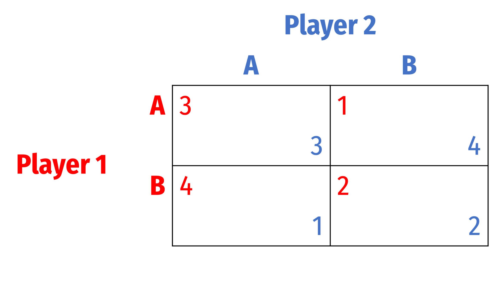
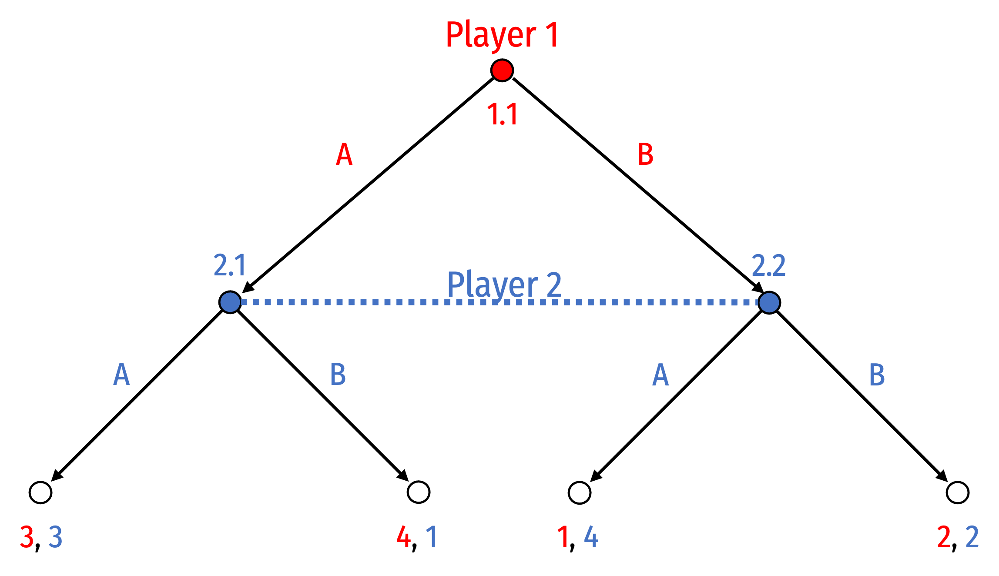
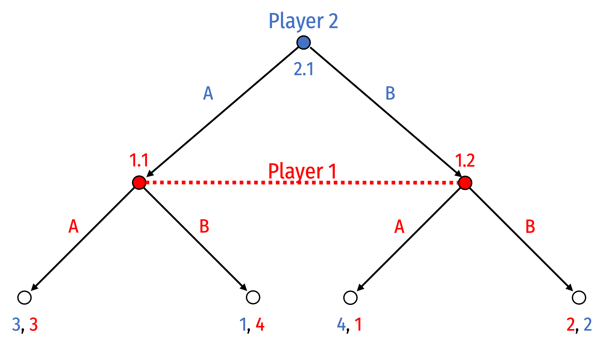
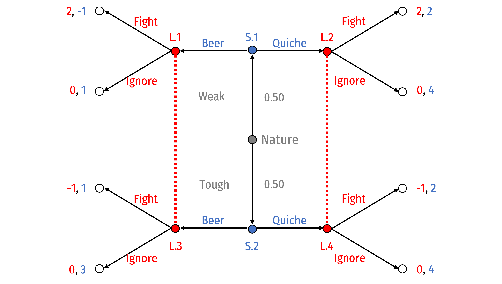

```{r setup, include=FALSE}
knitr::opts_chunk$set(echo = F,
                      message =F,
                      warning =F,
                      fig.retina = 3,
                      fig.width = 8,
                      fig.asp = 0.618)
library("tidyverse")
#library("mosaic")
#library("ggrepel")
ggplot2::theme_set(theme_light(base_family = "Fira Sans Condensed", base_size = 16))
update_geom_defaults("text", list(family = "Fira Sans Condensed"))
update_geom_defaults("label", list(family = "Fira Sans Condensed"))
```

**Note**: Answers may be longer than I would deem sufficient on an exam. Some might vary slightly based on points of interest, examples, or personal experience. These suggested answers are designed to give you both the answer and a short explanation of why it is the answer.

# Concepts

## Question 1

#### What is the difference between a game with **imperfect information** and **incomplete information**?

A game of **_imperfect_ information** is simply a game where the uncertainty comes from what strategy each player has chosen. This can be represented as a simultaneous game in normal/strategic form (payoff matrix) or a sequential game in extended form (game trees) where the second-mover has an information set, indicating they do not know what the first-mover chose.



Game in normal form

 

Equivalent game in extensive form(s)

A game of **_incomplete_ information** is a game where all players do not know everything about the game (who the players are, their available strategies, and the payoffs to all strategy-combinations). A common example is a game of **asymmetric information**, where one (informed) player can be a particular type, but the other player (uninformed) does not know the other player's type. These are called **Bayesian** games because players' actions (and the equilibria) depend on their *beliefs* about other players. 

There are **simultaneous Bayesian games** where players move at the same time (or at least, cannot observe the other player's move prior to their own decision). In the following spin on the assurance game, both <span style=color:red;>Harry</span> and <span style=color:blue;>Sally</span> like Starbucks better than Whitaker. <span style=color:blue;>Sally</span> might like <span style=color:red;>Harry</span>, in which case she would like to be at the *same* place as him. She might *not* like him on the other hand, and might *not* like to be at the same place as him. <span style=color:red;>Harry</span> does not know for certain how <span style=color:blue;>Sally</span> feels:


There are also **sequential Bayesian games** where players move in a clear sequence. A **signalling** variant has the informed player move first, and their move is observed by the uninformed player, who then responds. Hopefully, each type of player plays a different move, revealing their type to the uninformed player. A **screening** variant has the uninformed player move first, and their move is observed by the informed player, who then responds. Hopefully, each type of player responds differently to the first move, revealing their type to the uninformed player. Consider below as an example:


## Question 2

#### Describe the conditions for a **Bayesian Nash Equilibrium (BNE)** and **Perfect Bayesian Nash Equilibrium (PBNE)**. Explain the two types of potential equilibria in any Bayesian game.

Any **Bayesian** game refers to a game with incomplete information. The quintessential example is a game of asymmetric information: one player can be one of two *types* -- they know which type they are, but the other player does not. The main difference between **Bayesian Nash equilibrium (BNE)** and **\emph{Perfect} Bayesian Nash Equilibrium (PBNE)** is whether the game being played is simultaneous or sequential, respectively. This is much like the difference between an ordinary Nash equilibrium in a simultaneous game and a *subgame perfect* Nash equilibrium in a sequential game (hence the "perfect").

In a **Bayesian Nash equilibrium**, each player must be playing their optimal strategy (best response) given the strategies of the other players *and* the uninformed player's *beliefs* about the other player (i.e. the probability of each type). This is typically accomplished by the uninformed player picking the stratgy that maximizes their *expected* payoff against the informed player (weighed by the probability of each type of player). It consists of:

1. A behavioral strategy profile (i.e. what strategy each (type of) player will play)
2. A belief system (i.e. an estimation of the probability of each type of player)

A **Perfect Bayesian Nash equilibrium** builds on **BNE**, where each player must act in a *sequentially*-rational way (i.e. their optimal strategy survives backwards induction given the optimal responses of the other player) and one that is consistent with their beliefs.

Additionally, we can categorize two categories of Bayesian equilibria for each type of game (simultaneous or sequential):

1. A **pooling equilibrium** where each type of player plays the same strategy. 
2. A **separating equilibrium** where each type of player plays a *unique* strategy (compared to other types)

## Question 3

#### Explain the framework of a **signaling** game. What kind of equilibrium is a good signal seeking to attain? (Think back to question 2.) What makes for a good signal? Give some examples.

A signalling game is a sequential game where the informed player (who may be one of several types) moves first, and then the uninformed player moves second. The ideal outcome of a signalling game is a **separating BPNE** where the informed first-mover's action accurately signals their type to the uninformed second-mover.

A good signal is one that is costly, but more costly for one type of player. Thus, observing the signal clearly identifies to the uninformed player that the informed player is a particular type. 

Here are a few examples:

- A foreign merchant signals that s/he is trustworthy by adopting the local practices and customs of the community, so long as it is more costly for dishonest foreign merchants to adopt the practices than an honest merchant
- In Akerlof (1970)'s lemons model: car dealers offering a warranty on a car signals to buyers that the car is high quality, so long as it is less costly for a dealer to offer a warranty on a high-quality car than a low-quality car
- In Spence (1973)'s education model: getting higher education signals to employers that an employee will be a high-ability worker, so long as it is less costly for a high-ability worker to get higher education than a low-ability worker

# Problems

## Question 4

#### A group of police officers have breathalyzers that never fail to detect a truly drunk person. However, the breathalyzer displays false drunkenness in 5% of the cases in which the driver is sober. One in a thousand drivers is driving drunk.

#### Suppose the police officers stop a driver at random, and force the driver to take a breathalyzer test. It indicates that the driver is drunk. Assume we don't know anything else; *what is the probability the driver truly is drunk?*

#### **Hint**: you will first need to find the probability of a positive result overall, use the law of total probability: $P(B)=P(B|A)P(A)+P(B|\text{Not }A)P(\text{Not }A)$, Drawing a probability tree may also help visualize.

This question is a pure application of **Bayes' Rule**: 
$$P(A|B)=\frac{P(B|A)P(A)}{P(B)}$$

- We want to find: $P(Drunk|+)$
- We know: 
    - $P(+|Drunk)=1$
    - $P(+|Sober)=0.05$
    - $P(Drunk)=0.001$
- Bayes' rule implies: $$P(Drunk|+)=\frac{P(+|Drunk)P(Drunk)}{P(+)}$$
- We need to find $P(+)$. Using the law of total probability (see also the probability tree and table to see where this comes from):

$$\begin{align*}
P(+)&=P(+|Drunk)P(Drunk)+P(+|Sober)P(Sober)\\
P(+)&=1(0.001)+0.05(0.999)\\
P(+)&=0.05095\\
\end{align*}$$


|    | Drunk | Sober | **Total** |
|----|------:|--------:|--------:|
| + | 0.0010 | 0.04995 | 0.05095 |
| - | 0.0000 | 0.94905 | 0.94905 |
| **Total** | 0.0010 | 0.99900 | 1.00000 | 

Thus: 

$$\begin{align*}
P(Drunk|+)&=\frac{P(+|Drunk)P(Drunk)}{P(+)}\\
&=\frac{1(0.001)}{0.05095}\\
&=0.020\\
\end{align*}$$

## Question 5

Consider the following game: A (partially-drunk) <span style=color:red;>Local</span> is at a bar in the Old West, potentially looking to pick a fight. A <span style=color:blue;>Stranger</span> comes to the bar for breakfast. The <span style=color:blue;>Stranger</span> is either <span style=color:blue;>Tough</span> or <span style=color:blue;>Weak</span>, and the <span style=color:red;>Local</span> does not know which. Suppose either type is *equally* likely (i.e. $p=0.50)$. If the <span style=color:red;>Local</span> picks a <span style=color:red;>Fight</span>, the <span style=color:blue;>Stranger</span> earns a payoff of <span style=color:blue;>2</span>, and if the <span style=color:red;>Local</span> chooses to <span style=color:red;>Ignore</span>, the <span style=color:blue;>Stranger</span> earns <span style=color:blue;>4</span>. The <span style=color:red;>Local</span> earns <span style=color:red;>0</span> from <span style=color:red;>Ignoring</span>, <span style=color:red;>2</span> from <span style=color:red;>Fighting</span> a <span style=color:blue;>*weak* Stranger</span>, and <span style=color:red;>-1</span> against a <span style=color:blue;>*tough* Stranger</span>. The <span style=color:blue;>Stranger</span> first decides on breakfast: <span style=color:blue;>Quiche</span> (at a cost of 0), or <span style=color:blue;>Beer</span>, which costs 1 for a tough and 3 for a weak <span style=color:blue;>Stranger</span>. The game is set up in the tree below.



For the questions below, when contemplating a potential a **Bayesian Perfect Nash Equilibrium (BPNE)**, each player must (1) have sequentially rational strategies that consistent with backwards induction and (2) have consistent beliefs about the other player. As hints, for (1), consider <span style=color:red;>Local</span>'s *expected* payoff to picking a strategy against the two types of <span style=color:blue;>Stranger</span> given <span style=color:blue;>Stranger</span>'s breakfast selection. For (2), no need to worry about Bayes' Law here, just think about what beliefs <span style=color:red;>Local</span> must have about <span style=color:blue;>Stranger</span>'s type, conditional on observing <span style=color:blue;>Stranger</span>'s breakfast choice, in each of the 4 equilibria.

### Part A

#### Under what conditions (if any) can a **pooling BPNE equilibrium** exist where *both* types of <span style=color:blue;>Stranger</span> choose <span style=color:blue;>Beer</span>?

First, this "Beer-or-Quiche" game actually is a canonical example among game theorists. It originated from a paper based on the satirical 1982 book *Real Men Don't Eat Quiche* by Bruce Feirstein.

If both types of <span style=color:blue;>Stranger</span> choose <span style=color:blue;>Beer</span>, <span style=color:red;>Local</span> must believe
$$p(\color{blue}{Tough}|\color{blue}{Beer})=0.5$$

Note that any belief is possible for $p(\color{blue}{Tough}|\color{blue}{Quiche})$, since we never reach the right information set (where <span style=color:blue;>Stranger</span> has chosen <span style=color:blue;>Quiche</span>)! 

That is, conditional on observing the <span style=color:blue;>Stranger</span> choose <span style=color:blue;>Beer</span>, they are 50% likely to be *tough* (because *all* types of <span style=color:blue;>Stranger</span> choose <span style=color:blue;>Beer</span>, and 50% of <span style=color:blue;>Strangers</span> are *tough*!)

We now consider <span style=color:red;>Local</span>'s expected payoff of <span style=color:red;>Fight</span> vs. <span style=color:red;>Ignore</span> a <span style=color:blue;>Beer</span>-drinking <span style=color:blue;>Stranger</span> (of unknown type). Recall we know $Prob(tough)=Prob(weak)=p=0.50$. 

$$E[\color{red}{Fight}]=\color{red}{2}(0.5)+\color{red}{-1}(0.5)=\color{red}{1.5}$$

$$E[\color{red}{Ignore}]=\color{red}{0}(0.5)+\coloor{red}{0}(0.5)=\color{red}{0}$$

<span style=color:red;>Local</span> gets a higher expected payoff from <span style=color:red;>Fight</span> so that is what they will do against any <span style=color:blue;>Beer</span>-drinking <span style=color:blue;>Stranger</span>.

Now, a *weak* <span style=color:blue;>Stranger</span>, knowing if he chooses <span style=color:blue;>Beer</span> will cause a **Fight** (where he earns $\color{blue}{-1})$, would want to *change* to <span style=color:blue;>Quiche</span>, since he would earn <span style=color:blue;>2</span> in a Fight (because <span style=color:blue;>Beer</span> costs him 3). Note it would not even matter what <span style=color:red;>Local</span> did in response, since both payoffs of Fight and Ignore under Quiche are preferable to <span style=color:blue;>Stranger</span>!

Furthermore, a *strong* <span style=color:blue;>Stranger</span>, knowing if he chooses <span style=color:blue;>Beer</span> will cause a fight (where he earns $\color{blue}{1})$, would want to *change* to <span style=color:blue;>Quiche</span>, since he would earn <span style=color:blue;>2</span> in a fight (because <span style=color:blue;>Beer</span> costs him 1). Note it would not even matter what <span style=color:red;>Local</span> did in response, since both payoffs of Fight and Ignore under Quiche are preferable to <span style=color:blue;>Stranger</span>!

Thus, since *both* types of <span style=color:blue;>Stranger</span> would *not* want to choose <span style=color:blue;>Beer</span>, knowing it is in <span style=color:red;>Local</span>'s best interest to fight any beer-drinker in this scenario, this candidate scenario **can not be a BPNE** since it is **not sequentially rational** for *either* type of <span style=color:blue;>Stranger</span>.

### Part B

Under what conditions (if any) can a **pooling BPNE equilibrium** exist where *both* types of <span style=color:blue;>Stranger</span> choose <span style=color:blue;>Quiche</span>?

### Part C

Under what conditions (if any) can a **separating BPNE equilibrium** exist where a *weak* <span style=color:blue;>Stranger</span> chooses <span style=color:blue;>Beer</span> and a *tough* <span style=color:blue;>Stranger</span> chooses <span style=color:blue;>Quiche</span>?

### Part D

Under what conditions (if any) can the **separating BPNE equilibrium** exist where a *weak* <span style=color:blue;>Stranger</span> chooses <span style=color:blue;>Quiche</span> and a *tough* <span style=color:blue;>Stranger</span> chooses <span style=color:blue;>Beer</span>? 

### Part E

Describe why the signal sent in this game can successfully achieve a separating equilibrium.
