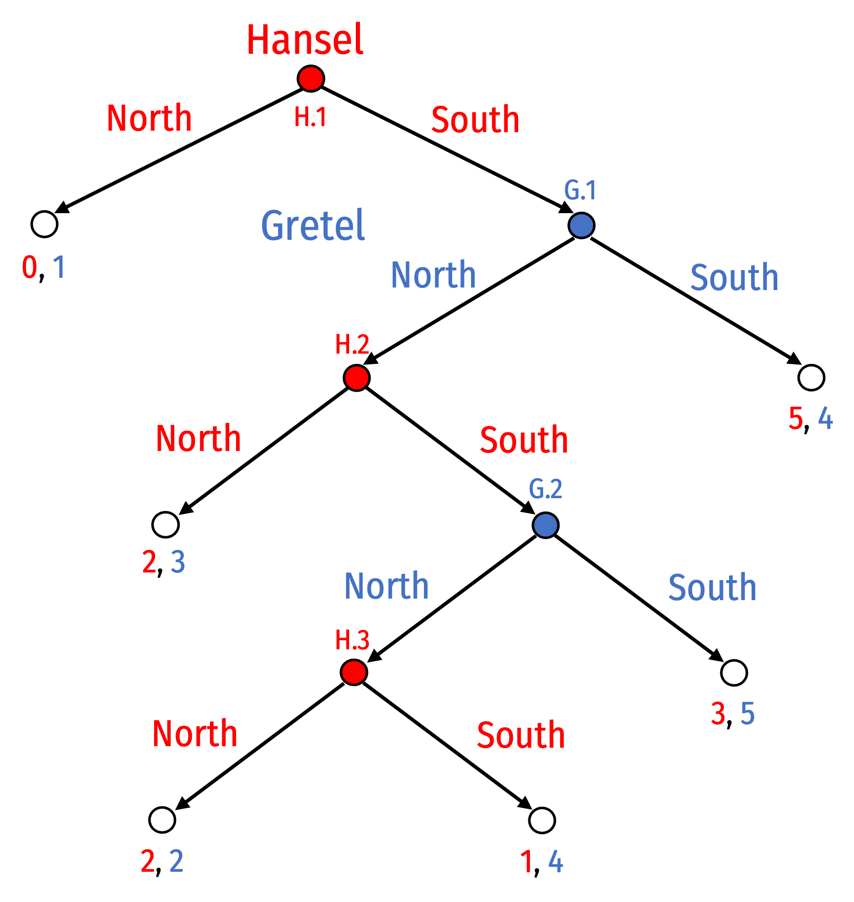

```{r setup, include=FALSE}
knitr::opts_chunk$set(echo = F,
                      message =F,
                      warning =F,
                      fig.retina = 3,
                      fig.width = 8,
                      fig.asp = 0.618)
library("tidyverse")
#library("mosaic")
#library("ggrepel")
ggplot2::theme_set(theme_light(base_family = "Fira Sans Condensed", base_size = 16))
update_geom_defaults("text", list(family = "Fira Sans Condensed"))
update_geom_defaults("label", list(family = "Fira Sans Condensed"))
```

**Note**: Answers may be longer than I would deem sufficient on an exam. Some might vary slightly based on points of interest, examples, or personal experience. These suggested answers are designed to give you both the answer and a short explanation of why it is the answer.

# Concepts

## Question 1

#### What is the difference between a game with **imperfect information** and **incomplete information**?

A game of **_imperfect_ information** is simply a game where the uncertainty comes from what strategy each player has chosen. This can be represented as a simultaneous game in normal/strategic form (payoff matrix) or a sequential game in extended form (game trees) where the second-mover has an information set, indicating they do not know what the first-mover chose.


Game in normal form

 
Equivalent game in extensive form(s)

A game of **_incomplete_ information** is a game where all players do not know everything about the game (who the players are, their available strategies, and the payoffs to all strategy-combinations). A common example is a game of **asymmetric information**, where one (informed) player can be a particular type, but the other player (uninformed) does not know the other player's type. These are called **Bayesian** games because players' actions (and the equilibria) depend on their *beliefs* about other players. 

There are **simultaneous Bayesian games** where players move at the same time (or at least, cannot observe the other player's move prior to their own decision). In the following spin on the assurance game, both <span style=color:red;>Harry</span> and <span style=color:blue;>Sally</span> like Starbucks better than Whitaker. <span style=color:blue;>Sally</span> might like <span style=color:red;>Harry</span>, in which case she would like to be at the *same* place as him. She might *not* like him on the other hand, and might *not* like to be at the same place as him. <span style=color:red;>Harry</span> does not know for certain how <span style=color:blue;>Sally</span> feels:


There are also **sequential Bayesian games** where players move in a clear sequence. A **signalling** variant has the informed player move first, and their move is observed by the uninformed player, who then responds. Hopefully, each type of player plays a different move, revealing their type to the uninformed player. A **screening** variant has the uninformed player move first, and their move is observed by the informed player, who then responds. Hopefully, each type of player responds differently to the first move, revealing their type to the uninformed player. See question 9 for an example signalling game. 


## Question 2

#### Describe the conditions for a **Bayesian Nash Equilibrium (BNE)** and **Perfect Bayesian Nash Equilibrium (PBNE)**. Explain the two types of potential equilibria in any Bayesian game.


The **folk theorem** says that if players play an infinitely repeated game and can observe each player's history, then if players have high enough discount rates ($\delta$ -- they are patient enough to care enough about future payoffs vs. present payoffs) or if there is a high enough probability of repeated interaction ($\theta$), then any equilibrium that is at least as good as the one-shot equilibrium is possible.

The punchline is, in a prisoners' dilemma, if players care enough about the future ($\delta$ or $\theta$ is high enough), then cooperation is a sustainable and rational equilibrium.

## Question 3

#### Describe what a **subgame** means, and circle all subgames in the following game tree.



A **subgame** is any game that is initated upon reaching a decision node (i.e. it extends from the decision node all the way to any terminal nodes from that branch), so long as it fully contains an information set (it breaks no information sets). Think of it like any branch that extends all the way to the end.

In the game tree above, there are 5 subgames (circled on the tree below):

1. The game itself, initiated by Hansel’s decision node H.1
2. The subgame initiated by Gretel’s decision node G.1
3. The subgame initiated by Hansel’s decision node H.2
4. The subgame initiated by Gretel’s decision node G.2
5. The subgame initiated by Hansel’s decision node H.3


## Question 4

#### Define **subgame perfect Nash equilibrium**.

A Nash equilibrium set of strategies is **subgame perfect** if it is sequentially rational: the pair of strategies must be a Nash equilibrium in every possible subgame. That is, if any subgame were reached, neither player would want to deviate from their strategy. 

Subgame perfection rules out threats and promises that are not credible, i.e. if the relevant subgame were reached, players would want to change their announced strategy to the **SPNE** strategy

## Question 5

#### Explain what **strategic moves** are, and explain the three major types of strategic moves.

A **strategic move** is a move that a player can take to change the game in their favor. Normally, these are moves that are made in a stage *prior* to the actual game, and which changes the nature of the actual game to be played. There are three types of strategic moves:

1. A **commitment** is an action that a player engages in *unconditionally* (i.e. regardless of what other players do)
2. A **promise** is a *conditional* announcement that the promisor will play a strategy that *rewards* the other player *if* the other player plays a specific move (or doesn't play a specific move)
3. A **threat** is a *conditional* announcement that the threatener will play a strategy that *punishes* the other player *if* the other player plays a specific move (or doesn't play a specific move)

## Question 6

#### What makes a *promise* **credible**? What makes a *threat* **credible**? Give some examples of each, and in your answers, use the concept of **subgame perfection.**

Both promises and threats are not credible if the threatened/promised strategy is not **incentive-compatible** for the threatener/promisor if the subgame is reached where they must carry out the promise or threat and it is not in their interest to do so. In other words, a threatened/promised strategy is not credible unless it is **subgame perfect** -- it would be a Nash equilibrium for the player to carry out the threat or promise.

Promises and threats can be made credible with **commitment** that changes the payoffs or available moves to the threatener/promisor such that they will indeed choose to carry out the promise or threat if that subgame were reached. 

## Question 7

#### What makes a strategy **evolutionarily stable** (ESS)? Describe the difference between **monomorphic** and **polymorphic** equilibria.

A strategy is **evolutionarily stable** (**ESS**) if a population of players all playing that strategy cannot successfully be invaded by a small group of mutants playing a different strategy. 

A **monomorphic** equilibrium is where all members of the population are playing the same strategy (a single **phenotype**) and that strategy is **ESS**. For example, in the Hawk-Dove game, a population where all individuals play *Hawk*, and could not be successfully invaded by mutant *Doves*, is a monomorphic equilibrium.

A **polymorphic** equilibrium is where different fractions of a population each play a different strategy (or there are multiple **phenotypes** in the population). This is the case where there is no single strategy that is **ESS**, and therefore a **monomorphic** equilibrium is impossible. An example would be a population that is some fraction of *Doves* and some fraction of *Hawks* (in a scenario where neither *Hawk* nor *Dove* is **ESS**).  

# Problems

## Question 8

Consider an evolutionary version of the Stag Hunt game, where members of a species can decide to cooperate and hunt a **Stag** together, or defect and go after a **Hare** on their own.
 


### Part A

#### Is **Stag** an evolutionarily stable strategy (ESS)?

Consider a population of **Stag**-players, who are randomly matched to play each other:

- With probability $1-\epsilon$, they play with another **normal** (Stag) player
- With very small probability $\epsilon$, they play with a **mutant** (Hare) player

**This is important to remember going forward: $\epsilon$ is a very small number! Think like 0.01.**

We need to check if the expected payoff of normal (**Stag**) types is higher than mutant (**Hare**) types:
$$\begin{align*}
E[Normal] &\lessgtr E[Mutant]\\
E[Stag] &\lessgtr E[Hare]\\
2(1-\epsilon)+0(\epsilon) &\lessgtr 1(1-\epsilon)+1(\epsilon)\\
2-2\epsilon &> 1 \\
\end{align*}$$

Yes, **Stag** is **ESS**, a population of **Stag**-players cannot successfully be invaded by a small group of mutant **Hare**-players. 

### Part B

#### Is **Hare** an evolutionarily stable strategy (ESS)?

Consider a population of **Hare**-players, who are randomly matched to play each other:

- With probability $1-\epsilon$, they play with another **normal** (Hare) player
- With very small probability $\epsilon$, they play with a **mutant** (Stag) player

We need to check if the expected payoff of normal (**Hare**) types is higher than mutant (**Stag**) types:
$$\begin{align*}
E[Normal] &\lessgtr E[Mutant]\\
E[Hare] &\lessgtr E[Stag]\\
1(1-\epsilon)+1(\epsilon) &\lessgtr 0(1-\epsilon)+2(\epsilon)\\
1 &> 2\epsilon \\
\end{align*}$$

Yes, **Hare** is **ESS**, a population of **Hare**-players cannot successfully be invaded by a small group of mutant **Stag**-players. 


### Part C

#### What are the pure strategy Nash equilibria (PSNE) of this game? Reconcile this with your answers in parts a and b.

The two PSNE are (Stag, Stag) and (Hare, Hare). If a strategy, $S$, is ESS, then ($S,S$) must be a PSNE.  

### Part D

Suppose the environment changes such that hunting a large **Hare** *alone* is equally rewarding to the cooperative hunt of a **Stag** (but if they both hunt **Hare**, it is less rewarding).


#### Under the new environment, is **Hare** evolutionarily stable (ESS)?

Consider a population of **Hare**-players, who are randomly matched to play each other:

- With probability $1-\epsilon$, they play with another **normal** (Hare) player
- With very small probability $\epsilon$, they play with a **mutant** (Stag) player

We need to check if the expected payoff of normal (**Hare**) types is higher than mutant (**Stag**) types:

$$\begin{align*}
E[Normal] &\lessgtr E[Mutant]\\
E[Hare] &\lessgtr E[Stag]\\
1(1-\epsilon)+2(\epsilon) &\lessgtr 0(1-\epsilon)+2(\epsilon)\\
1+\epsilon &> 2\epsilon \\
\end{align*}$$

Yes, **Hare** is **ESS**, a population of **Hare**-players cannot successfully be invaded by a small group of mutant **Stag**-players.

### Part E

#### Under the new environment, is **Stag** evolutionarily stable (ESS)?

Consider a population of **Stag**-players, who are randomly matched to play each other:

- With probability $1-\epsilon$, they play with another **normal** (Stag) player
- With very small probability $\epsilon$, they play with a **mutant** (Hare) player

We need to check if the expected payoff of normal (**Stag**) types is higher than mutant (**Hare**) types:

$$\begin{align*}
E[Normal] &\lessgtr E[Mutant]\\
E[Stag] &\lessgtr E[Hare]\\
2(1-\epsilon)+0(\epsilon) &\lessgtr 2(1-\epsilon)+1(\epsilon)\\
2-2\epsilon &< 2-\epsilon \\
\end{align*}$$

No, **Stag** is **not ESS**, a population of **Stag**-players will be successfully invaded by a small group of mutant **Hare**-players.

### Part F

#### Given what we learned in class about the relationship between (pure strategy) Nash equilibria and evolutionarily stable strategies, we now need a new refinement. Define a **_strict_ Nash equilibrium** in pure strategies to mean that each player is playing a **strict** (or **unique**) best response to other players, i.e. there is no *other* strategy that is *also* a best response to another player. In the one-shot game in part d, which PSNE are **strict**, and which are not (i.e. "weak" PSNE? What do you then think is the relationship between ESS and strict/non-strict PSNE?

In the game above, (Hare, Hare) is a strict PSNE, since the best response to a player playing **Hare** is to also play **Hare.** This means that a population of **Hare**-players could not be invaded by mutant **Stag**-players.

(Stag, Stag) on the other hand is a *weak* PSNE, since both **Stag** and **Hare** are best responses to a player playing **Stag** (both yield a payoff of 2). This means that a population of **Stag**-players could be invaded by mutant **Hare**-players. 

In general, let *S* be a strategy available to all players:

If $(S,S)$ is a strict pure strategy Nash equilibrium (PSNE), then *S* is an evolutionarily stable strategy (ESS). Conversely, if *S* is an ESS, then $(S,S)$ is a strict PSNE. This implies that playing *S* is a strict (unique) best response against other players playing *S*. This means that a population of *S*-players can not be invaded by any mutant playing another strategy.

If $(S,S)$ is a *weak* PSNE, then *S* is *not* an ESS. This implies that *S* is *not* a (only) strict best response against *S*, there are other strategies $S'$ that are also best responses against *S*. This means that a population of *S*-players can be invaded by mutant *S'* players. 

## Question 9

Consider the evolutionary Hawk-Dove game, where members of a species are competing over a resource valued at 12, with a cost of losing a fight being $-15$.

### Part A

#### Draw the payoff matrix for the game.


#### Find the pure strategy Nash equilibria.

This is a simple Chicken game, so the two PSNE are:

1. (Hawk, Dove)
2. (Dove, Hawk)

### Part C

#### Is **Hawk** evolutionarily stable?

Consider a population of **Hawk**-players, who are randomly matched to play each other:

- With probability $1-\epsilon$, they play with another **normal** (Hawk) player
- With very small probability $\epsilon$, they play with a **mutant** (Dove) player

We need to check if the expected payoff of normal (**Hawk**) types is higher than mutant (**Dove**) types:

$$\begin{align*}
E[Normal] &\lessgtr E[Mutant]\\
E[Hawk] &\lessgtr E[Dove]\\
-1.5(1-\epsilon)+12(\epsilon) &\lessgtr 0(1-\epsilon)+6(\epsilon)\\
13.5\epsilon-1.5 &< 6\epsilon \\
\end{align*}$$

No, **Hawk** is **not ESS**, a population of **Hawk**-players will be successfully invaded by a small group of mutant **Dove**-players (for very small $\epsilon$).

### Part D

#### Is **Dove** evolutionarily stable?

Consider a population of **Dove**-players, who are randomly matched to play each other:

- With probability $1-\epsilon$, they play with another **normal** (Dove) player
- With very small probability $\epsilon$, they play with a **mutant** (Hawk) player

We need to check if the expected payoff of normal (**Dove**) types is higher than mutant (**Hawk**) types:

$$\begin{align*}
E[Normal] &\lessgtr E[Mutant]\\
E[Dove] &\lessgtr E[Hawk]\\
6(1-\epsilon)+0(\epsilon) &\lessgtr 12(1-\epsilon)-1.5(\epsilon)\\
6-6\epsilon &< 12-13.5\epsilon \\
\end{align*}$$

No, **Dove** is **not ESS**, a population of **Dove**-players will be successfully invaded by a small group of mutant **Hawk**-players (for very small $\epsilon$). 

### Part E

#### Reconcile your answers in parts c and d to your answer in part b.

Neither **Hawk** nor **Dove** are ESS, because neither (Hawk, Hawk) nor (Dove, Dove) are PSNE. 

### Part F

Find the evolutionarily stable (polymorphic) equilibrium distribution of **Hawks** and **Doves.** [Hint: let $p$ be the probability the *other* player is a **Hawk**.]

Forget mutants and normal types for a moment, just consider the expected payoff of any individual playing **Hawk** or playing **Dove** against a random opponent, who plays **Hawk** with probability $p$ and **Dove** with probability ($1-p$). This is akin to finding a **mixed strategy Nash equilibrium (MSNE)**, the probability $p$ where the expected payoff of playing either strategy is equal (opponent indifference principle). 

$$\begin{align*}
E[Hawk]&=E[Dove]\\
-1.5(p)+12(1-p)&=0(p)+6(1-p)\\
12-13.5p&=6-6p\\
12&=6+7.5p\\
6&=7.5p\\
0.80&=p\\
\end{align*}$$

The polymorphic ESS is where 80% of the population are Hawks, 20% are Doves. If we were to graph the expected payoffs as a function of $p$:

```{r, fig.retina = 3}
hawk <- function(p){12-13.5*p}
dove <- function(p){6-6*p}
hawks_triangle <- tribble(
  ~x, ~y,
  0, 6,
  0, 12,
  0.8, 1.2
)
doves_triangle <- tribble(
  ~x, ~y,
  1, 0,
  0.889, 0,
  0.8, 1.2
)

ggplot(data = tibble(x = c(0,1)))+
  aes(x = x)+
  geom_polygon(data = hawks_triangle, aes(x = x, y = y), fill ="#FFA500", alpha = 0.5)+
  geom_polygon(data = doves_triangle, aes(x = x, y = y), fill ="#047806", alpha = 0.5)+
  
  stat_function(fun = hawk, geom = "line", size = 2, color = "#FFA500")+
  geom_label(x = 0.1, y = hawk(0.1), label = "Payoff to Hawk", color = "#FFA500")+
  stat_function(fun = dove, geom = "line", size = 2, color = "#047806")+
  geom_label(x = 0.1, y = dove(0.1), label = "Payoff to Dove", color = "#047806")+
  
  geom_segment(x = 0, xend = 0.8, y = 1.2, yend = 1.2, size = 1, linetype = "dotted")+
  geom_segment(x = 0.8, xend = 0.8, y = 1.2, yend = 0, size = 1, linetype = "dotted")+

  annotate("segment", x = 0.1, xend = 0.75, y = 1, yend = 1, color = "#FFA500", size=2, alpha=1, arrow=arrow(length=unit(0.5,"cm"), ends="last", type="closed"))+
  geom_label(x = 0.45, y = 1, label = "Hawks \n invade", color = "#FFA500")+
  
    annotate("segment", x = 1, xend = 0.85, y = 2, yend = 2, color = "#047806", size=2, alpha=1, arrow=arrow(length=unit(0.5,"cm"), ends="last", type="closed"))+
  geom_label(x = 0.95, y = 2, label = "Doves \n invade", color = "#047806")+

  
  scale_x_continuous(breaks = seq(0,1,0.1),
                     limits = c(0,1.05),
                     expand = c(0,0))+
  scale_y_continuous(breaks = seq(0,12,1),
                     limits = c(0,12.5),
                     expand = c(0,0))+
  labs(x = "Proportion of Hawks, p",
       y = "Fitness")+
  theme_light(base_family = "Fira Sans Condensed", base_size = 20)
```

## Question 10

Consider the following game between two roommates. Roommate A has a very difficult exam the next morning, while Roommate B does not. The two of them can each decide to Study or Go Out that evening. Both would rather do something together, while A would certainly prefer they both Study and B would prefer they both Go Out.

### Part A

#### Suppose they both agree that A gets to decide first and B must respond, as in the following game:


#### Solve this game for the rollback equilibrium using backwards induction.


### Part B

#### Circle all subgames on the game tree.


There are three subgames (shown in answer to part a):
    1. The game itself
    2. The subgame initiated by decision node B.1
    3. The subgame initiated by decision node B.2

### Part C

#### Carefully convert this game from extensive form to strategic form. (Be mindful of how many potential strategies each player has!) Then, find any Nash equilibria in strategic form.

Since B faces two decision nodes with 2 strategies at each node, they have $2^2=4$ possible strategies. For convenience, I denote their strategies as the ordered pair of what choice they would make at decision nodes (B.1, B.2). For shorthand: S stands for Study; GO stands for Go Out. 


- Using best response analysis, we can see the following Nash equilibria:
    1. {Study, (Study, Study)}
    2. {Study, (Study, Go Out)}
    3. {Go Out, (Go Out, Go Out)}


### Part D

#### Which Nash equilibrium is subgame perfect? Why?

 

- Only {Study, (Study, Go Out)} is subgame perfect. It is the only strategy set by both players that would be a Nash equilibrium in each of the 3 subgames. 
- Under the Nash equilibrium of {Study, (Study, Study)}, B would want to change from Study to Go Out in the subgame beginning at node B.2.
- Under the Nash equilibrium of {Go Out, (Go Out, Go Out)}, B would want to change from Go Out to Study in the subgame beginning at node B.1. A would also want to switch from Go Out to Study in the subgame beginning at their initial decision node (i.e. the whole game).

### Part E

#### Suppose in an attempt to get A to Go Out, B says they will Go Out regardless of what A does. If A still gets to decide first (i.e. it is the same game as in part a), what should A make of this?

This is not a credible statement because it is not subgame perfect. B would indeed Go Out if A chose to Go Out, but if A chooses to Study (and we enter the lower subgame B.1 on the left), B is better off also choosing to Study.