```{r setup, include=FALSE}
options(htmltools.dir.version = FALSE)
knitr::opts_chunk$set(echo=F,
                      message=F,
                      warning=F,
                      fig.retina = 3,
                      fig.align = "center")
library("tidyverse")
library("ggrepel")
library("fontawesome")
xaringanExtra::use_tile_view()
xaringanExtra::use_tachyons()
xaringanExtra::use_freezeframe()

update_geom_defaults("label", list(family = "Fira Sans Condensed"))
update_geom_defaults("text", list(family = "Fira Sans Condensed"))

set.seed(256)

theme_slides <- theme_light() + 
  theme(
    text = element_text(family = "Fira Sans", size = 24)
  )

```

class: inverse

# Outline

### [Game Theory](#)
### [Defining a Game](#)
### [Types of Games](#)
### [About This Course](#)

---

# About Me

.left-column[
.center[


.smallest[
Edinburgh, 2019
]
]
]

.right-column[
.smallest[

- Ph.D (Economics) — George Mason University, 2015

- B.A. (Economics) — University of Connecticut, 2011

- Specializations:
  - Law and Economics
  - Austrian Economics

- Research interests
  - modeling innovation & economic growth
  - political economy & economic history of intellectual property
]
]

---

# About Me

.left-column[
.center[


.smallest[
My face without a mask, 2021
]
]
]

.right-column[
.smallest[

- Ph.D (Economics) — George Mason University, 2015

- B.A. (Economics) — University of Connecticut, 2011

- Specializations:
  - Law and Economics
  - Austrian Economics

- Research interests
  - modeling innovation & economic growth
  - political economy & economic history of intellectual property

]
]

---

# The Reason I am Busy AF Behind the Scenes


.center[

]

And why I wear a mask.
---

class: inverse, center, middle

# Game Theory

---

# What This Course is NOT (*Necessarily*) About

.pull-left[
.center[


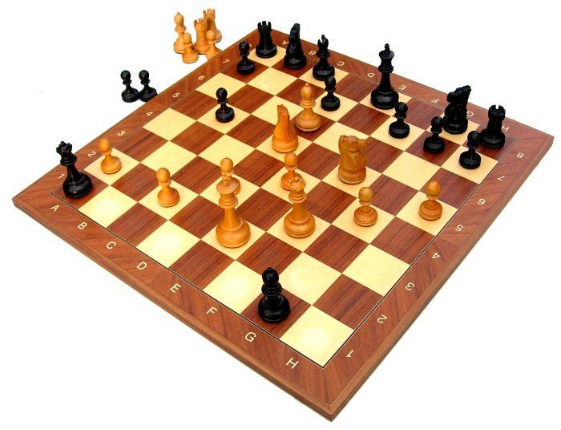
]
]

.pull-right[
.center[
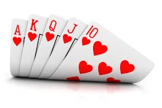
]

.center[

]
]

---

# You Are An Experienced Player of Many Games

.pull-left[

- You are *actively* playing *many* games
  - Friends
  - Enemies
  - Family
  - Employer
  - Classmates
  - Driving
  - Reputation
  - With me
]

.pull-right[
.center[


]
]

---

# Applications of Game Theory

.pull-left-3[
.center[


]
]

.pull-middle-3[
.center[


]
]

.pull-right-3[
.center[


]
]

---

class: inverse, center, middle

# Defining a Game

---

# What A Game Is...in Math

.pull-left[
- A game is fully described by
$$\Gamma = (s_1,s_2, \cdots, s_n;u_1, u_2, \cdots, u_n):$$

1. Players $i \in \{1,2,\cdots, N\}: N \geq 2$
2. Strategies $s_i \in \{S_i\}$
  - $S_i$ is the set of all strategies available to player $i$
3. Payoffs $u_i \in \{s_i, s_{\neg i}\}$
  - $u_i: S_i \times S \cdots S_{\neg i} \rightarrow \mathbb{R}$
]

--

.pull-right[
.bg-washed-green.b--dark-green.ba.bw2.br3.shadow-5.ph4.mt5[
.hi-green[Example]: A 2-person game

1. Players
  - 1 and 2
2. Strategies
  - $s_1 \in S_1$ and $s_2 \in S_2$
3. Payoffs
  - $u_1 \in \{s_1, s_2\}$
  - $u_2 \in \{s_1, s_2\}$

]
]

---

# Now That I've Frightened You

.pull-left[
.smaller[
- Game theory can be highly abstract and mathematical

- Our approach in this class will use *some*, but not *primarily* math

- You'll be fine if you can:
  - Do some simple algebra
  - Find an average or expected value
  - Maybe take a derivative
  - Even if not, you can catch up

- We will focus on **applications** and examples of strategic interaction 
]
]
.pull-right[
.center[
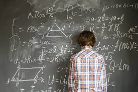
]
]

---

# How We Will Define a Game

.pull-left[

- A .hi[game] is a strategic interaction between rational agents that has 3 elements:
  1. .hi-purple[Players] interacting rationally
  2. .hi-purple[Conditional strategies] that each player can choose from
  3. .hi-purple[Payoffs] to each player that are *jointly-determined* from combination of all players’ strategies

]

.pull-right[
.center[
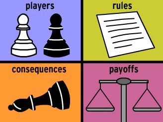
]
]

---

# How We Will Define a Game

.pull-left[

- Arguably, a 4th element, .hi-purple[Rules] about:
  - Timing of players' moves
  - Actions available to each player at each move
  - Information each player has at each move
]

.pull-right[
.center[

]
]

---

# We Are Ruling Out Situations

.pull-left[

- Where strategy does not matter (i.e. pure chance)

- Without strategic interaction between players (i.e. a “single-player” game) 
]

.pull-right[
.center[
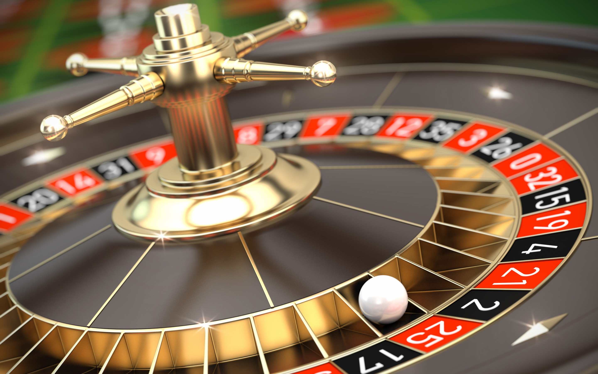

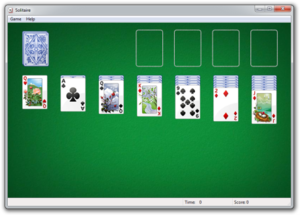
]
]

---

# History of Game Theory

.pull-left-3[
.center[
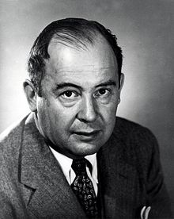

.smallest[
John von Neumann
1903—1956
]
]
]

.pull-middle-3[
.center[
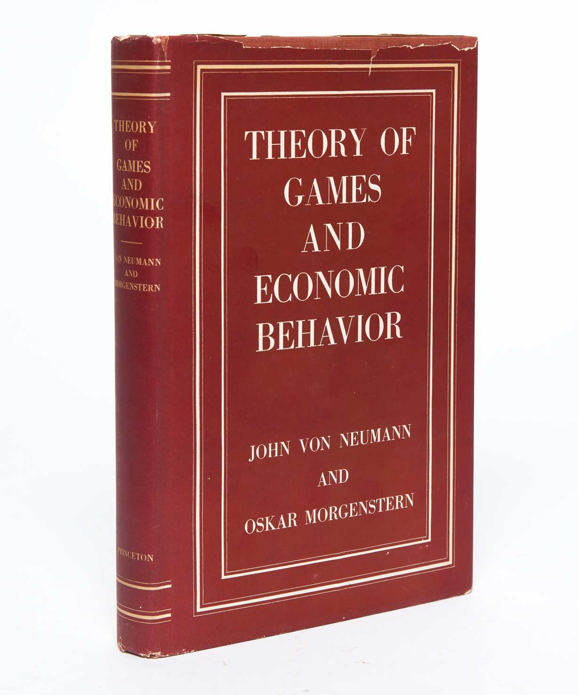
]
]

.pull-right-3[
.center[
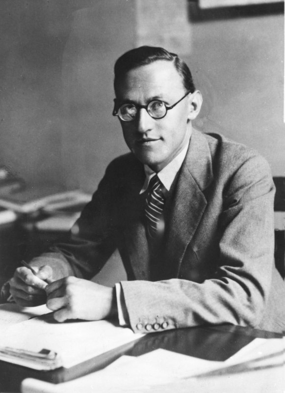

.smallest[
Oskar Morgenstern
1902—1977
]
]
]

---

# Game Theory Nobel Prizes

.center[

]

---

# Game Theory is *Not* Limited to Economics!

.pull-left[

- Political science
- International relations
- Business strategy
- Negotiation
- Law
- Evolutionary biology
- Sports

]

.pull-right[
.center[

]
]

---

# An Example Game

.bg-washed-green.b--dark-green.ba.bw2.br3.shadow-5.ph4.mt5[
.hi-green[Example]: Take out a piece of paper. You will be matched randomly with one other person in class. Neither of you will ever find out who the other person was. Write down either the letter X or Y.

- If one of you writes X and the other writes Y, the person with X gets 8 bonus points added to their midterm exam, the person with Y gets 0 bonus points
- If you both write X, you each get 1 bonus point
- If you both write Y, you each get 4 bonus points

]

---

# Why Is This a Game?

.pull-left[
1. More than 1 player
2. Strategies available to each player
3. Payoffs jointly determined by strategies chosen

- You just don’t happen to know *who* the other player is
  - But you still need to think about (how to respond to) their strategies with your own
]

.pull-right[
.center[

]
]

---

# We Can Represent This 

- We can represent this (and any) game in two ways:
  - Both describe all three elements of the game

--

.pull-left[

- .hi[“Normal”] or .hi[“Strategic”] form (a matrix)

.center[
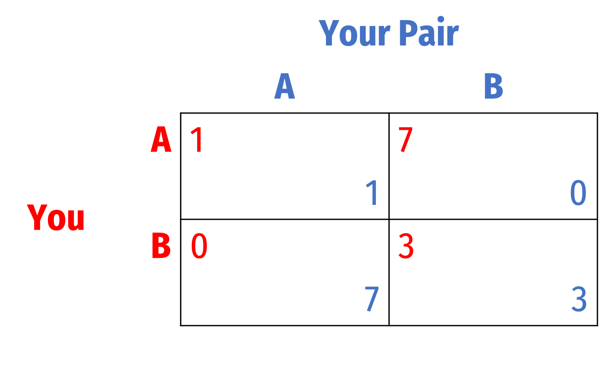
]
]

--

.pull-right[

- .hi[“Extensive”] form (a game tree)

.center[
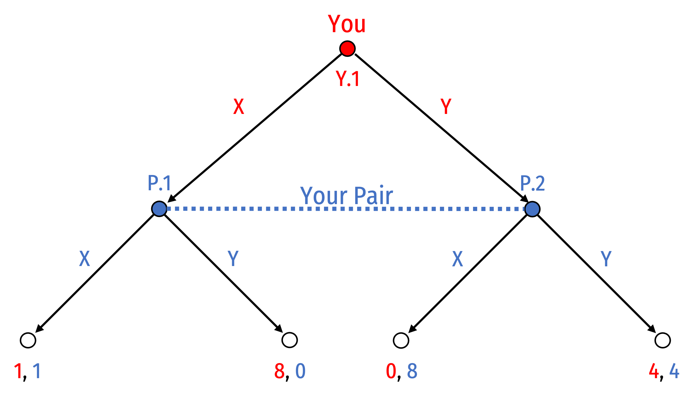
]
]

---

# Some Data From My ECON 306 Class

```{r}
pd<-tibble(individual = c("JT", "MS", "KK", "MS", "JS", "AG", "VA", "KS", "SB", "BM", "WA", "MA", "GC", "GY", "AR", "JW", "RB", "SW", "NR", "LC", "GS", "CW", "RO", "MG", "SJ", "AT", "ET", "PS", "SD", "MK", "SD", "PC", "MM", "JC", "SM", "JH", "MC", "HD","ML", "MK", "SA", "SS", "LK", "NB", "MM", "RR", "AP", "TS", "CU", "IC", "EZ", "PH", "HM", "TB", "JM", "RY", "SZ", "LC"),
           chose = c("X", "X", "X", "X", "Y", "X", "X", "X", "X", "X", "X", "Y", "Y", "Y", "Y", "X", "Y", "X", "X", "X", "X", "X", "X", "Y", "X", "X", "X", "Y", "X", "X", "X", "X", "Y", "Y", "X", "NA", "NA", "Y", "Y", "NA", "Y", "X", "Y", "X", "X", "X", "X", "X", "Y", "X", "X", "Y", "NA", "Y", "X", "X", "Y", "X"),
           earned = c(1,1,1,1,0,8,1,1,1,1,8,0,4,4,0,8,0,8,1,1,1,1,8,0,1,1,8,0,1,1,1, 8,0,0,8,NA,NA,4,4,NA,0,8,0,8,1,1,1,1,0,8,8,0,NA,0,8,8,0,1)) %>% filter(chose != "NA")

choice<-pd %>%
  count(chose) %>%
  mutate(frac = paste0(round(100*n/sum(n),2),"%"),
         chose = ordered(chose, levels = c("Y", "X")),
         chose_label = paste0(chose,"\n",frac)) %>%
  #arrange(desc(n)) %>%
  ggplot(data = .)+
  aes(x = "",
      y = n)+
  geom_col(aes(fill = chose))+
  geom_text(aes(label = chose_label),
            color = "white",
            size = 5,
            family = "Fira Sans Condensed",
            fontface = "bold",
            position = position_stack(vjust=0.5)
            #vjust = 1.1
  )+
  #scale_fill_manual(values = c("X"="X", "Y"="Y"))+
  guides(color = F,
         fill = F)+
  theme_void(base_family = "Fira Sans Condensed",
             base_size = 14)+
  coord_flip()+
  scale_fill_viridis_d()+
  labs(title = "Choices Made")+
  theme(plot.title = element_text(face = "bold", size = rel(1.5)))

points<-pd %>%
  count(earned) %>%
  mutate(frac = paste0(round(100*n/sum(n),2),"%"),
         earned = ordered(earned, levels = c("0", "1", "4", "8")),
         earned_label = paste0(earned,"\n",frac)) %>%
  arrange(desc(n)) %>%
  ggplot(data = .)+
  aes(x = earned,
      y = n)+
  geom_col(aes(fill = earned))+
  geom_text(aes(label = frac),
            color = "white",
            size = 5,
            family = "Fira Sans Condensed",
            fontface = "bold",
            hjust = 1.1)+
  guides(color = F,
         fill = F)+
  theme_classic(base_family = "Fira Sans Condensed",
                base_size = 14)+
  coord_flip()+
  scale_fill_viridis_d()+
  scale_y_continuous(limits=c(0,25),
                     expand = c(0,0))+
  labs(title = "Points Earned")+
  theme(plot.title = element_text(face = "bold", size = rel(1.5)),
        axis.title.y = element_blank(),
        axis.title.x = element_blank(),
        axis.line.x = element_blank(),
        axis.ticks.x = element_blank(),
        axis.text.x = element_blank(),
        axis.text.y = element_text(face = "bold"))

library(patchwork)
choice / points
```

---

# Solution Concepts

.pull-left[

- In order to be a useful tool/model, need a .hi[solution concept] to predict outcome
  - Otherwise, what’s the point of the model?

- Game theory models are a special type of .hi[equilibrium model], so we want to find the .hi[equilibrium] of a game
]

.pull-right[
.center[

]
]

---

# The Solution to Our Game

.pull-left[

- Both players have a .hi-purple[dominant strategy] to play X

- A famous type of game, called a .hi-purple[Prisoners’ Dilemma]
  - Why can’t they both just play Y?

- Much, much more to say about it all this semester
]

.pull-right[
.center[
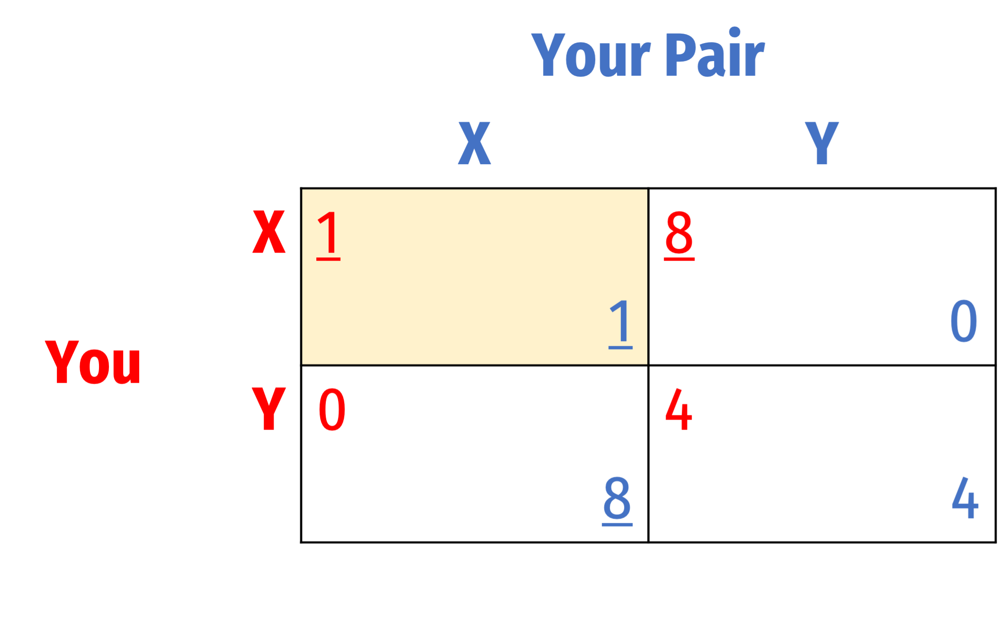
]
]

---

class: inverse, center, middle

# Types of Games

---

# Simultaneous vs. Sequential Games

.pull-left[

- .hi[Simultaneous games]: players choose strategies simultaneously

- Must *anticipate* what other players are likely to play *without knowing*

- .hi-green[Examples]: prisoners' dilemma, coordination game, RTS games, most sports, sealed-bid auction, secret ballot
]

.pull-right[
.center[

]
]

---

# Simultaneous vs. Sequential Games

.pull-left[

- .hi[Sequential games]: players make moves one at a time

- Often can *see the previous moves* of all players

- Must *look to the future* of how others will respond in order to determine what is optimal *now*

- .hi-green[Examples]: chess, poker, board games, strategy games, bargaining, negotiations
]

.pull-right[
.center[
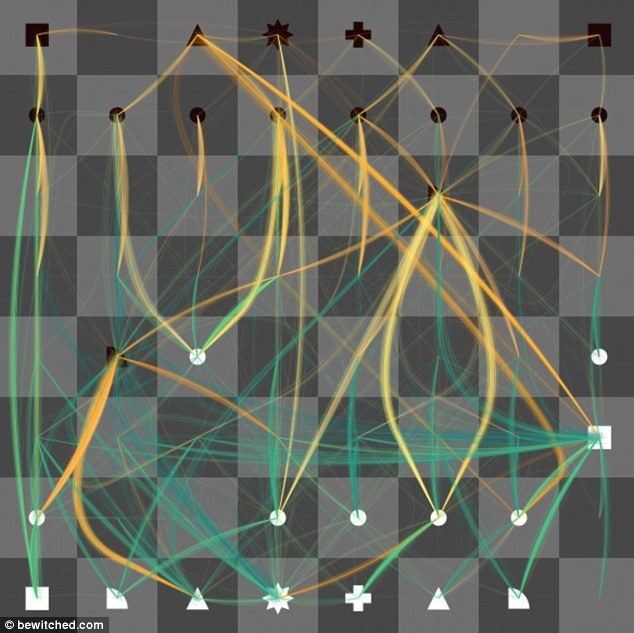
]
]

---

# One-Shot vs. Repeated Games

.pull-left[

- .hi[One-shot game]: game between players with no *history* together, occurs only once

- Players do not know much about each other, know they will never encounter one another again

- .hi-green[Examples]: tipping while on vacation, strangers on a subway, game show contestants
]

.pull-right[
.center[

]
]

---

# One-Shot vs. Repeated Games

.pull-left[

- .hi[Repeated game]: game between *the same* players is played *more than once*

- Players know the *history* of the game with each other

- .hi-purple[Finitely-repeated game]: has a known final round

- .hi-purple[Infinitely-repeated game]: has no (or an unknown) final round

]

.pull-right[
.center[
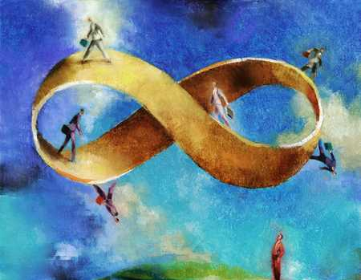
]
]

---

# One-Shot vs. Repeated Games

.pull-left[

- Reputation and history matters more in repeated games

- More role for “emotional” responses
  - Aggressiveness, vindictiveness, retribution, forgiveness

- Some strategies may be good for a *one-shot* interaction but harmful in a *repeated* game

- .hi-green[Examples]: bargaining too hard, rude to employees/customers, fraud
]

.pull-right[
.center[

]
]

---

# Information

.pull-left[

- .hi[Perfect information]: all players know all of the rules, possible strategies, payoffs, and move history of all players

- All players know that all players know that all players know that ...
  - .hi-purple[“Common knowledge”]
]

.pull-right[
.center[

]
]

---

# Information

.pull-left[

- .hi[Imperfect information]: all players *don’t* necessarily have all information

- .hi-purple[“Strategic uncertainty”]: players may know the game, but not which strategies other players have chosen
  - i.e. a simultaneous game

]

.pull-right[
.center[
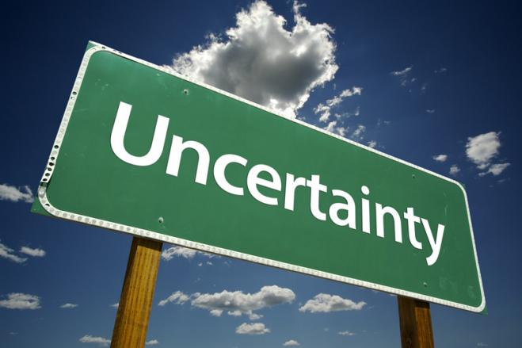
]
]

---

# Information

.pull-left[
.smaller[
- .hi[Incomplete information]: all players *don’t* have full information about the game (.hi-purple[“external uncertainty”])

- .hi-purple[Asymmetric information]: some players have more information than others
  - Player 1 doesn’t know the other player 2’s “type,” but they do
  - Player 2 may want to conceal their information, or may try to .hi-purple[signal] their type to Player 1

- .hi-green[Examples]: insurance, used cars, education, ordeals
]
]
.pull-right[
.center[

]
]

---

# Stability of the Rules

.pull-left[

- Rules of the game may be fixed and immutable

- Or players may be able to .hi-turquoise[manipulate the rules in their favor]
  - .hi-purple[“Strategic moves”]: *pre-game* game of determining rules for future game

- Making .hi[credible] .hi-purple[threats] or .hi-purple[promises] with .hi-purple[commitment]

- .hi-green[Examples]: constitutions, agenda-setting, strategic voting, entry deterrence
]

.pull-right[
.center[
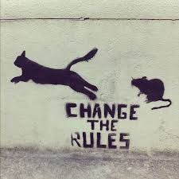
]
]

---

# Sum of the Game

.pull-left[

- A .hi-purple[zero/constant sum game]: player(s) gain only at the expense of other player(s)

- .hi-green[Examples]: sports, board games, division of a surplus
]

.pull-left[
.center[
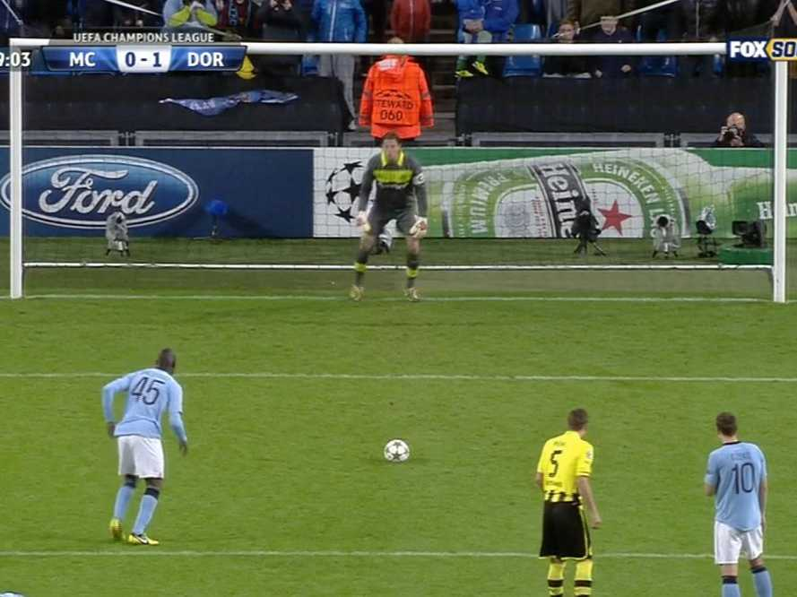
]
]

---

# Sum of the Game

.pull-left[

- A .hi-purple[positive sum game]: all players can potential benefit from interaction
  - .hi-green[Example]: trade, bargaining

- A .hi-purple[negative sum game]: all players can potentially be harmed from interaction
  - .hi-green[Example]: war, conflict, rent-seeking
]

.pull-right[
.center[

]
]

---

class: inverse, center, middle

# About This Course

---

# Learning Goals

By the end of this course, you will: 

1. Recognize different types of strategic interactions across different domains (e.g. economics, business, political science, biology, etc.)
2. Recognize common types of games, e.g. prisoners' dilemma, stag hunt, battle of the sexes, chicken, hawk-dove
3. Solve for equilibria of games in normal form, extended form, in pure & mixed strategies, with perfect and imperfect information
4. Understand the role of information, sequencing, credible commitments, repetition, etc.
5. Become familiar with some of the economics (and other) literatures that use game theoretic tools
6. Use game theory tools to explore a topic in writing

---

# Assignments

```{r}
tribble(
  ~Frequency,  ~Assignment, ~Weight,
  "n", "Homeworks", "25% (using average HW grade)",
  "1", "Paper", "25%",
  "1", "Midterm Exam", "25%",
  "3", "Final Exam", "25%"
) %>% knitr::kable(., "html")
```

---

# Your “Textbooks”

.pull-left[
.center[
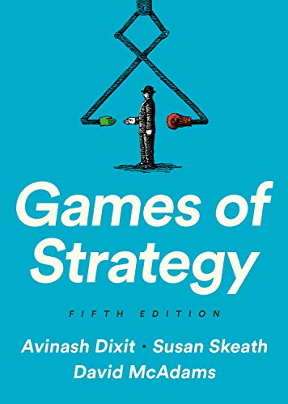
]
]

.pull-left[
.center[

]
]

---

# Course Website

.center[
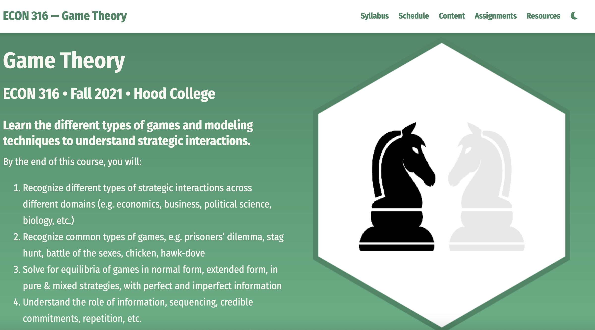

[gameF21.classes.ryansafner.com](https://gameF21.classes.ryansafner.com)
]

---

# Logistics

.pull-left[
.smallest[

- Office hours: M/W 10:00-11:00 AM & by appt
  - Office: 110 Rosenstock

- `r fa("slack", fill ="#5E81AC")` Slack channel
  - `#c-316-game`

- Recorded videos in Blackboard Panopto

- Attendance

- See the [resources page](http://gameF21.classes.ryansafner.com/resources) for tips for success and more helpful resources
]
]
.pull-right[
.center[

]
]
---

# Roadmap for the Semester

.center[
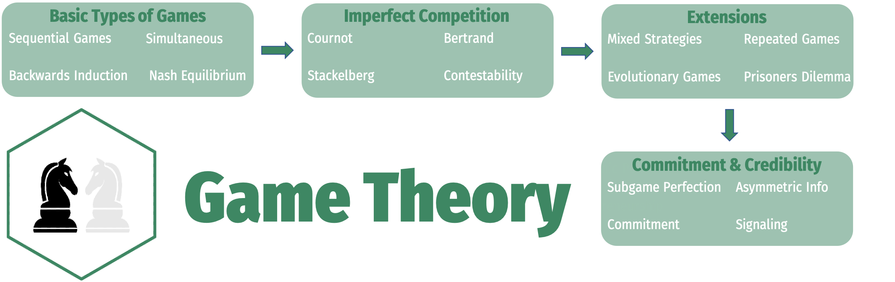
]
