```{r setup, include=FALSE}
options(htmltools.dir.version = FALSE)
knitr::opts_chunk$set(echo=F,
                      message=F,
                      warning=F,
                      fig.retina = 3,
                      fig.align = "center")
library("tidyverse")
library("ggrepel")
library("fontawesome")
xaringanExtra::use_tile_view()
xaringanExtra::use_tachyons()
xaringanExtra::use_freezeframe()

update_geom_defaults("label", list(family = "Fira Sans Condensed"))
update_geom_defaults("text", list(family = "Fira Sans Condensed"))

set.seed(256)

theme_slides <- theme_light() + 
  theme(
    text = element_text(family = "Fira Sans", size = 24)
  )

```

class: inverse

# Outline

### [Games in Normal Form](#3)
### [Dominance-Solvability](#10)
### [Best-Response](#55)
### [Depicting Three Player Games](#68)

---

class: inverse, center, middle

# Simultaneous Games

---

# Simultaneous Games

.pull-left[
.smaller[
- Players must make choices simultaneously, but under .hi-purple[strategic uncertainty]
  - Don't know which strategies other players are playing before you choose yours

- *Possible* strategic choices and payoffs of each outcome to each player *are* known by all players

- Must think not only about own best strategic choice, but also the best strategic choice of *other* player(s)
]
]

.pull-right[
.center[

]
]

---

# Flat Tire Story

.center[

]

---

# Games in Normal Form

.pull-left[
.smallest[
- .hi[Normal] or .hi[strategic form]

- By convention .hi-red[Row Player] is Player 1, .hi-blue[Column player] is Player 2
  - First payoff in a cell goes to .hi-red[Row], second to .hi-blue[Column]
  - But order doesn’t matter (!)

- Dimensions of matrix
  - Rows: possible strategies available to .hi-red[Row]
  - Columns: possible strategies available to .hi-blue[Column]

- For now, we only look at .hi-purple[discrete] strategies (and a single decision per player)
]
]
.pull-right[
.center[
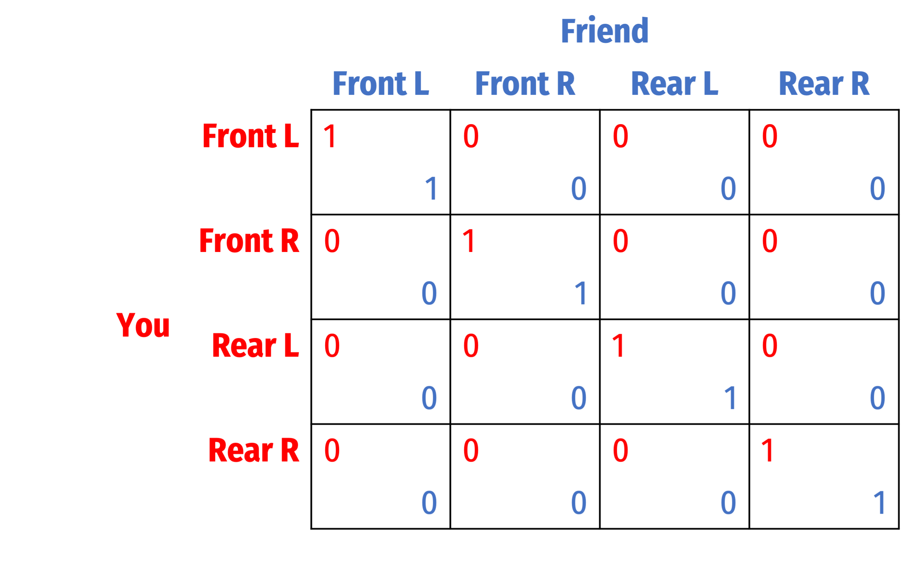
]
]

---

# Nash Equilibrium, Again

.pull-left[  
- Again, in a .hi-purple[Nash equilibrium], no player wants to change strategies given the strategies played by all other players
  - Equivalently, each player is playing a best response to other players' strategies

- Today we will learn **several methods** to search for Nash equilibria in simultaneous games
]

.pull-right[
.center[

]
]

---

# Cell-by-Cell Inspection

.pull-left[  
- Consider again the .hi-purple[prisoners' dilemma]

- Consider each outcome and ask, **does _any_ player want to change strategies, _given what the other player is doing_?**
  1. (.red[C], .blue[C])
  2. (.red[C], .blue[D])
  3. (.red[D], .blue[C])
  4. (.red[D], .blue[D])
]

.pull-right[
.center[
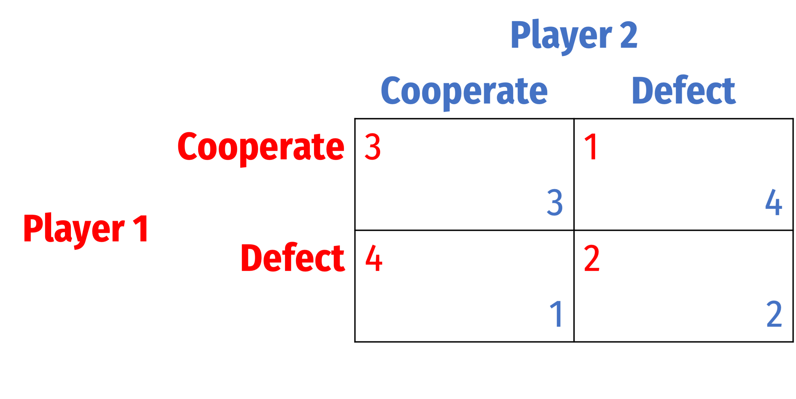
]
]

---

# Cell-by-Cell Inspection

.pull-left[  
- Consider again the .hi-purple[prisoners' dilemma]

- Consider each outcome and ask, **does _any_ player want to change strategies, _given what the other player is doing_?**
  1. (.red[C], .blue[C]) ✅
  2. (.red[C], .blue[D]) ✅
  3. (.red[D], .blue[C]) ✅
  4. (.red[D], .blue[D]) ❌

- .hi-turquoise[If no player wants to switch strategies (given the others’), that outcome is a Nash equilibrium]: (.red[D], .blue[D])
]

.pull-right[
.center[
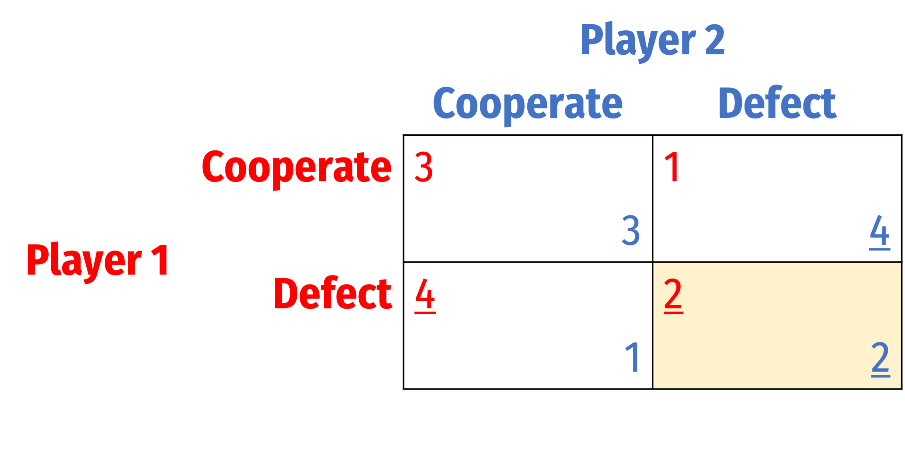
]
]

---

class: inverse, center, middle

# Dominance Solvability

---

# Dominance Solvability

.pull-left[

- One efficient (but not foolproof) method for finding solution: search for .hi-purple[dominated strategies] and eliminate them
  - like pruning branches of a sequential game tree

]

.pull-right[
.center[

]
]

---

# Dominance Solvability

.pull-left[
- A player has a .hi-purple[dominant strategy] when it yields a *higher* payoff than *all other* strategies available, regardless of what strategy the other player is playing
- A player has a .hi-purple[dominated strategy] when it yields a *lower* payoff than *all other* strategies available, regardless of what strategy the other player is playing
]

.pull-right[
.center[

]
]

---

# Dominance Solvability

.pull-left[
- Consider the .hi[prisoners' dilemma]

]

.pull-right[
.center[

]
]

---

# Dominance Solvability

.pull-left[
- Consider the .hi[prisoners' dilemma]

- For .hi-red[Player 1]...
]

.pull-right[
.center[
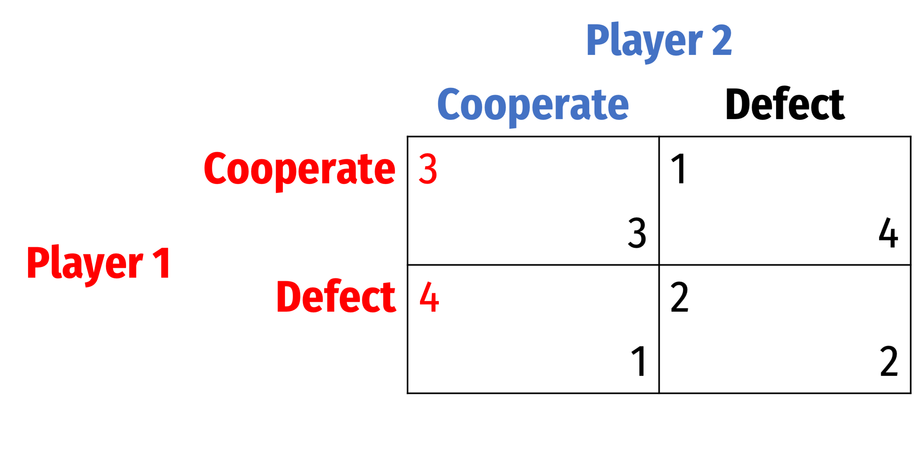
]
]

---

# Dominance Solvability

.pull-left[
- Consider the .hi[prisoners' dilemma]

- For .hi-red[Player 1]...
]

.pull-right[
.center[

]
]

---

# Dominance Solvability

.pull-left[
- Consider the .hi[prisoners' dilemma]

- For .hi-red[Player 1]...
]

.pull-right[
.center[
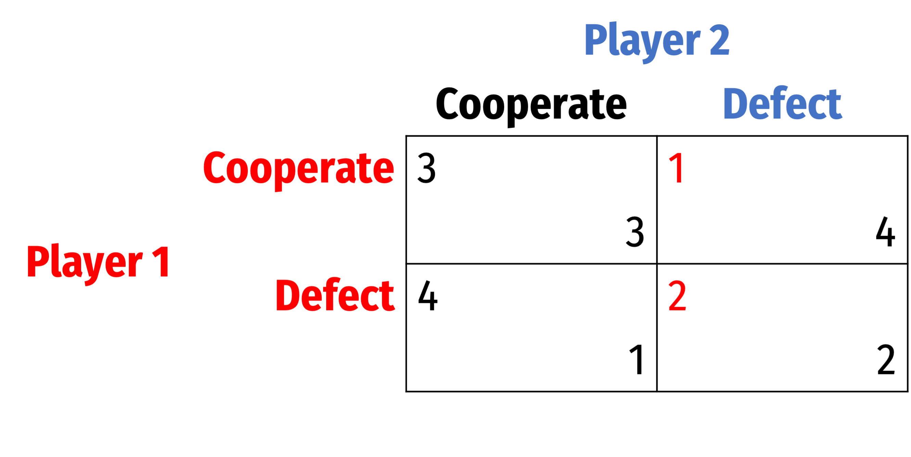
]
]

---

# Dominance Solvability

.pull-left[
- Consider the .hi[prisoners' dilemma]

- For .hi-red[Player 1]...
]

.pull-right[
.center[

]
]

---

# Dominance Solvability

.pull-left[
- Consider the .hi[prisoners' dilemma]

- For .hi-red[Player 1]: .red[Cooperate] is .hi-purple[dominated] by .red[Defect]
  - $u_1(\color{red}{D}, \color{blue}{C}) \succ u_1(\color{red}{C}, \color{blue}{C})$
  - $u_1(\color{red}{D}, \color{blue}{D}) \succ u_1(\color{red}{C}, \color{blue}{D})$

]

.pull-right[
.center[
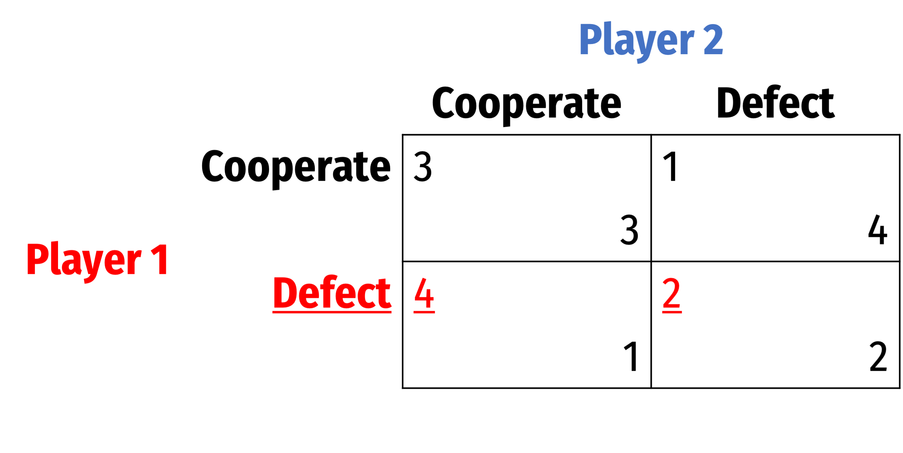
]
]

---

# Dominance Solvability

.pull-left[
- Consider the .hi[prisoners' dilemma]

- For .hi-red[Player 1]: .red[Cooperate] is .hi-purple[dominated] by .red[Defect]
  - $u_1(\color{red}{D}, \color{blue}{C}) \succ u_1(\color{red}{C}, \color{blue}{C})$
  - $u_1(\color{red}{D}, \color{blue}{D}) \succ u_1(\color{red}{C}, \color{blue}{D})$

- Knowing .hi-red[Player 1] will **never** play .red[Cooperate], we can delete that entire row from the game
]

.pull-right[
.center[

]
]

---

# Dominance Solvability

.pull-left[
- Consider the .hi[prisoners' dilemma]

- For .hi-red[Player 1]: .red[Cooperate] is .hi-purple[dominated] by .red[Defect]
  - $u_1(\color{red}{D}, \color{blue}{C}) \succ u_1(\color{red}{C}, \color{blue}{C})$
  - $u_1(\color{red}{D}, \color{blue}{D}) \succ u_1(\color{red}{C}, \color{blue}{D})$

- Knowing .hi-red[Player 1] will **never** play .red[Cooperate], we can delete that entire row from the game
  - .hi-blue[Player 2]’s best response to .red[Defect] is to .blue[Defect]
]

.pull-right[
.center[
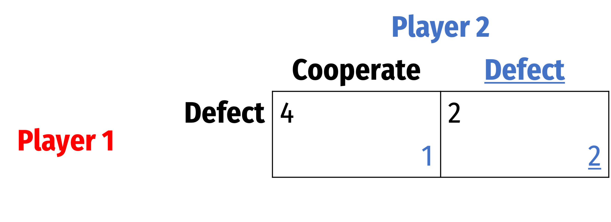
]
]

---

# Dominance Solvability

.pull-left[
- Alternatively, we could consider .hi-blue[Player 2]

]

.pull-right[
.center[

]
]


---

# Dominance Solvability

.pull-left[
- Alternatively, we could consider .hi-blue[Player 2]

- For .hi-blue[Player 2]...
]

.pull-right[
.center[
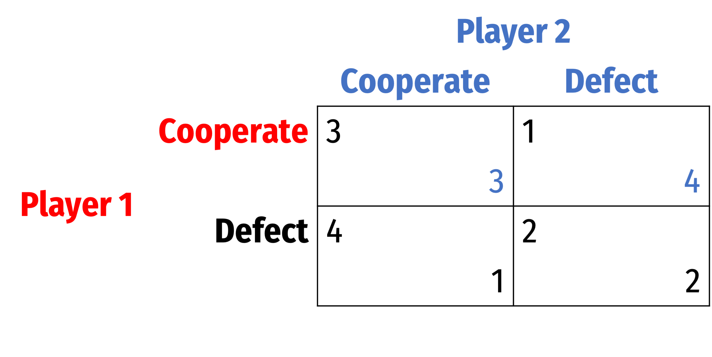
]
]
---

# Dominance Solvability

.pull-left[
- Alternatively, we could consider .hi-blue[Player 2]

- For .hi-blue[Player 2]...
]

.pull-right[
.center[
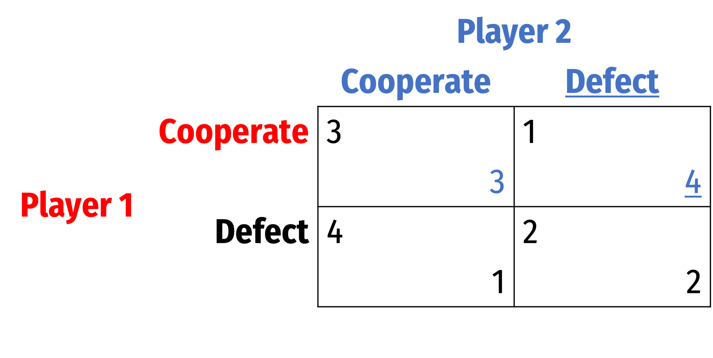
]
]
---

# Dominance Solvability

.pull-left[
- Alternatively, we could consider .hi-blue[Player 2]

- For .hi-blue[Player 2]...
]

.pull-right[
.center[
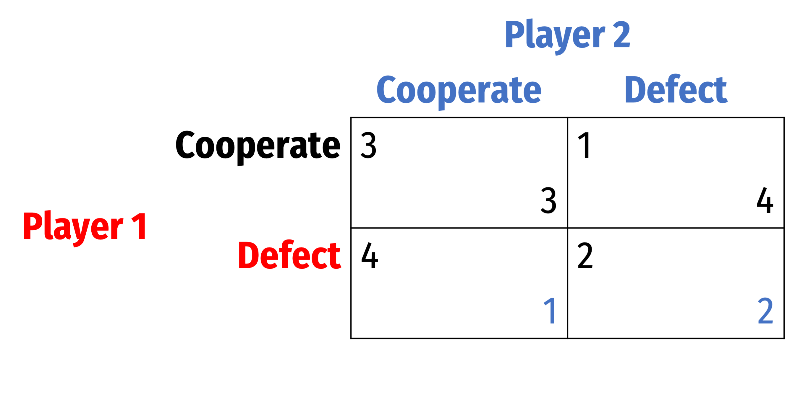
]
]
---

# Dominance Solvability

.pull-left[
- Alternatively, we could consider .hi-blue[Player 2]

- For .hi-blue[Player 2]...
]

.pull-right[
.center[
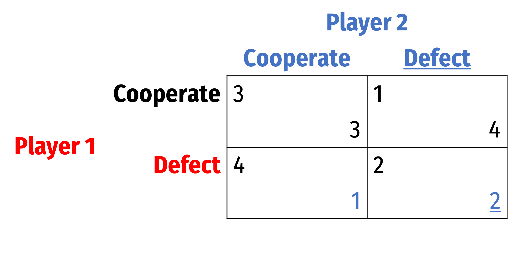
]
]

---

# Dominance Solvability

.pull-left[
- Alternatively, we could consider .hi-blue[Player 2]

- For .hi-blue[Player 2]: .blue[Cooperate] is .hi-purple[dominated] by .blue[Defect]
  - $u_2(\color{red}{C}, \color{blue}{D}) \succ u_2(\color{red}{C}, \color{blue}{C})$
  - $u_2(\color{red}{D}, \color{blue}{D}) \succ u_2(\color{red}{D}, \color{blue}{C})$

]

.pull-right[
.center[
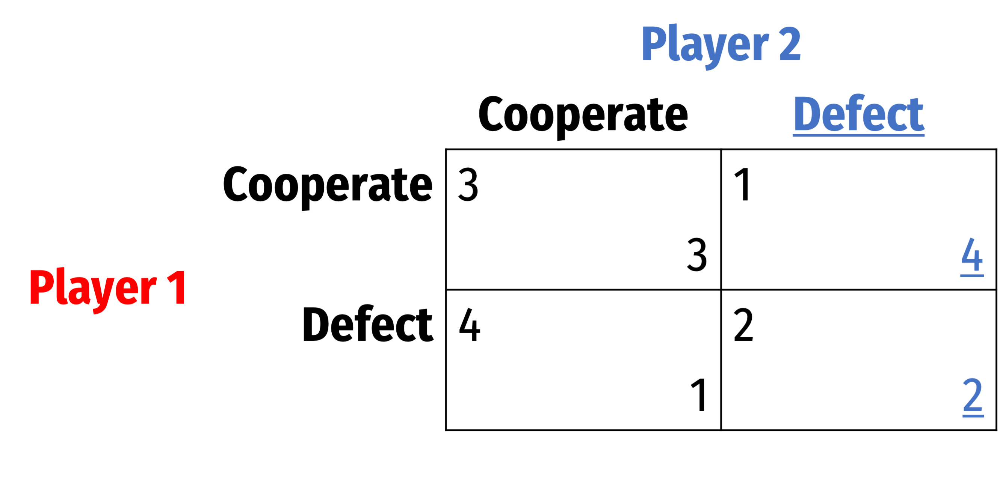
]
]
---

# Dominance Solvability

.pull-left[
- Alternatively, we could consider .hi-blue[Player 2]

- For .hi-blue[Player 2]: .blue[Cooperate] is .hi-purple[dominated] by .blue[Defect]
  - $u_2(\color{red}{C}, \color{blue}{D}) \succ u_2(\color{red}{C}, \color{blue}{C})$
  - $u_2(\color{red}{D}, \color{blue}{D}) \succ u_2(\color{red}{D}, \color{blue}{C})$

- Knowing .hi-blue[Player 2] will **never** play .blue[Cooperate], we can delete that entire column from the game

]

.pull-right[
.center[
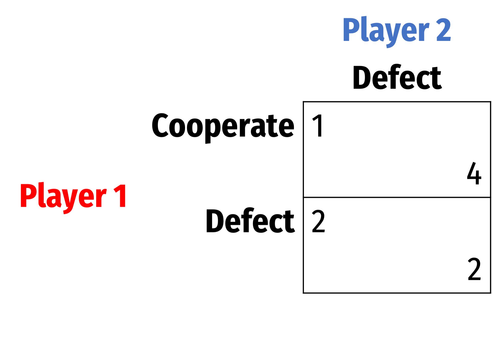
]
]

---

# Dominance Solvability

.pull-left[
- Alternatively, we could consider .hi-blue[Player 2]

- For .hi-blue[Player 2]: .blue[Cooperate] is .hi-purple[dominated] by .blue[Defect]
  - $u_2(\color{red}{C}, \color{blue}{D}) \succ u_2(\color{red}{C}, \color{blue}{C})$
  - $u_2(\color{red}{D}, \color{blue}{D}) \succ u_2(\color{red}{D}, \color{blue}{C})$

- Knowing .hi-blue[Player 2] will **never** play .blue[Cooperate], we can delete that entire column from the game
  - .hi-red[Player 1]’s best response to .blue[Defect] is to .red[Defect]

]

.pull-right[
.center[
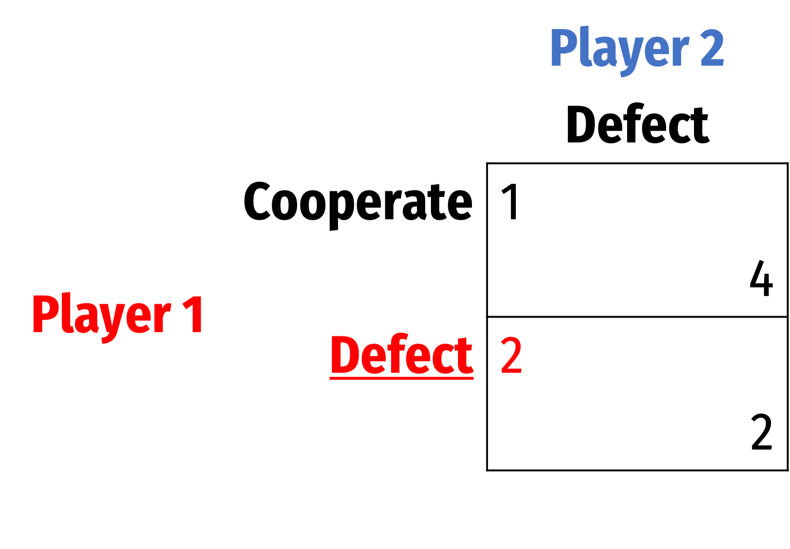
]
]

---

# Dominance Solvability

.pull-left[

- Take the **prisoners’ dilemma**

- .hi-purple[Nash Equilibrium]: (.hi-red[Defect], .hi-blue[Defect])
  - neither player has an incentive to change strategy, *given the other's strategy*

- Why can’t they both **cooperate**?
  - A clear .hi-purple[Pareto improvement]!
]

.pull-right[
.center[

]
]

---

# Pareto Efficiency and Games

.pull-left[

- Main feature of prisoners’ dilemma: the Nash equilibrium is Pareto inferior to another outcome (.hi-red[Cooperate], .hi-blue[Cooperate])!
  - But that outcome is *not* a Nash equilibrium!
  - Dominant strategies to **Defect**

- How can we ever get rational cooperation?
]

.pull-right[
.center[

]
]

---

# When One Player Has a Dominant Strategy

.pull-left[

- .hi-red[Congress] determines fiscal policy

- Can tax & spend to .red[Balance Budget]

- Can tax & spend to run a .red[Budget Deficit]

- Constant political pressure to spend more & tax less
  - May raise possibility of inflation
]

.pull-right[
.center[

]
]
---

# When One Player Has a Dominant Strategy

.pull-left[

- .hi-blue[Federal Reserve] determines monetary policy

- Can target .blue[Low Interest Rates]

- Can target .blue[High Interest Rates]

- Generally wants to avoid inflation
  - Likes keeping interest rates low to stimulate Demand (if no threat of inflation)
]

.pull-right[
.center[

]
]

---

# When One Player Has a Dominant Strategy

.pull-left[

- Both players choose policy simultaneously and independently of each other

- How to find the equilibrium of this game? 
]

.pull-right[
.center[
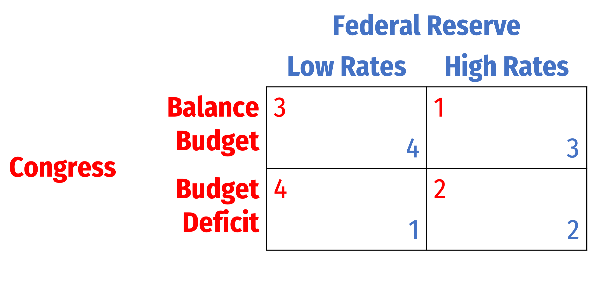
]
]

---

# When One Player Has a Dominant Strategy

.pull-left[

- Both players choose policy simultaneously and independently of each other

- How to find the equilibrium of this game? 
  - Does the .hi-blue[Fed] have a dominant strategy?
]

.pull-right[
.center[

]
]

---

# When One Player Has a Dominant Strategy

.pull-left[

- Both players choose policy simultaneously and independently of each other

- How to find the equilibrium of this game? 
  - Does the .hi-blue[Fed] have a dominant strategy?
  - Does .hi-red[Congress]?
]

.pull-right[
.center[

]
]

---

# When One Player Has a Dominant Strategy

.pull-left[

- Both players choose policy simultaneously and independently of each other

- How to find the equilibrium of this game? 
  - Does the .hi-blue[Fed] have a dominant strategy?
  - Does .hi-red[Congress]?
  - Given this, how will .hi-blue[Fed] choose?
]

.pull-right[
.center[

]
]

---

# Successive Elimination of Dominated Strategies

.pull-left[

- What about the following game?
]

.pull-right[
.center[
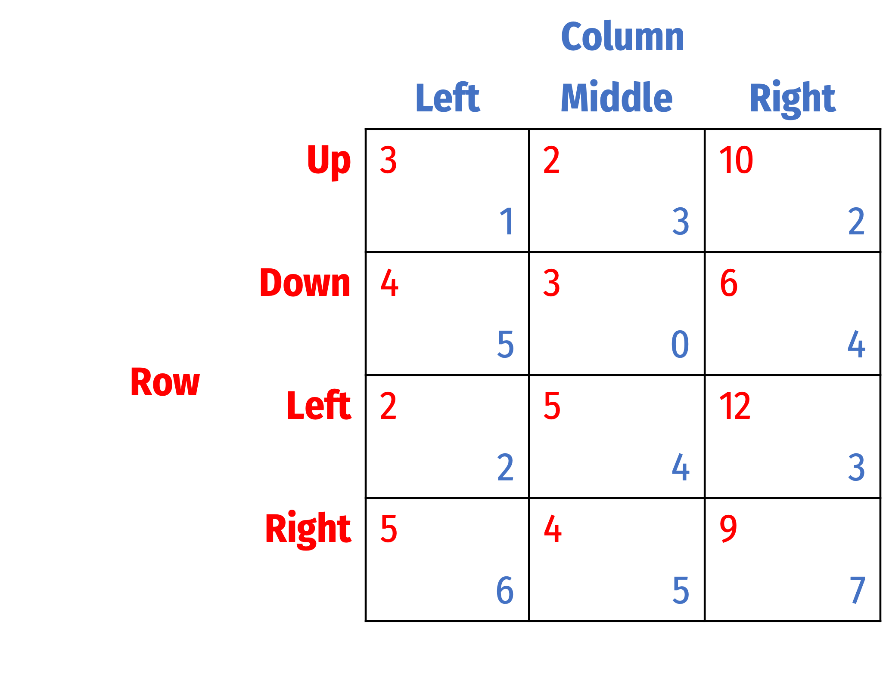
]
]

---


# Successive Elimination of Dominated Strategies

.pull-left[

- What about the following game?

- Hint: Do any of .hi-red[Row]'s strategies *always* yield a lower payoff than another strategy?
]

.pull-right[
.center[

]
]

---

# Successive Elimination of Dominated Strategies

.pull-left[

- What about the following game?

- Hint: Do any of .hi-red[Row]'s strategies *always* yield a lower payoff than another strategy?
  - .red[Down] is dominated by .red[Right]
]

.pull-right[
.center[

]
]

---

# Successive Elimination of Dominated Strategies

.pull-left[

- What about the following game?

- Hint: Do any of .hi-red[Row]'s strategies *always* yield a lower payoff than another strategy?
  - .red[Down] is dominated by .red[Right]
  - Remove this row, since .hi-red[Row] will never play .red[Down]
]

.pull-right[
.center[
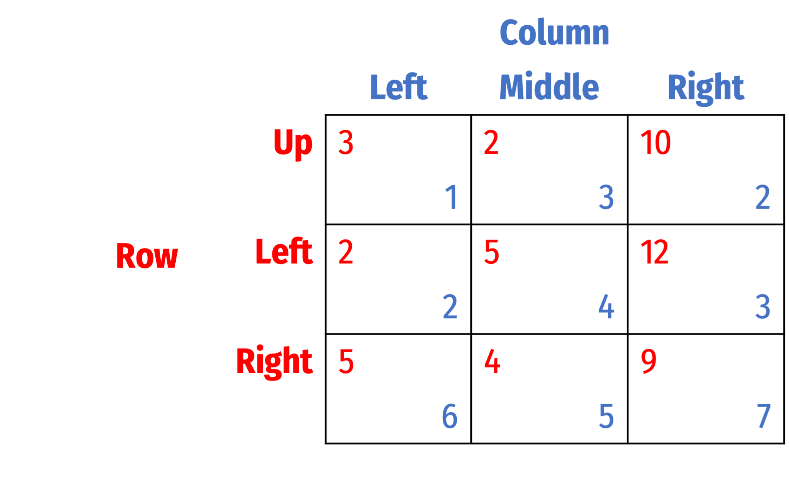
]
]

---

# Successive Elimination of Dominated Strategies

.pull-left[

- Keep searching for dominated strategies...

- Hint: Do any of .hi-blue[Column]'s strategies *always* yield a lower payoff than another strategy?
]

.pull-right[
.center[

]
]

---

# Successive Elimination of Dominated Strategies

.pull-left[

- Keep searching for dominated strategies...

- Hint: Do any of .hi-blue[Column]'s strategies *always* yield a lower payoff than another strategy?
  - .blue[Left] is dominated by .blue[Right]
  - Remove this column, since .hi-blue[Column] will never play .blue[Left]

]

.pull-right[
.center[

]
]

---

# Successive Elimination of Dominated Strategies

.pull-left[

- Keep searching for dominated strategies...

]

.pull-right[
.center[
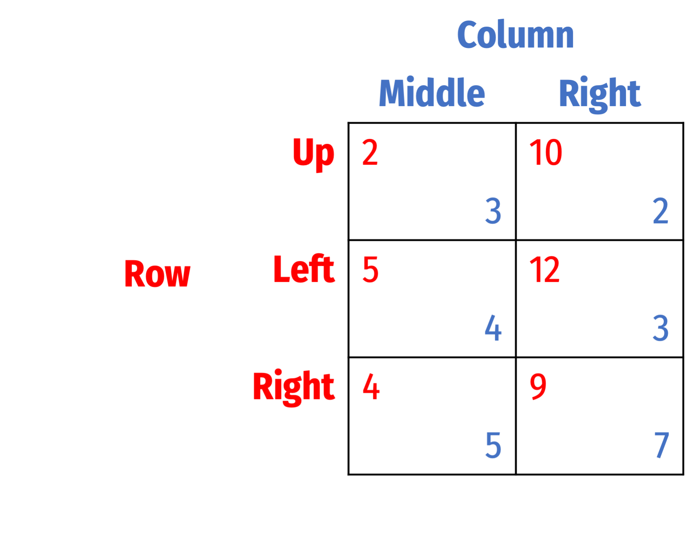
]
]

---

# Successive Elimination of Dominated Strategies

.pull-left[

- Keep searching for dominated strategies...

- For .hi-red[Row], .red[Left] dominates *both* .red[Up] and .red[Right]
  - Delete both .red[Up] and .red[Right] since .hi-red[Row] will never play them

]

.pull-right[
.center[

]
]

---

# Successive Elimination of Dominated Strategies

.pull-left[

- Keep searching for dominated strategies...

- Since .hi-red[Row] will play .red[Left], .hi-blue[Column]'s best response is to play .blue[Middle]

]

.pull-right[
.center[
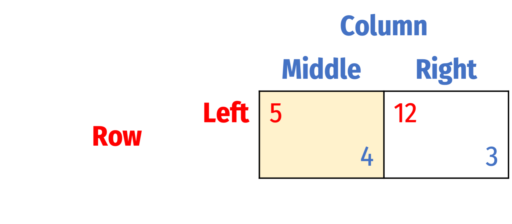
]
]

---

# Successive Elimination of Dominated Strategies

.pull-left[

- We've found the .hi-purple[Nash Equilibrium]: (.red[Left], .blue[Middle])

- Check that it's truly an equilibrium
  - Does .hi-red[Row] want to change from .red[Left], given .hi-blue[Column] is playing .blue[Middle]?
  - Does .hi-blue[Column] want to change from .blue[Middle], given .hi-red[Row] is playing .red[Left]?

]

.pull-right[
.center[

]
]

---

# Successive Elimination of Dominated Strategies

.pull-left[

- If .hi-purple[successive elimination of dominated strategies] yields a unique outcome, then the game is .hi[“dominance solvable”]
  - Not all games can be solved this way!

]

.pull-right[
.center[

]
]

---

# You Try

.pull-right[
.center[
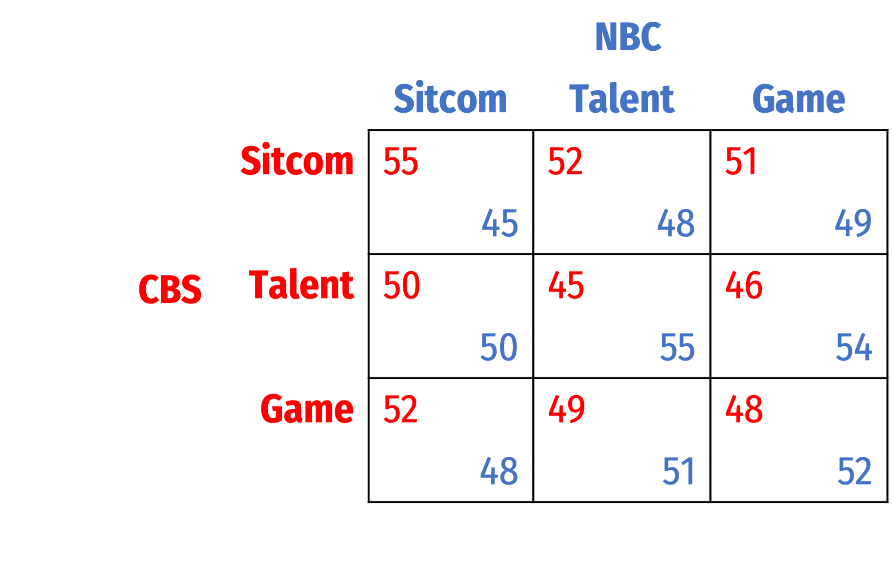
]
]
---

# Eliminating Dominated Strategies: Not Foolproof

.pull-left[
- What about ties?
]

.pull-right[
.center[

]
]

---

# Eliminating Dominated Strategies: Not Foolproof

.pull-left[
- What about ties?

- For .hi-red[Row], .red[A] is .hi-purple[“weakly” dominated] by .red[B]
  - If .hi-blue[Column] plays .blue[A], then playing .red[A] is strictly better than .red[B] for .hi-red[Row]
  - If .hi-blue[Column] plays .blue[B], then playing .red[A] is at least as good $(\succsim)$ as .red[B] for .hi-red[Row]

]

.pull-right[
.center[

]
]

---

# Eliminating Dominated Strategies: Not Foolproof

.pull-left[
- What about ties?

- Some for .hi-blue[Column]: .blue[A] is .hi-purple[“weakly” dominated] by .blie[B]
  - If .hi-red[Row] plays .red[A], then playing .blue[A] is strictly better than .blue[B] for .hi-blue[Column]
  - If .hi-red[Row] plays .red[B], then playing .blue[A] is at least as good $(\succsim)$ as .blue[B] for .hi-blue[Column]

]

.pull-right[
.center[

]
]

---

# Eliminating Dominated Strategies: Not Foolproof

.pull-left[
- Successive elimination of **_weakly_** dominated strategies implies deleting **A** for both players

- Predicted .hi-purple[Nash Equilibrium]: (.red[B], .blue[B])

]

.pull-right[
.center[

]
]

---

# Eliminating Dominated Strategies: Not Foolproof

.pull-left[
- Successive elimination of **_weakly_** dominated strategies implies deleting **A** for both players

- Predicted .hi-purple[Nash Equilibrium]: (.red[B], .blue[B])

]

.pull-right[
.center[
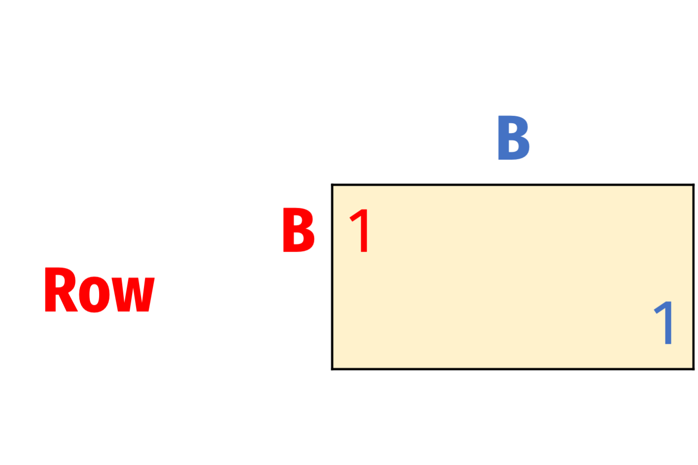
]
]

---

# Eliminating Dominated Strategies: Not Foolproof

.pull-left[
- Successive elimination of **_weakly_** dominated strategies implies deleting **A** for both players

- Predicted .hi-purple[Nash Equilibrium]: (.red[B], .blue[B])

- But (.red[A], .blue[B]) and (.red[B], .blue[A]) are **also** Nash equilibria!
  - Check for yourself

- So only rule out **strictly** dominated strategies!
]

.pull-right[
.center[

]
]

---

class: inverse, center, middle

# Best Response Analysis

---

# Best Response Analysis

.pull-left[

- Consider this game again, and check for each player’s .hi-purple[best response] to each of the other player's strategies
]

.pull-right[
.center[

]
]

---

# Best Response Analysis

.pull-left[

- Consider .hi-red[Row]
  - If .hi-blue[Column] plays .blue[Left]
]

.pull-right[
.center[
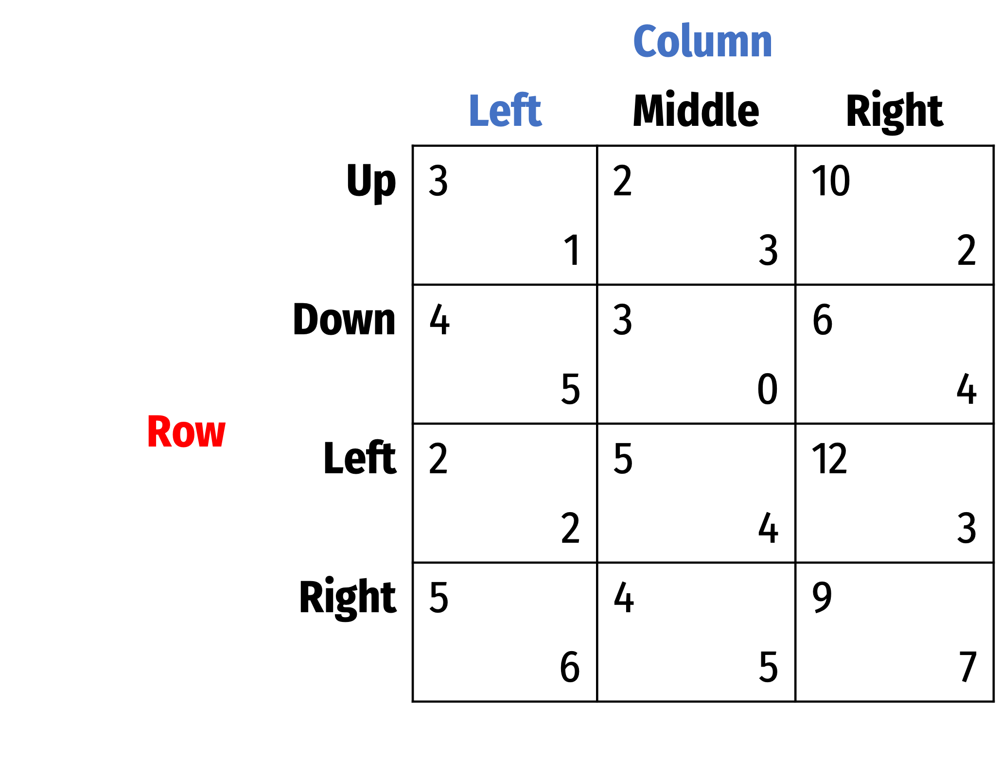
]
]


---

# Best Response Analysis

.pull-left[

- Consider .hi-red[Row]
  - If .hi-blue[Column] plays .blue[Left], best response is .red[Right]
]

.pull-right[
.center[

]
]

---

# Best Response Analysis

.pull-left[

- Consider .hi-red[Row]
  - If .hi-blue[Column] plays .blue[Left], best response is .red[Right]
  - If .hi-blue[Column] plays .blue[Middle], best response is .red[Left]

]

.pull-right[
.center[
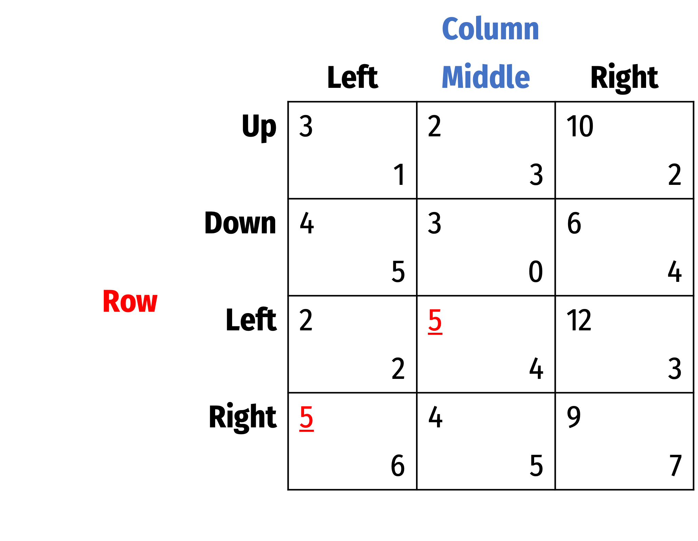
]
]

---

# Best Response Analysis

.pull-left[

- Consider .hi-red[Row]
  - If .hi-blue[Column] plays .blue[Left], best response is .red[Right]
  - If .hi-blue[Column] plays .blue[Middle], best response is .red[Left]
  - If .hi-blue[Column] plays .blue[Right], best response is .red[Left]
]

.pull-right[
.center[
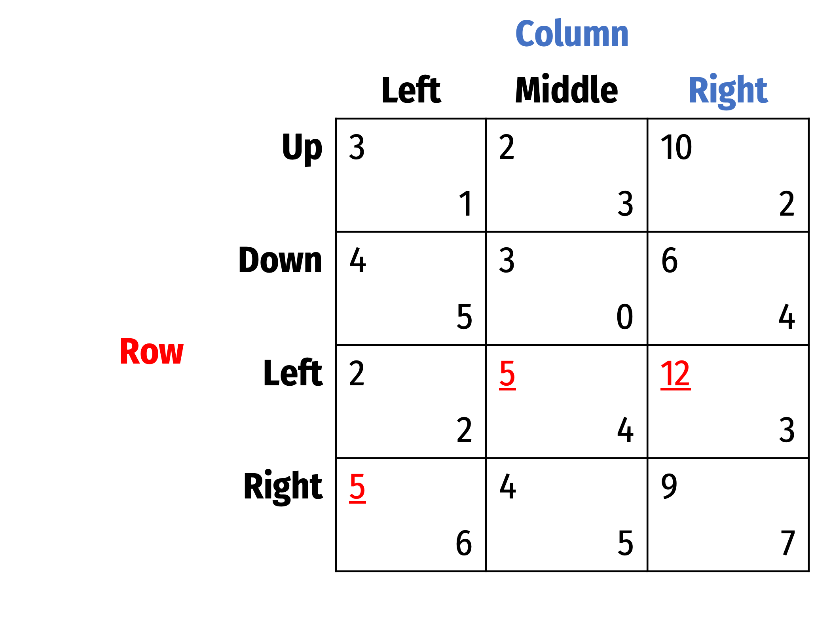
]
]

---

# Best Response Analysis

.pull-left[

- Consider .hi-blue[Column]
  - If .hi-red[Row] plays .red[Up]
]

.pull-right[
.center[
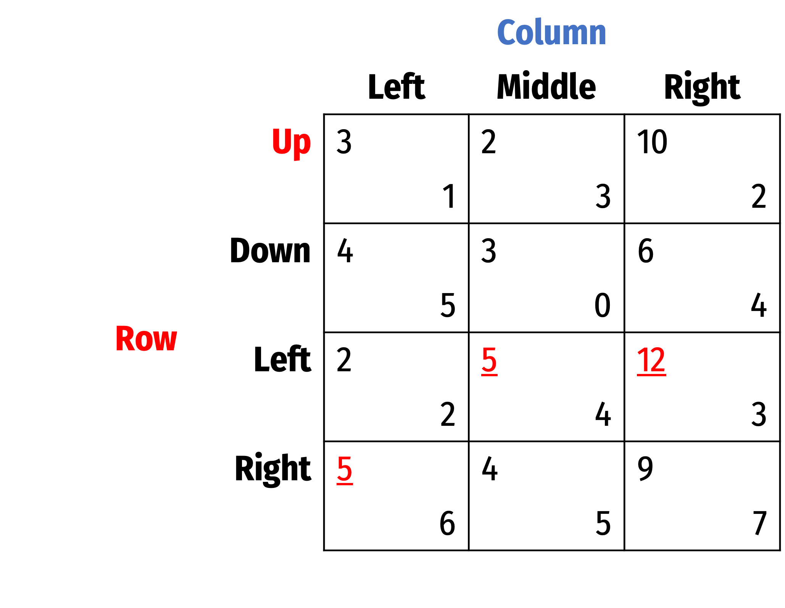
]
]

---

# Best Response Analysis

.pull-left[

- Consider .hi-blue[Column]
  - If .hi-red[Row] plays .red[Up], best response is .blue[Middle]
]

.pull-right[
.center[
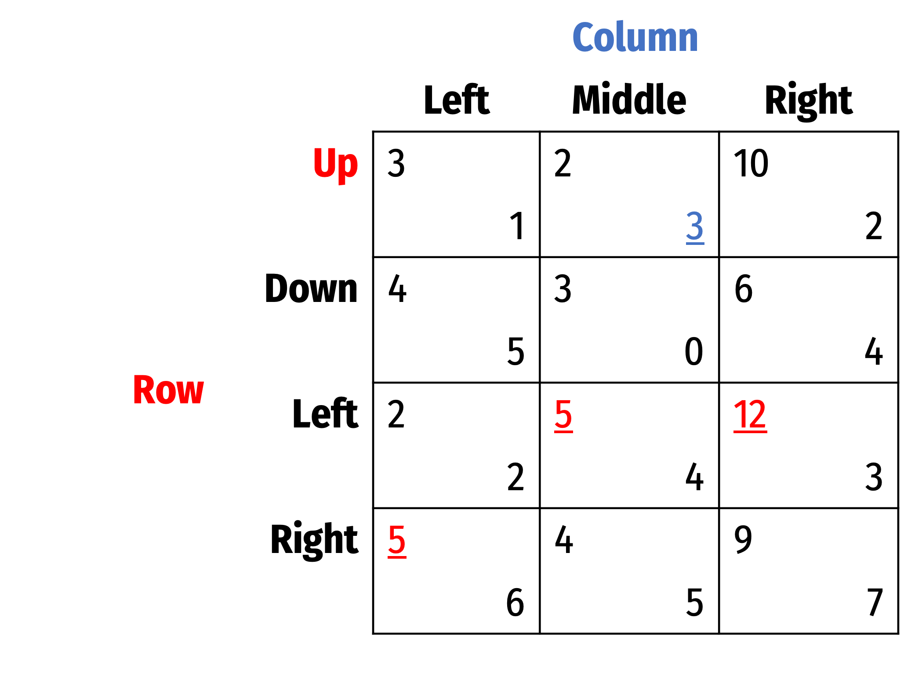
]
]

---

# Best Response Analysis

.pull-left[

- Consider .hi-blue[Column]
  - If .hi-red[Row] plays .red[Up], best response is .blue[Middle]
  - If .hi-red[Row] plays .red[Down], best response is .blue[Left]
]

.pull-right[
.center[
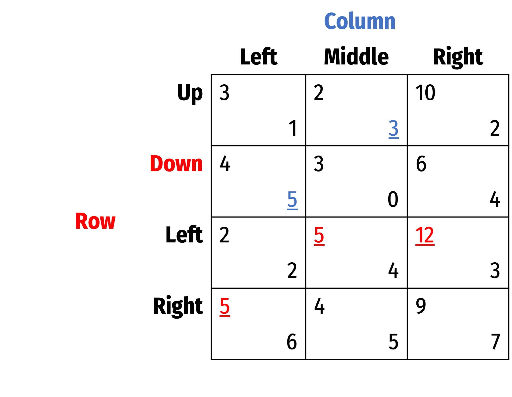
]
]

---

# Best Response Analysis

.pull-left[

- Consider .hi-blue[Column]
  - If .hi-red[Row] plays .red[Up], best response is .blue[Middle]
  - If .hi-red[Row] plays .red[Down], best response is .blue[Left]
  - If .hi-red[Row] plays .red[Left], best response is .blue[Middle]

]

.pull-right[
.center[
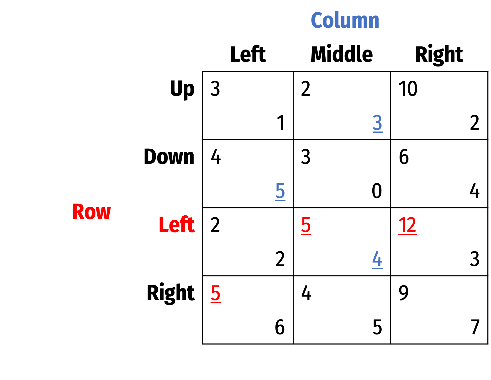
]
]

---

# Best Response Analysis

.pull-left[

- Consider .hi-blue[Column]
  - If .hi-red[Row] plays .red[Up], best response is .blue[Middle]
  - If .hi-red[Row] plays .red[Down], best response is .blue[Left]
  - If .hi-red[Row] plays .red[Left], best response is .blue[Middle]
  - If .hi-red[Row] plays .red[Right], best response is .blue[Right]
]

.pull-right[
.center[
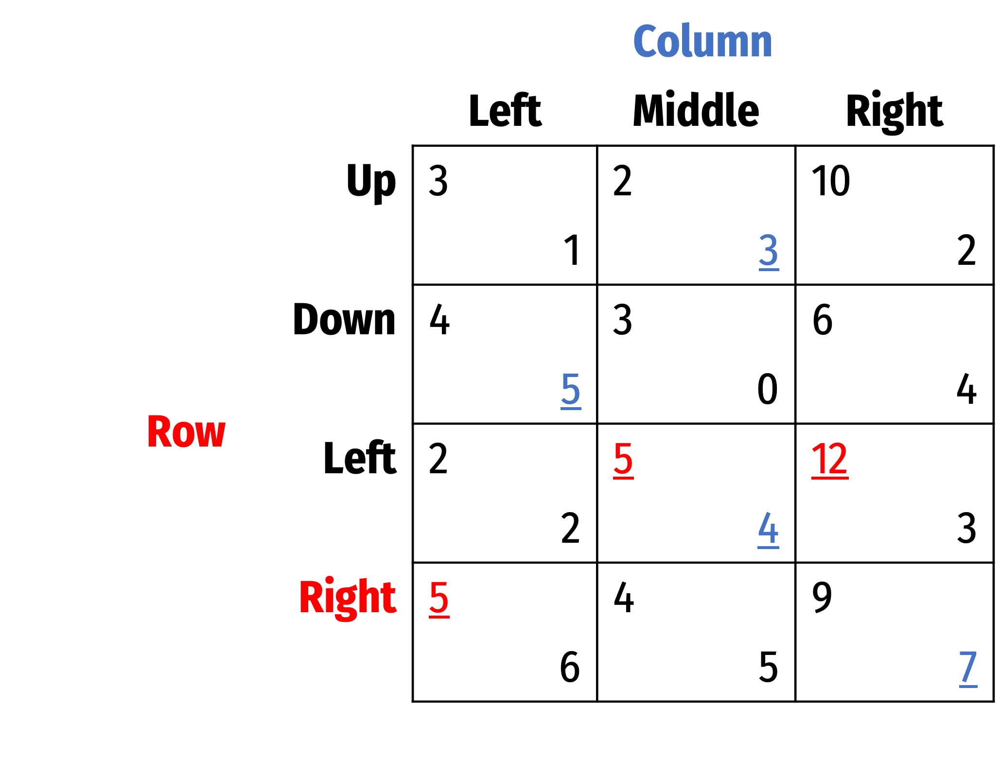
]
]

---

# Best Response Analysis

.pull-left[

- Highlighted all best responses for each player, shows us the .hi-purple[Nash Equilibrium]: (.red[Left], .blue[Middle])

- In a Nash equilibrium, .hi-purple[all players are playing a best response to each other's strategies]

- A more tedious process, but foolproof
]

.pull-right[
.center[
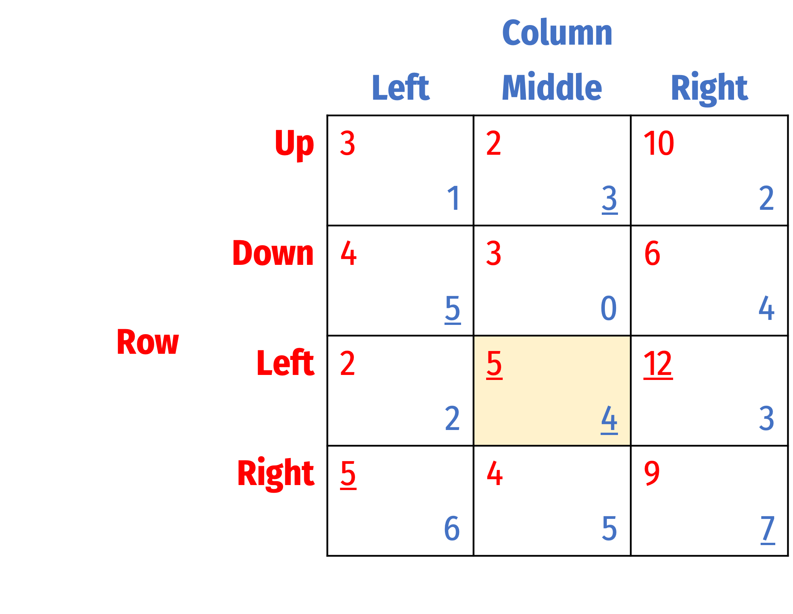
]
]

---

# Best Response Analysis Permits Ties

.pull-left[
- For .hi-red[Row] in this game:
  - If .hi-blue[Column] plays .blue[A], .hi-red[Row]'s best response is .red[B]
  - If .hi-blue[Column] plays .blue[B], .red[A] and .red[B] are both best responses

- Symmetrically for .hi-blue[Column]

- Finds all three Nash equilibria (in each, both players play a best response)
  1. (.red[B], .blue[A])
  2. (.red[A], .blue[B])
  3. (.red[B], .blue[B])
  
]

.pull-right[
.center[
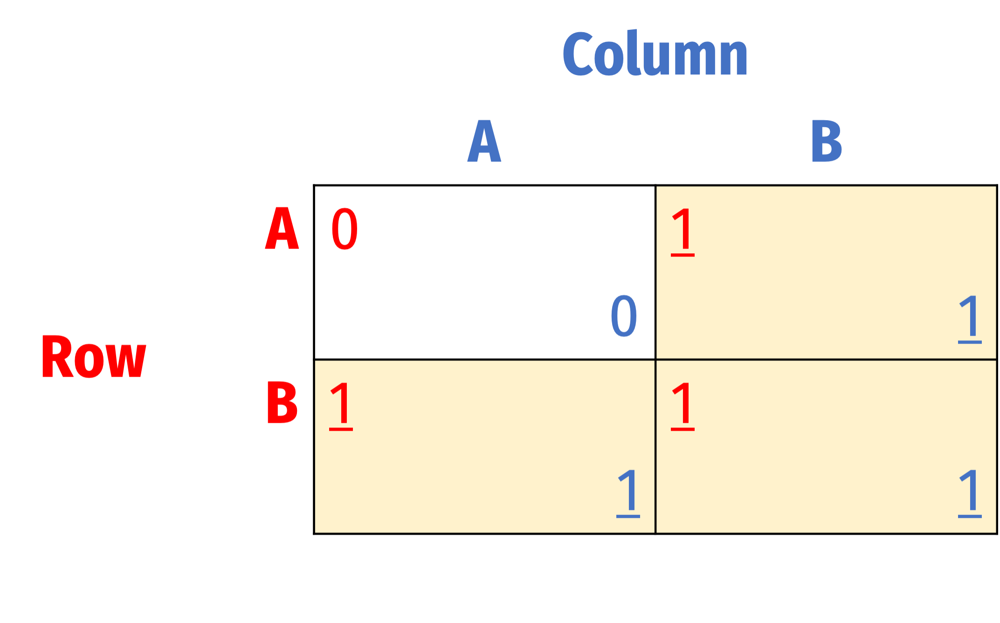
]
]

---
class: inverse, center, middle

# Depicting Three Player Games

---

# Depicting Three Player Games

.center[
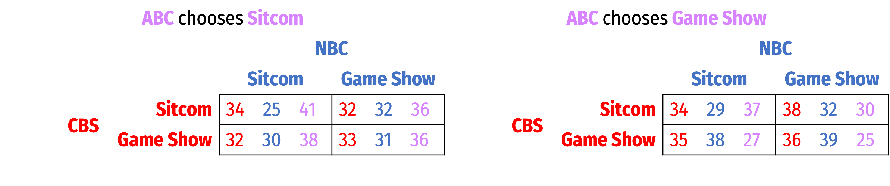
]

- Represent .hi-purple[ABC]'s choice across two matrices
- Three payoffs for each outcome: (.red[CBS], .blue[NBC], .purple[ABC])
- Let's first try solving by searching for dominated strategies...

--

- .purple[Game Show] is dominated by .purple[Sitcom] for .hi-purple[ABC], so delete it

---

# Depicting Three Player Games

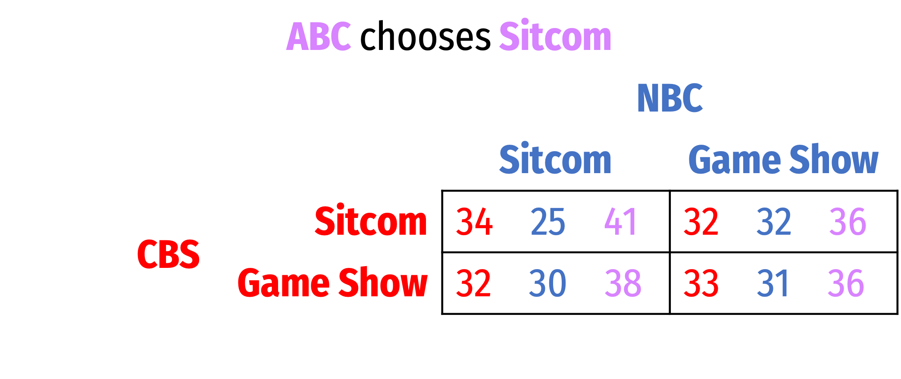


- Keep searching

--

- .blue[Sitcom] is dominated by .blue[Game Show] for .hi-blue[NBC], so delete it

---

# Depicting Three Player Games

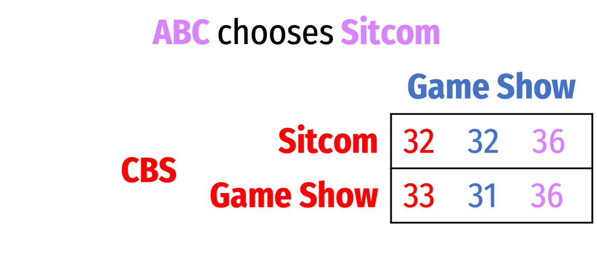

- Keep searching

--

- .hi-red[Sitcom] is dominated by .red[Game Show] for .hi-red[CBS], so delete it

---

# Depicting Three Player Games


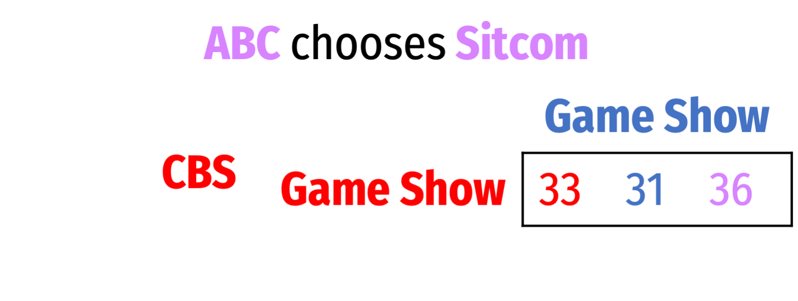

- .hi-purple[Nash Equilibrium]: (.red[Game Show], .blue[Game Show], .purple[Sitcom])

---

# Depicting Three Player Games

.center[
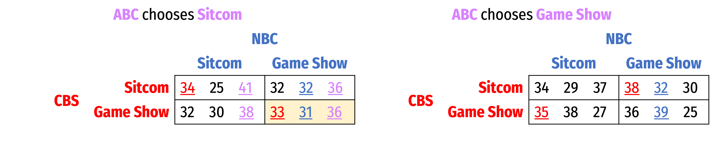
]


- .hi-purple[Nash Equilibrium]: (.red[Game Show], .blue[Game Show], .purple[Sitcom])

--

- Now let's try using best response analysis instead

---

# Depicting Three Player Games

.center[
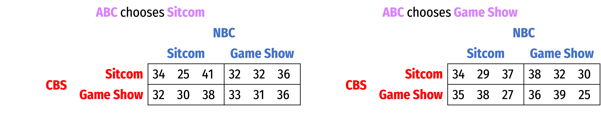
]


- Start with .hi-red[CBS]
  - If .hi-blue[NBC] chooses .blue[Sitcom] and .hi-purple[ABC] chooses .purple[Sitcom]
  
---

# Depicting Three Player Games

.center[
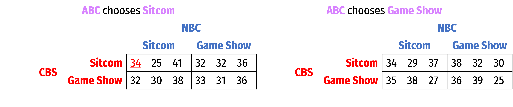
]


- Start with .hi-red[CBS]
  - If .hi-blue[NBC] chooses .blue[Sitcom] and .hi-purple[ABC] chooses .purple[Sitcom], .hi-red[CBS]' BR: .red[Sitcom]
  
---
  
# Depicting Three Player Games

.center[
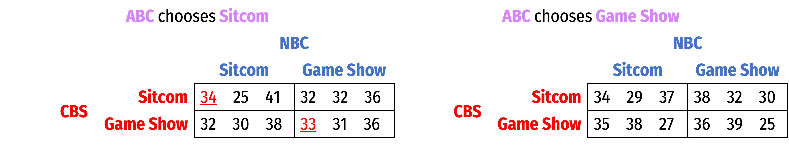
]


- Start with .hi-red[CBS]
  - If .hi-blue[NBC] chooses .blue[Sitcom] and .hi-purple[ABC] chooses .purple[Sitcom], .hi-red[CBS]' BR: .red[Sitcom]
  - If .hi-blue[NBC] chooses .blue[Game Show] and .hi-purple[ABC] chooses .purple[Sitcom], .hi-red[CBS]' BR: .red[Game Show]
  
---

# Depicting Three Player Games

.center[
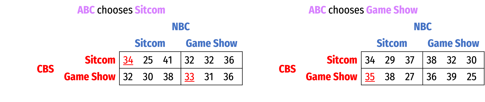
]


- Start with .hi-red[CBS]
  - If .hi-blue[NBC] chooses .blue[Sitcom] and .hi-purple[ABC] chooses .purple[Sitcom], .hi-red[CBS]' BR: .red[Sitcom]
  - If .hi-blue[NBC] chooses .blue[Game Show] and .hi-purple[ABC] chooses .purple[Sitcom], .hi-red[CBS]' BR: .red[Game Show]
  - If .hi-blue[NBC] chooses .blue[Sitcom] and .hi-purple[ABC] chooses .purple[Game Show], .hi-red[CBS]' BR: .red[Game Show]

---

# Depicting Three Player Games

.center[
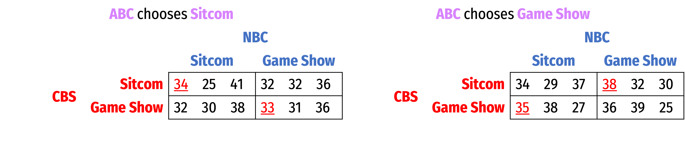
]


- Start with .hi-red[CBS]
  - If .hi-blue[NBC] chooses .blue[Sitcom] and .hi-purple[ABC] chooses .purple[Sitcom], .hi-red[CBS]' BR: .red[Sitcom]
  - If .hi-blue[NBC] chooses .blue[Game Show] and .hi-purple[ABC] chooses .purple[Sitcom], .hi-red[CBS]' BR: .red[Game Show]
  - If .hi-blue[NBC] chooses .blue[Sitcom] and .hi-purple[ABC] chooses .purple[Game Show], .hi-red[CBS]' BR: .red[Game Show]
  - If .hi-blue[NBC] chooses .blue[Game Show] and .hi-purple[ABC] chooses .purple[Game Show], .hi-red[CBS]' BR: .red[Sitcom]

---

# Depicting Three Player Games

.center[

]


- Now consider .hi-blue[NBC]

---

# Depicting Three Player Games

.center[
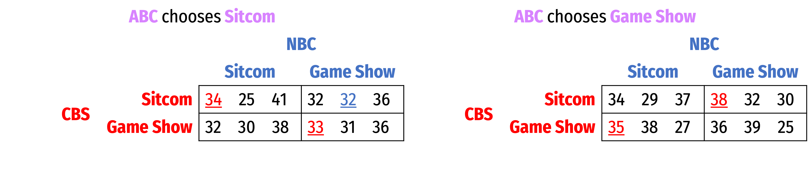
]


- Now consider .hi-blue[NBC]
  - If .hi-red[CBS] chooses .red[Sitcom] and .hi-purple[ABC] chooses .purple[Sitcom], .hi-blue[NBC]'s BR: .blue[Game Show]

---

# Depicting Three Player Games

.center[
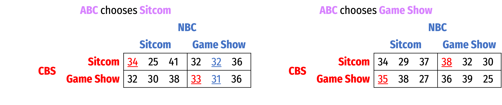
]


- Now consider .hi-blue[NBC]
  - If .hi-red[CBS] chooses .red[Sitcom] and .hi-purple[ABC] chooses .purple[Sitcom], .hi-blue[NBC]'s BR: .blue[Game Show]
  - If .hi-red[CBS] chooses .red[Game Show] and .hi-purple[ABC] chooses .purple[Sitcom], .hi-blue[NBC]'s BR: .blue[Game Show]

---

# Depicting Three Player Games

.center[
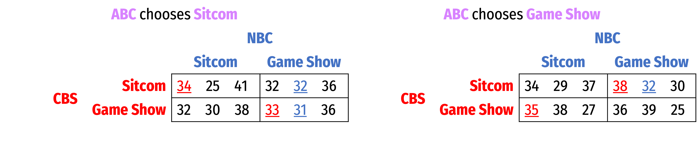
]


- Now consider .hi-blue[NBC]
  - If .hi-red[CBS] chooses .red[Sitcom] and .hi-purple[ABC] chooses .purple[Sitcom], .hi-blue[NBC]'s BR: .blue[Game Show]
  - If .hi-red[CBS] chooses .red[Game Show] and .hi-purple[ABC] chooses .purple[Sitcom], .hi-blue[NBC]'s BR: .blue[Game Show]
  - If .hi-red[CBS] chooses .red[Sitcom] and .hi-purple[ABC] chooses .purple[Game Show], .hi-blue[NBC]'s BR: .blue[Game Show]

---

# Depicting Three Player Games

.center[
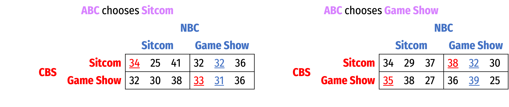
]


- Now consider .hi-blue[NBC]
  - If .hi-red[CBS] chooses .red[Sitcom] and .hi-purple[ABC] chooses .purple[Sitcom], .hi-blue[NBC]'s BR: .blue[Game Show]
  - If .hi-red[CBS] chooses .red[Game Show] and .hi-purple[ABC] chooses .purple[Sitcom], .hi-blue[NBC]'s BR: .blue[Game Show]
  - If .hi-red[CBS] chooses .red[Sitcom] and .hi-purple[ABC] chooses .purple[Game Show], .hi-blue[NBC]'s BR: .blue[Game Show]
  - If .hi-red[CBS] chooses .red[Game Show] and .hi-purple[ABC] chooses .purple[Game Show], .hi-blue[NBC]'s BR: .blue[Game Show]

---

# Depicting Three Player Games

.center[

]


- Finally consider .hi-purple[ABC]

---

# Depicting Three Player Games

.center[
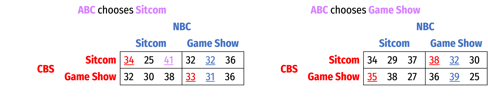
]


- Finally consider .hi-purple[ABC]
  - If .hi-red[CBS] chooses .red[Sitcom] and .hi-blue[NBC] chooses .blue[Sitcom], .hi-purple[ABC]'s BR: .purple[Sitcom]

---

# Depicting Three Player Games

.center[
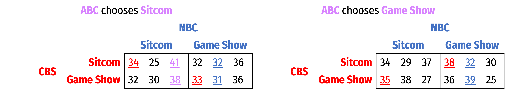
]


- Finally consider .hi-purple[ABC]
  - If .hi-red[CBS] chooses .red[Sitcom] and .hi-blue[NBC] chooses .blue[Sitcom], .hi-purple[ABC]'s BR: .purple[Sitcom]
  - If .hi-red[CBS] chooses .red[Game Show] and .hi-blue[NBC] chooses .blue[Sitcom], .hi-purple[ABC]'s BR: .purple[Sitcom]

---

# Depicting Three Player Games

.center[
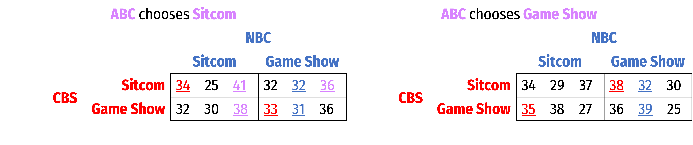
]


- Finally consider .hi-purple[ABC]
  - If .hi-red[CBS] chooses .red[Sitcom] and .hi-blue[NBC] chooses .blue[Sitcom], .hi-purple[ABC]'s BR: .purple[Sitcom]
  - If .hi-red[CBS] chooses .red[Game Show] and .hi-blue[NBC] chooses .blue[Sitcom], .hi-purple[ABC]'s BR: .purple[Sitcom]
  - If .hi-red[CBS] chooses .red[Sitcom] and .hi-blue[NBC] chooses .blue[Game Show], .hi-purple[ABC]'s BR: .purple[Sitcom]

---

# Depicting Three Player Games

.center[
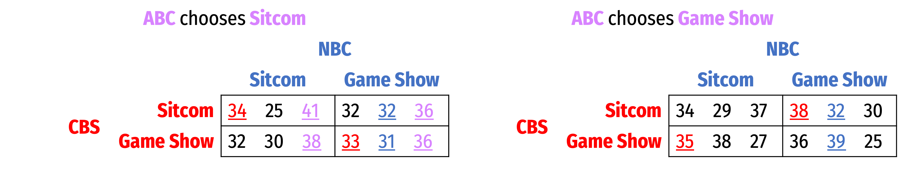
]


- Finally consider .hi-purple[ABC]
  - If .hi-red[CBS] chooses .red[Sitcom] and .hi-blue[NBC] chooses .blue[Sitcom], .hi-purple[ABC]'s BR: .purple[Sitcom]
  - If .hi-red[CBS] chooses .red[Game Show] and .hi-blue[NBC] chooses .blue[Sitcom], .hi-purple[ABC]'s BR: .purple[Sitcom]
  - If .hi-red[CBS] chooses .red[Sitcom] and .hi-blue[NBC] chooses .blue[Game Show], .hi-purple[ABC]'s BR: .purple[Sitcom]
  - If .hi-red[CBS] chooses .red[Game Show] and .hi-blue[NBC] chooses .blue[Game Show], .hi-purple[ABC]'s BR: .purple[Sitcom]

---
# Depicting Three Player Games

.center[

]


- .hi-purple[Nash Equilibrium]: (.red[Game Show], .blue[Game Show], .purple[Sitcom])

---

# Summary of Methods of Finding Nash Eq.

.smallest[
Ranked from (most to least) effective and (most to least) tedious:

1. .hi-purple[Cell-by-cell inspection]
  - For each outcome, ask: would any player like to change strategy given others' strategies?
  - Every outcome where all players answer “NO” is a Nash equilibrium

2. .hi-purple[Best response analysis]
  - For each possible strategy of *other* players, what is a player's best response?
  - If **all** players are playing a best response in an outcome, that's a Nash equilibrium

3. .hi-purple[Successive elimination of dominated strategies]
  - Eliminate (dominated) strategies players will never play
  - If a single strategy remains for each player, that's the Nash equilibrium
  - Ties cause you to rule out potential Nash equilibria!
]