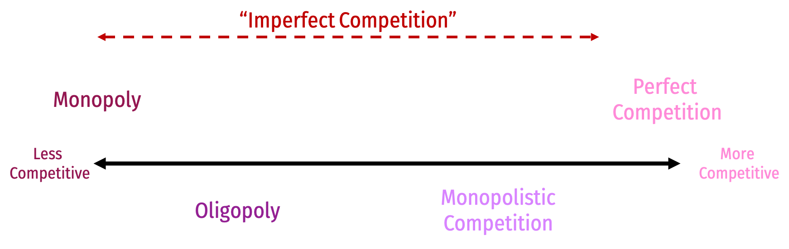
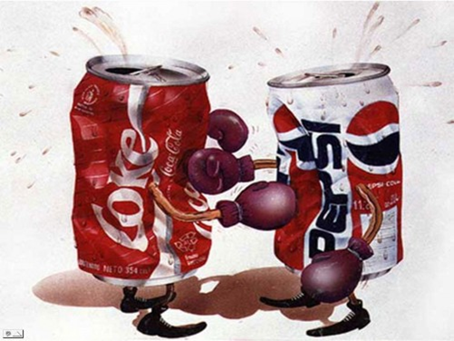

```{r setup, include=FALSE}
options(htmltools.dir.version = FALSE)
knitr::opts_chunk$set(echo=F,
                      message=F,
                      warning=F,
                      fig.retina = 3,
                      fig.align = "center")
library("tidyverse")
library("ggrepel")
library("fontawesome")
xaringanExtra::use_tile_view()
xaringanExtra::use_tachyons()
xaringanExtra::use_freezeframe()

update_geom_defaults("label", list(family = "Fira Sans Condensed"))
update_geom_defaults("text", list(family = "Fira Sans Condensed"))

set.seed(256)

theme_slides <- theme_light() + 
  theme(
    text = element_text(family = "Fira Sans", size = 24)
  )
```

class: inverse

# Outline

### [Coordination Games](#3)
### [Multiple Equilibria](#41)
### [Rationalizability and the Role of Beliefs](#50)

---

# Discrete vs. Continuous Strategies

.pull-left[

- We considered simultaneous games where strategies are .hi-purple[discrete]: a finite (usually small) number of strategies to choose from

- We now consider .hi-purple[continuous] strategies:
  - Practically infinite number of "strategies" to choose from
  - Example: firms don't just choose 1 out of 2 or 3 possible prices, but one from a large possible range
    - Must switch from game trees and payoff matrices to algebraic equations
    - Still keep concepts of "best response" and Nash equilibria
]

.pull-right[
.center[

]
]

---

class: inverse, center, middle

# Quick Microeconomics Refresher

---

# Demand Function

.pull-left[

- .hi[Demand function] relates quantity to price

.bg-washed-green.b--dark-green.ba.bw2.br3.shadow-5.ph4.mt5[
.green[**Example**]: 
$$q=20-p$$
]
- Not graphable (wrong axes)!

]

---

# Inverse Demand Function

.pull-left[

- .hi[*Inverse* demand function] relates price to quantity
    - Take demand function and solve for $p$

.bg-washed-green.b--dark-green.ba.bw2.br3.shadow-5.ph4.mt5[
.green[**Example**]: 
$$p=20-q$$
]
- Graphable (price on vertical axis)!

]


---

# Inverse Demand Function

.pull-left[

- .hi[*Inverse* demand function] relates price to quantity
    - Take demand function and solve for $p$

.bg-washed-green.b--dark-green.ba.bw2.br3.shadow-5.ph4.mt5[
.green[**Example**]: 
$$p=20-q$$
]
- Graphable (price on vertical axis)!

]

.pull-right[

```{r, fig.retina=3}
demand=function(x){20-x}

d<-ggplot(data.frame(x=c(0,10)), aes(x=x))+
  stat_function(fun=demand, geom="line", size=2, color = "blue")+
  geom_label(aes(x=8,y=demand(8)), color = "blue", label="Demand", size = 6)+
    scale_x_continuous(breaks=seq(0,10,1),
                     limits=c(0,10),
                     expand=expand_scale(mult=c(0,0.1)))+
  scale_y_continuous(breaks=seq(0,20,2),
                     limits=c(0,20),
                     expand=expand_scale(mult=c(0,0.1)),
                     labels = function(x){paste("$", x, sep="")})+
  coord_cartesian(clip="off")+
  labs(x = "Quantity of x",
       y = "Price of x")+
  theme_classic(base_family = "Fira Sans Condensed", base_size=20)
d
```
]

---

# Demand and Marginal Revenue

.pull-left[

```{r, fig.retina=3}
MR=function(x){20-4*x}

#q_choke<-(a/b)
#MR_choke<-(a/(2*b))

ggplot(data.frame(x=c(0,10)), aes(x=x))+
  stat_function(fun=demand, geom="line", size=2, color="blue")+
  geom_label(x=2.5,y=demand(2.5), label="Demand slope=b", color="blue")+
  stat_function(fun=MR, geom="line", size=2, color="purple")+
  geom_label(x=2.5,y=MR(2.5), label="MR(q) slope=2b", color="purple")+
    scale_x_continuous(breaks = c(0,5,10),
                       labels = c(0,expression(a/2*b),expression(a/b)),
                       expand=expand_scale(mult=c(0,0.1)))+
  scale_y_continuous(breaks=c(0,20),
                     labels=c(0,expression(a)),
                     limits=c(0,20),
                     expand=expand_scale(mult=c(0,0.1)))+
  labs(x = "Quantity (q)",
       y = "Price (p)")+
  theme_classic(base_family = "Fira Sans Condensed", base_size=20)
```
]

.pull-right[

$$\begin{align*}
\color{#0047AB}{p(q)}&\color{#0047AB}{=a-bq}\\
\color{#6A5ACD}{MR(q)}&\color{#6A5ACD}{=a-2bq}\\
\end{align*}$$

- **Marginal revenue starts at same intercept as Demand $(a)$ with twice the slope $(2b)$**
]

---

# Perfectly Competitive Firms


.pull-left[
```{r, fig.retina=3, fig.height=5}
demand<-function(x){10-x}
supply<-function(x){x}
demand_firm<-function(x){5}

ggplot(data.frame(x=c(0,10)), aes(x=x))+
  stat_function(fun=demand_firm, geom="line", size=2, color = "blue")+
  geom_label(aes(x=9,y=demand_firm(9)), color = "blue", label="Demand = MR", size = 5)+
    scale_x_continuous(breaks=seq(0,10,1),
                     limits=c(0,10),
                     expand=expand_scale(mult=c(0,0.1)))+
  scale_y_continuous(breaks=seq(0,10,1),
                     limits=c(0,10),
                     labels=scales::dollar,                   
                     expand=expand_scale(mult=c(0,0.1)))+
  guides(fill=F)+
  labs(title = "Representative Firm",
       x = "Quantity",
       y = "Price")+
  theme_classic(base_family = "Fira Sans Condensed", base_size=20)
```
]

.pull-right[
```{r, fig.retina=3, fig.height=5}
ggplot(data.frame(x=c(0,10)), aes(x=x))+
  stat_function(fun=demand, geom="line", size=2, color = "blue")+
    geom_label(aes(x=9,y=demand(9)), color = "blue", label="Demand", size = 5)+
  stat_function(fun=supply, geom="line", size=2, color = "red")+
    geom_label(aes(x=9,y=supply(9)), color = "red", label="Supply", size = 5)+
  geom_segment(x=5, xend=5, y=0, yend=5, size=1, linetype="dotted")+
  geom_segment(x=0, xend=5, y=5, yend=5, size=1, linetype="dotted")+
    scale_x_continuous(breaks=seq(0,10,1),
                     limits=c(0,10),
                     expand=expand_scale(mult=c(0,0.1)))+
  scale_y_continuous(breaks=seq(0,10,1),
                     limits=c(0,10),
                     labels=scales::dollar,                   
                     expand=expand_scale(mult=c(0,0.1)))+
  guides(fill=F)+
  labs(title = "Industry",
       x = "Quantity",
       y = "Price")+
  theme_classic(base_family = "Fira Sans Condensed", base_size=20)
```
]

- Firms in a competitive market are .hi[“price-takers”] and must charge the market price

- .blue[Demand for a firm's product] is **perfectly elastic** at the market price
  - Marginal revenue = Firm's Demand = market price
  
---

# Perfectly Competitive Firms

.pull-left[
```{r, fig.retina=3, fig.height=4.5}
demand<-function(x){10-x}
supply<-function(x){x}
demand_firm<-function(x){10}
mc_cc<-function(x){3*x^2-8*x+9}
ac_cc<-function(x){x^2-4*x+10+10/x}

pc<-ggplot(data.frame(x=c(0,10)), aes(x=x))+
  stat_function(fun=demand_firm, geom="line", size=2, color = "blue")+
  geom_label(aes(x=4.5,y=demand_firm(4.5)), color = "blue", label="Demand", size = 5)+
    stat_function(fun=mc_cc, geom="line", size=2, color = "red")+
  geom_label(aes(x=3.5,y=mc_cc(3.5)), color = "red", label="MC(q)", size = 5)+
    stat_function(fun=ac_cc, geom="line", size=2, color = "orange")+
  geom_label(aes(x=4.5,y=ac_cc(4.5)), color = "orange", label="AC(q)", size = 5)+
  geom_segment(x=2.8, xend=2.8, y=0, yend=10, size=1, linetype="dotted")+
    scale_x_continuous(breaks=NULL,
                     limits=c(0,5),
                     expand=expand_scale(mult=c(0,0.1)))+
  scale_y_continuous(breaks=NULL,
                     limits=c(0,20),
                     expand=expand_scale(mult=c(0,0.1)))+
  guides(fill=F)+
  labs(title = "Representative Firm",
       x = "Quantity",
       y = "Price")+
  theme_classic(base_family = "Fira Sans Condensed", base_size=20)
pc
```
]

.pull-right[
```{r, fig.retina=3, fig.height=4.5}
cs_1<-tribble(
  ~x, ~y,
  0, 10,
  0, 5,
  5, 5
)
ps_1<-tribble(
  ~x, ~y,
  0, 0,
  0, 5,
  5, 5
)

ggplot(data.frame(x=c(0,10)), aes(x=x))+
  geom_polygon(data=cs_1, aes(x=x,y=y), fill="blue", alpha=0.5)+
  geom_polygon(data=ps_1, aes(x=x,y=y), fill="red", alpha=0.5)+
  stat_function(fun=demand, geom="line", size=2, color = "blue")+
    geom_label(aes(x=9,y=demand(9)), color = "blue", label="Demand", size = 5)+
  stat_function(fun=supply, geom="line", size=2, color = "red")+
    geom_label(aes(x=9,y=supply(9)), color = "red", label="Supply", size = 5)+
  geom_segment(x=5, xend=5, y=0, yend=5, size=1, linetype="dotted")+
  geom_segment(x=0, xend=5, y=5, yend=5, size=1, linetype="dotted")+
  
  # point A
  geom_point(x = 5, y = 5, size=3)+
  geom_text(x = 5, y = 5.5, label = "A", size=5)+
  
    scale_x_continuous(breaks=NULL,
                     limits=c(0,10),
                     expand=expand_scale(mult=c(0,0.1)))+
  scale_y_continuous(breaks=NULL,
                     limits=c(0,10),
                     expand=expand_scale(mult=c(0,0.1)))+
  guides(fill=F)+
  labs(title = "Industry",
       x = "Quantity",
       y = "Price")+
  theme_classic(base_family = "Fira Sans Condensed", base_size=20)
```
]

.smallest[
- Firms choose $q^\star$ to maximize profits where .purple[MR(q)]=.red[MC(q)]
- In the long run, firms earn profit $\pi=0$ due to .hi[free entry and exit]
]

---

# Firm with Market Power

.pull-left[

- Firm with market power is a .hi-purple[price searcher]

- Chooses $q^\star$ to maximize profits where .purple[MR(q)]=.red[MC(q)]

- .green[Profit] = (.blue[p] — .orange[AC(q)])q

- Earns positive profits from .hi[barriers to entry]
]

.pull-right[
```{r}
MR=function(x){20-4*x}
demand=function(x){20-2*x}
mc=function(x){1*x}
ac=function(x){0.5*x+5/x}

ggplot(data.frame(x=c(0,10)), aes(x=x))+
  geom_rect(xmin=0,xmax=4,ymin=ac(4),ymax=demand(4),fill="green",alpha=0.5)+  stat_function(fun=demand, geom="line", size=2, color = "blue")+
  geom_label(aes(x=8,y=demand(8)), color = "blue", label="Demand")+
  stat_function(fun=MR, geom="line", size=2, color="purple")+
  geom_label(x=2.5,y=MR(2.5), label="MR(q)", color="purple")+
  stat_function(fun=mc, geom="line", size=2, color="red")+
  geom_label(x=5,y=mc(5), label="MC(q)", color="red")+
  stat_function(fun=ac, geom="line", size=2, color="orange")+
  geom_label(x=5,y=ac(5), label="AC(q)", color="orange")+
  geom_segment(x = 4, xend = 4, y = 0, yend=demand(4), size = 1 , linetype = "dotted")+
  geom_segment(x = 0, xend = 4, y = demand(4), yend=demand(4), size = 1 , linetype = "dotted")+
    scale_x_continuous(breaks=seq(0,10,1),
                     limits=c(0,10),
                     expand=expand_scale(mult=c(0,0.1)))+
  scale_y_continuous(breaks=seq(0,20,2),
                     limits=c(0,20),
                     expand=expand_scale(mult=c(0,0.1)),
                     labels = function(x){paste("$", x, sep="")})+
  coord_cartesian(clip="off")+
  labs(x = "Quantity of x",
       y = "Price of x")+
  theme_classic(base_family = "Fira Sans Condensed", base_size=20)
```
]

---

# Imperfect Competition

.center[

]

---

class: inverse, center, middle

# Application: The Econoomics of Oligopoly

---

# Oligopoly

.pull-left[
.center[

]
]

.pull-right[

- .hi[Oligopoly]: industry with a few large sellers with market power

- Other features can vary
  - May sell similar or different goods
  - May have barriers to entry

- Key: Firms make .hi-purple[strategic choices], interdependent on one another

- For modeling simplicity: 
  - .hi-purple[Duopoly]: a market with 2 sellers 
]


---

# Oligopoly: Modeling

.pull-left[
.center[

]
]

.pull-right[

.smallest[
- Unlike perfect competition or monopoly, no single “theory of oligopoly”

- Depends heavily on assumptions made about interactions and choice variables (FYI):
  - “Bertrand competition:” firms compete on **price**
  - “Cournot competition:” firms **simultaneously** compete on **quantity**
  - “Stackelberg competition:” firms **sequentially** compete on **quantity**

- One certainty: oligopoly is a .hi-purple[strategic interaction] between few firms

]
]

---

# Equilibrium in Oligopoly


.pull-left[
.center[

]
]

.pull-right[

- What does .hi-purple[“equilibrium”] mean in an *oligopoly*?

- In competition or monopoly, a unique $(q^*,p^*)$ for industry such that **nobody has incentives to change price**

]

---

# Equilibrium in Oligopoly

.pull-left[
.center[

]
]

.pull-right[

- Oligopoly: use game-theoretic .hi-purple[Nash Equilibrium]: 
  - no player wants to change their strategy **given all other players’ strategies**
  - each player is playing a **best response** against other players’ strategies

]

---

# As a Prisoner's Dilemma I

.pull-left[
.center[


]
]

.pull-right[

- We will start with a .hi-purple[discrete] example to get the basics

- .hi-green[Example]: suppose we have a simple **duopoly** between .hi-red[Apple] and .hi-blue[Google]

- Each is planning to launch a new tablet, and choose to sell it at a **High Price** or a **Low Price**

]

---

# As a Prisoner's Dilemma 

.pull-left[

- .hi-purple[Nash equilibrium]: (.hi-red[Low Price], .hi-blue[Low Price])
  - neither player has an incentive to change price, *given the other's price*

]

.pull-right[
.center[


Nash equilibrium
]
]

---

# As a Prisoner's Dilemma 

.pull-left[

- .hi-purple[Nash equilibrium]: (.hi-red[Low Price], .hi-blue[Low Price])
  - neither player has an incentive to change price, *given the other's price*
  
- A possible **Pareto improvement**: (.hi-red[High Price], .hi-blue[High Price])
  - Both players are better off, nobody worse off!
  - Is it a Nash Equilibrium?

]

.pull-right[
.center[


]
]

---

class: inverse, center, middle

# Cartels

---

# As a Prisoner's Dilemma III

.pull-left[

- Google and Apple could .hi-purple[collude] with one another and agree to both raise prices

- .hi[Cartel]: group of sellers coordinate to raise prices to act like a collective monopoly and split the profits	

]

.pull-right[

.center[

]
]

---

# Instability of Cartels

.pull-left[

- Cartels often **unstable**:

- Incentive for each member to cheat is too strong

- Entrants (non-cartel members) can threaten lower prices

- Difficult to monitor whether firms are upholding agreement

- Cartels are illegal, must be discrete 

]

.pull-right[
.center[

]
]

---

# Attempts to Sustain Collusion I

.pull-left[
.center[

]
]

.pull-right[

Archer Daniels Midland (USA), Ajinomoto (Japan), Koywa Hakko Kogyo (Japan), Sewon American Inc (South Korea) held secret meetings to fix the price of lysine, a food additive to animal feed in the 1990s.


]

---

# Attempts to Sustain Collusion I 

.pull-left[
.center[

]
]

.pull-right[

Archer Daniels Midland (USA), Ajinomoto (Japan), Koywa Hakko Kogyo (Japan), Sewon American Inc (South Korea) held secret meetings to fix the price of lysine, a food additive to animal feed in the 1990s.

An internal FBI informant brought the cartel down.

]

---


# Attempts to Sustain Collusion II

.pull-left[
.center[

]
]

.pull-right[

- 1950s market for turbines (for electric utility companies)

- A triopoly by market share:
  - GE: 60%
  - Westinghouse: 30%
  - Allied-Chalmers: 10%

- Maintained this equilibrium with clever coordination
]

---

# Attempts to Sustain Collusion II

.pull-left[
.center[

]
]

.pull-right[

- Utility companies solicit bids to build turbines:

- If bid comes on day 1-17 on *lunar* calendar
  - Westinghouse & A-C bid prohibitively high
  - Ensures GE won
]

---

# Attempts to Sustain Collusion II

.pull-left[
.center[

]
]

.pull-right[

- Utility companies solicit bids to build turbines:

- If bid comes on day 18-25 on *lunar* calendar
  - GE & A-C bid prohibitively high
  - Ensures Westinghouse won
]

---

# Attempts to Sustain Collusion II

.pull-left[
.center[

]
]

.pull-right[

- Utility companies solicit bids to build turbines:

- If bid comes on day 26-28 on *lunar* calendar
  - GE & Westinghouse bid prohibitively high
  - Ensures Allied-Chalmers won
]

---

# Attempts to Sustain Collusion II

.pull-left[
.center[

]
]

.pull-right[

- Utility companies released their bids randomly, not according to lunar calendar
  - Ensures the 60%-30%-10% distribution

- Cheating by one of the 3 firms easily monitored by other 2

- Nobody thought about the lunar calendar, until antitrust authorities caught on
]

---

# Attempts to Sustain Collusion III

.pull-left[
.center[

]
]

.pull-right[

- FCC Spectrum License auctions 1996-1997

- Firm seeking a license in particular location (and willing to fight for it) signals to other firms via ending its bid in the **telephone area code** digits
  - e.g. $50,100,**202** for Washington DC (area code 202)

- Other firms let it win (in exchange for tacit agreement to do the same)
]

---

# Government-Sanctioned Cartels I

.pull-left[

- Like monopolies, some cartels exist because they are *supported* by governments or regulators, possibly by rent-seeking

- National Recovery Administration (1933-1935)
  - cartelized most industries to artificially raise prices of goods
  - found unconstitutional in *Schechter Poultry Corp. v. United States* (1935)

]

.pull-right[
.center[

]
]

---

# Government-Sanctioned Cartels II

.center[

]

---

# Government-Sanctioned Cartels II

.left-column[
.center[


]
]

.right-column[

> “[B]ecause of their inability to maintain their cartels [prior to the ICC], railroads were big supporters of the [Interstate Commerce Act] because the newly-formed ICC could coordinate cartel prices...Using the new law as authority, the railroads revamped their freight classification, raised rates, eliminated passes and fare reductions, and revised less than carload rates on all types of goods, including groceries.”

.source[Kolko, Gabriel, 1963, *The Triumph of Conservatism: A Reinterpretation of American History, 1900-1916*]
]

---

# Government-Sanctioned Cartels III

.pull-left[
.center[


Source: [NPR Planet Money](https://www.npr.org/sections/money/2015/06/24/417187957/episode-478-the-raisin-outlaw)
]
]

.pull-right[

> “Marvin Horne was known as the raisin outlaw. His crime: Selling 100% of his raisin crop, against the wishes of the Raisin Administrative Committee, a group of farmers that regulates the national raisin supply.
> He took the case all the way to the Supreme Court, which issued its final ruling this week.”

]

---

# Government-Sanctioned Cartels IV

.pull-left[
.center[

]
]

.pull-right[
.center[

]
]

---

# Cartels: In Fiction I

.center[
<iframe width="980" height="550" src="https://www.youtube.com/embed/hGo5bxWy21g" frameborder="0" allow="accelerometer; autoplay; encrypted-media; gyroscope; picture-in-picture" allowfullscreen></iframe>
]

---

# Cartels: In Fiction II

.center[
<iframe width="980" height="550" src="https://www.youtube.com/embed/aT7TxMaZ4eM" frameborder="0" allow="accelerometer; autoplay; encrypted-media; gyroscope; picture-in-picture" allowfullscreen></iframe>

]
