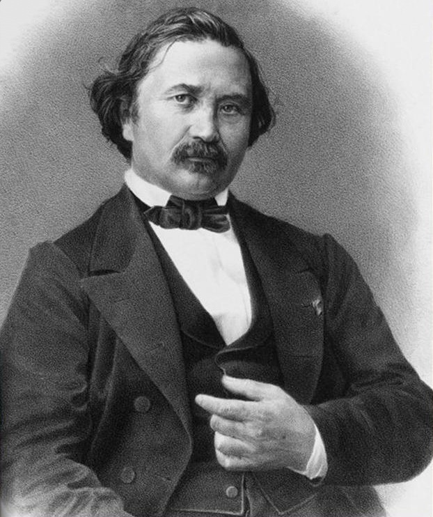

```{r setup, include=FALSE}
options(htmltools.dir.version = FALSE)
knitr::opts_chunk$set(echo=F,
                      message=F,
                      warning=F,
                      fig.retina = 3,
                      fig.align = "center")
library("tidyverse")
library("ggrepel")
library("fontawesome")
xaringanExtra::use_tile_view()
xaringanExtra::use_tachyons()
xaringanExtra::use_freezeframe()

update_geom_defaults("label", list(family = "Fira Sans Condensed"))
update_geom_defaults("text", list(family = "Fira Sans Condensed"))

set.seed(256)

theme_slides <- theme_light() + 
  theme(
    text = element_text(family = "Fira Sans", size = 24)
  )
```

# A More Rigorous Oligopoly/Cartel Problem

.smallest[
.bg-washed-green.b--dark-green.ba.bw2.br3.shadow-5.ph4.mt5[
.hi-green[Example]: Suppose Squeaky Clean (Firm 1) and Biobase (Firm 2) are the only two producers of chlorine for swimming pools. The inverse market demand for chlorine is
$$P=32-2Q$$
where $Q=q_{1}+q_{2}$ is measured in tons, and $P$ is $/ton. Assume only a constant marginal cost of $16 for both firms
]

1. If the two firms collude and agree to act as a monopolist and evenly split the market, how much will each firm produce, what will be the market price, and how much profit will each firm earn?

2. Under this agreement, does either firm have an incentive to cheat (i.e. by producing an additional ton of chlorine)? What would happen to each firm's profits if either, or both, cheated?
]

---

# Models of Oligopoly

.pull-left[
Three canonical models of Oligopoly

1. .hi[Bertrand competition]
  - Firms **simultaneously** compete on **price**
2. .hi[Cournot competition]
  - Firms **simultaneously** compete on **quantity**
3. .hi[Stackelberg competition]
  - Firms **sequentially** compete on **quantity**

]

.pull-right[
.center[

]
]

---

# Bertrand Competition

.left-column[
.center[


.smaller[
Joseph Bertrand

1822-1890
]
]
]
.right-column[
- .hi["Bertrand competition"]: two (or more) firms compete on **price** to sell the **same good**

- Firms set their prices **simultaneously**

- Consumers are indifferent between the brands and .hi-purple[always buy from the seller with the lowest price]

]

---

# Bertrand Competition: Example

.pull-left[

- Suppose two firms, .hi-red[Walmart] and .hi-blue[Target] stock and sell identical HDTVs

- Costs each firm $200 to stock an HDTV

- Let $Q$ be the *total* quantity purchased by consumers from the entire market (i.e. both firms)
  - $Q=\color{red}{q_w}+\color{blue}{q_t}$

- Denote .hi-red[Walmart]'s price as .hi-red[`\\(p_w\\)`] and .hi-blue[Target]'s price as .hi-blue[`\\(p_t\\)`]
]

.pull-right[
.center[

]
]

---

# Bertrand Competition: Example

.pull-left[
- Demand for HDTV's at .hi-red[Walmart]:

]

---

# Bertrand Competition: Example

.pull-left[
- Demand for HDTV's at .hi-red[Walmart]:
  - $Q$ if .red[`\\(p_w\\)`] $<$ .blue[`\\(p_t\\)`]
]

---

# Bertrand Competition: Example

.pull-left[
- Demand for HDTV's at .hi-red[Walmart]:
  - $Q$ if .red[`\\(p_w\\)`] $<$ .blue[`\\(p_t\\)`]
  - $\frac{Q}{2}$ if .red[`\\(p_w\\)`] $=$ .blue[`\\(p_t\\)`]
]

---

# Bertrand Competition: Example

.pull-left[
- Demand for HDTV's at .hi-red[Walmart]:
  - $Q$ if .red[`\\(p_w\\)`] $<$ .blue[`\\(p_t\\)`]
  - $\frac{Q}{2}$ if .red[`\\(p_w\\)`] $=$ .blue[`\\(p_t\\)`]
  - $0$ if .red[`\\(p_w\\)`] $>$ .blue[`\\(p_t\\)`]
]

--

.pull-right[
```{r, fig.retina=3}
Demand_b=function(x){10-x}
MC=function(x){2}
ggplot(data.frame(x=c(0,10)), aes(x=x))+
  
  # curves 
  stat_function(fun=Demand_b, geom="line", size=5, color="purple")+
  
  geom_segment(x=0.05,xend=0.05,y=10,yend=5, size =2, color = "red")+
  geom_segment(x=0,xend=2.5,y=5,yend=5, size =2, color = "red")+
  geom_segment(x=2.5,xend=5,y=5,yend=5, size =2, linetype="dotted", color = "red")+
  geom_segment(x=5,xend=10,y=5,yend=0, size=2, color="red")+
  annotate(geom = "label", x = 7, y = 3, label = "Walmart's Demand",color = "red", size = 6) +
  
  stat_function(fun=MC, geom="line", size=2, color="orange")+
  annotate(geom = "label", x = 2, y = Demand_b(2), label = "Market Demand",color = "purple", size = 6) +
  annotate(geom = "label", x = 9, y = 2, label = "MC(q)", color="orange", size=6)+
  
  geom_segment(x=2.5,xend=2.5,y=0,yend=5, size=1, linetype="dotted")+
  geom_segment(x=5,xend=5,y=0,yend=5, size=1, linetype="dotted")+

  scale_x_continuous(breaks = c(0,2.5,5),
                     labels = c(0,expression(Q/2),"Q"),
                     expand=c(0,0))+
  scale_y_continuous(breaks = c(0,2,5),
                     labels = c(0,"$200", expression(p[t])),
                     limits = c(0,10),
                     expand=c(0,0))+
  theme_classic(base_family = "Fira Sans Condensed", base_size=20)+
  labs(x = expression(paste("Walmart's Quantity, ", q[w]), sep=" "),
       y = expression(paste("Walmart's Price, ", p[w]), sep=" "))
```
]

---

# Bertrand Competition: Example

.pull-left[
- Demand for HDTV's at .hi-red[Walmart]:
  - $Q$ if .red[`\\(p_w\\)`] $<$ .blue[`\\(p_t\\)`]
  - $\frac{Q}{2}$ if .red[`\\(p_w\\)`] $=$ .blue[`\\(p_t\\)`]
  - $0$ if .red[`\\(p_w\\)`] $>$ .blue[`\\(p_t\\)`]
]

.pull-left[
- Demand for HDTV's at .hi-blue[Target]:
  - $0$ if .red[`\\(p_w\\)`] $<$ .blue[`\\(p_t\\)`]
  - $\frac{Q}{2}$ if .red[`\\(p_w\\)`] $=$ .blue[`\\(p_t\\)`]
  - $Q$ if .red[`\\(p_w\\)`] $>$ .blue[`\\(p_t\\)`]
]

---

# Bertrand Competition: Example

.pull-left[

- The only way to sell TVs is to match or beat your competitor's price 

]

.pull-right[
.center[

]
]

---

# Bertrand Competition: Example

.pull-left[

- The only way to sell TVs is to match or beat your competitor's price

- Suppose you are .hi-red[Walmart]

For a known .hi-blue[`\\(p_t\\)`], setting your price 

$$\color{red}{p_w}=\color{blue}{p_t}-\epsilon$$

for any arbitrary $\epsilon > 0$ captures you the entire market $Q$

- Same for .hi-blue[Target] for $\color{red}{p_w}$

]

.pull-right[
.center[

]
]

---

# Bertrand Competition: Example

.pull-left[

- Won't charge $p<MC$, earn losses

- Firms continue undercutting one another until .hi-red[`\\(p_w\\)`] $=$ .hi-blue[`\\(p_t\\)`] $=MC$

- .hi-purple[Nash Equilibrium]: $$\big( \color{red}{p_w = MC}, \color{blue}{p_t=MC} \big)$$
  - Firms earn no profits! 

]

.pull-right[
.center[

]
]

---

# Bertrand Paradox

.pull-left[

- .hi[Bertrand Paradox]: competitive outcome can be achieved with just 2 firms!
  - $p=MC$, $\pi=0$

]

.pull-right[
.center[

]
]

---

# Walmart's Reaction Curve

.pull-left[
```{r}
rc<-ggplot(tibble(x=c(0,10)), aes(x=x))+
  geom_segment(x=0, xend=1000,y=0,yend=1000, size=1, linetype="dashed")+
  geom_segment(x=0,xend=225,y=200,yend=200, size=2, color="red")+
  geom_segment(x=225,xend=1025,y=200,yend=1000, size=2, color="red")+
  annotate(geom = "label", x = 825, y = 800 , label = "Walmart's RC",color = "red", size = 4) +

  scale_x_continuous(breaks = seq(0,1000,100),
                     labels = scales::dollar,
                     limits = c(0,1050),
                     expand=c(0,0))+
  scale_y_continuous(breaks = seq(0,1000,100),
                     labels = scales::dollar,
                     limits = c(0,1050),
                     expand=c(0,0))+
  theme_classic(base_family = "Fira Sans Condensed", base_size=20)+
  labs(x = expression(paste("Target's Price, ", p[t]), sep=" "),
       y = expression(paste("Walmart's Price, ", p[w]), sep=" "))
rc
```
]

.pull-right[

We can graph .hi-red[Walmart]'s .hi-purple[reaction curve] to .hi-blue[Target]'s price

]

---

# Walmart's Reaction Curve

.pull-left[
```{r}
rc+
  geom_segment(x=500,xend=500,y=0,yend=475, size=1, linetype="dotted", color="blue")+
  geom_segment(x=0,xend=500,y=475,yend=475, size=1, linetype="dotted", color="red")

```
]

.pull-right[

We can graph .hi-red[Walmart]'s .hi-purple[reaction curve] to .hi-blue[Target]'s price

- e.g. if .hi-blue[Target] sets a price of .hi-blue[$500], .hi-red[Walmart]'s best response is .hi-red[`\\($500-\epsilon\\)`]

]

---

# Walmart's Reaction Curve

.pull-left[
```{r}
rc+
  geom_segment(x=500,xend=500,y=0,yend=475, size=1, linetype="dotted", color="blue")+
  geom_segment(x=0,xend=500,y=475,yend=475, size=1, linetype="dotted", color="red")+
  geom_segment(x=300,xend=300,y=0,yend=275, size=1, linetype="dotted", color="blue")+
  geom_segment(x=0,xend=300,y=275,yend=275, size=1, linetype="dotted", color="red")

```
]

.pull-right[

We can graph .hi-red[Walmart]'s .hi-purple[reaction curve] to .hi-blue[Target]'s price

- e.g. if .hi-blue[Target] sets a price of .hi-blue[$500], .hi-red[Walmart]'s best response is .hi-red[`\\($500-\epsilon\\)`]
- e.g. if .hi-blue[Target] sets a price of .hi-blue[$300], .hi-red[Walmart]'s best response is .hi-red[`\\($300-\epsilon\\)`]

]

---

# Walmart's Reaction Curve

.pull-left[
```{r}
rc+
  geom_segment(x=500,xend=500,y=0,yend=475, size=1, linetype="dotted", color="blue")+
  geom_segment(x=0,xend=500,y=475,yend=475, size=1, linetype="dotted", color="red")+
  geom_segment(x=300,xend=300,y=0,yend=275, size=1, linetype="dotted", color="blue")+
  geom_segment(x=0,xend=300,y=275,yend=275, size=1, linetype="dotted", color="red")+
  geom_segment(x=200,xend=200,y=0,yend=200, size=1, linetype="dotted", color="blue")+
  geom_segment(x=0,xend=200,y=200,yend=200, size=1, linetype="dotted", color="red")

```
]

.pull-right[

We can graph .hi-red[Walmart]'s .hi-purple[reaction curve] to .hi-blue[Target]'s price

- e.g. if .hi-blue[Target] sets a price of .hi-blue[$500], .hi-red[Walmart]'s best response is .hi-red[`\\($500-\epsilon\\)`]
- e.g. if .hi-blue[Target] sets a price of .hi-blue[$300], .hi-red[Walmart]'s best response is .hi-red[`\\($300-\epsilon\\)`]
- e.g. if .hi-blue[Target] sets a price of .hi-blue[$200], (MC) .hi-red[Walmart]'s best response is .hi-red[`\\($200\\)`] (MC)

]

---

# Target's Reaction Curve

.pull-left[
```{r}
rc_target<-ggplot(tibble(x=c(0,10)), aes(x=x))+
  geom_segment(x=0, xend=1000,y=0,yend=1000, size=1, linetype="dashed")+
  geom_segment(x=200,xend=200,y=0,yend=225, size=2, color="blue")+
  geom_segment(x=200,xend=1000,y=225,yend=1025, size=2, color="blue")+
  annotate(geom = "label", x = 900, y = 925 , label = "Target's RC",color = "blue", size = 4) +

  scale_x_continuous(breaks = seq(0,1000,100),
                     labels = scales::dollar,
                     limits = c(0,1050),
                     expand=c(0,0))+
  scale_y_continuous(breaks = seq(0,1000,100),
                     labels = scales::dollar,
                     limits = c(0,1050),
                     expand=c(0,0))+
  theme_classic(base_family = "Fira Sans Condensed", base_size=20)+
  labs(x = expression(paste("Target's Price, ", p[t]), sep=" "),
       y = expression(paste("Walmart's Price, ", p[w]), sep=" "))
rc_target
```
]

.pull-right[

We can graph .hi-blue[Target]'s .hi-purple[reaction curve] to .hi-red[Walmart]'s price

]
---

# Target's Reaction Curve

.pull-left[
```{r}
rc_target+
  geom_segment(x=475,xend=475,y=0,yend=500, size=1, linetype="dotted", color="blue")+
  geom_segment(x=0,xend=475,y=500,yend=500, size=1, linetype="dotted", color="red")

```
]

.pull-right[

We can graph .hi-blue[Target]'s .hi-purple[reaction curve] to .hi-red[Walmart]'s price

- e.g. if .hi-red[Walmart] sets a price of .hi-red[$500], .hi-blue[Target]'s best response is .hi-blue[`\\($500-\epsilon\\)`]

]

---

# Target's Reaction Curve

.pull-left[
```{r}
rc_target+
  geom_segment(x=475,xend=475,y=0,yend=500, size=1, linetype="dotted", color="blue")+
  geom_segment(x=0,xend=475,y=500,yend=500, size=1, linetype="dotted", color="red")+
  geom_segment(x=275,xend=275,y=0,yend=300, size=1, linetype="dotted", color="blue")+
  geom_segment(x=0,xend=275,y=300,yend=300, size=1, linetype="dotted", color="red")

```
]

.pull-right[

We can graph .hi-blue[Target]'s .hi-purple[reaction curve] to .hi-red[Walmart]'s price

- e.g. if .hi-red[Walmart] sets a price of .hi-red[$500], .hi-blue[Target]'s best response is .hi-blue[`\\($500-\epsilon\\)`]
- e.g. if .hi-red[Walmart] sets a price of .hi-red[$300], .hi-blue[Target]'s best response is .hi-blue[`\\($300-\epsilon\\)`]

]

---

# Target's Reaction Curve

.pull-left[
```{r}
rc_target+
  geom_segment(x=475,xend=475,y=0,yend=500, size=1, linetype="dotted", color="blue")+
  geom_segment(x=0,xend=475,y=500,yend=500, size=1, linetype="dotted", color="red")+
  geom_segment(x=275,xend=275,y=0,yend=300, size=1, linetype="dotted", color="blue")+
  geom_segment(x=0,xend=275,y=300,yend=300, size=1, linetype="dotted", color="red")+
  geom_segment(x=200,xend=200,y=0,yend=200, size=1, linetype="dotted", color="blue")+
  geom_segment(x=0,xend=200,y=200,yend=200, size=1, linetype="dotted", color="red")

```
]

.pull-right[

We can graph .hi-blue[Target]'s .hi-purple[reaction curve] to .hi-red[Walmart]'s price

- e.g. if .hi-red[Walmart] sets a price of .hi-red[$500], .hi-blue[Target]'s best response is .hi-blue[`\\($500-\epsilon\\)`]
- e.g. if .hi-red[Walmart] sets a price of .hi-red[$300], .hi-blue[Target]'s best response is .hi-blue[`\\($300-\epsilon\\)`]
- e.g. if .hi-red[Walmart] sets a price of .hi-red[$200] (MC),  .hi-blue[Target]'s best response is .hi-blue[`\\($200\\)`] (MC)

]

---

# Nash Equilibrium with Reaction Curves

.pull-left[
```{r}
rc+ 
  geom_segment(x=200,xend=200,y=0,yend=225, size=2, color="blue")+
  geom_segment(x=200,xend=1000,y=225,yend=1025, size=2, color="blue")+
  annotate(geom = "label", x = 900, y = 925 , label = "Target's RC",color = "blue", size = 4)+
  geom_point(x=200,y=200,size=5,color="purple")+
  annotate(geom = "label", x = 400, y = 200 , label = "Nash Equilibrium",color = "purple", size = 5)
```
]

.pull-right[

Combine both curves on the same graph

- .hi-purple[Nash Equilibrium]: $$\big( \color{red}{p_w = MC}, \color{blue}{p_t=MC} \big)$$
    - Where both reaction curves intersect

- No longer an incentive to undercut or change price 

]

---

# Bertrand Competition: Moblab

.center[

]

---

# Bertrand Competition: Moblab

.pull-left[
- Each of you selling identical Economics course notes

- You will be put into a market with one other player

- Each term, both of you simultaneously choose your price

- Firm(s) choosing the lowest price get **all** the customers

]

.pull-right[
.center[

]

]

---
# Bertrand Competition: Moblab

.pull-left[

- The lowest price $p_L$ determines the market demand
$$q=3600-200p_L$$


- Both firms have $2 cost per unit sold

- $p=10$ maximizes total market profits

]

.pull-right[
.center[

]

]

---

# Bertrand Competition: Moblab

.pull-left[
$$q=3600-200p_L$$

.hi-green[Example:]
- Suppose Firm 1 sets $p=9$ and Firm 2 sets $p=10$

- Firm 2 sells 0, makes $0

- Firm 1 sells $q=3,600-200(9)=1,800$ and earns $1,800(9-2)=12,600$ profit

]

.pull-right[
.center[

]

]
