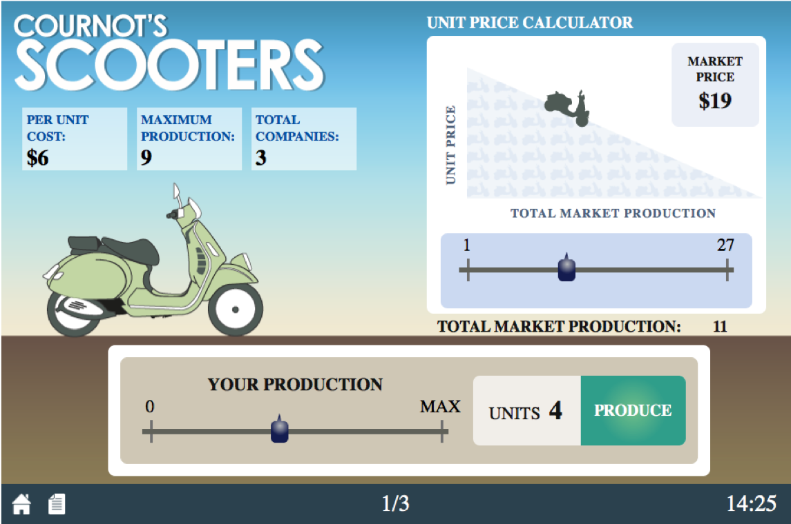

```{r setup, include=FALSE}
options(htmltools.dir.version = FALSE)
knitr::opts_chunk$set(echo=F,
                      message=F,
                      warning=F,
                      fig.retina = 3,
                      fig.align = "center")
library("tidyverse")
library("ggrepel")
library("fontawesome")
xaringanExtra::use_tile_view()
xaringanExtra::use_tachyons()
xaringanExtra::use_freezeframe()

update_geom_defaults("label", list(family = "Fira Sans Condensed"))
update_geom_defaults("text", list(family = "Fira Sans Condensed"))

set.seed(256)

theme_slides <- theme_light() + 
  theme(
    text = element_text(family = "Fira Sans", size = 24)
  )
```


# Models of Oligopoly

.pull-left[
Three canonical models of Oligopoly

1. .hi[Bertrand competition]
  - Firms **simultaneously** compete on **price**
2. .hi[Cournot competition]
  - Firms **simultaneously** compete on **quantity**
3. .hi[Stackelberg competition]
  - Firms **sequentially** compete on **quantity**

]

.pull-right[
.center[

]
]

---
# Cournot Competition

.left-column[
.center[


.smaller[
Antoine Augustin Cournot

1801-1877
]
]
]
.right-column[
- .hi["Cournot competition"]: two (or more) firms compete on **quantity** to sell the **same good**

- Firms set their quantities **simultaneously**

- Firms' joint output determines the market price faced by all firms
]

---

# Cournot Competition: Mechanics

.pull-left[

- Suppose two firms (1 and 2), each have an identical constant cost $$MC(q)=AC(q)=c$$

- Firm 1 and Firm 2 simultaneously set quantities, $q_1$ and $q_2$

- Total market demand is given by

$$\begin{align*}
P&=a-bQ\\
Q&=q_1+q_2\\
\end{align*}$$
]

.pull-right[
.center[

]
]

---

# Cournot Competition: Mechanics

.pull-left[

- Firm 1's profit is given by:

$$\begin{align*}
\pi_1&=q_1(P-c)\\
\pi_1&=q_1(a-b(q_1+q_2)-c)\\
\end{align*}$$

- And, symmetrically same for firm 2

- Note each firm's profits depend (in part) on the outputs of the other firm! 
]

.pull-right[
.center[

]
]

---

# Residual Demand

- Consider each the demand each firm faces to be a .hi-purple[residual demand]

- e.g. for firm 1

$$\begin{align*}
p&=a-b(q_1+q_2)\\
p&=\underbrace{(a-bq_2)}_{intercept}-\underbrace{b}_{slope}q_1\\
\end{align*}$$

- Firm 2 will produce some amount, $\color{purple}{q_2}$. 

- Firm 1 takes this as given, to find its own residual demand
  - Intercept: $a-bq_2$
  - Slope: $b$ (in front of $q_1)$

---

# Residual Demand

.pull-left[
```{r}
Demand_fake<-function(x){10-x}
Demand_residual<-function(x){8-x}

ggplot(tibble(x=c(0,10)), aes(x=x))+
  stat_function(fun=Demand_fake, geom="line", size=2, color="blue")+
    stat_function(fun=Demand_residual, geom="line", size=2, color="darkblue", linetype = "dashed")+
  annotate(geom = "label", x = 9, y = Demand_fake(9) , label = "Market Demand",color = "blue", size = 4) +
    annotate(geom = "label", x = 5, y = Demand_residual(5) , label = "Demand for Firm 1",color = "darkblue", size = 4) +

  annotate("segment", x = 5, xend = 3, y = 5, yend = 5, color = "purple", size=2, alpha=0.9, arrow=arrow(length=unit(0.5,"cm"), ends="last", type="closed"))+
    annotate(geom = "label", x = 4, y =5 , label = expression(q[2]), color = "purple", size = 4)+ 

  scale_x_continuous(breaks = NULL,
                     limits = c(0,10),
                     expand=c(0,0))+
  scale_y_continuous(breaks = c(0,8,10),
                     labels = c(0,expression(a-(b*q[2])), expression(a)),
                     limits = c(0,10),
                     expand=c(0,0))+
  theme_classic(base_family = "Fira Sans Condensed", base_size=20)+
  labs(x = expression(paste("Firm 1's quantity, ", q[1])),
       y = expression("Market Price, p"))
```

]

.pull-right[
- Firm 2 will produce some amount $q_2$

- Firm 1 will take this as a given, a constant

- Firm 1's choice variable is $q_1$, given $q_2$
]

---

# Cournot Competition: Example

.content-box-green[
.hi-green[Example]: Assume Saudi Arabia $(sa)$ and Iran $(i)$ are the only two oil producers, each with a constant $MC=AC=20$. The market (inverse) demand curve is given by:
$$\begin{align*}
P&=200-3Q\\
Q&=q_{sa}+q_i\\
\end{align*}$$

]

--

$$P=200-3q_{sa}-3q_i$$

---

# Cournot Competition: Example 

$$P=\underbrace{200-3q_i}_{intercept}-3q_{sa}$$

- Firms maximize profit (as always), by setting $q^*: MR(q)=MC(q)$

--

- Solve for Saudi Arabia
  - Take $q_i$ as given, a constant
  - Recall MR is twice the slope of demand
  
--

$$MR_{sa}=200-3q_i-6q_{sa}$$

---

# Cournot Competition: Example 

- Solve for $q^*$ for each firm (where $MR(q)=MC(q))$, we derive each firm's .hi[reaction function] or .hi[best response function] to the other firm's output

- Symmetric marginal costs and marginal revenues

--

$$\begin{align*}
q_{sa}^*&=30-0.5q_i\\
q_i^*&=30-0.5q_{sa}\\
\end{align*}$$

---

# Saudi Arabia's Reaction Curve

.pull-left[
```{r}
Saudi=function(x){30-0.5*x}

saudi<-ggplot(tibble(x=c(0,10)), aes(x=x))+
  stat_function(fun=Saudi, geom="line", size=2, color="red")+
    annotate(geom = "label", x = 45, y = Saudi(45) , label = "Saudi Arabia",color = "red", size = 4) +
  scale_x_continuous(breaks = seq(0,60,5),
                     limits = c(0,60),
                     expand=c(0,0))+
  scale_y_continuous(breaks = seq(0,60,5),
                     limits = c(0,60),
                     expand=c(0,0))+
  theme_classic(base_family = "Fira Sans Condensed", base_size=20)+
  labs(x = expression(paste("Iran's Output, ", q[I]), sep=" "),
       y = expression(paste("Saudi Arabia's Output, ", q[SA]), sep=" "))
saudi
```
]

.pull-right[

We can graph .hi-red[Saudi Arabias]'s .hi-purple[reaction curve] to .hi-blue[Irans]'s output

]

---

# Saudi Arabia's Reaction Curve

.pull-left[
```{r}
saudi+
  geom_segment(x=40,xend=40,y=0,yend=10, size=1, linetype="dotted", color="blue")+
  geom_segment(x=0,xend=40,y=10,yend=10, size=1, linetype="dotted", color="red")

```
]

.pull-right[

We can graph .hi-red[Saudi Arabias]'s .hi-purple[reaction curve] to .hi-blue[Irans]'s output

- e.g. if .hi-blue[Iran] produces .hi-blue[40], .hi-red[Saudi Arabia]'s best response is .hi-red[10]

]

---

# Saudi Arabia's Reaction Curve

.pull-left[
```{r}
saudi+
  geom_segment(x=40,xend=40,y=0,yend=10, size=1, linetype="dotted", color="blue")+
  geom_segment(x=0,xend=40,y=10,yend=10, size=1, linetype="dotted", color="red")+
  geom_segment(x=20,xend=20,y=0,yend=20, size=1, linetype="dotted", color="blue")+
  geom_segment(x=0,xend=20,y=20,yend=20, size=1, linetype="dotted", color="red")

```
]

.pull-right[

We can graph .hi-red[Saudi Arabias]'s .hi-purple[reaction curve] to .hi-blue[Irans]'s output

- e.g. if .hi-blue[Iran] produces .hi-blue[40], .hi-red[Saudi Arabia]'s best response is .hi-red[10]
- e.g. if .hi-blue[Iran] produces .hi-blue[20], .hi-red[Saudi Arabia]'s best response is .hi-red[20]

]

---

# Iran's Reaction Curve

.pull-left[
```{r}
Iran=function(x){60-2*x}

iran<-ggplot(tibble(x=c(0,10)), aes(x=x))+
  stat_function(fun=Iran, geom="line", size=2, color="blue")+
    annotate(geom = "label", x = 15, y = Iran(15) , label = "Iran",color = "blue", size = 4) +
  scale_x_continuous(breaks = seq(0,60,5),
                     limits = c(0,60),
                     expand=c(0,0))+
  scale_y_continuous(breaks = seq(0,60,5),
                     limits = c(0,60),
                     expand=c(0,0))+
  theme_classic(base_family = "Fira Sans Condensed", base_size=20)+
  labs(x = expression(paste("Iran's Output, ", q[I]), sep=" "),
       y = expression(paste("Saudi Arabia's Output, ", q[SA]), sep=" "))
iran
```
]

.pull-right[

We can graph .hi-blue[Iran]'s .hi-purple[reaction curve] to .hi-red[Saudi Arabia]'s output

]

---

# Iran's Reaction Curve

.pull-left[
```{r}
iran+
  geom_segment(x=10,xend=10,y=0,yend=40, size=1, linetype="dotted", color="blue")+
  geom_segment(x=0,xend=10,y=40,yend=40, size=1, linetype="dotted", color="red")

```
]

.pull-right[

We can graph .hi-blue[Iran]'s .hi-purple[reaction curve] to .hi-red[Saudi Arabia]'s output

- e.g. if .hi-red[Saudi Arabia] produces .hi-red[40], .hi-blue[Iran]'s best response is .hi-blue[10]

]

---

# Iran's Reaction Curve

.pull-left[
```{r}
iran+
  geom_segment(x=10,xend=10,y=0,yend=40, size=1, linetype="dotted", color="blue")+
  geom_segment(x=0,xend=10,y=40,yend=40, size=1, linetype="dotted", color="red")+
  geom_segment(x=20,xend=20,y=0,yend=20, size=1, linetype="dotted", color="blue")+
  geom_segment(x=0,xend=20,y=20,yend=20, size=1, linetype="dotted", color="red")

```
]

.pull-right[

We can graph .hi-blue[Iran]'s .hi-purple[reaction curve] to .hi-red[Saudi Arabia]'s output

- e.g. if .hi-red[Saudi Arabia] produces .hi-red[40], .hi-blue[Iran]'s best response is .hi-blue[10]
- e.g. if .hi-red[Saudi Arabia] produces .hi-red[20], .hi-blue[Iran]'s best response is .hi-blue[20]

]

---

# Cournot-Nash Equilibrium, Graphically

.pull-left[
```{r}
saudi+
  stat_function(fun=Iran, geom="line", size=2, color="blue")+
    annotate(geom = "label", x = 15, y = Iran(15) , label = "Iran",color = "blue", size = 4) +
  geom_segment(x=20,xend=20,y=0,yend=20, size=1, linetype="dotted", color="blue")+
  geom_segment(x=0,xend=20,y=20,yend=20, size=1, linetype="dotted", color="red")+
  geom_point(x=20,y=20,size=5,color="purple")+
  annotate(geom = "label", x = 32, y = 24 , label = "Cournot-Nash Equilibrium",color = "purple", size = 5)
```
]

.pull-right[

Combine both curves on the same graph

- .hi-purple[Cournot-Nash Equilibrium]: $$\big( \color{red}{20}, \color{blue}{20} \big)$$
    - Where both reaction curves intersect

- Both are playing mutual best response to one another 

]

---

# Cournot-Nash Equilibrium, Algebraically

- .hi-purple[Cournot-Nash Equilibrium] algebraically: plug one firm's reaction function into the other's

--

$$\begin{align*}
q_{sa}^*&=30-0.5q_i\\
q_i^*&=30-0.5q_{sa}\\
\end{align*}$$

--

- The market demand again was

$$P=200-3q_{sa}-3q_i$$

---

# Cournot-Nash Equilibrium, Algebraically

- Both countries produce 20

--

$$\begin{align*}
P&=200-3(20)-3(20)\\
P&=\$80\\
\end{align*}$$

--

- Find profit for each country:

--

$$\begin{align*}
\pi_{sa}&=q_{sa}(P-c)\\
\pi_{sa}&=20(80-20)\\
\pi_{sa}&=1,200\\
\end{align*}$$

- Symmetrically for Iran, $\pi_i=1,200$

---

# Cournot-Nash Equilibrium, The Market

```{r}
Demand_market<-function(x){200-3*x}
MR_market<-function(x){200-6*x}
MC_market<-function(x){20}

CS_1<-tribble(
  ~x, ~y,
  0, 200,
  0, 80,
  40, 80
)

DWL_1<-tribble(
  ~x, ~y,
  40, 20,
  40, 80,
  60, 20
)

ggplot(tibble(x=c(0,10)), aes(x=x))+
  geom_polygon(data=CS_1, aes(x=x,y=y), fill="blue",alpha=0.5)+ #cs
  geom_rect(xmin=0, xmax=40, ymin=20, ymax=80, fill="green", alpha=0.5)+ # pi
  geom_polygon(data=DWL_1, aes(x=x,y=y), fill="black",alpha=0.5)+ #dwl
  stat_function(fun=Demand_market, geom="line", size=2, color="blue")+
  annotate(geom = "label", x = 50, y = Demand_market(50) , label = "Market Demand",color = "blue", size = 4) +

      stat_function(fun=MC_market, geom="line", size=2, color="red")+
  annotate(geom = "label", x = 70, y = MC_market(70) , label = "MC(q)=AC(q)",color = "red", size = 4) +

  geom_point(x=40,y=80,size=5,color="purple")+
  annotate(geom = "label", x = 50, y = 95 , label = "Cournot-Nash Equilibrium",color = "purple", size = 4)+
  
  geom_segment(x=40,xend=40,y=0,yend=80,linetype="dotted", size =1)+
  geom_segment(x=0,xend=40,y=80,yend=80,linetype="dotted", size =1)+
  scale_x_continuous(breaks = seq(0,80,10),
                     limits = c(0,80),
                     expand=c(0,0))+
  scale_y_continuous(breaks = seq(0,200,20),
                     labels = scales::dollar,
                     limits = c(0,200),
                     expand=c(0,0))+
  theme_classic(base_family = "Fira Sans Condensed", base_size=20)+
  labs(x = "Industry Output, Q",
       y = "Market Price, p",
       title = "Oil Industry")
```

---


# Cournot Collusion

- Suppose now both firms .hi-purple[collude] to act like a monopolist, who sets the entire market:

$$\begin{align*}
MR&=MC\\
200-6Q&=20\\
30&=Q^*\\
\end{align*}$$

--

- The monopoly price will then be:

$$\begin{align*}
P&=200-3(30)\\
P&=\$110\\
\end{align*}$$

--

- Total profit will then be:

$$\Pi=30(110-20)=\$2,700$$

with $1,400 going to each firm

---

# Cournot Collusion

.pull-left[
```{r}
saudi+
  stat_function(fun=Iran, geom="line", size=2, color="blue")+
    annotate(geom = "label", x = 15, y = Iran(15) , label = "Iran",color = "blue", size = 4) +
  geom_segment(x=20,xend=20,y=0,yend=20, size=1, linetype="dotted", color="blue")+
  geom_segment(x=0,xend=20,y=20,yend=20, size=1, linetype="dotted", color="red")+
  geom_point(x=20,y=20,size=5,color="purple")+
  annotate(geom = "label", x = 32, y = 24 , label = "Cournot-Nash Equilibrium",color = "purple", size = 5)+
    geom_point(x=15,y=15,size=5,color="orange")+
  annotate(geom = "label", x = 10, y = 11 , label = "Collusion",color = "orange", size = 5)+
    geom_segment(x=15,xend=15,y=0,yend=15, size=1, linetype="dotted", color="orange")+
  geom_segment(x=0,xend=15,y=15,yend=15, size=1, linetype="dotted", color="orange")


```
]

.pull-right[

- .hi-purple[Cournot Competition]: each firm produces 20 and earns $1,200

- .hi-orange[Cournot Collusion]: each firm produces 15 and earns $1,400 

]

---

# Cournot Collusion

.pull-left[
```{r}
saudi+
  stat_function(fun=Iran, geom="line", size=2, color="blue")+
    annotate(geom = "label", x = 15, y = Iran(15) , label = "Iran",color = "blue", size = 4) +
  geom_segment(x=20,xend=20,y=0,yend=20, size=1, linetype="dotted", color="blue")+
  geom_segment(x=0,xend=20,y=20,yend=20, size=1, linetype="dotted", color="red")+
  geom_point(x=20,y=20,size=5,color="purple")+
  annotate(geom = "label", x = 32, y = 24 , label = "Cournot-Nash Equilibrium",color = "purple", size = 5)+
    geom_point(x=15,y=15,size=5,color="orange")+
  annotate(geom = "label", x = 10, y = 11 , label = "Collusion",color = "orange", size = 5)+
    geom_segment(x=15,xend=15,y=0,yend=15, size=1, linetype="dotted", color="orange")+
  geom_segment(x=0,xend=15,y=15,yend=15, size=1, linetype="dotted", color="orange")


```
]

.pull-right[

- .hi-purple[Cournot Competition]: each firm produces 20 and earns $1,200

- .hi-orange[Cournot Collusion]: each firm produces 15 and earns $1,400 

- But is collusion a Nash equilibrium?
]

---

# Cournot Collusion

.pull-left[
```{r}
saudi+
  stat_function(fun=Iran, geom="line", size=2, color="blue")+
    annotate(geom = "label", x = 15, y = Iran(15) , label = "Iran",color = "blue", size = 4) +
    geom_point(x=15,y=15,size=5,color="orange")+
  annotate(geom = "label", x = 10, y = 11 , label = "Collusion",color = "orange", size = 5)+

  geom_segment(x=15,xend=15,y=0,yend=22.5, size=1, linetype="dotted", color="blue")+
  geom_segment(x=0,xend=15,y=22.5,yend=22.5, size=1, linetype="dotted", color="red")
```
]

.pull-right[

- Read either firm's reaction curve at the collusive outcome

- Suppose .red[Saudi Arabia] knows .blue[Iran] is producing .blue[15] (as per the cartel agreement)

- .red[Saudi Arabia]'s best response to .blue[Iran]'s .blue[15] is to produce .red[22.5]

]

---

# Cournot Collusion

- This would bring market price to
$$\begin{align*}
P&=200-3q_{sa}-3q_i\\
P&=200-3(22.5)-3(15)\\
P&=\$87.50\\
\end{align*}$$

--

.pull-left[
- Saudi Arabia's profit would be:

$$\begin{align*}
\pi_{sa}&=q_{sa}(P-c)\\
\pi_{sa}&=22.5(87.50-20)\\
\pi_{sa}&=\$1,518.75\\
\end{align*}$$

]

--

.pull-right[
- Iran's profit would be:

$$\begin{align*}
\pi_{i}&=q_{i}(P-c)\\
\pi_{i}&=15(87.50-20)\\
\pi_{i}&=\$712.50\\
\end{align*}$$

]

---

# Cournot Collusion, The Market

```{r}
CS_2<-tribble(
  ~x, ~y,
  0, 200,
  0, 110,
  30, 110
)

DWL_2<-tribble(
  ~x, ~y,
  30, 20,
  30, 110,
  60, 20
)

ggplot(tibble(x=c(0,10)), aes(x=x))+
  geom_polygon(data=CS_2, aes(x=x,y=y), fill="blue",alpha=0.5)+ #cs
  geom_rect(xmin=0, xmax=30, ymin=20, ymax=110, fill="green", alpha=0.5)+ # pi
  geom_polygon(data=DWL_2, aes(x=x,y=y), fill="black",alpha=0.5)+ #dwl
  stat_function(fun=Demand_market, geom="line", size=2, color="blue")+
    stat_function(fun=MR_market, geom="line", size=2, color="purple")+
  annotate(geom = "label", x = 50, y = Demand_market(50) , label = "Market Demand",color = "blue", size = 4) +
    annotate(geom = "label", x = 25, y = MR_market(25) , label = "MR(q)",color = "purple", size = 4) +
  
      stat_function(fun=MC_market, geom="line", size=2, color="red")+
  annotate(geom = "label", x = 70, y = MC_market(70) , label = "MC(q)=AC(q)",color = "red", size = 4) +

  geom_point(x=40,y=80,size=5,color="purple")+
  annotate(geom = "label", x = 50, y = 95 , label = "Cournot-Nash Equilibrium",color = "purple", size = 4)+
  
    geom_point(x=30,y=110,size=5,color="purple")+
  annotate(geom = "label", x = 30, y = 125 , label = "Collusion",color = "purple", size = 4)+

    geom_segment(x=30,xend=30,y=0,yend=110,linetype="dotted", size =1)+
  geom_segment(x=0,xend=30,y=110,yend=110,linetype="dotted", size =1)+

  geom_segment(x=40,xend=40,y=0,yend=80,linetype="dotted", size =1)+
  geom_segment(x=0,xend=40,y=80,yend=80,linetype="dotted", size =1)+
  scale_x_continuous(breaks = seq(0,80,10),
                     limits = c(0,80),
                     expand=c(0,0))+
  scale_y_continuous(breaks = seq(0,200,20),
                     labels = scales::dollar,
                     limits = c(0,200),
                     expand=c(0,0))+
  theme_classic(base_family = "Fira Sans Condensed", base_size=20)+
  labs(x = "Industry Output, Q",
       y = "Market Price, p",
       title = "Oil Industry")
```

---

# Bertrand Competition for our Example

- Imagine .hi[Bertrand competition] between Saudi Arabia and Iran instead (price competition)

- **Nash equilibrium**: Firms will set $P=MC$, so:

$$\begin{align*}
P&=MC\\
200-3Q&=20\\
Q&=60\\
\end{align*}$$

- Both countries split demand equally, each selling 30 units

- Profit for both countries would be 0, since $P=MC$

---

## Bertrand Competition, The Market

```{r}
CS_b<-tribble(
  ~x, ~y,
  0, 200,
  0, 20,
  60, 20
)


ggplot(tibble(x=c(0,10)), aes(x=x))+
  geom_polygon(data=CS_b, aes(x=x,y=y), fill="blue",alpha=0.5)+ #cs
  stat_function(fun=Demand_market, geom="line", size=2, color="blue")+
    stat_function(fun=MR_market, geom="line", size=2, color="purple")+
  annotate(geom = "label", x = 50, y = Demand_market(50) , label = "Market Demand",color = "blue", size = 4) +
    annotate(geom = "label", x = 25, y = MR_market(25) , label = "MR(q)",color = "purple", size = 4) +
  
      stat_function(fun=MC_market, geom="line", size=2, color="red")+
  annotate(geom = "label", x = 70, y = MC_market(70) , label = "MC(q)=AC(q)",color = "red", size = 4) +

  geom_point(x=40,y=80,size=5,color="purple")+
  annotate(geom = "label", x = 50, y = 95 , label = "Cournot-Nash Equilibrium",color = "purple", size = 4)+
  
    geom_point(x=30,y=110,size=5,color="purple")+
  annotate(geom = "label", x = 30, y = 125 , label = "Collusion",color = "purple", size = 4)+

    geom_segment(x=30,xend=30,y=0,yend=110,linetype="dotted", size =1)+
  geom_segment(x=0,xend=30,y=110,yend=110,linetype="dotted", size =1)+


  geom_segment(x=40,xend=40,y=0,yend=80,linetype="dotted", size =1)+
  geom_segment(x=0,xend=40,y=80,yend=80,linetype="dotted", size =1)+
  
  
      geom_point(x=60,y=20,size=5,color="purple")+
  annotate(geom = "label", x = 65, y = 30 , label = "Bertrand",color = "purple", size = 4)+

    geom_segment(x=60,xend=60,y=0,yend=30,linetype="dotted", size =1)+

  scale_x_continuous(breaks = seq(0,80,10),
                     limits = c(0,80),
                     expand=c(0,0))+
  scale_y_continuous(breaks = seq(0,200,20),
                     labels = scales::dollar,
                     limits = c(0,200),
                     expand=c(0,0))+
  theme_classic(base_family = "Fira Sans Condensed", base_size=20)+
  labs(x = "Industry Output, Q",
       y = "Market Price, p",
       title = "Oil Industry")
```

---


# Cournot vs. Bertrand Competition

| Type      | Output   | Price  | Profits |
|-----------|:--------:|-------:|---------:|
| Collusion | 30 | $110 | $2,700 |
| Cournot | 40 | $80 | $2,400 |
| Bertrand | 60 | $20 | $0 |

--

- Output: $Q_m < Q_c < Q_b$
- Market price: $P_b < P_c < P_m$
- Profit: $\pi_b=0 < \pi_c < \pi_m$

Where subscript $m$ is monopoly (collusion), $c$ is Cournot, $b$ is Bertrand

---

# Cournot Competition, You Try

.content-box-green[.hi-green[Example]:
Suppose Firm 1 and Firm 2 have a constant $MC=AC=8$. The market (inverse) demand curve is given by:

$$\begin{align*}
P&=200-2Q\\
Q&=q_1+q_2\\
\end{align*}$$
]

1. Find the Cournot-Nash equilibrium output and profit for each firm.

2. Find the output and profit for each firm if the two were to collude.

3. Find the price and output if the two were to compete on price instead of quantity.

---

# Cournot Competition

.left-column[
.center[


.smaller[
Antoine Augustin Cournot

1801-1877
]
]
]
.right-column[
- .hi[Cournot Theorem]: as the number of firms $(N)$ in the market increases, market output $Nq$ goes to the competitive level, and price converges to $c$.
  - Assuming no fixed costs, and an identical constant marginal cost for firms

- .hi-purple[More (fewer) firms reduce (increase) market distortions from market power]

]

---

# Cournot Competition

.left-column[
.center[


.smaller[
Antoine Augustin Cournot

1801-1877
]
]
]
.right-column[
- See some visualizations I made:
  1. [Cournot: Symmetric Market Changes](https://ryansafner.shinyapps.io/Cournot_market_changes/)
  2. [Cournot: Asymmetric Costs](https://ryansafner.shinyapps.io/cournot_asymmetric_costs/)
  3. [Cournot: With n Firms](https://ryansafner.shinyapps.io/Cournot_n_firms/)

Major implications from Cournot:

1. As $\uparrow$ number of firms: $\downarrow q$, $\downarrow p$, $\downarrow \pi$, $\uparrow CS$, $\downarrow DWL$ (closer to perfect competition)

2. If a firm has lower costs than others, earns greater profit. Firms will want to (equivalently):
  - lower their own costs
  - raise rivals' costs

]

---
# Cournot Competition on Moblab

.center[

]

---

# Cournot Competition on Moblab

.pull-left[
- Each of you is a firm selling identical scooters
- Each season, each firm chooses its quantity to produce
- You pay a cost for each you produce (identical across all firms)
- Market price depends on *total* industry output
    - More total output $\implies$ lower market price
    - Market price is revealed after all firms have chosen their output
]

.pull-right[
.center[

]
]

---

# Cournot Competition on Moblab

.pull-left[
- We will play 4 times:
    1. You are the only firm (monopoly)
    2. You will be matched with another firm (duopoly)
    3. You will be matched with 2 other firms (triopoly)
    4. The entire class is competing in the same market $(N=10)$
- Each instance will have 3 rounds 
]

.pull-right[
.center[

]
]