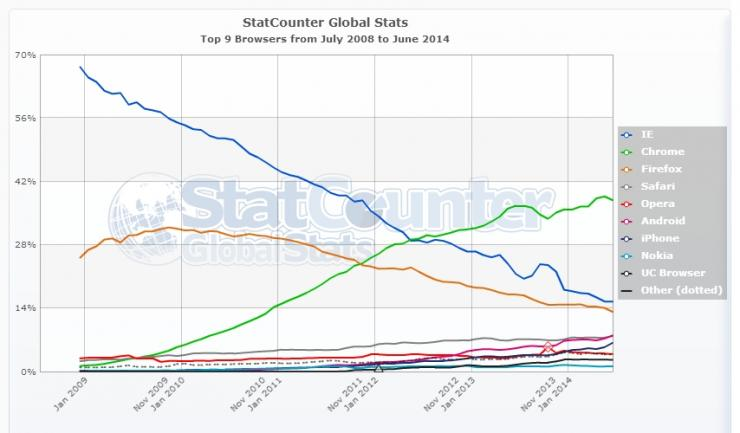

```{r setup, include=FALSE}
options(htmltools.dir.version = FALSE)
knitr::opts_chunk$set(echo=F,
                      message=F,
                      warning=F,
                      fig.retina = 3,
                      fig.align = "center")
library("tidyverse")
library("ggrepel")
library("fontawesome")
xaringanExtra::use_tile_view()
xaringanExtra::use_tachyons()
xaringanExtra::use_freezeframe()

update_geom_defaults("label", list(family = "Fira Sans Condensed"))
update_geom_defaults("text", list(family = "Fira Sans Condensed"))

set.seed(256)

theme_slides <- theme_light() + 
  theme(
    text = element_text(family = "Fira Sans", size = 24)
  )
```


class: inverse, center, middle

# Contestable Markets

---

# Is Monopoly a Nash Equilibrium?

.pull-left[

- Now that we understand Nash equilibrium and the economics of oligopoly...

- Are outcomes of *other* market structures Nash equilibria?

]

.pull-right[

.center[


]
]

---

# Is Monopoly a Nash Equilibrium?

.pull-left[

- Now that we understand Nash equilibrium and the economics of oligopoly...

- Are outcomes of *other* market structures Nash equilibria?

- **Perfect competition**: no firm wants to raise or lower price given the market price $\checkmark$

]

.pull-right[

.center[


]
]

---

# Is Monopoly a Nash Equilibrium?

.pull-left[

- **Monopolist** maximizes $\pi$ by setting $q^*$: $MR=MC$ and $p^*=Demand(q^*)$

- This is *an* equilibrium, but is it the *only* equilibrium?

- We've assumed just a *single* player in the model

- .hi-purple[What about *potential* competition?]

]

.pull-right[

.center[


]
]

---

# Contestable Markets I

.pull-left[

- Model the market as an .hi-purple[entry game], with two players:

1. .hi-red[**Incumbent**] which sets its price $\color{red}{p_I}$

2. .hi-blue[**Entrant**] decides to **stay out** or **enter** the market, setting its price $\color{blue}{p_E}$

- Price competition between 2 firms with similar products $\implies$ .hi-purple[consumers buy only from firm with lower price]

]

.pull-right[

.center[


]
]

---

# Contestable Markets II

.pull-left[
.smallest[
- Suppose both firms have identical costs: 
$$\begin{align*}
C(q)&=cq\\
MC(q)&=c\\ \end{align*}$$

- If .hi-red[Incumbent] sets $\color{red}{p_I}>c$
  - .hi-blue[Entrant] would enter and set $\color{blue}{p_E}=\color{red}{p_I}-\epsilon$<sup>.magenta[†]</sup>
]

]

.pull-right[
.center[

]
]

.footnote[<sup>.magenta[†]</sup> For arbitrary `\\(\epsilon>0\\)`, think `\\(\epsilon =\\)` “one penny”]

---

# Contestable Markets II

.pull-left[
.smallest[
- Suppose both firms have identical costs: 
$$\begin{align*}
C(q)&=cq\\
MC(q)&=c\\ \end{align*}$$

- If .hi-red[Incumbent] sets $\color{red}{p_I}>c$
  - .hi-blue[Entrant] would enter and set $\color{blue}{p_E}=\color{red}{p_I}-\epsilon$<sup>.magenta[†]</sup>
  - .hi-red[Incumbent] foresees this possibility, and wants to lower its price $\color{red}{p_I}<\color{blue}{p_E}$
  - This potential undercutting would continue logically until...

]

]

.pull-right[
.center[

]
]

.footnote[<sup>.magenta[†]</sup> For arbitrary `\\(\epsilon>0\\)`, think `\\(\epsilon =\\)` “one penny”]

---

# Contestable Markets II

.pull-left[

- .hi-purple[Nash Equilibrium]: $\big(\color{red}{p_I}=c$, .blue[Stay Out] $\big)$

- .hi-purple[A market with a single firm, but the **competitive outcome**!]
  - $p^*=MC$, $\color{green}{\pi=0}$
  - competitive $q^*$
  - max .hi-blue[Consumer Surplus], no DWL
]

.pull-right[

```{r, fig.retina=3} 
# Demand function, format: p=d-eq
a<-10
b<-2
f<-5
c<-2

Demand=function(x){a-b*x}
MR=function(x){a-2*b*x}
MC=function(x){c}
AC=function(x){f/x+c}

q_choke=a/b
q_PC<-(a-c)/(b)

CS<-data.frame(x=c(0,0,q_PC),
               y=c(Demand(q_PC),a,Demand(q_PC)))

points<-tribble(
  ~x, ~y, ~lab,
  q_PC, c, "Nash Eq."
)

line_colors <- c("Demand" = "blue", "MR" = "purple", "MC" = "red", "AC" = "orange")
surplus_colors <-c("Consumer" = "blue", "Profit" = "green", "DWL" = "black")

# make plot 

ggplot(data.frame(x=c(0,q_choke)), aes(x=x))+
  
  # curves 
  stat_function(fun=Demand, geom="line", size=2, aes(color="Demand"))+
  stat_function(fun=MR, geom="line", size=2, aes(color="MR"))+
  stat_function(fun=MC, geom="line", size=2, aes(color="MC"))+
  # surpluses
  geom_polygon(data=CS, aes(x=x,y=y, fill="Consumer"), alpha=0.5)+ #CS

  # labels 
  geom_segment(x=q_PC,y=0,xend=q_PC,yend=c,linetype=3)+
  geom_point(data = points,
             aes(x = x, y = y),
             size=4)+ 
  ggrepel::geom_text_repel(data = points,
                           aes(x = x, y = y, label = lab),
                           box.padding = 0.5,
                           seed = 2,
                           nudge_y = 0.75,
                           #nudge_x = 0.5
                           )+
  annotate(geom = "label", x = 4.5, y = Demand(4.5), label = "Demand",
           color = "blue") +
  annotate(geom = "label", x = 2.25, y = MR(2.25), label = "MR",
           color = "purple") +
  annotate(geom = "label", x = 4.5, y = c, label = "MC",
           color = "red") +
  # annotate(geom = "label", x = 1.3, y = 5, label = "Consumer Surplus",
   #        color = "blue") +
  scale_x_continuous(breaks = c(0,q_PC),
                     labels = c(0,expression(q[p=MC])),
                     expand=c(0,0))+
  scale_y_continuous(breaks = c(0,c),
                     labels = c(0,expression(c)),
                     limits = c(0,a),
                     expand=c(0,0))+
  scale_colour_manual("Curves", values = line_colors)+
  scale_fill_manual("Surpluses", values = surplus_colors, guide = guide_legend(override.aes = list(alpha = 0.5)))+
  guides(color = F, fill = F)+
  labs(x = "Quantity (q)",
       y = "Price (p)")+
  theme_classic(base_family = "Fira Sans Condensed", base_size=18)
```
]

---

# Contestable Markets II

.pull-left[

- .hi-green[Case II]: What if the .hi-blue[Entrant] has *higher costs* than the .hi-red[Incumbent]: $\color{blue}{c_E}>\color{red}{c_I}$?
  - Or alternatively, there are **sunk costs** (.red[Incumbent] has already incurred)

]

.pull-right[
]

---

# Contestable Markets II

.pull-left[

- .hi-green[Case II]: What if the .hi-blue[Entrant] has *higher costs* than the .hi-red[Incumbent]: $\color{blue}{c_E}>\color{red}{c_I}$?
  - Or alternatively, there are **sunk costs** (.red[Incumbent] has already incurred)

- .hi-purple[Nash equilibrium]: $\big(\color{red}{p_I}=\color{blue}{p_E-\epsilon}$, .blue[Stay Out] $\big)$

- One firm again, with some inefficiency
  - But not as bad as monopoly!
]

.pull-right[

```{r, fig.retina=3} 
a<-10
b<-2
f<-5
c<-2
d<-4.5
e<-4

Demand=function(x){a-b*x}
MR=function(x){a-2*b*x}
MCi=function(x){c}
MCe=function(x){d}
AC=function(x){f/x+c}

q_choke=a/b
q_PC<-(a-c)/(b)

q_star<-(a-e)/b
q_monopoly<-(a-c)/(2*b)

CS<-data.frame(x=c(0,0,q_star),
               y=c(Demand(q_star),a,Demand(q_star)))
DWL<-data.frame(x=c(q_star,q_star,q_PC),
               y=c(c,e,c))

points2<-tribble(
  ~x, ~y, ~lab,
  q_PC, c, "Comp. Eq.",
  q_monopoly, Demand(q_monopoly), "Monopoly",
  q_star, Demand(q_star), "Nash. Eq."
)

line_colors <- c("Demand" = "blue", "MR" = "purple", "MCi" = "red", "MCe" = "red4")
surplus_colors <-c("Consumer" = "blue", "Profit" = "green", "DWL" = "black")

# make plot 

library("ggplot2")
ggplot(data.frame(x=c(0,q_choke)), aes(x=x))+
  
  # curves 
  stat_function(fun=Demand, geom="line", size=2, aes(color="Demand"))+
  stat_function(fun=MR, geom="line", size=2, aes(color="MR"))+
  stat_function(fun=MCi, geom="line", size=2, aes(color="MCi"))+
  stat_function(fun=MCe, geom="line", size=2, aes(color="MCe"))+
  # surpluses
  geom_polygon(data=CS, aes(x=x,y=y, fill="Consumer"), alpha=0.5)+ #CS
  geom_rect(aes(xmin=0,xmax=q_star,ymin=c,ymax=e,fill="Profit"),alpha=0.25) + # Profits
  geom_polygon(data=DWL, aes(x=x,y=y, fill="DWL"), alpha=0.5)+ #CS
  # labels 
  
  # P.C. point 
  geom_segment(aes(x=q_PC,y=0),xend=q_PC,yend=c,linetype=3)+
  # N.E. point 
  geom_segment(aes(x=q_star,y=0),xend=q_star,yend=e,linetype=3)+
  geom_segment(aes(x=0,y=e),xend=q_star,yend=e,linetype=3)+
  # Monopoly point 
  geom_segment(aes(x=q_monopoly,y=0),xend=q_monopoly,yend=Demand(q_monopoly),linetype=3)+
  geom_segment(aes(x=0,y=Demand(q_monopoly)),xend=q_monopoly,yend=Demand(q_monopoly),linetype=3)+
    geom_point(data = points2,
             aes(x = x, y = y),
             size=4)+ 
  ggrepel::geom_text_repel(data = points2,
                           aes(x = x, y = y, label = lab),
                           box.padding = 0.5,
                           seed = 2,
                           nudge_y = 0.75,
                           #nudge_x = 0.5
                           )+

  annotate(geom = "label", x = 4.5, y = Demand(4.5), label = "Demand",
           color = "blue") +
  annotate(geom = "label", x = 2.25, y = MR(2.25), label = "MR",
           color = "purple") +
  annotate(geom = "label", x = 4.5, y = c, label = expression(c[I]),
           color = "red") +
  annotate(geom = "label", x = 4.5, y = d, label = expression(c[E]),
           color = "red4") +
  #annotate(geom = "label", x = 1.25, y = 6, label = "Consumer Surplus",
  #         color = "blue") +
  #annotate(geom = "label", x = 1.25, y = 3, label = "Profit",
  #         color = "green") +
  #annotate(geom = "label", x = 3.2, y = 3, label = "DWL",
  #         color = "black") +
  scale_x_continuous(breaks = c(0,q_monopoly,q_star,q_PC),
                     labels = c(0,expression(q[m]),expression(q[NE]),expression(q[p=MC])),
                     expand=c(0,0))+
  scale_y_continuous(breaks = c(0,c,d,e,Demand(q_monopoly)),
                     labels = c(0,expression(C[I]),expression(c[E]),expression(p[I]==c[E]-epsilon),expression(p[m])),
                     limits = c(0,a),
                     expand=c(0,0))+
  theme_light()+
  scale_colour_manual("Curves", values = line_colors)+
  scale_fill_manual("Surpluses", values = surplus_colors, guide = guide_legend(override.aes = list(alpha = 0.5)))+
  guides(color = F, fill = F)+
  labs(x = "Quantity (q)",
       y = "Price (p)")+
  theme_classic(base_family = "Fira Sans Condensed", base_size=18)
```
]

---

# Contestable Markets III

.pull-left[

- .hi-green[Case III]: What if there are **fixed costs**, $f$?

$$\begin{align*}
C(q)&=cq+f \\
MC(q)&=c \\
AC(q)&=c+\frac{f}{q} \\
\end{align*}$$

- With high enough $f$, .hi[economies of scale] prevent marginal cost pricing from a being profitable Nash Equilibrium

$$\pi_{p=MC}=-\frac{f}{q}<0$$

]

.pull-right[

```{r, fig.retina=3} 
# Demand function, format: p=d-eq
a<-10
b<-2
f<-5
c<-2

Demand=function(x){a-b*x}
MR=function(x){a-2*b*x}
MC=function(x){c}
AC=function(x){f/x+c}

q_choke<-(a/b)
MR_choke<-(a/(2*b))
q_PC<-(a-c)/(b)

CS<-data.frame(x=c(0,0,q_PC),
               y=c(Demand(q_PC),a,Demand(q_PC)))

line_colors <- c("Demand" = "blue", "MR" = "purple", "MC" = "red", "AC" = "orange")
surplus_colors <-c("Consumer" = "blue", "Loss" = "black", "DWL" = "black")

# make plot 

library("ggplot2")
ggplot(data.frame(x=c(0,q_choke)), aes(x=x))+
  
  # curves 
  stat_function(fun=Demand, geom="line", size=2, aes(color="Demand"))+
  stat_function(fun=MR, geom="line", size=2, aes(color="MR"))+
  stat_function(fun=MC, geom="line", size=2, aes(color="MC"))+
  stat_function(fun=AC, geom="line", size=2, aes(color="AC"))+
  
  # surpluses
  geom_rect(aes(xmin=0,xmax=q_PC,ymin=c,ymax=AC(q_PC),fill="Loss"),alpha=0.25) + # Losses
  
   # labels 
  geom_segment(aes(x=q_PC,y=0),xend=q_PC,yend=c,linetype=3)+
  #geom_point(aes(x=q_PC,y=c), color="black", size=3)+ 
  geom_text(x=q_PC+0.5,y=c,label="P.C.", color="black")+
  annotate(geom = "label", x = 4.5, y = Demand(4.5), label = "Demand",
           color = "blue") +
  annotate(geom = "label", x = 2.25, y = MR(2.25), label = "MR",
           color = "purple") +
  annotate(geom = "label", x = 4.5, y = c, label = "MC",
           color = "red") +
  annotate(geom = "label", x = 4.5, y = AC(d), label = "AC",
           color = "orange") +
  annotate(geom = "label", x = 1.25, y = 2.5, label = "Loss",
           color = "black") +
  scale_x_continuous(breaks = c(0,q_PC),
                     labels = c(0,expression(q[p=MC])),
                     expand=c(0,0))+
  scale_y_continuous(breaks = c(0,c,AC(q_PC)),
                     labels = c(0,expression(c),expression(c+f/q)),
                     limits = c(0,a),
                     expand=c(0,0))+
  theme_light(base_family = "Yanone Kaffeesatz Regular")+
  scale_colour_manual("Curves", values = line_colors)+
  scale_fill_manual("Surpluses", values = surplus_colors, guide = guide_legend(override.aes = list(alpha = 0.5)))+
  labs(x = "Quantity (q)",
       y = "Price (p)")+
  guides(color = F, fill = F)+
  theme_classic(base_family = "Fira Sans Condensed", base_size=18)
```
]

---

# Contestable Markets IV

.pull-left[

- .hi-purple[Nash equilibrium]: $\big(\color{red}{p_I}=AC$, .blue[Stay Out] $\big)$

- Again, only a single firm with some inefficiency
  - But not as bad as monopoly!
  - .red[Incumbent] earns no profits!

]

.pull-right[

```{r, fig.retina=3} 
# Demand function, format: p=d-eq
a<-10
b<-2
f<-5
c<-2

Demand=function(x){a-b*x}
MR=function(x){a-2*b*x}
MC=function(x){c}
AC=function(x){f/x+c}

q_choke<-(a/b)
MR_choke<-(a/(2*b))
q_PC<-(a-c)/(b)
q_AC<-((a-c)+sqrt((a-c)^2-4*b*f))/(2*b) # needed quadratic formula, heh 

CS<-data.frame(x=c(0,0,q_AC),
               y=c(Demand(q_AC),a,Demand(q_AC)))

DWL<-data.frame(x=c(q_AC,q_AC,q_PC),
                        y=c(c,Demand(q_AC),c))

points3<-tribble(
  ~x, ~y, ~lab,
  q_PC, c, "Comp. Eq.",
  q_monopoly, Demand(q_monopoly), "Monopoly",
  q_AC, Demand(q_AC), "Nash. Eq."
)

line_colors <- c("Demand" = "blue", "MR" = "purple", "MC" = "red", "AC" = "orange")
surplus_colors <-c("Consumer" = "blue", "Profit" = "green", "DWL" = "black")

# make plot 
ggplot(data.frame(x=c(0,q_choke)), aes(x=x))+
  
  # curves 
  stat_function(fun=Demand, geom="line", size=2, aes(color="Demand"))+
  stat_function(fun=MR, geom="line", size=2, aes(color="MR"))+
  stat_function(fun=MC, geom="line", size=2, aes(color="MC"))+
  stat_function(fun=AC, geom="line", size=2, aes(color="AC"))+
  
  # surpluses
  geom_polygon(data=CS, aes(x=x,y=y, fill="Consumer"), alpha=0.5)+ #CS
  geom_polygon(data=DWL, aes(x=x,y=y, fill="DWL"), alpha=0.5)+ #DWL
  
   # labels 
  geom_segment(aes(x=q_monopoly,y=0),xend=q_monopoly,yend=Demand(q_monopoly), linetype=3)+
  geom_segment(aes(x=0,y=Demand(q_monopoly)),xend=q_monopoly,yend=Demand(q_monopoly), linetype=3)+

  geom_segment(aes(x=q_PC,y=0),xend=q_PC,yend=c,linetype=3)+
  geom_segment(aes(x=q_AC,y=0),xend=q_AC,yend=Demand(q_AC), linetype=3)+
  geom_segment(aes(x=0,y=Demand(q_AC)),xend=q_AC,yend=Demand(q_AC), linetype=3)+
  annotate(geom = "label", x = 4.5, y = Demand(4.5), label = "Demand",
           color = "blue") +
  annotate(geom = "label", x = 2.25, y = MR(2.25),  label = "MR",
           color = "purple") +
  annotate(geom = "label", x = 4.5, y = c, label = "MC",
           color = "red") +
  annotate(geom = "label", x = 4.5, y = AC(d), label = "AC",
           color = "orange") +

      geom_point(data = points3,
             aes(x = x, y = y),
             size=4)+ 
  ggrepel::geom_text_repel(data = points3,
                           aes(x = x, y = y, label = lab),
                           box.padding = 0.5,
                           seed = 2,
                           nudge_y = 0.75,
                           #nudge_x = 0.5
                           )+
  scale_x_continuous(breaks = c(0,q_monopoly,q_AC,q_PC),
                     labels = c(0,expression(q[m]),expression(q[p=AC]),expression(q[p=MC])),
                     expand=c(0,0))+
  scale_y_continuous(breaks = c(0,c,AC(q_AC),Demand(q_monopoly)),
                     labels = c(0,expression(c),expression(c+f/q), expression(q[m])),
                     limits = c(0,a),
                     expand=c(0,0))+
  scale_colour_manual("Curves", values = line_colors)+
  scale_fill_manual("Surpluses", values = surplus_colors, guide = guide_legend(override.aes = list(alpha = 0.5)))+
  labs(x = "Quantity (q)",
       y = "Price (p)")+
  guides(color = F, fill = F)+
  theme_classic(base_family = "Fira Sans Condensed", base_size=18)
```
]

---

# Contestable Markets: Recap

.pull-left[
- .hi-purple[Markets are **contestable** if]:
  1. There are no barriers to entry or exit
  2. Firms have similar technologies (i.e. similar cost structure)
  3. There are no sunk costs
  
- Economies of scale need not be inconsistent with competitive markets (as is assumed) if they are contestable

- Generalizes "prefect competition" model in more realistic way, also game-theoretic
]

.pull-right[
.center[

]
]

---

# Contestable Markets: Summary

.left-column[

.center[


William Baumol

(1922--2017)

]
]

.right-column[

> "This means that...an incumbent, even if he can threaten retaliation after entry, dare not offer profit-making opportunities to potential entrants because an entering firm can hit and run, gathering in the available profits and departing when the going gets rough." 

]

.source[Baumol, William, J, 1982, "Contestable Markets: An Uprising in the Theory of Industry Structure," *American Economic Review,* 72(1): 1-15]

---
# Implications for Competition

.pull-left[
.center[

]
]

.pull-right[

- Regulation & antitrust (once) focus(ed) on *number* of firms
    - "Count the number of firms, if it's 1, it's a monopoly!"

- .hi-turquoise[Perfect competition as “gold standard”, only market arrangement that is socially efficient]:
  - .hi-purple[Allocatively efficient]: $p=MC$, $DWL=0$
  - .hi-purple[Productively efficient]: $p=AC_{min}$
]

---

# Implications for Competition

.pull-left[
.center[

]
]

.pull-right[

- But number of firms is **endogenous** and **can evolve over time**!
  - Function of how firms mutually interact strategically

- A more **dynamic** situation: firms respond over time

]

---

# Implications for Competition

.pull-left[
.center[

]
]

.pull-right[

- Perfect competition **not** the *only* socially efficient market-structure
  - Market with number of firms (even 1) may be efficient .hi[if it is contestable]

- .hi-purple[Regulation and antitrust should consider whether a market is *contestable*, not just the *number* of firms]
  - Free entry
  - No sunk costs
]

---
# Implications for Competition

.pull-left[
.center[

]
]

.pull-right[

- Firms engaging in egregious monopolistic behavior $(\downarrow q$, $\uparrow p>MC$, $\pi>0$) largely persist because of .hi-purple[barriers to entry]
  - Attempts to make market **uncontestable**

- Business activities or political dealings with the goal to raise $\color{blue}{c_E}>\color{red}{c_I}$
  - Lower your own costs, or raise your rivals'!

]

---

# Monopoly Or Contestable Market?

.center[

]

---

# Contestable Markets

.pull-left[
.center[

]
]

.pull-right[

> "Of far greater concern to Microsoft is the competition from new and emerging technologies, some of which are currently visible and others of which certainly are not. This array of known, emerging, and wholly unknown competitors places enormous pressure on Microsoft to price competitively and innovate aggressively." (Schmalensee 1999)

]

---

# Contestable Markets

.center[

]

---

# Contestable Markets

.center[

]
