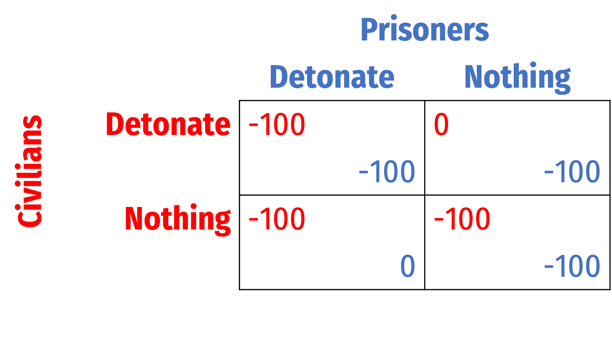
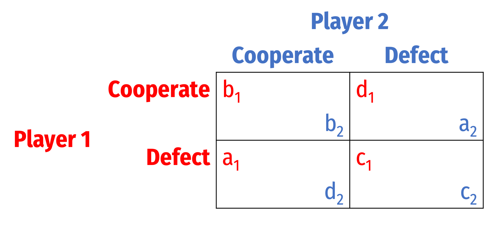
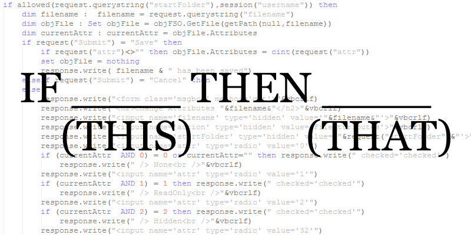

```{r setup, include=FALSE}
options(htmltools.dir.version = FALSE)
knitr::opts_chunk$set(echo=F,
                      message=F,
                      warning=F,
                      fig.retina = 3,
                      fig.align = "center")
library("tidyverse")
library("ggrepel")
library("fontawesome")
xaringanExtra::use_tile_view()
xaringanExtra::use_tachyons()
xaringanExtra::use_freezeframe()

update_geom_defaults("label", list(family = "Fira Sans Condensed"))
update_geom_defaults("text", list(family = "Fira Sans Condensed"))

set.seed(256)

theme_slides <- theme_light() + 
  theme(
    text = element_text(family = "Fira Sans", size = 24)
  )
```

class: inverse

# Outline

### [When Pure Strategies Won't Work](#3)
### [MSNE in Constant Sum Games](#16)
### [Coordination Games: PSNE and MSNE](#67)

---

class: inverse, center, middle

# Prisoners' Dilemma, Reprise

---

# Prisoners' Dilemma, Reprise

.center[
<iframe width="980" height="550" src="https://www.youtube.com/embed/K4GAQtGtd_0" title="YouTube video player" frameborder="0" allow="accelerometer; autoplay; clipboard-write; encrypted-media; gyroscope; picture-in-picture" allowfullscreen></iframe>
]

---

# Prisoners' Dilemma, Reprise

.pull-left[
- Not technically a Prisoners' Dilemma!
  - Game affected by Joker's threat to blow both of them up at midnight if nobody acts
  
- Both players have a *weakly*-dominant strategy to Detonate

- What is/are the Nash equilibrium/equilibria?

]

.pull-right[
.center[

]
]

---

# Prisoners' Dilemma, Reprise

.pull-left[
.smallest[
- A true prisoners' dilemma: 
$$a>b>c>d$$

- Each player's preferences: 
    - 1<sup>st</sup> best: you Defect, they Coop. ("temptation payoff")
    - 2<sup>nd</sup> best: you both Coop.
    - 3<sup>rd</sup> best: you both Defect
    - 4<sup>th</sup> best: you Coop., they Defect ("sucker's payoff")

- Nash equilibrium: (.red[Defect], .blue[Defect])
  - (.red[Coop.], .blue[Coop.]) an unstable Pareto improvement

]
]

.pull-right[
.center[

]
]

---

# Prisoners' Dilemma: How to Sustain Cooperation?

.pull-left[
- We'll stick with these specific payoffs for this lesson

- .hi-purple[How can we sustain cooperation in Prisoners' Dilemma?]

]

.pull-right[
.center[

]
]

---

class: inverse, center, middle

# Repeated Games

---

# Repeated Games: Finite and Infinite

.pull-left[
.smallest[
- Analysis of games can change when players encounter each other *more than once*

- .hi[Repeated games]: the same players play the same game multiple times, two types:

- Players know the *history* of the game with each other

- .hi-purple[Finitely-repeated game]: has a known final round

- .hi-purple[Infinitely-repeated game]: has no (or an unknown) final round

]
]
.pull-right[
.center[

]
]

---

class: inverse, center, middle

# Finitely-Repeated Games

---

# Finitely-Repeated Prisoners' Dilemma

.pull-left[
.smaller[
- Suppose a prisoners' dilemma is played for 2 rounds

- Apply .hi-purple[backwards induction:]
    - What should each player do in the final round?
]
]
.pull-right[
.center[

]
]

---

# Finitely-Repeated Prisoners' Dilemma

.pull-left[
.smaller[
- Suppose a prisoners' dilemma is played for 2 rounds

- Apply .hi-purple[backwards induction:]
    - What should each player do in the final round?
    - Play dominant strategy: **Defect**
    - Knowing each player will Defect in round 2/2, what should they do in round 1?
]
]
.pull-right[
.center[

]
]

---

# Finitely-Repeated Prisoners' Dilemma

.pull-left[
.smaller[
- Suppose a prisoners' dilemma is played for 2 rounds

- Apply .hi-purple[backwards induction:]
    - What should each player do in the final round?
    - Play dominant strategy: **Defect**
    - Knowing each player will Defect in round 2/2, what should they do in round 1?
        - No benefit to playing Cooperate
        - No threat punish Defection!
]
]

.pull-right[
.center[

]
]

---

# Finitely-Repeated Prisoners' Dilemma

.pull-left[
.smaller[
- Suppose a prisoners' dilemma is played for 2 rounds

- Apply .hi-purple[backwards induction:]

- Both **Defect** in round 1 (and round 2)

- No value in cooperation over time!
]
]

.pull-right[
.center[

]
]

---

# Finitely-Repeated Prisoners' Dilemma

.pull-left[
- For any game with a unique PSNE in a one-shot game, as long as there is a known, finite end, Nash equilibrium is the same

]

.pull-right[
.center[

]
]

---

# Finitely-Repeated Prisoners' Dilemma

.pull-left[
- In experimental settings, we tend to see people cooperate in early rounds, but close to the final round (if not the actual final round), defect on each other

]

.pull-right[
.center[

]
]

---

class: inverse, center, middle

# Infinitely-Repeated Games

---

# Infinitely-Repeated Games

.pull-left[
.smaller[
- Finitely-repeated games are interesting, but rare
  - How often do we know for certain when a game/relationship we are in will end? 

- Some predictions for finitely-repeated games don't hold up well in reality
  - Ultimatum game, prisoners' dilemma

- We often play games or are in relationships that are .hi[indefinitely repeated] (have no *known* end), we call them .hi[infinitely-repeated games]

]]

.pull-right[
.center[

]
]

---

# Infinitely-Repeated Games

.pull-left[

- There are two nearly identical interpretations of infinitely repeated games:
  1. Players play *forever*, but discount (payoffs in) the future by a constant factor
  2. Each round the game might end with some constant probability
]

.pull-right[
.center[

]
]

---

# First Intepretation: Discounting the Future

.pull-left[

- Since we are dealing with payoffs in the future, we have to consider players' .hi[time preferences]

- Easiest to consider with monetary payoffs and the .hi[time value of money] that underlies finance

$$PV=\frac{FV}{(1+r)^t}$$

$$FV = PV(1+r)^t$$

]

.pull-right[
.center[

]
]

---

# Present vs. Future Goods

.pull-left[

- .hi-green[Example]: what is the present value of getting $1,000 one year from now at 5% interest?

$$\begin{align*}
PV &= \frac{FV}{(1+r)^n}\\
PV &= \frac{1000}{(1+0.05)^1}\\
PV &= \frac{1000}{1.05}\\
PV &= \$952.38\\ 
\end{align*}$$

]

.pull-right[
```{r}
ggplot(data = tibble(x=1:10), aes(x=x))+
    annotate("segment", x = 1, xend = 0.08, y = 1000, yend = 952.38, colour = "purple", size=2, alpha=1, arrow=arrow(length=unit(0.5,"cm"), ends="last", type="closed"))+
  geom_label(x=0.04,y=952.38,label="V(0)", color = "purple")+
  geom_label(x=1,y=1000,label="V(1)", color = "purple")+
  scale_x_continuous(breaks=seq(0,1,1),
                     limits = c(0,1.5),
                     expand = c(0,0))+
  scale_y_continuous(breaks=seq(0,1200,50),
                     labels = scales::dollar,
                     limits=c(900,1200))+
  coord_cartesian(clip = "off")+
  labs(x = "Time",
       y = "Value",
       title = "Discounting the Future")+
  theme_classic(base_family = "Fira Sans Condensed", base_size =16)

```
]

---

# Present vs. Future Goods

.pull-left[

- .hi-green[Example]: what is the *future* value of $1,000 lent for one year at 5% interest?

$$\begin{align*}
FV &= PV(1+r)^n\\
FV &= 1000(1+0.05)^1\\
FV &= 1000(1.05)\\
FV &= \$1050\\
\end{align*}$$

]

.pull-right[
```{r}
ggplot(data = tibble(x=1:10), aes(x=x))+
    annotate("segment", x = 0, xend = 0.95, y = 1000, yend = 1050, colour = "purple", size=2, alpha=1, arrow=arrow(length=unit(0.5,"cm"), ends="last", type="closed"))+
  geom_label(x=0.04,y=1000,label="V(0)", color = "purple")+
  geom_label(x=1,y=1050,label="V(1)", color = "purple")+
  scale_x_continuous(breaks=seq(0,1,1),
                     limits = c(0,1.5),
                     expand = c(0,0))+
  scale_y_continuous(breaks=seq(0,1200,50),
                     labels = scales::dollar,
                     limits=c(900,1200))+
  coord_cartesian(clip = "off")+
  labs(x = "Time",
       y = "Value",
       title = "Earning Interest")+
  theme_classic(base_family = "Fira Sans Condensed", base_size =16)

```
]

---

# Discounting the Future

.pull-left[
- Suppose a player values $1 now as being equivalent to some amount with interest $1(1+r)$ *one period later*
  - i.e. $1 with an r% interest rate over that period

- The .hi-purple[“discount factor”] is $\delta=\frac{1}{1+r}$, the ratio that future value must be multiplied to equal present value

]

.pull-right[
.center[

]
]

---

# Discounting the Future

.pull-left[
$$\$1 \text{ now} = \delta \, \$1 \text{ later}$$

.smallest[
- If $\delta$ is low $(r$ is high)
  - Players regard future money as worth much less than present money, **very impatient**
  - .hi-green[Example]: $\delta = 0.20$, future money is worth 20% of present money

- If $\delta$ is high $(r$ is low)
  - Players regard future money almost the same as present money, **more patient**
  - .hi-green[Example]: $\delta = 0.80$, future money is worth 80% of present money
]
]

.pull-right[
.center[

]
]

---

# Discounting the Future

.smallest[
.content-box-green[
.hi-green[Example]: Suppose you are indifferent between having $1 today and $1.10 next period
]
]

--

.smallest[
$$\begin{align*}
\$1 \text{ today} &= \delta \$1.10 \text{ next period}\\
\frac{\$1}{\$1.10} & = \delta\\
0.91 &\approx \delta\\
\end{align*}$$

]

--

.smallest[
- There is an implied interest rate of $r=0.10$

- $1 at 10% interest yields $1.10 next period

$$\begin{align*}
\delta &= \frac{1}{1+r}\\
\delta &= \frac{1}{1.10}\ \approx 0.91\\
\end{align*}$$

]

---

# Discounting the Future

- Now consider an infinitely repeated game

--
  - If a player receives payoff $p$ in every future round, the **present value** of this infinite payoff stream is
    
$$p(\delta+\delta^2+\delta^3+ \cdots)$$
  - This is due to compounding interest over time
--

- This infinite sum converges to:

$$\sum_{t=1}^\infty=\frac{p}{1-\delta}$$
- Thus, the present discounted value of receiving $p$ in every future round is $\left(\frac{p}{1-\delta}\right)$

---

# Prisoners' Dilemma, Infinitely Repeated

.pull-left[
- With these payoffs, the value of both **cooperating** forever is $\left(\frac{3}{1-\delta}\right)$
- Value of both **defecting** forever is $\left(\frac{2}{1-\delta}\right)$

]

.pull-right[
.center[

]
]

---

# Alternatively: Game Continues Probabilistically

.pull-left[
- **Alternate interpretation**: game continues with some (commonly known among the players) probability $\theta$ each round

- Assume this probability is independent between rounds (i.e. one round continuing has no influence on the probability of the *next* round continuing, etc)

]

.pull-right[
.center[

]
]

---

# Alternatively: Game Continues Probabilistically

.pull-left[
.smallest[

- Then the probability the game is played $T$ rounds from now is $\theta^T$

- A payoff of $p$ in every future round has a present value of
$$p(\theta+\theta^2+\theta^3+\cdots)= \left(\frac{p}{1-\theta}\right)$$

- This is similar to discounting of future payoffs; equivalent if $\theta=\delta$
]
]

.pull-right[
.center[

]
]

---
# Strategies in Infinitely Repeated Games

.pull-left[

.smallest[
- Recall, a .hi[strategy] is a complete plan of action that describes how you will react under all possible circumstances (i.e. moves by other players)
  - i.e. "if other player plays $x$, I'll play $a$, if they play $y$, I'll play $b$, if, ..., etc"
  - think about it as a(n infinitely-branching) game tree, .hi-turquoise[“what will I do at each node where it is my turn?”]
    
- For an infinitely-repeated game, .hi-turquoise[an infinite number of possible strategies exist!]

- We will examine a specific set of .hi[contingent] or .hi[trigger strategies]
]
]

.pull-right[
.center[



]
]

---

# Trigger Strategies

.pull-left[
.smallest[
- Consider one (the most important) trigger strategy for an infinitely-repeated prisoners' dilemma, the .hi[“Grim Trigger” strategy]:
  - **On round 1**: Cooperate
  - **Every future round:** so long as the history of play has been (Coop, Coop) in every round, play Cooperate. Otherwise, play Defect *forever.*
    
- “**Grim**” trigger strategy leaves no room for forgiveness: one deviation triggers *infinite punishment*, like the sword of Damocles

]
]

.pull-right[
.center[

]
]

---

# Payoffs in Grim Trigger Strategy

.pull-left[
- If you are playing the **Grim Trigger strategy**, consider your opponent's incentives:
    - If you both *Cooperate* forever, you receive an infinite payoff stream of 3 per round

$$3+3\delta+3\delta^2+3\delta^3+\cdots+3\delta^{\infty}=\frac{3}{1-\delta}$$

]

.pull-right[
.center[

]
]

---

# Payoffs in Grim Trigger Strategy

.pull-left[
- This strategy is a Nash equilibrium as long there's no incentive to deviate: 

.smallest[
$$\begin{align*}
\text{Payoff to cooperation} & > \text{Payoff to one-time defection}\\
\frac{3}{1-\delta} & >  4+\frac{2\delta}{1-\delta}\\
\delta & > 0.5\\
\end{align*}$$

]

- If `\\(\delta > 0.5\\)`, then player will cooperate and not defect

]

.pull-right[
.center[

]
]

---

# Payoffs in Grim Trigger Strategy

.pull-left[
- $\delta > 0.5$ is sufficient to sustain cooperation under the grim trigger strategy
    - This is the most extreme strategy with the strongest threat

]

.pull-right[
.center[

]
]

---

# Payoffs in Grim Trigger Strategy

.pull-left[
- Two interpretations of $\delta > 0.5$ as a sufficient condition for cooperation:

1.  $\delta$ as .hi-purple[sufficiently high discount rate]
    - Players are patient enough and care about the future (reputation, etc), will not defect
2.  $\delta$ as .hi-purple[sufficiently high probability of repeat interaction]
    - Players expect to encounter each other again and play future games together

]

.pull-right[
.center[

]
]

---
# Other Trigger Strategies

.pull-left[
.smallest[
- "Grim Trigger" strategy is, well, grim: a single defection causes infinite punishment with no hope of redemption
  - *Very useful* in game theory for understanding the “worst case scenario” or the *bare minimum* needed to sustain cooperation!
  - Empirically, most people aren't playing this strategy in life
  - Social cooperation hangs on by a thread: what if the other player makes a *mistake*? Or *you* mistakenly think they Defected?
- There are “nicer” trigger strategies
]
]

.pull-right[
.center[

]
]

---

# "Nicer" Strategies

.pull-left[
- Consider a .hi["Forgiving Trigger" strategy]:
    - On round 1: Cooperate
    - Every future round: so long as the history of play has been (Coop, Coop) in every round, play Cooperate. Otherwise, play Defect for 3 rounds
        - Punishment, but lasts for 3 rounds, then reverts to Cooperation
]

.pull-right[
.center[

]
]

---

# "Nicer" Strategies

.pull-left[
- Consider the .hi["Tit for Tat" strategy]:
    - On round 1: Cooperate
    - Every future round: Play the strategy that the other player played last round
        - Example: if they Cooperated, play Cooperate; if they Defected, play Defect
]

.pull-right[
.center[

]
]

---

# "Nicer" Strategies

.pull-left[
- Consider the .hi["Tit for 2 Tats" strategy]:
    - On round 1: Cooperate
    - Every future round: Cooperate, unless the other player has played Defect twice, then play Defect
]

.pull-right[
.center[

]
]

---

# *The Evolution of Cooperation*

.left-column[
.center[


.smallest[
Robert Axelrod

1943—
]
]
]

.right-column[
.smallest[
- Research in explaining the **evolution of cooperation**
- Use prisoners' dilemma to describe human societies and evolutionary biology of animal behaviors
- Hosted a series of famous tournaments for experts to submit a strategy to play in an infinitely<sup>.magenta[1]</sup> repeated prisoners' dilemma 

]

.quitesmall[
> “The contestants ranged from a 10-year-old computer hobbyist to professors of computer science, economics, psychology, mathematics, sociology, political science, and evolutionary biology.”

]

.smallest[
- *The Evolution of Cooperation* (1984)
- Among the most cited works in all of political science 
]

.source[<sup>.magenta[1]</sup> Each round had a 0.00346 probability of ending the game, ensuring on average 200 rounds of play

Axelrod, Robert, 1984, *The Evolutioon of Cooperation]

]

---

# *The Evolution of Cooperation*

.left-column[
.center[


.smallest[
Robert Axelrod

1943—
]
]
]

.right-column[
.smallest[
- Axelrod's discussion of successful strategies based on four properties:
  1. **Niceness**: cooperate, never be the first to defect
  2. **Be Provocable**: don't be suckered by being too nice, return defection with defection
  3. **Don't be envious**: focus on maximizing your own score, rather than ensuring your score is higher than your "partner's"
  4. **Don't be too clever**: clarity is essential for others to cooperate with you

- The winning strategy was, famously, **TIT FOR TAT**, submitted by Anatol Rapoport

]
.source[Axelrod, Robert, 1984, *The Evolutioon of Cooperation]
]

---

class: inverse, center, middle

# The Folk Theorem

---

# The Folk Theorem

.pull-left[
- Consider the **average payoff** to each player each round, depending on the strategies chosen
    - e.g. if both Cooperate forever, average payoff is (3,3) — both earn 3 every round

]

.pull-right[
```{r}
points <- tribble(
  ~x, ~y, ~lab,
  1, 4, "(C,D)",
  2, 2, "(D,D)",
  4, 1, "(D,C)",
  3, 3, "(C,C)"
)

p<-ggplot(data = tibble(x = c(0,1)))+
  aes(x = x)+
  geom_point(data = points, aes(x = x, y = y), size = 3)+
  ggrepel::geom_text_repel(data = points, aes(x = x, y = y, label = lab), box.padding = 0.5, seed = 2)+
  scale_x_continuous(breaks = seq(0,5,1),
                     limits = c(0,5.25),
                     expand = c(0,0))+
  scale_y_continuous(breaks = seq(0,5,1),
                     limits = c(0,5.25),
                     expand = c(0,0))+
  labs(x = "Player 1's Average Payoff/Round",
       y = "Player 2's Average Payoff/Round")+
  coord_fixed()+
  theme_light(base_family = "Fira Sans Condensed", base_size = 16)
p
```

]

---

# The Folk Theorem

.pull-left[
- Consider the **average payoff** to each player each round, depending on the strategies chosen
    - e.g. if both Cooperate forever, average payoff is (3,3) — both earn 3 every round
- Consider the .red[set of feasible average payoff]
    - e.g. no way to produce average payoff of (6,6)
    - average payoff of (2.5, 2.5) is possible (players alternate between C and D each round)

]

.pull-right[
```{r}
p+geom_polygon(data = points, aes(x = x, y = y), fill = "red", alpha = 0.5)
```

]

---

# The Folk Theorem

.pull-left[

- .hi[Folk theorem]: any .hi-purple[individually rational] and feasible average payoff can be sustained with sufficiently high $\delta$ (or $\theta)$

- An average payoff is .hi-purple[individually rational] if it is at least as good as the one-shot Nash equilibrium (Defect, Defect), i.e. (2,2) outcome

]

.pull-right[
```{r}
points2 <- tribble(
  ~x, ~y,
  2, 2,
  2, 3.5,
  3, 3,
  3.5, 2
)

p+geom_polygon(data = points2, aes(x = x, y = y), fill = "blue", alpha = 0.7)+
  geom_polygon(data = points, aes(x = x, y = y), fill = "red", alpha = 0.5)
  
```

]

---

# Folk Theorem: Simply Put

.pull-left[
.smallest[
- .hi[Folk theorem (simplified)]: Many strategies can sustain long-run cooperation if:
    - Each player can observe history
    - The value of future interactions must be sufficiently important to players
        - sufficiently high discount rate $\delta$
        - sufficiently high probability of game continuing $\theta$
- If this is true, *many* strategies can sustain long-run cooperation
    - Any in the teal set in the diagram before
    - *Grim trigger* is simply the bare minimum/worst case scenario (and, importantly, easiest to model!)
]
]

.pull-right[
.center[

]
]

---

# Assessing the Folk Theorem

.pull-left[
.smallest[
- **The Good**: cooperation is possible, rational, and efficient!
  - Any improvement above (D,D) is a Pareto improvement for all players
    
- **The Bad**: lack of predictive power
  - Anything goes! Almost *any* outcome can be a sustainable equilibrium
  - This is why game theorists use the grim trigger strategy results as the *bare minimum* sufficient strategy for cooperation
    
- As temptation payoff increases relative to Nash equilibrium, need higher $\delta$ or $\theta$ to sustain cooperation
]
]

.pull-right[
.center[

]
]
