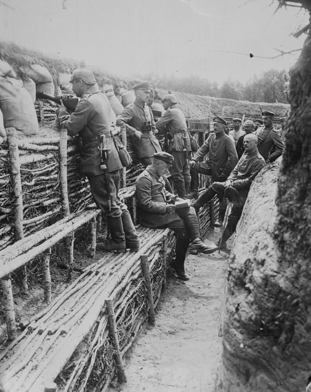
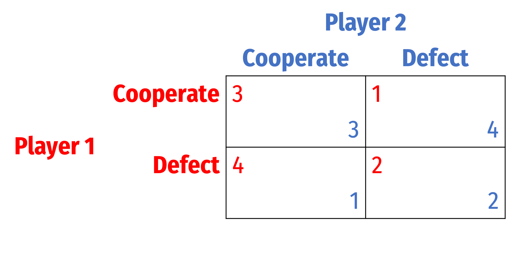
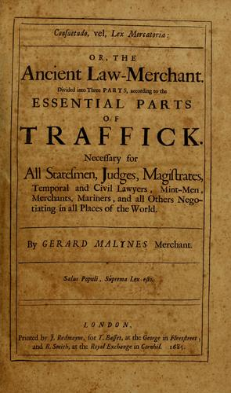
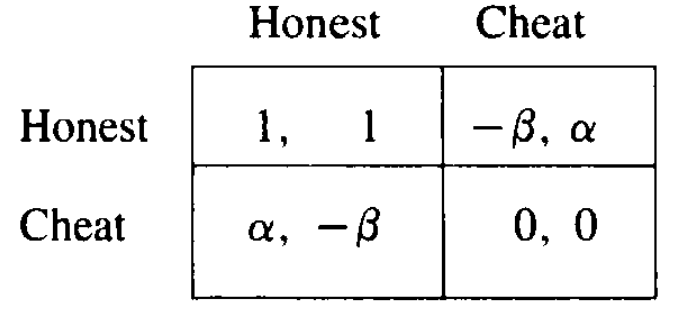

```{r setup, include=FALSE}
options(htmltools.dir.version = FALSE)
knitr::opts_chunk$set(echo=F,
                      message=F,
                      warning=F,
                      fig.retina = 3,
                      fig.align = "center")
library("tidyverse")
library("ggrepel")
library("fontawesome")
xaringanExtra::use_tile_view()
xaringanExtra::use_tachyons()
xaringanExtra::use_freezeframe()

update_geom_defaults("label", list(family = "Fira Sans Condensed"))
update_geom_defaults("text", list(family = "Fira Sans Condensed"))

set.seed(256)

theme_slides <- theme_light() + 
  theme(
    text = element_text(family = "Fira Sans", size = 24)
  )
```

class: inverse

# Outline

### [The Evolution of Cooperation](#3)
### [The Folk Theorem](#6)
### [Interpreting Repeated Games](#12)
### [Application I: Reputation](#67)
### [Application II: Law Merchant & Medieval Trade Fairs](#67)

---

class: inverse, center, middle

# The Evolution of Cooperation

---

# *The Evolution of Cooperation*

.left-column[
.center[


.smallest[
Robert Axelrod

1943—
]
]
]

.right-column[
.smallest[
- Research in explaining the **evolution of cooperation**
- Use prisoners' dilemma to describe human societies and evolutionary biology of animal behaviors
- Hosted a series of famous tournaments for experts to submit a strategy to play in an infinitely<sup>.magenta[1]</sup> repeated prisoners' dilemma 

]

.quitesmall[
> “The contestants ranged from a 10-year-old computer hobbyist to professors of computer science, economics, psychology, mathematics, sociology, political science, and evolutionary biology.”

]

.smallest[
- *The Evolution of Cooperation* (1984)
- Among the most cited works in all of political science 
]

.source[<sup>.magenta[1]</sup> Each round had a 0.00346 probability of ending the game, ensuring on average 200 rounds of play

Axelrod, Robert, 1984, *The Evolutioon of Cooperation]

]

---

# *The Evolution of Cooperation*

.left-column[
.center[


.smallest[
Robert Axelrod

1943—
]
]
]

.right-column[
.smallest[
- Axelrod's discussion of successful strategies based on four properties:
  1. **Niceness**: cooperate, never be the first to defect
  2. **Be Provocable**: don't be suckered by being too nice, return defection with defection
  3. **Don't be envious**: focus on maximizing your own score, rather than ensuring your score is higher than your "partner's"
  4. **Don't be too clever**: clarity is essential for others to cooperate with you

- The winning strategy was, famously, **TIT FOR TAT**, submitted by Anatol Rapoport

]
.source[Axelrod, Robert, 1984, *The Evolutioon of Cooperation]
]

---

class: inverse, center, middle

# The Folk Theorem

---

# The Folk Theorem

.pull-left[
- Consider the **average payoff** to each player each round, depending on the strategies chosen
    - e.g. if both Cooperate forever, average payoff is (3,3) — both earn 3 every round

]

.pull-right[
```{r}
points <- tribble(
  ~x, ~y, ~lab,
  1, 4, "(C,D)",
  2, 2, "(D,D)",
  4, 1, "(D,C)",
  3, 3, "(C,C)"
)

p<-ggplot(data = tibble(x = c(0,1)))+
  aes(x = x)+
  geom_point(data = points, aes(x = x, y = y), size = 3)+
  ggrepel::geom_text_repel(data = points, aes(x = x, y = y, label = lab), box.padding = 0.5, seed = 2)+
  scale_x_continuous(breaks = seq(0,5,1),
                     limits = c(0,5.25),
                     expand = c(0,0))+
  scale_y_continuous(breaks = seq(0,5,1),
                     limits = c(0,5.25),
                     expand = c(0,0))+
  labs(x = "Player 1's Average Payoff/Round",
       y = "Player 2's Average Payoff/Round")+
  coord_fixed()+
  theme_light(base_family = "Fira Sans Condensed", base_size = 16)
p
```

]

---

# The Folk Theorem

.pull-left[
- Consider the **average payoff** to each player each round, depending on the strategies chosen
    - e.g. if both Cooperate forever, average payoff is (3,3) — both earn 3 every round
- Consider the .red[set of feasible average payoff]
    - e.g. no way to produce average payoff of (6,6)
    - average payoff of (2.5, 2.5) is possible (players alternate between C and D each round)

]

.pull-right[
```{r}
p+geom_polygon(data = points, aes(x = x, y = y), fill = "red", alpha = 0.5)
```

]

---

# The Folk Theorem

.pull-left[

- .hi[Folk theorem]: any .hi-purple[individually rational] and feasible average payoff can be sustained with sufficiently high $\delta$ (or $\theta)$

- An average payoff is .hi-purple[individually rational] if it is at least as good as the one-shot Nash equilibrium (Defect, Defect), i.e. (2,2) outcome

]

.pull-right[
```{r}
points2 <- tribble(
  ~x, ~y,
  2, 2,
  2, 3.5,
  3, 3,
  3.5, 2
)

p+geom_polygon(data = points2, aes(x = x, y = y), fill = "blue", alpha = 0.7)+
  geom_polygon(data = points, aes(x = x, y = y), fill = "red", alpha = 0.5)
  
```

]

---

# Folk Theorem: Simply Put

.pull-left[
.smallest[
- .hi[Folk theorem (simplified)]: Many strategies can sustain long-run cooperation if:
    - Each player can observe history
    - The value of future interactions must be sufficiently important to players
        - sufficiently high discount rate $\delta$
        - sufficiently high probability of game continuing $\theta$
- If this is true, *many* strategies can sustain long-run cooperation
    - Any in the teal set in the diagram before
    - *Grim trigger* is simply the bare minimum/worst case scenario (and, importantly, easiest to model!)
]
]

.pull-right[
.center[

]
]

---

# Assessing the Folk Theorem

.pull-left[
.smallest[
- **The Good**: cooperation is possible, rational, and efficient!
  - Any improvement above (D,D) is a Pareto improvement for all players
    
- **The Bad**: lack of predictive power
  - Anything goes! Almost *any* outcome can be a sustainable equilibrium
  - This is why game theorists use the grim trigger strategy results as the *bare minimum* sufficient strategy for cooperation
    
- As temptation payoff increases relative to Nash equilibrium, need higher $\delta$ or $\theta$ to sustain cooperation
]
]

.pull-right[
.center[

]
]

---

class: inverse, center, middle

# Interpreting Repeated Games

---

# Interpreting Repeated Games

.pull-left[
.smallest[
- One-shot game between rational players leads to the predicted result (in PD: mutual defection)

- (Infinitely) repeated games allow us to consider:
  - cooperation
  - altruism
  - trust
  - loyalty and betrayal
  - revenge and vindication
  - promises and threats
  
- These are things that look "irrational" to utility-maximizing *homo economicus*

- People have evolved norms and institutions to enable optimal behavior
]
]

.pull-right[
.center[

]
]

---

# Role of Institutions (and Biology?) I

.pull-left[
.smallest[
- (The bad side of the) Folk theorem shows us that nearly any set of strategies sustains cooperation

- Main role of institutions is to .hi-turquoise[select an equilibrium] for us to coordinate around
  - Importance of fairness and efficiency
  - .hi-purple[Reciprocal altruism]: agent acts against its interest temporarily, in the interest of another, with expectation that other will do the same in the future
  - “You scratch my back, I'll scratch yours”
]
]
.pull-right[
.center[

]
]

---

# Role of Institutions (and Biology?) I

.pull-left[
.smallest[
- Any institution must be a Nash equilibrium in the “game” of life

- In long-run, non Nash-behavior will be eliminated
  - Later, we'll see such behavior is not “evolutionarily stable”

- .hi-purple[Cultural selection theory]: societies whose institutions select fair and efficient outcomes thrive, while others perish
    - Akin to biological natural selection
  
- We'll see more evolutionary biology applications of game theory shortly
]
]
.pull-right[
.center[

]
]

---

# Biological Cooperation: Stickelback Fish

.pull-left[
.smallest[
- When a potential predator appears, one or more sticklebacks approach to check it out

- Costly (dangerous) but provides useful information:
  - If hungry predator: flee
  - Otherwise, stay
    
- Milinski (1987) found these fish use Tit-for-Tat:
  - Two fish swim together towards potential predator
  - "**Cooperate**": move forward
  - "**Defect**": hang back
]

.source[Milinski, M., 1987 "TIT FOR TAT in sticklebacks and the evolution of cooperation," *Nature* 4(325): 433-435]
]

.pull-right[
.center[

]
]

---

# Biological Cooperation: Vampire Bats

.pull-left[
.smallest[
- Vampire bats starve after 60 hours

- Feed each other by regurgitating blood

- Sharing food is great benefit to recipient, great cost to giver

- Wilkinson (1984) provides evidence that bats that receive food are more likely to give food in future

- Bats share beyond simple kin-groups
]

.source[Wilkinson, G, 1984 "Reciprocal Altruism in Bats and Other Mammals," *Ethology and Social Biology* 9(2-4): 85-100]

]

.pull-right[
.center[

]
]

---

# *Human* Social Cooperation

.left-column[
.center[


.smallest[
David Hume

1711—1776
]
]
]

.right-column[

> “Men being naturally selfish, or endowed only with a confined generosity, they are not easily induced to perform any action for the interest of strangers, except with a view to some reciprocal advantage, which they had no hope of obtaining but by such a performance.”

.source[A Treatise on Human Nature} (1740): Book III, Part II, $\S$ V]
]

---

# *Human* Social Cooperation


.left-column[
.center[


Adam Smith

1723-1790
]
]

.right-column[

.smallest[
> "In civilized society [man] stands at all times in need of the cooperation and assistance of great multitudes, while his whole life is scarce sufficient to gain the friendship of a few persons...man has almost constant occasion for the help of his brethren, and .hi[it is in vain for him to expect it from their benevolence only]."

> "Whoever offers to another a bargain of any kind, proposes to do this. .hi[Give me that which I want, and you shall have this which you want]...and it is in this manner that we obtain from one another the far greater part of those good offices which we stand in need of. .hi[It is not from the benevolence of the butcher, the brewer, or the baker, that we expect our dinner, but from their regard to their own interest.] (Book I, Chapter 2).

]
]
.source[Smith, Adam, 1776, [*An Enquiry into the Nature and Causes of the Wealth of Nations*](https://www.econlib.org/library/Smith/smWN.html)]

---

# Cooperation, Even in Extreme Circumstances

.left-column[
.center[

]
]

.right-column[

.smaller[
- Despite mass killing in WWI, peace would occasionally “flare” up across entrenched lines

- .hi-green[Examples]:
  - The hour of 8:00-9:00am was regarded as consecrated to "private business"
  - No shooting during meals
  - No firing artillery at enemy's supply lines

]

.quitesmall[
> “After shooting, a German soldier shouted out 'We are very sorry about that; we hope no one was hurt. It is not our fault, it is that damned Prussian artillery.”

> “A key factor was the realization that if one side would exercise a particular kind of restraint, then the other might reciprocate,” (Axelrod 1984: 78-79)

]
.source[Axelrod, Robert, 1984, *The Evolutioon of Cooperation*, Ch. 4, The Live-and-Let-Live System in Trench Warfare in World War I]
]

---

class: inverse, center, middle

# Application I: Reputation

---

# (In)complete Contracts

.pull-left[
- In economics & contract theory, a .hi[complete contract] specifies all actions or transfers that parties must take under every possible contingency

- In the real world of .hi-purplw[uncertainty], complete contracts are *impossible*

]

.pull-right[
.center[

]
]

---

# Consequences of Incomplete Contracts


.pull-left[

- Agreements are always incomplete contracts, actions for many (unforeseen) contingencies are unspecified

- Even for specified actions and contingencies, outcomes are indeterminate due to .hi-purple[enforcement costs]
  - argument about interpretation
  - slow litigation process, legal fees

- Gives rise to .hi[post-contractual opportunism] (shirking, fraud, renegotiation, hold-up, etc)


]

.pull-right[
.center[

]
]

---

# I Am Altering The Deal...

.center[

<iframe width="980" height="550" src="https://www.youtube.com/embed/qd8hy032uLc" frameborder="0" allow="accelerometer; autoplay; encrypted-media; gyroscope; picture-in-picture" allowfullscreen></iframe>

]

---

# ...Pray I Don't Alter it Any Futher

.center[
<iframe width="980" height="550" src="https://www.youtube.com/embed/OXyH1XkQo44" frameborder="0" allow="accelerometer; autoplay; encrypted-media; gyroscope; picture-in-picture" allowfullscreen></iframe>
]

---

# Asides: I/O & Theory of Firm

.pull-left[
.pull-left[
.center[


.smallest[
[ECON 326 — Industrial Organization](https://ios20.classes.ryansafner.com)
]
]
]
.pull-right[
.center[

.smallest[
[ECON 315 — Economics of the Law](https://laws21.classes.ryansafner.com)
]
]
]
]

.pull-right[
.smallest[
- Research in industrial organization about how .hi-purple[firms solve these problems of transaction costs]
  - **vertical integration** to prevent post-contractual opportunism
  - **contractual restraints** (that look like they create market power but are actually efficient)

- In general .hi-purple[firms are a solution to high transaction cost situations]; .hi-purple[the law] is another
]
]

---

# Using Market Forces to Enforce Contracts: Reputation

> "Since every contingency cannot be cheaply specified in a contract or even known and because legal redress is expensive, transactors will generally also rely on an implicit type of long-term contract that employs a market rather than legal enforcement mechanism, namely, the imposition of a capital loss by the withdrawal of expected future business. This goodwill market-enforcement mechanism undoubtedly is a major element of the contractual alternative to vertical integration," (p.303)

.source[Klein, Benjamin, Robert G Crawford, and Armen A Alchian, 1978, "Vertical Integration, Appropriable Rents, and the Competitive Contracting Process," *Journal of Law and Economics* 21(2): 297-326]

---

# Using Market Forces to Enforce Contracts: Reputation

.smaller[
> "One way in which this market mechanism of contract enforcement may operate is by offering to the potential cheater a future 'premium,' more precisely, a price sufficiently greater than average variable (that is, avoidable) cost to assure a quasi-rent stream that will exceed the potential gain from cheating. The present-discounted value of this future premium stream must be greater than any increase in wealth that could be obtained by the potential cheater if he, in fact, cheated and were terminated. The offer of such a long-term relationship with the potential cheater will eliminate systematic opportunistic behavior," (p.304).

]

.source[Klein, Benjamin, Robert G Crawford, and Armen A Alchian, 1978, "Vertical Integration, Appropriable Rents, and the Competitive Contracting Process," *Journal of Law and Economics* 21(2): 297-326]

---

# Using Market Forces to Enforce Contracts: Reputation

.smaller[

> "The larger the potential one-time 'theft' by cheating (the longer and more costly to detect a violation, enforce the contract, switch suppliers, and so forth) and the shorter the expected continuing business relationship, the higher this premium will be in a nondeceiving equilibrium. This may therefore partially explain both the reliance by firms on long-term implicit contracts with particular suppliers and the existence of reciprocity agreements among firms...The threat of termination of this relationship mutually suppresses opportunistic behavior. The premium stream can be usefully thought of as insurance payments made by the firm to prevent cheating," (pp.304-5)

]
.source[Klein, Benjamin, Robert G Crawford, and Armen A Alchian, 1978, "Vertical Integration, Appropriable Rents, and the Competitive Contracting Process," *Journal of Law and Economics* 21(2): 297-326]

---

# Using Market Forces to Enforce Contracts: Reputation

.pull-left[
- Essentially playing an infinitely repeated Prisoners' Dilemma
  - Cooperate = fulfill contract
  - Defect = don't buy, cheat, renege, hold up, opportunism

]

.pull-right[
.center[

]
]

---

# Using Market Forces to Enforce Contracts: Reputation

.smallest[
> “Any profits are competed away in equilibrium by competitive expenditures on fixed (sunk) assets, such as initial specific investments (for example, a sign) with low or zero salvage value if the firm cheats, necessary to enter and obtain this preferred position of collecting the premium stream. These fixed (sunk) costs of supplying credibility of future performance are repaid or covered by future sales on which a premium is earned. .hi[In equilibrium,the premium stream is then merely a normal rate of return on the 'reputation,' or 'brand-name' capital created by the firm by these initial expenditures.] This brand-name capital, .hi[the value of which is highly specific to contract fulfillment by the firm], is analytically .hi[equivalent to a forfeitable collateral bond put up by the firm which is anticipated to face an opportunity to take advantage of appropriable quasi rents in specialized assets],” (p.306).

]

.source[Klein, Benjamin, Robert G Crawford, and Armen A Alchian, 1978, "Vertical Integration, Appropriable Rents, and the Competitive Contracting Process," *Journal of Law and Economics* 21(2): 297-326]

---

# Using Market Forces to Enforce Contracts: Reputation

.smallest[

> “We can generally say that .hi[the larger the appropriable specialized quasi rents] (and therefore .hi[the larger the potential short-run gain from opportunistic behavior]) and .hi[the larger the premium payments necessary to prevent contractual reneging, the more costly this implicit contractual solution will be]...the lower the appropriable specialized quasi rents, the more likely that transactors will rely on a contractual relationship rather than common ownership. And conversely, .hi[integration by common or joint ownership is more likely], the higher the appropriable specialized quasi rents of the assets involved,” (pp.306-307).

]

.source[Klein, Benjamin, Robert G Crawford, and Armen A Alchian, 1978, "Vertical Integration, Appropriable Rents, and the Competitive Contracting Process," *Journal of Law and Economics* 21(2): 297-326]

---

class: inverse, center, middle

# Application II: Law Merchant & Medieval Trade Fairs

---

# The Revival of International Trade (c.1100)
.center[

]

---

# The Revival of International Trade (c.1100)

.pull-left[
- Commercial Revolution in the 12<sup>th</sup> Century, developments in economy and technology

- Resumption of long distance international trade (not since Roman era) took place in fairs, like the Champagne Fair


]

.pull-right[
.center[

]
]

---


# The Revival of International Trade (c.1100)

.pull-left[
- No established commercial law or State enforcement of contracts

- *International* merchants can’t depend on weak & biased local governments to enforce *international* contracts!

- Transactions at fairs: transfer of goods in exchange for promissory note to be paid *at next fair*
  - Ample room for dishonest merchants to trade
  
]

.pull-right[
.center[

]
]

---

# *Lex Mercatoria*

.pull-left[
.smallest[
- Merchants adopted their own “laws” and best practices to facilitate commerce & minimize transaction costs
  - *Lex Mercatoria*

- For-profit merchant courts emerge to settle disputes and enforce international contracts
  - More efficient, cheaper, and less partisan than Royal courts
  - Legal and jurisdictional competition
  
- Developed contract law and advanced legal instruments — debt, credit, loans, equity contracts
]
]

.pull-right[
.center[

]
]

---

# *Lex Mercatoria*

.pull-left[
- Not part of government, had no official power to enforce judgments!

- Was successful (and foundation of most international and commercial law today), so must have worked
  
]

.pull-right[
.center[

]
]

---

# Reputation Again

.pull-left[

.smaller[
- What prevents a merchant from cheating?
  - Reputation and sanction by other merchants
  - If two specific merchants repeatedly interact, honesty can be sustained by trigger strategies (sufficiently high $\delta$ or $\theta$, etc)

- Then why need a legal system? 
  - Merchants require *information* about other merchants and their histories
  - Role of third party
]
]

.pull-right[
.center[

]
]

---

# Reputation Again

.pull-left[

.smallest[
Milgrom, North, and Weingast (1990) model these interactions as a multi-stage repeated game (p.11):

1. Traders may (at a cost $Q>0$) ask LM (publicly reports whether any trader has any unpaid judgments) about their current partner
2. Two traders play a prisoners' dilemma (**Honest** or **Cheat**)
3. If LM was asked before (in stage 1), either player may **Appeal** outcome to LM at a cost $C>0$
4. If **Appealed**, LM awards damages $(J)$ to Plaintiff if he was Honest and his partner Cheated; otherwise nothing 
5. Defendant chooses to **Pay** $J$ or **Not**
6. Unpaid judgments recorded by LM

]

.source[
Milgrom, Paul R, Douglass C North, and Barry R Weingast, 1990, “The Role of Institutions in the Revival of Trade: The Law Merchant, Private Judges, and the Champagne Fairs,” *Economics and Politics* 2(1): 1-23
]
]

.pull-right[
.center[

]
]

---

# Reputation Again

.pull-left[

- If costs of asking judge are not too high, and if players are sufficiently patient (high enough $\delta$ or $\theta)$, can sustain honest trade

- Merchant courts have strong incentive to be quick and efficient (promotes commerce)
  - State/local courts biased against foreigners, inefficient

.source[
Milgrom, Paul R, Douglass C North, and Barry R Weingast, 1990, “The Role of Institutions in the Revival of Trade: The Law Merchant, Private Judges, and the Champagne Fairs,” *Economics and Politics* 2(1): 1-23
]
]

.pull-right[
.center[

]
]
