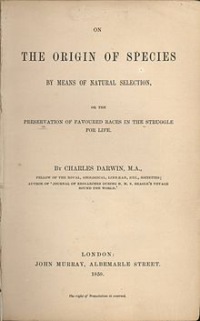
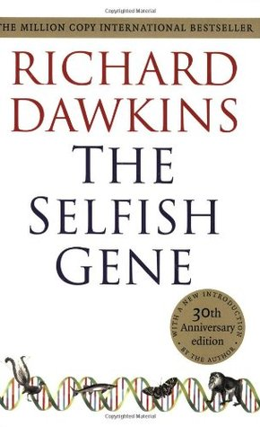
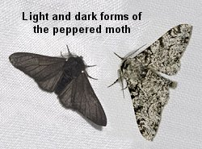
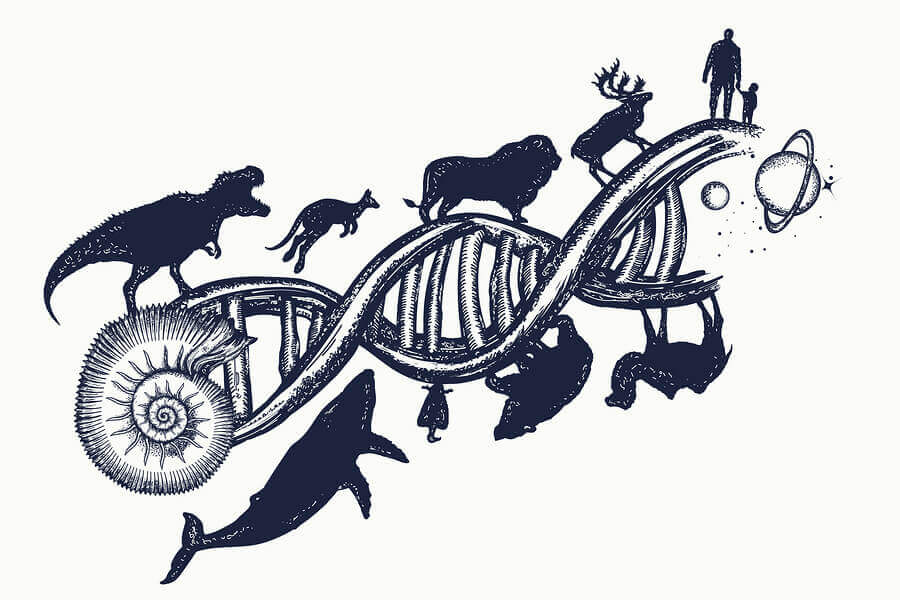
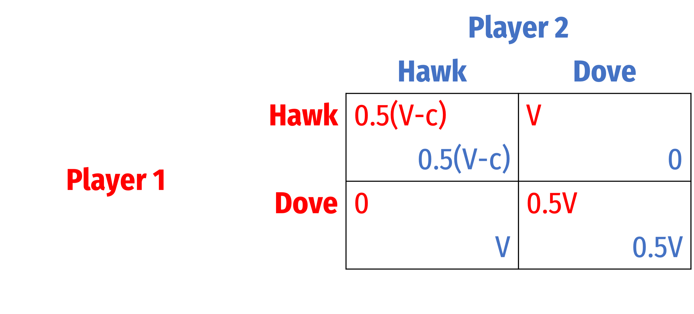
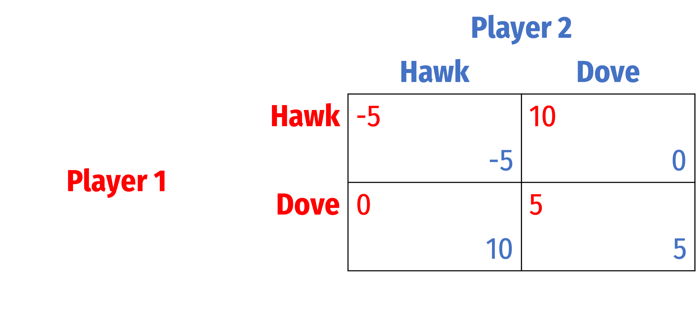
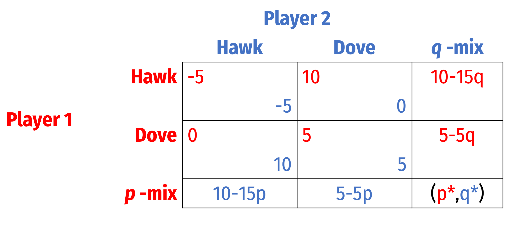
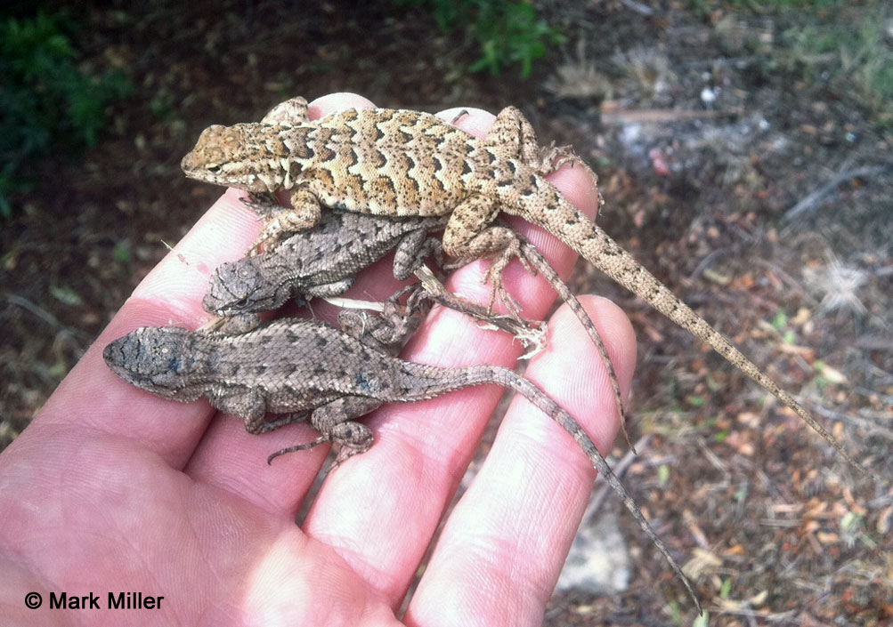
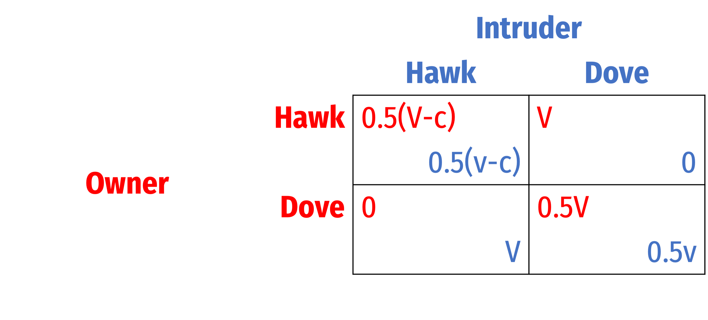

```{r setup, include=FALSE}
options(htmltools.dir.version = FALSE)
knitr::opts_chunk$set(echo=F,
                      message=F,
                      warning=F,
                      fig.retina = 3,
                      fig.align = "center")
library("tidyverse")
library("ggrepel")
library("fontawesome")
xaringanExtra::use_tile_view()
xaringanExtra::use_tachyons()
xaringanExtra::use_freezeframe()

update_geom_defaults("label", list(family = "Fira Sans Condensed"))
update_geom_defaults("text", list(family = "Fira Sans Condensed"))

set.seed(256)

theme_slides <- theme_light() + 
  theme(
    text = element_text(family = "Fira Sans", size = 24)
  )
```

class: inverse

# Outline

### [Evolution, Natural Selection, and Game Theory](#3)
### [Evolutionarily Stable Strategies](#20)
### [The Hawk-Dove Game](#32)
### [Asymmetric Games](#68)

---

class: inverse, center, middle

# Evolution, Natural Selection, and Game Theory


---

# Evolution by Natural Selection

.left-column[
.center[


]
]

.right-column[

- .hi[Evolution]: change over time in one or more inherited traits in populations of individuals

.smallest[
> “[I]f variations useful to any organic being do occur, assuredly individuals thus characterised will have the best chance of being preserved in the struggle for life; and from the strong principle of inheritance they will tend to produce offspring similarly characterised. This principle of preservation, I have called, for the sake of brevity, Natural Selection,” (Ch. 4).

]

.source[Darwin, Charles, 1859, *On the Origin of Species*]

]

---

# Evolution by Natural Selection

.left-column[
.center[


]
]

.right-column[

- .hi[Natural selection]: Darwin’s greatest idea, main mechanism behind biological change, requires:
  1. Variation in organisms
  2. Differential reproduction (“fitness”)
  3. Heredity (replication)

- .hi-purple[Fitness]: how good a replicator is at replicating relative to other types

- “Fitter” traits becomes more common in a population of replicators over time

]

---

# *The Selfish .ul[Gene]*

.left-column[
.center[

]
]

.right-column[
- At first glance, “players” in this game appear to be individual organisms
  - But individuals only live through one life cycle of replication

- In the long run, its really the **strategies themselves** (.hi-purple[phenotypes] — behavioral/traits of an organism) that are in competition over many many generations

- These are expressed in the .hi-purple[genotypes] of organisms

- Assume genes are *selfish* and are the “agent” to model:
  - Objective is to maximize reproductive success 

]

---

# *The Selfish .ul[Gene]*

.pull-left[

1. **Choose:** .hi-purple[ < phenotype (“strategy”) >]

2. **In order to maximize:** .hi-green[< reproductive fitness >]

3. **Subject to:** .hi-red[< environment (including other organisms!) >]

]

.pull-right[
.center[

]
]

---

# Natural Selection: Darwin’s Finches

.pull-left[
- Finches on the Galapagos Islands

- Island experiences draughts

- Finch population evolved deeper, stronger beaks that let them eat tougher seeds

]

.pull-right[
.center[

]
]

---

# Natural Selection: Darwin’s Finches

.pull-left[
- [Peppered moths in 19^th^ century Manchester, England](https://en.wikipedia.org/wiki/Peppered_moth_evolution)

- Both light and dark moths existed

- Soot from the industrial revolution and coal-fired power plants turned many trees black

- Being dark became an advantageous trait to hide from predators

- After 50 years, nearly all moths become black

]

.pull-right[
.center[

]
]

---

# The Need for Evolutionary Game Theory

.left-column[
.center[


.smallest[
John Maynard Smith

1920—2004
]
]
]
.right-column[

> “[If] we want to understand why selection has favoured particular phenotypes [then] the appropriate mathematical tool is optimisation theory. We are faced with the problem of deciding what particular features ... contribute to fitness, but not with the special difficulties which arise when success depends on what others are doing. It is in the latter context that game theory becomes relevant,” (p.1).

.source[Maynard Smith, John, 1982, *Evolution and the Theory of Games*]
]

---

# The Need for Evolutionary Game Theory II


.left-column[
.center[


.smallest[
John Maynard Smith

1920—2004
]
]
]
.right-column[

> “Sensibly enough, a central assumption of classical game theory is that the players will behave rationally, and according to some criterion of self-interest. Such an assumption would clearly be out of place in an evolutionary context. Instead, the criterion of rationality is replaced by that of population dynamics and stability, and the criterion of self-interest by Darwinian fitness,” (p.2).

.source[Maynard Smith, John, 1982, *Evolution and the Theory of Games*]
]

---

# Evolutionary Game Theory

.pull-left[
- Fitness of an individual depends on what others do — strategic interaction
    - These are often “*hard wired*”, not conscious strategies

- This creates an .hi[evolutionary biological game]
  - .hi-purple[Players]: members of a population/species
  - .hi-purple[Strategies]: “phenotype”: traits, behavior, appearance, etc
  - .hi-purple[Payoffs]: fitness

]

.pull-right[
.center[

]
]

---

# Evolutionary Game Theory II

.left-column[
.center[


.smallest[
John Maynard Smith

1920—2004
]
]
]
.right-column[

.smaller[
> “A ‘strategy’ is a behavioural phenotype; i.e. it is a specification ofwhat an individual will do in any situation in which it may find itself,” (p.10).

> “The idea, however, can be applied equally well to any kind of phenotypic variation, and the word strategy could be replaced by the word phenotype; for example, a strategy could be the growth form of a plant, or the age at first reproduction, or the relative numbers of sons and daughters produced by a parent,” (p.10).

]

.source[Maynard Smith, John, 1982, *Evolution and the Theory of Games*]
]

---

# Evolutionary Game Theory III

.pull-left[
.smaller[
- Fitter phenotypes enjoy reproductive success and continue into future generations

- From time to time, random .hi[mutations] occur that create new phenotypes

- If this phenotype is *more fit* than the original, it may successfully .hi-purple[invade] a population and replace it

- Biologists call a population configuration of phenotypes that **cannot** be successfully invaded an .hi[evolutionarily stable strategy (ESS)]
]
]

.pull-right[
.center[

]
]

---


# Evolutionary Game Theory IV

.left-column[
.center[


.smallest[
John Maynard Smith

1920—2004
]
]
]
.right-column[

> “An ESS is a strategy such that, if all the members of a population adopt it, then no mutant strategy could invade the population under the influence of natural selection,” (p.10).


.source[Maynard Smith, John, 1982, *Evolution and the Theory of Games*]
]

---

# Evolutionary Game Theory V

.pull-left[
- Two types of ESS population configurations:

1. .hi-purple[Monomorphic]: every individual plays the same strategy (is same phenotype)
2. .hi-purple[Polymorphic]: different individuals playing different strategies (multiple phenotypes)
  - Akin to populations playing *mixed strategies*
  - Different groups of a population where all individuals in that group play same pure strategy

]

.pull-right[
.center[

]
]

---

# Model and Purpose

.pull-left[

- Main focus is on population dynamics and changes of strategy

- Want to find stable ESS where populations don't change strategies

- Start with large population of organisms (of same species) with same phenotype (strategy)

- *Within*-species evolution: 
  - Strategies and payoffs are the same
  - Symmetric games

]

.pull-right[
.center[

]
]

---

# Model and Purpose II

.pull-left[

- .hi[Heredity]:
  - With high probability $(1-\epsilon)$, each individual adopts parent's strategy
  - With low probability $(\epsilon)$, individual plays another strategy (.hi[mutation])

- Individuals within population are randomly matched to (to play game)

- Payoffs represent (reproductive) fitness

]

.pull-right[
.center[

]
]

---

# Model and Purpose II

.pull-left[

- Strategies with higher fitness spread, those with lower fitness diminish

- Over time, mutations of higher fitness spread and replace those of lower fitness

- .hi[ESS] where a population playing a strategy can not be successfully invaded and replaced by another strategy

]

.pull-right[
.center[

]
]

---

class: inverse, center, middle

# Evolutionarily Stable Strategies

---

# ESS in a Prisoners' Dilemma (Cooperators)

.pull-left[

- Consider first a .hi-turquoise[population of Cooperators]

- Small fraction $\epsilon$ of mutants appear, who **Defect**

- Among the large population, individuals randomly meet and interact
  - Prob. of playing against normal (Cooperator): $1-\epsilon$
  - Prob. of playing against mutant (Defector): $\epsilon$

]

.pull-right[
.center[

]
]

---

# ESS in a Prisoners' Dilemma (Cooperators)

.pull-left[

- We need to calculate the expected payoffs of:
  1. A “normal” individual facing another normal individual with probability $(1-\epsilon)$ and a mutant with probability $\epsilon$
  2. A “mutant” individual facing a normal individual with probability $(1-\epsilon)$ and another mutant with probability $\epsilon$

]

.pull-right[
.center[

]
]

---

# ESS in a Prisoners' Dilemma (Cooperators)

.pull-left[

.smallest[
- Expected payoff to a **normal** (cooperator) type:
$$\begin{align*}E[\color{red}{Cooperate}]&=\color{red}{3}(1-\epsilon)+\color{red}{1}(\epsilon)\\
&=3-2\epsilon\\ \end{align*}$$

]
]

.pull-right[
.center[

]
]

---

# ESS in a Prisoners' Dilemma (Cooperators)

.pull-left[

.smallest[
- Expected payoff to a **normal** (cooperator) type:
$$\begin{align*}E[\color{red}{Cooperate}]&=\color{red}{3}(1-\epsilon)+\color{red}{1}(\epsilon)\\
&=3-2\epsilon\\ \end{align*}$$

- Expected payoff for a **mutant** (defector) type:
$$\begin{align*}E[\color{red}{Defect}]&=\color{red}{4}(1-\epsilon)+\color{red}{2}(\epsilon)\\
&=4-2\epsilon\\ \end{align*}$$

]
]

.pull-right[
.center[

]
]

---

# ESS in a Prisoners' Dilemma (Cooperators)

.pull-left[

.smallest[
- Expected payoff to a **normal** (cooperator) type:
$$\begin{align*}E[\color{red}{Cooperate}]&=\color{red}{3}(1-\epsilon)+\color{red}{1}(\epsilon)\\
&=3-2\epsilon\\ \end{align*}$$

- Expected payoff for a **mutant** (defector) type:
$$\begin{align*}E[\color{red}{Defect}]&=\color{red}{4}(1-\epsilon)+\color{red}{2}(\epsilon)\\
&=4-2\epsilon\\ \end{align*}$$

- Payoff to mutants $>$ payoff to normal types
  - Higher-fitness .hi-purple[mutants (defectors) will successfully invade a population of cooperators]
  
- Therefore, .hi-purple[cooperation is not ESS]
]
]

.pull-right[
.center[

]
]

---

# ESS in a Prisoners' Dilemma (Defectors)

.pull-left[

- Consider next a .hi-turquoise[population of Defectors]

- Small fraction $\epsilon$ of mutants appear, who **Cooperate**

- Among the large population, individuals randomly meet and interact
  - Prob. of playing against normal (Defector): $1-\epsilon$
  - Prob. of playing against mutant (Cooperator): $\epsilon$

]

.pull-right[
.center[

]
]

---

# ESS in a Prisoners' Dilemma (Defectors)

.pull-left[

.smallest[
- Expected payoff to a **normal** (defector) type:
$$\begin{align*}E[\color{red}{Defect}]&=\color{red}{2}(1-\epsilon)+\color{red}{4}(\epsilon)\\
&=2+2\epsilon\\ \end{align*}$$

]
]

.pull-right[
.center[

]
]

---

# ESS in a Prisoners' Dilemma (Defectors)

.pull-left[

.smallest[
- Expected payoff to a **normal** (defector) type:
$$\begin{align*}E[\color{red}{Defect}]&=\color{red}{2}(1-\epsilon)+\color{red}{4}(\epsilon)\\
&=2+2\epsilon\\ \end{align*}$$

- Expected payoff for a **mutant** (cooperator) type:
$$\begin{align*}E[\color{red}{Cooperate}]&=\color{red}{1}(1-\epsilon)+\color{red}{3}(\epsilon)\\
&=1+2\epsilon\\ \end{align*}$$

]
]

.pull-right[
.center[

]
]

---

# ESS in a Prisoners' Dilemma (Defectors)

.pull-left[

.smallest[
- Expected payoff to a **normal** (defector) type:
$$\begin{align*}E[\color{red}{Defect}]&=\color{red}{2}(1-\epsilon)+\color{red}{4}(\epsilon)\\
&=2+2\epsilon\\ \end{align*}$$

- Expected payoff for a **mutant** (cooperator) type:
$$\begin{align*}E[\color{red}{Cooperate}]&=\color{red}{1}(1-\epsilon)+\color{red}{3}(\epsilon)\\
&=1+2\epsilon\\ \end{align*}$$

- Payoff to normal $>$ payoff to mutants types
  - Lower-fitness .hi-purple[mutants (cooperators) cannot successfully invade a population of cooperators]
  
- Therefore, .hi-purple[defect is an ESS]
]
]

.pull-right[
.center[

]
]

---

# ESS in a Prisoners' Dilemma

.pull-left[

.smallest[
- Consider human society as a prisoners' dilemma

- All of us cooperating $\succ$ all of us defecting
  - **Cooperation is not ESS**: a single defector can exploit a world of cooperators
  - **Defection is ESS**: it's dangerous to be the only cooperator in a world of defectors
]
.quitesmall[
> “I can picture in my mind a world without war, a world without hate. And I can picture us attacking that world because they'd never expect it.” — Jack Handey
]

.smallest[
- In *human* social settings, institutions allow us to credibly commit to cooperating
]
]
.pull-right[
.center[

]
]
---

# Implications for Biology and Game Theory

.pull-left[
.smaller[
1. A **dominated** strategy *cannot* be evolutionarily stable
  - e.g. Cooperate in prisoners' dilemma
    
2. Evolution can be *inefficient*
  - e.g. prisoners' dilemma leads to (Defect, Defect) outcome
    
3. If a strategy, $s$ is an ESS, then $(\color{red}{s},\color{blue}{s})$ must be a Nash equilibrium
  - monomorphic equilibria require symmetric $(\color{red}{s},\color{blue}{s})$ ESS Nash equilibria
  - the converse is not true
]
]
.pull-right[
.center[

]
]

---

class: inverse, center, middle

# The Hawk-Dove Game

---

# The Hawk-Dove Game

.pull-left[
- Hawk-dove game is the first example biologists studied

- Game is **not** played by two animals of different species (i.e. an actual hawk and an actual dove)

- Game is played by members of the *same* species playing different **behavioral strategies** (**phenotypes**)

]

.pull-left[
.center[

]
]

---

# The Hawk-Dove Game: General Form

.pull-left[
.quitesmall[
- Two individuals competing over scarce resource: $V$
  - $V \approx$ gain in the animal’s *fitness*

- **“Dove”** strategy is passive, yields entire resource to **“Hawk”**

- **“Hawk”** strategy is aggressive, fights for $V$

- Two **Doves** meeting will share the resource, each getting $0.5V$

- Two **Hawks** meeting will fight
  - Each animal is equally likely to win $(p=0.50)$ and get $V$, or lose and get injured at cost $-c$, expected payoff is $0.5(V-c)$
]
]

.pull-right[
.center[

]
]

---

# The Hawk-Dove Game: If $V>C$

.pull-left[

- Let $V=10$, $c=2$

- **“Hawk”** $\implies$ “Defect”

- **“Dove”** $\implies$ “Cooperate”

- Dominant strategy to play **Hawk**

- What type of game is this? (Look at the payoffs)
]

.pull-right[
.center[

]
]

---

# The Hawk-Dove Game: If $V>C$

.pull-left[

.smallest[
- Is **Hawk** evolutionarily stable?

- Consider a population of **Hawks** who encounter a mutant **Dove** with probability $\epsilon$

]
]

.pull-right[
.center[

]
]

---

# The Hawk-Dove Game: If $V>C$

.pull-left[

.smallest[
- Is **Hawk** evolutionarily stable?

- Consider a population of **Hawks** who encounter a mutant **Dove** with probability $\epsilon$

- Expected payoff for a **normal** (Hawk) type:
$$\begin{align*}E[\color{red}{Hawk}]&=\color{red}{4}(1-\epsilon)+\color{red}{10}(\epsilon)\\
&=4+6\epsilon\\ \end{align*}$$

]
]

.pull-right[
.center[

]
]

---

# The Hawk-Dove Game: If $V>C$

.pull-left[

.smallest[
- Is **Hawk** evolutionarily stable?

- Consider a population of **Hawks** who encounter a mutant **Dove** with probability $\epsilon$

- Expected payoff for a **normal** (Hawk) type:
$$\begin{align*}E[\color{red}{Hawk}]&=\color{red}{4}(1-\epsilon)+\color{red}{10}(\epsilon)\\
&=4+6\epsilon\\ \end{align*}$$

- Expected payoff for a **mutant** (Dove) type:
$$\begin{align*}E[\color{red}{Dove}]&=\color{red}{0}(1-\epsilon)+\color{red}{5}(\epsilon)\\
&=5\epsilon\\ \end{align*}$$

]
]

.pull-right[
.center[

]
]

---

# The Hawk-Dove Game: If $V>C$

.pull-left[

.smallest[
- Is **Hawk** evolutionarily stable?

- Consider a population of **Hawks** who encounter a mutant **Dove** with probability $\epsilon$

- Expected payoff for a **normal** (Hawk) type:
$$\begin{align*}E[\color{red}{Hawk}]&=\color{red}{4}(1-\epsilon)+\color{red}{10}(\epsilon)\\
&=4+6\epsilon\\ \end{align*}$$

- Expected payoff for a **mutant** (Dove) type:
$$\begin{align*}E[\color{red}{Dove}]&=\color{red}{0}(1-\epsilon)+\color{red}{5}(\epsilon)\\
&=5\epsilon\\ \end{align*}$$

- .hi-purple[Hawk is ESS], a monomorphic population (all Hawks)

]
]

.pull-right[
.center[

]
]

---

# The Hawk-Dove Game: If $V>C$

.pull-left[

.smallest[
- Is **Dove** evolutionarily stable?

- Consider a population of **Dove** who encounter a mutant **Hawk** with probability $\epsilon$

]
]

.pull-right[
.center[

]
]

---

# The Hawk-Dove Game: If $V>C$

.pull-left[

.smallest[
- Is **Dove** evolutionarily stable?

- Consider a population of **Dove** who encounter a mutant **Hawk** with probability $\epsilon$

- Expected payoff for a **normal** (Dove) type:
$$\begin{align*}E[\color{red}{Dove}]&=\color{red}{5}(1-\epsilon)+\color{red}{0}(\epsilon)\\
&=5-5\epsilon\\ \end{align*}$$

]
]

.pull-right[
.center[

]
]

---

# The Hawk-Dove Game: If $V>C$

.pull-left[

.smallest[
- Is **Dove** evolutionarily stable?

- Consider a population of **Dove** who encounter a mutant **Hawk** with probability $\epsilon$

- Expected payoff for a **normal** (Dove) type:
$$\begin{align*}E[\color{red}{Dove}]&=\color{red}{5}(1-\epsilon)+\color{red}{0}(\epsilon)\\
&=5-5\epsilon\\ \end{align*}$$

- Expected payoff for a **mutant** (Hawk) type:
$$\begin{align*}E[\color{red}{Dove}]&=\color{red}{10}(1-\epsilon)+\color{red}{4}(\epsilon)\\
&=10-6\epsilon\\ \end{align*}$$

]
]

.pull-right[
.center[

]
]

---

# The Hawk-Dove Game: If $V>C$

.pull-left[

.smallest[
- Is **Dove** evolutionarily stable?

- Consider a population of **Dove** who encounter a mutant **Hawk** with probability $\epsilon$

- Expected payoff for a **normal** (Dove) type:
$$\begin{align*}E[\color{red}{Dove}]&=\color{red}{5}(1-\epsilon)+\color{red}{0}(\epsilon)\\
&=5-5\epsilon\\ \end{align*}$$

- Expected payoff for a **mutant** (Hawk) type:
$$\begin{align*}E[\color{red}{Dove}]&=\color{red}{10}(1-\epsilon)+\color{red}{4}(\epsilon)\\
&=10-6\epsilon\\ \end{align*}$$

- .hi-purple[Dove is not ESS], will be invaded by Hawks!

- This game is a .hi-purple[prisoners' dilemma] (when $V>C)$!

]
]

.pull-right[
.center[

]
]

---

# The Hawk-Dove Game: If $V<C$

.pull-left[

.smallest[
- If $V<C$, the game reduces to a game of chicken!

]
]

.pull-right[
.center[

]
]

---

# The Hawk-Dove Game: If $V<C$

.pull-left[

.smallest[
- If $V<C$, the game reduces to a game of chicken!

- Let $V=10$, $c=20$

- Two .hi-purple[PSNE]: (.red[Dove], .blue[Hawk]), (.red[Hawk], .blue[Dove])

]
]

.pull-right[
.center[

]
]

---

# The Hawk-Dove Game: If $V<C$

.pull-left[

.smallest[
- If $V<C$, the game reduces to a game of chicken!

- Let $V=10$, $c=20$

- Two .hi-purple[PSNE]: (.red[Dove], .blue[Hawk]), (.red[Hawk], .blue[Dove])

- .hi-purple[MSNE]:
]
]

.pull-right[
.center[

]
]

---

# The Hawk-Dove Game: If $V<C$

.pull-left[

.smallest[
- If $V<C$, the game reduces to a game of chicken!

- Let $V=10$, $c=20$

- Two .hi-purple[PSNE]: (.red[Dove], .blue[Hawk]), (.red[Hawk], .blue[Dove])

- .hi-purple[MSNE]: $(p,q)=\left(\frac{V}{C}, \frac{V}{C}\right)$, in this case (0.50, 0.50)
]
]

.pull-right[
.center[

]
]

---

# The Hawk-Dove Game: If $V<C$

.pull-left[

.smallest[
- Is **Hawk** evolutionarily stable?

- Consider a population of **Hawks** who encounter a mutant **Dove** with probability $\epsilon$
]
]

.pull-right[
.center[

]
]

---

# The Hawk-Dove Game: If $V<C$

.pull-left[

.smallest[
- Is **Hawk** evolutionarily stable?

- Consider a population of **Hawks** who encounter a mutant **Dove** with probability $\epsilon$

- Expected payoff for a **normal** (Hawk) type:
$$\begin{align*}E[\color{red}{Hawk}]&=\color{red}{-5}(1-\epsilon)+\color{red}{10}(\epsilon)\\
&=15\epsilon-5\\ \end{align*}$$
]
]


.pull-right[
.center[

]
]

---

# The Hawk-Dove Game: If $V<C$

.pull-left[

.smallest[
- Is **Hawk** evolutionarily stable?

- Consider a population of **Hawks** who encounter a mutant **Dove** with probability $\epsilon$

- Expected payoff for a **normal** (Hawk) type:
$$\begin{align*}E[\color{red}{Hawk}]&=\color{red}{-5}(1-\epsilon)+\color{red}{10}(\epsilon)\\
&=15\epsilon-5\\ \end{align*}$$

- Expected payoff for a **mutant** (Dove) type:
$$\begin{align*}E[\color{red}{Dove}]&=\color{red}{0}(1-\epsilon)+\color{red}{5}(\epsilon)\\
&=5\epsilon\\ \end{align*}$$
]
]


.pull-right[
.center[

]
]

---

# The Hawk-Dove Game: If $V<C$

.pull-left[

.smallest[
- Is **Hawk** evolutionarily stable?

- Consider a population of **Hawks** who encounter a mutant **Dove** with probability $\epsilon$

- Expected payoff for a **normal** (Hawk) type:
$$\begin{align*}E[\color{red}{Hawk}]&=\color{red}{-5}(1-\epsilon)+\color{red}{10}(\epsilon)\\
&=15\epsilon-5\\ \end{align*}$$

- Expected payoff for a **mutant** (Dove) type:
$$\begin{align*}E[\color{red}{Dove}]&=\color{red}{0}(1-\epsilon)+\color{red}{5}(\epsilon)\\
&=5\epsilon\\ \end{align*}$$

- Payoff to mutant $>$ payoff to normal 

- .hi-purple[Hawk is not ESS], will be invaded by Doves!

]
]

.pull-right[
.center[

]
]

---

# The Hawk-Dove Game: If $V<C$

.pull-left[

.smallest[
- Is **Dove** evolutionarily stable?

- Consider a population of **Doves** who encounter a mutant **Hawk** with probability $\epsilon$
]
]

.pull-right[
.center[

]
]

---

# The Hawk-Dove Game: If $V<C$

.pull-left[

.smallest[
- Is **Dove** evolutionarily stable?

- Consider a population of **Doves** who encounter a mutant **Hawk** with probability $\epsilon$

- Expected payoff for a **normal** (Dove) type:
$$\begin{align*}E[\color{red}{Dove}]&=\color{red}{5}(1-\epsilon)+\color{red}{0}(\epsilon)\\
&=5-5\epsilon\\ \end{align*}$$

]
]

.pull-right[
.center[

]
]

---

# The Hawk-Dove Game: If $V<C$

.pull-left[

.smallest[
- Is **Dove** evolutionarily stable?

- Consider a population of **Doves** who encounter a mutant **Hawk** with probability $\epsilon$

- Expected payoff for a **normal** (Dove) type:
$$\begin{align*}E[\color{red}{Dove}]&=\color{red}{5}(1-\epsilon)+\color{red}{0}(\epsilon)\\
&=5-5\epsilon\\ \end{align*}$$

- Expected payoff for a **mutant** (Hawk) type:
$$\begin{align*}E[\color{red}{Hawk}]&=\color{red}{10}(1-\epsilon)+\color{red}{-5}(\epsilon)\\
&=10-15\epsilon\\ \end{align*}$$

]
]

.pull-right[
.center[

]
]

---

# The Hawk-Dove Game: If $V<C$

.pull-left[

.smallest[
- Is **Dove** evolutionarily stable?

- Consider a population of **Doves** who encounter a mutant **Hawk** with probability $\epsilon$

- Expected payoff for a **normal** (Dove) type:
$$\begin{align*}E[\color{red}{Dove}]&=\color{red}{5}(1-\epsilon)+\color{red}{0}(\epsilon)\\
&=5-5\epsilon\\ \end{align*}$$

- Expected payoff for a **mutant** (Hawk) type:
$$\begin{align*}E[\color{red}{Hawk}]&=\color{red}{10}(1-\epsilon)+\color{red}{-5}(\epsilon)\\
&=10-15\epsilon\\ \end{align*}$$

- Payoff to mutant $>$ payoff to normal 

- .hi-purple[Dove is not ESS], will be invaded by Hawks!

]
]

.pull-right[
.center[

]
]

---

# The Hawk-Dove Game: If $V<C$

.pull-left[
.smallest[
- When $V<C$ (Chicken), neither **Hawk** nor **Dove** is evolutionarily stable!

- No .hi-purple[monomorphic] population is possible

- This is because neither (.red[Hawk], .blue[Hawk]) or (.red[Dove], .blue[Dove]) are PSNE!
  - Again: if strategy $s$ is ESS, then $(\color{red}{s},\color{blue}{s})$ must be a PSNE!

- There is a *better* response against a Hawk (or Dove) than Hawk (or Dove) itself!
  - A monomorphic population of Hawks (or Doves) can always be invaded!
]
]

.pull-right[
.center[

]
]

---

# The Hawk-Dove Game: Polymorphic Populations

.pull-left[
.smallest[
- We must have a .hi-purple[polymorphic] population

- Suppose some fraction of the population, $p$, are Hawks
]
]
.pull-right[
```{r}
ggplot(data = tibble(x = c(0,1)))+
  aes(x = x)+
  scale_x_continuous(breaks = seq(0,1,0.1),
                     limits = c(0,1.05),
                     expand = c(0,0))+
  scale_y_continuous(breaks = seq(0,10,1),
                     limits = c(0,10.5),
                     expand = c(0,0))+
  labs(x = "Proportion of Hawks, p",
       y = "Fitness")+
  theme_light(base_family = "Fira Sans Condensed", base_size = 20)
```
]

---

# The Hawk-Dove Game: Polymorphic Populations

.pull-left[
.smallest[
- We must have a .hi-purple[polymorphic] population

- Suppose some fraction of the population, $p$, are Hawks
  - Expected payoff of a Hawk (i.e. mixed strategy)
  
$$E[\color{red}{Hawk}] = \color{red}{-5}p+\color{red}{10}(1-p)=\color{#FFA500}{10-15p}$$
]
]
.pull-right[
```{r}
hawk <- function(p){10-15*p}

ggplot(data = tibble(x = c(0,1)))+
  aes(x = x)+
  stat_function(fun = hawk, geom = "line", size = 2, color = "#FFA500")+
  geom_label(x = 0.1, y = hawk(0.1), label = "Payoff to Hawk", color = "#FFA500")+
  scale_x_continuous(breaks = seq(0,1,0.1),
                     limits = c(0,1.05),
                     expand = c(0,0))+
  scale_y_continuous(breaks = seq(0,10,1),
                     limits = c(0,10.5),
                     expand = c(0,0))+
  labs(x = "Proportion of Hawks, p",
       y = "Fitness")+
  theme_light(base_family = "Fira Sans Condensed", base_size = 20)
```
]

---

# The Hawk-Dove Game: Polymorphic Populations

.pull-left[
.smallest[
- We must have a .hi-purple[polymorphic] population

- Suppose some fraction of the population, $p$, are Hawks
  - Expected payoff of a Hawk (i.e. mixed strategy)
  
$$E[\color{red}{Hawk}] = \color{red}{-5}p+\color{red}{10}(1-p)=\color{#FFA500}{10-15p}$$
- Suppose some fraction of the population, $1-p$, are Doves
  - Expected payoff of a Dove (i.e. mixed strategy)

$$E[\color{red}{Dove}] = \color{red}{0}p+\color{red}{5}(1-p)=\color{#047806}{5-5p}$$

]
]

.pull-right[
```{r}
dove <- function(p){5-5*p}

ggplot(data = tibble(x = c(0,1)))+
  aes(x = x)+
  stat_function(fun = hawk, geom = "line", size = 2, color = "#FFA500")+
  geom_label(x = 0.1, y = hawk(0.1), label = "Payoff to Hawk", color = "#FFA500")+
  stat_function(fun = dove, geom = "line", size = 2, color = "#047806")+
  geom_label(x = 0.1, y = dove(0.1), label = "Payoff to Dove", color = "#047806")+
  
  scale_x_continuous(breaks = seq(0,1,0.1),
                     limits = c(0,1.05),
                     expand = c(0,0))+
  scale_y_continuous(breaks = seq(0,10,1),
                     limits = c(0,10.5),
                     expand = c(0,0))+
  labs(x = "Proportion of Hawks, p",
       y = "Fitness")+
  theme_light(base_family = "Fira Sans Condensed", base_size = 20)
```

]

---

# The Hawk-Dove Game: Polymorphic Populations

.pull-left[
.smallest[
- We must have a .hi-purple[polymorphic] population

- If $\color{#FFA500}{\underbrace{10-15p}_{E[Hawk]}} > \color{#047806}{\underbrace{5-5p}_{E[Dove]}}$, Hawks can invade
]
]

.pull-right[
```{r}
hawks_triangle <- tribble(
  ~x, ~y,
  0, 5,
  0, 10,
  0.5, 2.5
)
ggplot(data = tibble(x = c(0,1)))+
  aes(x = x)+
  geom_polygon(data = hawks_triangle, aes(x = x, y = y), fill ="#FFA500", alpha = 0.5)+
  stat_function(fun = hawk, geom = "line", size = 2, color = "#FFA500")+
  geom_label(x = 0.1, y = hawk(0.1), label = "Payoff to Hawk", color = "#FFA500")+
  stat_function(fun = dove, geom = "line", size = 2, color = "#047806")+
  geom_label(x = 0.1, y = dove(0.1), label = "Payoff to Dove", color = "#047806")+
  annotate("segment", x = 0.1, xend = 0.4, y = 2, yend = 2, color = "#FFA500", size=2, alpha=1, arrow=arrow(length=unit(0.5,"cm"), ends="last", type="closed"))+
  geom_label(x = 0.25, y = 2, label = "Hawks invade", color = "#FFA500")+
  scale_x_continuous(breaks = seq(0,1,0.1),
                     limits = c(0,1.05),
                     expand = c(0,0))+
  scale_y_continuous(breaks = seq(0,10,1),
                     limits = c(0,10.5),
                     expand = c(0,0))+
  labs(x = "Proportion of Hawks, p",
       y = "Fitness")+
  theme_light(base_family = "Fira Sans Condensed", base_size = 20)
```

]

---

# The Hawk-Dove Game: Polymorphic Populations

.pull-left[
.smallest[
- We must have a .hi-purple[polymorphic] population

- If $\color{#FFA500}{\underbrace{10-15p}_{E[Hawk]}} > \color{#047806}{\underbrace{5-5p}_{E[Dove]}}$, Hawks can invade

- If $\color{#FFA500}{\underbrace{10-15p}_{E[Hawk]}} < \color{#047806}{\underbrace{5-5p}_{E[Dove]}}$, Doves can invade

]
]

.pull-right[
```{r}
doves_triangle <- tribble(
  ~x, ~y,
  1, 0,
  0.667, 0,
  0.5, 2.5
)
ggplot(data = tibble(x = c(0,1)))+
  aes(x = x)+
  geom_polygon(data = hawks_triangle, aes(x = x, y = y), fill ="#FFA500", alpha = 0.5)+
  geom_polygon(data = doves_triangle, aes(x = x, y = y), fill ="#047806", alpha = 0.5)+
  stat_function(fun = hawk, geom = "line", size = 2, color = "#FFA500")+
  geom_label(x = 0.1, y = hawk(0.1), label = "Payoff to Hawk", color = "#FFA500")+
  stat_function(fun = dove, geom = "line", size = 2, color = "#047806")+
  geom_label(x = 0.1, y = dove(0.1), label = "Payoff to Dove", color = "#047806")+
  annotate("segment", x = 0.1, xend = 0.4, y = 2, yend = 2, color = "#FFA500", size=2, alpha=1, arrow=arrow(length=unit(0.5,"cm"), ends="last", type="closed"))+
  geom_label(x = 0.25, y = 2, label = "Hawks invade", color = "#FFA500")+
  
    annotate("segment", x = 1, xend = 0.75, y = 2, yend = 2, color = "#047806", size=2, alpha=1, arrow=arrow(length=unit(0.5,"cm"), ends="last", type="closed"))+
  geom_label(x = 0.9, y = 2, label = "Doves invade", color = "#047806")+

  scale_x_continuous(breaks = seq(0,1,0.1),
                     limits = c(0,1.05),
                     expand = c(0,0))+
  scale_y_continuous(breaks = seq(0,10,1),
                     limits = c(0,10.5),
                     expand = c(0,0))+
  labs(x = "Proportion of Hawks, p",
       y = "Fitness")+
  theme_light(base_family = "Fira Sans Condensed", base_size = 20)
```

]

---

# The Hawk-Dove Game: Polymorphic Populations

.pull-left[
.smallest[
- We must have a .hi-purple[polymorphic] population

- If $\color{#FFA500}{\underbrace{10-15p}_{E[Hawk]}} > \color{#047806}{\underbrace{5-5p}_{E[Dove]}}$, Hawks can invade

- If $\color{#FFA500}{\underbrace{10-15p}_{E[Hawk]}} < \color{#047806}{\underbrace{5-5p}_{E[Dove]}}$, Doves can invade

- Stable only if $\color{#FFA500}{\underbrace{10-15p}_{E[Hawk]}} = \color{#047806}{\underbrace{5-5p}_{E[Dove]}}$
  - $p^\star = 0.50$
]
]

.pull-right[
```{r}
doves_triangle <- tribble(
  ~x, ~y,
  1, 0,
  0.667, 0,
  0.5, 2.5
)
ggplot(data = tibble(x = c(0,1)))+
  aes(x = x)+
  geom_polygon(data = hawks_triangle, aes(x = x, y = y), fill ="#FFA500", alpha = 0.5)+
  geom_polygon(data = doves_triangle, aes(x = x, y = y), fill ="#047806", alpha = 0.5)+
  stat_function(fun = hawk, geom = "line", size = 2, color = "#FFA500")+
  geom_label(x = 0.1, y = hawk(0.1), label = "Payoff to Hawk", color = "#FFA500")+
  stat_function(fun = dove, geom = "line", size = 2, color = "#047806")+
  geom_label(x = 0.1, y = dove(0.1), label = "Payoff to Dove", color = "#047806")+
  annotate("segment", x = 0.1, xend = 0.4, y = 2, yend = 2, color = "#FFA500", size=2, alpha=1, arrow=arrow(length=unit(0.5,"cm"), ends="last", type="closed"))+
  geom_label(x = 0.25, y = 2, label = "Hawks invade", color = "#FFA500")+
  
    annotate("segment", x = 1, xend = 0.75, y = 2, yend = 2, color = "#047806", size=2, alpha=1, arrow=arrow(length=unit(0.5,"cm"), ends="last", type="closed"))+
  geom_label(x = 0.9, y = 2, label = "Doves invade", color = "#047806")+
  geom_segment(x = 0, xend = 0.5, y = 2.5, yend = 2.5, size = 1, linetype = "dotted")+
  geom_segment(x = 0.5, xend = 0.5, y = 2.5, yend = 0, size = 1, linetype = "dotted")+
  scale_x_continuous(breaks = seq(0,1,0.1),
                     limits = c(0,1.05),
                     expand = c(0,0))+
  scale_y_continuous(breaks = seq(0,10,1),
                     limits = c(0,10.5),
                     expand = c(0,0))+
  labs(x = "Proportion of Hawks, p",
       y = "Fitness")+
  theme_light(base_family = "Fira Sans Condensed", base_size = 20)
```

]

---

# The Hawk-Dove Game: Polymorphic Populations

.pull-left[
.smallest[
- We have a .hi-purple[polymorphic] population of 50% Hawks and 50% Doves

- This is the same as the MSNE with $p=0.50, q = 0.50$

- In general, $p, q = \frac{V}{c}$
  - i.e. we had $V = 10, c = 20$

]
]

.pull-right[
```{r}
doves_triangle <- tribble(
  ~x, ~y,
  1, 0,
  0.667, 0,
  0.5, 2.5
)
ggplot(data = tibble(x = c(0,1)))+
  aes(x = x)+
  geom_polygon(data = hawks_triangle, aes(x = x, y = y), fill ="#FFA500", alpha = 0.5)+
  geom_polygon(data = doves_triangle, aes(x = x, y = y), fill ="#047806", alpha = 0.5)+
  stat_function(fun = hawk, geom = "line", size = 2, color = "#FFA500")+
  geom_label(x = 0.1, y = hawk(0.1), label = "Payoff to Hawk", color = "#FFA500")+
  stat_function(fun = dove, geom = "line", size = 2, color = "#047806")+
  geom_label(x = 0.1, y = dove(0.1), label = "Payoff to Dove", color = "#047806")+
  annotate("segment", x = 0.1, xend = 0.4, y = 2, yend = 2, color = "#FFA500", size=2, alpha=1, arrow=arrow(length=unit(0.5,"cm"), ends="last", type="closed"))+
  geom_label(x = 0.25, y = 2, label = "Hawks invade", color = "#FFA500")+
  
    annotate("segment", x = 1, xend = 0.75, y = 2, yend = 2, color = "#047806", size=2, alpha=1, arrow=arrow(length=unit(0.5,"cm"), ends="last", type="closed"))+
  geom_label(x = 0.9, y = 2, label = "Doves invade", color = "#047806")+
  geom_segment(x = 0, xend = 0.5, y = 2.5, yend = 2.5, size = 1, linetype = "dotted")+
  geom_segment(x = 0.5, xend = 0.5, y = 2.5, yend = 0, size = 1, linetype = "dotted")+
  scale_x_continuous(breaks = seq(0,1,0.1),
                     limits = c(0,1.05),
                     expand = c(0,0))+
  scale_y_continuous(breaks = seq(0,10,1),
                     limits = c(0,10.5),
                     expand = c(0,0))+
  labs(x = "Proportion of Hawks, p",
       y = "Fitness")+
  theme_light(base_family = "Fira Sans Condensed", base_size = 20)
```

]

---

# The Hawk-Dove Game: Polymorphic Populations

.pull-left[
.smallest[
- We have a .hi-purple[polymorphic] population of 50% Hawks and 50% Doves

- This is the same as the MSNE with $p=0.50, q = 0.50$

- In general, $p, q = \frac{V}{c}$
  - i.e. we had $V = 10, c = 20$

- What about $V = 10, c = 15$?
  - ESS: $\frac{2}{3}$ Hawks, $\frac{1}{3}$ Doves
  - As $\downarrow c$ or $\uparrow V$, more Hawks (better reward to fighting), and vice versa!

]
]

.pull-right[
```{r}
hawk_2<-function(p){10-12.5*p}
hawks_triangle2 <-tribble(
  ~x, ~y,
  0,5,
  0,10,
  0.667, hawk_2(0.667)
  
)
doves_triangle2 <- tribble(
  ~x, ~y,
  1, 0,
  0.8, 0,
  0.667, hawk_2(0.667)
)
ggplot(data = tibble(x = c(0,1)))+
  aes(x = x)+
  geom_polygon(data = hawks_triangle2, aes(x = x, y = y), fill ="#FFA500", alpha = 0.5)+
  geom_polygon(data = doves_triangle2, aes(x = x, y = y), fill ="#047806", alpha = 0.5)+
  stat_function(fun = hawk_2, geom = "line", size = 2, color = "#FFA500")+
  geom_label(x = 0.1, y = hawk(0.1), label = "Payoff to Hawk", color = "#FFA500")+
  stat_function(fun = dove, geom = "line", size = 2, color = "#047806")+
  geom_label(x = 0.1, y = dove(0.1), label = "Payoff to Dove", color = "#047806")+
  annotate("segment", x = 0.1, xend = 0.4, y = 2, yend = 2, color = "#FFA500", size=2, alpha=1, arrow=arrow(length=unit(0.5,"cm"), ends="last", type="closed"))+
  geom_label(x = 0.25, y = 2, label = "Hawks invade", color = "#FFA500")+
  
    annotate("segment", x = 1, xend = 0.75, y = 2, yend = 2, color = "#047806", size=2, alpha=1, arrow=arrow(length=unit(0.5,"cm"), ends="last", type="closed"))+
  geom_label(x = 0.9, y = 2, label = "Doves invade", color = "#047806")+
  geom_segment(x = 0, xend = 0.667, y = hawk_2(0.667), yend = hawk_2(0.667), size = 1, linetype = "dotted")+
  geom_segment(x = 0.667, xend = 0.667, y = hawk_2(0.667), yend = 0, size = 1, linetype = "dotted")+
  scale_x_continuous(breaks = seq(0,1,0.1),
                     limits = c(0,1.05),
                     expand = c(0,0))+
  scale_y_continuous(breaks = seq(0,10,1),
                     limits = c(0,10.5),
                     expand = c(0,0))+
  labs(x = "Proportion of Hawks, p",
       y = "Fitness")+
  theme_light(base_family = "Fira Sans Condensed", base_size = 20)
```

]

---

# Polymorphic Populations and Evolutionary Instability

.pull-left[
.smaller[
- Hawk-dove game with $V<C$ showed that pure strategies can be evolutionarily unstable
  - A population of Hawks will be successfully invaded by mutant Doves
  - A population of Doves will be successfully invaded by mutant Hawks

- There is a cyclical invasion pattern with no stable equilibrium

- Only stable equilibrium was a polymorphic population with a specific distribution of phenotypes
  - in our earlier lingo, a mixed strategy
]
]

.pull-right[
.center[

]
]

---

# Polymorphic Populations and Evolutionary Instability

.pull-left[
.smaller[
- Rock-paper-scissors is a great example of evolutionary instability
  - A population of Rock-players will always be invaded by a Scissors-player
  - A population of Scissors-players will always be invaded by a Paper-player
  - A population of Paper-players will always be invaded by a Rock-player
- Only stable equilibrium is a mixed strategy (or a polymorphic population with $\frac{1}{3}$ of each type)
]
]

.pull-right[
.center[

]
]

---

# Polymorphic Populations and Evolutionary Instability

.pull-left[
.smallest[
- The side-blotched lizard (*Uta stansburiana*) is polymorphic with three morphs, each pursuing a different mating strategy
    1. *Orange-throated*: strongest and very aggressive, don't form strong pair bonds
    2. *Blue-throated*: middle-sized, form strong pair bonds and guards female
    3. *Yellow-throated*: smallest, color mimics females (sneaks into orange's territory)

- Each phenotype can successfully invade another: it's Rock-Paper-Scissors

- Creates a 6-year population cycle

- John Maynard Smith: “They have read my book!”
]
]

.pull-right[
.center[

]
]

---

class: inverse, center, middle

# Asymmetric Games

---

# Asymmetric Games

.pull-left[

- Games played between *different* species
    - Insects and plants
    - Predator and prey
- Games are played by asymmetrically positioned members of same species
    - Current owner of a nesting ground or food source
    - Current mate vs. competitor
- Amazing thing is: many confrontations are resolved peacefully
    - Current owner of food source keeps it 
]

.pull-right[
.center[

]
]

---

# The Hawk-Dove Game: Bourgeois Strategy

.pull-left[

- An .red[Owner] (of territory) and an .blue[Intruder]
  - $\color{red}{V} \neq \color{blue}{v}$
  - Often $\color{red}{V} > \color{blue}{v}$: local knowledge, home turf advantage, sunk cost, etc 

- Individual organism might find itself in either role (as either player) at different times

]

.pull-right[
.center[

]
]

---

# The Hawk-Dove Game: Bourgeois Strategy

.pull-left[

- The .hi-purple[“Bourgeois strategy”] conditions behavior on the organism's role:
  - Play **Hawk** if .red[Owner], play **Dove** if .blue[Intruder]

- A *conditional strategy* (like Bourgeois) is an ESS iff it is a strict PSNE:
  - (.red[Hawk], .blue[Dove]) is a **PSNE** when $V<c$ and $v<c$
  - (.red[Dove], .blue[Hawk]) a “paradoxical strategy” (but also **PSNE**)

]

.pull-right[
.center[

]
]