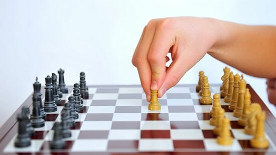
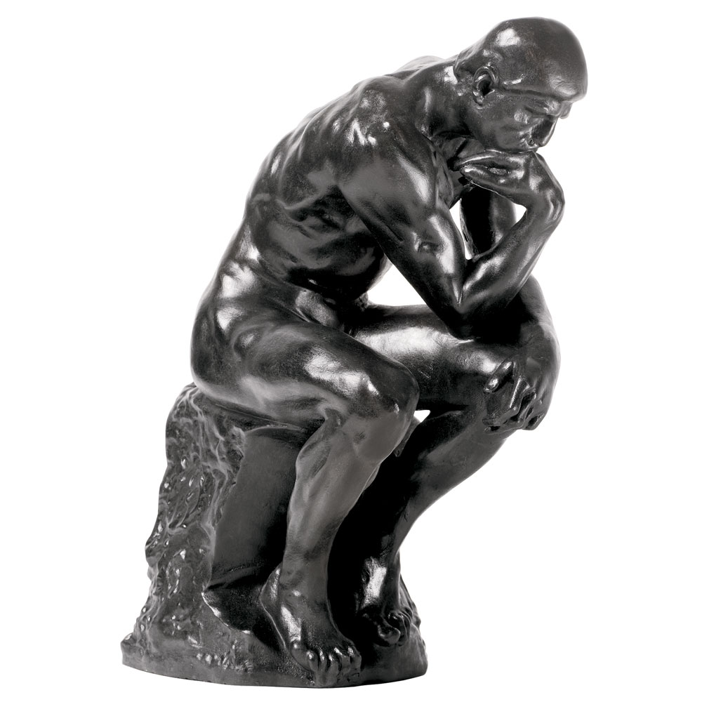
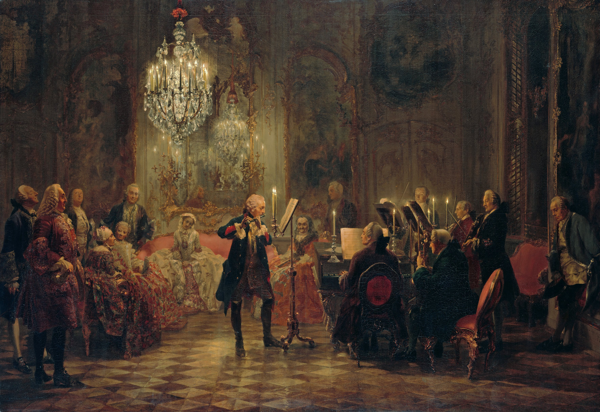

```{r setup, include=FALSE}
options(htmltools.dir.version = FALSE)
knitr::opts_chunk$set(echo=F,
                      message=F,
                      warning=F,
                      fig.retina = 3,
                      fig.align = "center")
library("tidyverse")
library("ggrepel")
library("fontawesome")
xaringanExtra::use_tile_view()
xaringanExtra::use_tachyons()
xaringanExtra::use_freezeframe()

update_geom_defaults("label", list(family = "Fira Sans Condensed"))
update_geom_defaults("text", list(family = "Fira Sans Condensed"))

set.seed(256)

theme_slides <- theme_light() + 
  theme(
    text = element_text(family = "Fira Sans", size = 24)
  )
```

# Game Theory

.pull-left[

.smallest[
- Game theory appears somewhat tautological
  - Result of game is baked into the rules of a game specified
  - Game theorists often know the result even before the players play

- More useful as a **theoretical framework** for understanding strategic interactions
  - If players were rational and had perfect information — what would they do?
  - Compare the (theory) prediction with reality
      - Do players act differently in reality? 

]
]

.pull-right[
.center[

]
]

---

# When Results are Not as Predicted

.pull-left[

- Behavioral economists:
  - Did players make a mistake? Act less than "rational"?
  - Cognitive biases, behavioral economics explanations
  - Did players not understand the rules?

- Game theorists:
  - Did you specify the game correctly?
  - Are the rules correctly modeled?
  - Are the payoffs correctly specified?

]

.pull-right[
.center[

]
]

---

# Research with Game Theory

.pull-left[
.smallest[
- Most fruitful part of research (in my biased opinion) is using game theory to understand the role of *institutions* (norms, culture, shared histories, government policies, etc.)
    - Coordination devices
    - Focal points
    - Sorting between multiple Nash equilibria
    - Path dependent outcomes
    - Making threats/promises credible
    - Making exchanges self-enforcing
    - Resolving asymmetric information problems 

- We'll see this starting this week, and in the papers we'll read
]
]

.pull-right[
.center[

]
]

---

# The Two Major Models of Economics as a “Science”

.pull-left[

## Optimization

- Agents have .hi[objectives] they value

- Agents face .hi[constraints]

- Make .hi[tradeoffs] to maximize objectives within constraints

.center[

]
]

--

.pull-right[

## Equilibrium

- Agents .hi[compete] with others over **scarce** resources

- Agents .hi[adjust] behaviors based on prices

- .hi[Stable outcomes] when adjustments stop

.center[

]

]

---

# Game Theory vs. Decision Theory Models I

.pull-left[
.center[

]
]

.pull-right[

- Traditional economic models are often called .hi[“Decision theory”]:

- .hi-purple[Optimization models] **ignore all other agents** and just focus on how can **you** maximize **your** objective within **your** constraints
  - Consumers max utility; firms max profit, etc.

- **Outcome**: .hi-purple[optimum]: decision where *you* have no better alternatives

]


---

# Game Theory vs. Decision Theory Models I

.pull-left[

.center[

]
]

.pull-right[

- Traditional economic models are often called .hi[“Decision theory”]:

- .hi-purple[Equilibrium models] assume that there are **so many agents** that **no agent’s decision can affect the outcome**
  - Firms are price-takers or the *only* buyer or seller
  - **Ignores all other agents’ decisions**!

- **Outcome**: .hi-purple[equilibrium]: where *nobody* has any better alternative

]

---

# Game Theory vs. Decision Theory Models III

.pull-left[
.center[

]
]

.pull-right[

- .hi[Game theory models] directly confront .hi-purple[strategic interactions] between players
  - How each player would optimally respond to a strategy chosen by other player(s)
  - Lead to a stable outcome where everyone has considered and chosen mutual best responses

- **Outcome**: .hi-purple[Nash equilibrium]: where *nobody* has a better strategy **given the strategies everyone else is playing**

]


---

# Equilibrium in Games

.pull-left[
.center[

]
]

.pull-right[

- .hi-purple[Nash Equilibrium]: 
  - no player wants to change their strategy **given all other players’ strategies**
  - each player is playing a **best response** against other players’ strategies

]

---

# A Suggested Framework

.pull-left[

I. Identify the strategic interaction
  - Who are the players
  - What choices can they make?
  - How does the *interaction* of their choices determine outcomes for each player?
]

.pull-right[
.center[

]
]

---

# A Suggested Framework

.pull-left[

.smallest[
II. Model the game: rules, payoffs, etc (*often the hard part!*)
  - Ordering of choices -- sequential, simultaneous?
      - Information -- what does each player know and not know
      - One-shot or repeated?
      - If repeated: a finite number of times? an infinite number of times? ending with certain probability?
  - Define the payoffs (*again, the hard part*!)
      - use *economic theory* to determine how various interactions should affect various outcomes for each player
      - numerical payoffs make things easy, but constrain you to fewer possibilities
      - using *variables* in payoffs allows you to solve for the *conditions* that will yield *different Nash equilibria*
]
]
.pull-right[
.center[

]
]

---

# A Suggested Framework

.pull-left[

III. Predict the outcome(s)
  - Solve for Nash equilibria
    - If applicable, consider: pure vs. mixed strategies, one-shot vs. repeated games
  - If using variables in payoffs, what values of variables will give us various equilibria?
  - If multiple equilibria -- any reasons we should expect one over others?
]

.pull-right[
.center[

]
]

---

# A Suggested Framework

.pull-left[
.smallest[
IV. Compare reality with predictions
  - Are there behavioral reasons players do not reach predicted outcome? 
  - Are there institutions, policies, norms, ethics, etc. that lead players towards/away from certain outcomes?
    
V. Consider changes in the game
  - What would have to change (payoffs, rules, etc) to get different outcomes?
  - Are there policies or institutions that might affect or cause this?
  - Consider welfare of players: how do the players do? How could this be improved?
]
]
.pull-right[
.center[

]
]

---

class: inverse, center, middle

# Example I: Patronage, Copyright, and Crowdfunding as Alternative Institutions

---

# Patronage

.center[

]

---

# Patronage Today

.center[

]

---

# Patronage Today

.center[

]

---

# Patronage Today

.center[

]

---

# Basic Game

.pull-left[
.smallest[
- .red[Creator] can produce a (single) expressive work
  - Fixed cost $F$
  - Marginal cost $C$
  - If produced, incur cost $-(F+C)$, and sell at price $P$

- .blue[Consumer] can consume or copy expressive work
  - Values it at $V$
  - Purchases at price $P$
      - $V-P$: consumer surplus
  - Copies with replication cost, $R$
]

.source[Safner, Ryan, 2021, “Kickstart My Art: Are Crowdfunding and Intellectual Property Complements or Substitutes?”]
]

.pull-right[
.center[

]
]
---


# Basic Game

.pull-left[
- Solve this game by backwards induction:

- Consumer will Purchase when:
  - $R>P$: costlier to copy than to purchase
  - $V>P$: price to buy is lower than value (i.e. consumer surplus, $V-P \geq 0$)

- Producer will Produce when:
  - Consumer Purchases
  - $P>F-C$: revenue exceeds cost
  
.source[Safner, Ryan, 2021, “Kickstart My Art: Are Crowdfunding and Intellectual Property Complements or Substitutes?”]

]

.pull-right[
.center[

]
]

---

# Mechanisms to Enhance Cooperation

.pull-left[
.smallest[
- An agent ("patron") bears the fixed costs (F) in exchange for some of the following:
    - Distribution rights (copyrights); personal prestige; portion of profits; rewards
- Deterrence of pirating & shirking (raise R relative to P)
    - Technology affects replication costs; Customization, product differentiation, price discrimination; Legal threats; Reputation
- Compare three systems:
    1. Patronage of the arts
    2. Copyright
    3. Crowdfunding
]

.source[Safner, Ryan, 2021, “Kickstart My Art: Are Crowdfunding and Intellectual Property Complements or Substitutes?”]

]

.pull-right[
.center[

]
]

---

# Patronage of the Arts (& Sciences)

.pull-left[
.center[

]
]

.pull-right[
.center[

]
]

---

# Patronage Version of the Game

.pull-left[
.smallest[
- .hi-purple[Patronage of the arts]: institution that changes the rules of the game
  - .blue[Consumer-Patron] decides to sponsor a .red[Creator] by bearing their fixed costs F
  - .red[Creator] now in a principal-agent problem: produce or shirk (abscond with F)

- Rules of the game that affect key parameters:
  - Removes opportunity of copying (custom works) 
  - F: fixed costs now borne by .blue[patron]

]
.source[Safner, Ryan, 2021, “Kickstart My Art: Are Crowdfunding and Intellectual Property Complements or Substitutes?”]

]

.pull-right[
.center[

]
]

---

# Copyright

.pull-left[
- Cost of replication has plummeted via new technology (both for creators & for copyists)

- Copyright: Individual creator can control distribution rights and seek legal sanctions against copyists 

.source[Safner, Ryan, 2021, “Kickstart My Art: Are Crowdfunding and Intellectual Property Complements or Substitutes?”]

]

.pull-right[
.center[


]
]

---

# Copyright Version of the Game

.pull-left[
- .hi-purple[Copyright]: another institution that changes the *payoffs* of the original game
  - If .blue[Consumer] chooses to Copy, now faces additional:
  - $D$: damages from copyright lawsuit
  - $\sigma$: probability of getting caught/sued
  - .red[Creator] gains $\sigma D$ (from lawsuit against .blue[Consumer]), but must pay $E$ for enforcement costs (legal fees)
    
.source[Safner, Ryan, 2021, “Kickstart My Art: Are Crowdfunding and Intellectual Property Complements or Substitutes?”]

]

.pull-right[
.center[

]
]

---

# Copyright Version of the Game

.pull-left[
    
- .blue[Consumer] purchases when:
  - $P<R-\sigma D$
  - More likely than first version of game

.source[Safner, Ryan, 2021, “Kickstart My Art: Are Crowdfunding and Intellectual Property Complements or Substitutes?”]

]

.pull-right[
.center[

]
]

---

# Patronage with Copyright/Crowdfunding Version

.pull-left[
- .hi-purple[Patronage with Copyright]: *three* players
  - patron and consumer are different
  - patron can sponsor creator by bearing $F$
  - patron contracts for copyright and some share $\alpha$ of the profits

- .hi-purple[Crowdfunding]: patrons $\neq$ wealthy elites, but a collection of many people contributing towards $F$

.source[Safner, Ryan, 2021, “Kickstart My Art: Are Crowdfunding and Intellectual Property Complements or Substitutes?”]

]

.pull-right[
.center[

]
]

---

# Example II: 19<sup>th</sup> Century American Literary Piracy

.pull-left[

- From 18<sup>th</sup>—mid 20<sup>th</sup> century the United States *refused* to respect copyright of *foreign* authors

- American publishing industry expressly built on piracy of foreign works (mostly British novels)

- The U.S. is now the world's copyright policeman, enforcing its copyrights internationally
  
.source[Safner, Ryan, 2021, “Pirate Thy Neighbor: The Protectionist Roots of International Copyright Recognition in the United States”

Safner, Ryan, 2021, “Honor Among Thieves: How 19th Century American Pirate Publishers Simulated Copyright Protection”]

]

.pull-right[
.center[

]
]

---

# Example II: 19<sup>th</sup> Century American Literary Piracy

.pull-left[

.smallest[
- U.S. publishers' piracy of foreign authors in the 19<sup>th</sup> century faced a tragedy of the commons:
  - No exclusive claims over printing foreign works (no copyright $\implies$ no right to exclude)

- Solved this problem by creating a publishing cartel that created "property rights" in piracy of foreign authors

- Enabled protectionist resistance to calls for respecting international copyrights 
  - System broke down by end of 19<sup>th</sup> century
  - Rising U.S. cultural output in 20<sup>th</sup> century: publishers now advocate for international copyrights

]

.source[Safner, Ryan, 2021, “Pirate Thy Neighbor: The Protectionist Roots of International Copyright Recognition in the United States”

Safner, Ryan, 2021, “Honor Among Thieves: How 19th Century American Pirate Publishers Simulated Copyright Protection”]

]

.pull-right[
.center[

]
]

---

# Game Setup

.pull-left[
- Two representative American publishers, 1 and 2; two authors $A$, and $B$

- Publisher 1 moves first and decides to publish $A$ or $B$ at profit-maximizing price $p$ with cost $c$

- Publisher 2 moves second and can decide to publish:
    - the *same* author as 1 ("pirate") at lower cost $\hat{p}<p; \hat{c}<c$ or 
    - the *other* author at cost $c$

.source[Safner, Ryan, 2021, “Pirate Thy Neighbor: The Protectionist Roots of International Copyright Recognition in the United States”
]

]

.pull-right[
.center[

]
]
---

# Game Setup

.pull-left[
- Consumers will buy only from lower-priced publisher
    - If publisher 2 pirates, can sell at lower price than publisher 1
    - If both publish different authors, each earns $p_i-c$, where $i=\{A, B\}$
- Authors $A$ and $B$ may fetch different prices $p_A$ and $p_B$ depending on market demand

.source[Safner, Ryan, 2021, “Pirate Thy Neighbor: The Protectionist Roots of International Copyright Recognition in the United States”
]

]

.pull-right[
.center[

]
]

---
# Game Setup

.pull-left[
- Piracy/original publishing depends on: 
  - relative value of author $A$ vs $B$
  - profits of original sales $(p_i-c)$ vs. profits of pirate sales $(\hat{p_i}-\hat{c})$
    - both demand for pirated works $(\hat{p_i})$ and reproduction technology $(\hat{c})$

.source[Safner, Ryan, 2021, “Pirate Thy Neighbor: The Protectionist Roots of International Copyright Recognition in the United States”
]

]

.pull-right[
.center[

]
]

---

# Game Outcome - Role of Institutions

.pull-left[
- Parameters $p_A$, $p_B$, $c$, and $\hat{c}$ are determined by market conditions and institutions:

- Historically, several methods to secure property rights and deter piracy from other publishers
  - Arts patronage
  - Monopoly/guild (Stationers' Company of London)
  - Internal trade organizations
  - Copyright law
  
.source[Safner, Ryan, 2021, “Pirate Thy Neighbor: The Protectionist Roots of International Copyright Recognition in the United States”]

]

.pull-right[
.center[

]
]

---

# The Cartel Solution: “Courtesy of the Trade”

.pull-left[
.smaller[
- 1790—1891 U.S. did not recognize copyrights to foreign authors

- U.S. publishing industry largely pirated famous British authors
 - Set up “courtesy of the trade” system of voluntary norms to avoid tragedy of commons
 - Created pseudo-property rights in foreign authors works
 - Ended up paying authors despite no obligation to, nor any legal protection earned

]

.source[Safner, Ryan, 2021, “Pirate Thy Neighbor: The Protectionist Roots of International Copyright Recognition in the United States”

Safner, Ryan, 2021, “Honor Among Thieves: How 19th Century American Pirate Publishers Simulated Copyright Protection”]

]
.pull-right[
.center[

]
]

---

# The Cartel Solution: “Courtesy of the Trade”

.pull-left[
.smallest[
- 1790—1891 U.S. did not recognize copyrights to foreign authors

- Resolved the tragedy of the commons problem via a cartel
- A publisher would announce which foreign author they would publish and stake their "claim"
  - Other publishers would refrain from republishing that author, in hopes that when they stake a claim on a different author, others would respect it
  - If didn't respect claims, retaliation: nobody would respect their future claims 

]

.source[Safner, Ryan, 2021, “Pirate Thy Neighbor: The Protectionist Roots of International Copyright Recognition in the United States”

Safner, Ryan, 2021, “Honor Among Thieves: How 19th Century American Pirate Publishers Simulated Copyright Protection”]

]
.pull-right[
.center[

]
]

---

# More General Solutions

.pull-left[

- 1891 International Copyright Act “respects” foreign copyrights in U.S.
  - “Manufacturing clause” required foreign works to be printed in U.S.
  - Rationale for “trade courtesy” cartel disappears

- U.S. publishers begin publishing U.S. authors
  - Now in their interest to push for other countries to respect U.S. copyright
  
.source[Safner, Ryan, 2021, “Pirate Thy Neighbor: The Protectionist Roots of International Copyright Recognition in the United States”]

]

.pull-right[
.center[

]
]