```{r setup, include=FALSE}
options(htmltools.dir.version = FALSE)
knitr::opts_chunk$set(echo=F,
                      message=F,
                      warning=F,
                      fig.retina = 3,
                      fig.align = "center")
library("tidyverse")
library("ggrepel")
library("fontawesome")
xaringanExtra::use_tile_view()
xaringanExtra::use_tachyons()
xaringanExtra::use_freezeframe()

update_geom_defaults("label", list(family = "Fira Sans Condensed"))
update_geom_defaults("text", list(family = "Fira Sans Condensed"))

set.seed(256)

theme_slides <- theme_light() + 
  theme(
    text = element_text(family = "Fira Sans", size = 24)
  )
```

class: inverse

# Outline

### [](#)

---

# A Motivating Example

.pull-left[
- Suppose I announce that if any of you were late, I would give you an F

- If you believe my threat, you will arrive on time, and I never have to carry out my threat

- *Sounds* like a Nash equilibrium:
  - I get what I want at no cost to me
  - You prefer being in class on time to failing
  - Nobody wants to change

]

.pull-right[
.center[

]
]

---

# A Motivating Example

.pull-left[
- Implausible prediction: I would not actually want to carry out my threat if it came to it!
    - Big confrontation, you could complain to Dept. chair, Provost, etc

- A problem of “out-of-equilibrium” play
    - How can a threat *I will never carry out* change your behavior?
    - I can optimally choose bizarre behavior in situations I know will never happen!

]

.pull-right[
.center[

]
]

---

# A Motivating Example

.pull-left[
- BUT: if you know what *would* happen in those unlikely scenarios, that *does* affect your behavior for things that *normally* happen
    - namely, if you know I will not *actually* fail you for coming late, you will sometimes come late

]

.pull-right[
.center[

]
]

---

# Motivating Example

.pull-left[
- This lesson is about the effects of .hi[threats] and .hi[promises]

- Must learn another major refinement of Nash equilibrium

- First, return to seqential games

- Continue with assumption of perfect information (soon we will consider imperfect information)

]

.pull-right[
.center[

]
]

---

# Motivating Example

.pull-left[

- A new solution concept:

- .hi[Subgame perfect Nash equilibrium (SPNE)]: selects only Nash equilibria sustained by .hi-purple[credible] threats and promises, and rules out *non-credible* threats/promises
    - Formal definition: a set of strategies is **SP** if it induces a Nash equilibrium in *every subgame* of a game
    
- First, let’s understand what we mean by “subgame”

]

.pull-right[
.center[

]
]

---

class: inverse, center, middle

# Subgames

---

# Subgames

.pull-left[
- A .hi[subgame] is any portion of a game that contains one initial note and all of its successor nodes
  - e.g. .hi-turquoise[any decision node initiates its own subgame] through to the terminal nodes
  - The game itself counts as a subgame
    
- Idea: analyze a subgame as a game itself and .hi-turquoise[ignore any history] in the overall game and .hi-turquoise[find what is optimal in each subgame]

]

.pull-right[
.center[
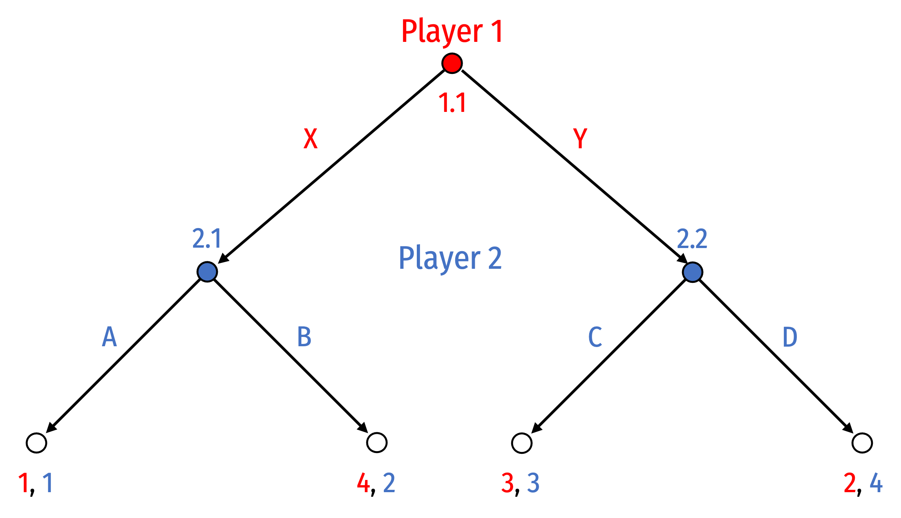
]
]
---

# Subgames: Example

.pull-left[
- In this example, there are 3 subgames:
  1. The full game itself (initiated by .red[Player 1]'s decision node .red[1.1])
  2. Subgame initiated by .blue[Player 2's] decision node .blue[2.1]
  3. Subgame initiated by .blue[Player 2's] decision node .blue[2.2]

]

.pull-right[
.center[
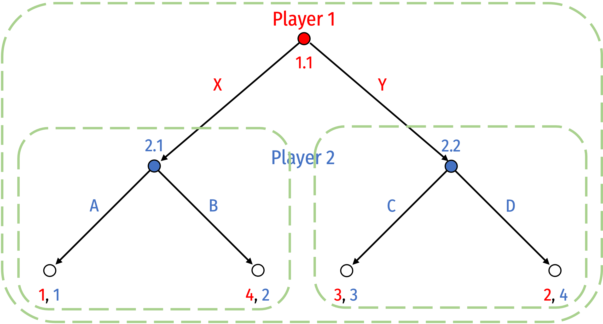
]
]

---

# Aside: Subgames Can't Break Information Sets

.pull-left[
.smaller[
- Subgames cannot “break” .hi-purple[information sets]
  - Indicated by dashed line: .blue[Player 2] does not know what .red[Player 1] chose (consider it a simultaneous game)
  - More on information later

- Players must *know which* subgame they are in, so a subgame cannot “break” an information set
  - .blue[Player 2] here would not know what .red[Player 1] did, so .red[Player 1] can’t make a decision; could not “ignore history”
]
]
.pull-right[
.center[
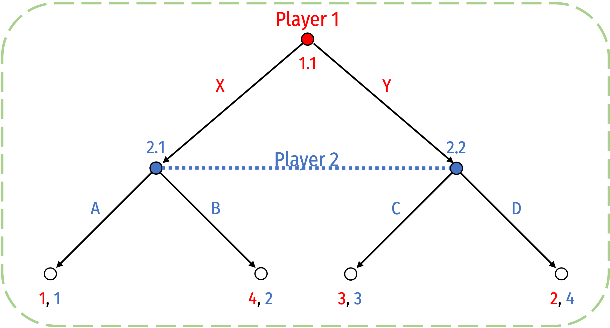
]
]

---

# (Review) Strategies in this Example

.pull-left[
.smallest[
- Recall we defined a .hi[strategy] as a complete plan of what a player will do at *every* decision node they (might) face

- .red[Player 1] has 1 decision (.red[1.1]) with 2 choices, so $2^1$ possible strategies:
  1. .red[X] at (.red[1.1])
  2. .red[Y] at (.red[1.1])
]
]
.pull-right[
.center[

]
]

---

# (Review) Strategies in this Example

.pull-left[
.smallest[
- Recall we defined a .hi[strategy] as a complete plan of what a player will do at *every* decision node they (might) face

- .red[Player 1] has 1 decision (.red[1.1]) with 2 choices, so $2^1$ possible strategies:
  1. .red[X] at (.red[1.1])
  2. .red[Y] at (.red[1.1])
  
- .blue[Player 2] has 2 decision (.blue[2.1], .blue[2.2]) with 2 choices at each, so $2^2$ possible strategies:
  1. .blue[A] at (.red[2.1]); .blue[C] at (2.2)
  2. .blue[A] at (.red[2.1]); .blue[D] at (2.2)
  3. .blue[B] at (.red[2.1]); .blue[C] at (2.2)
  4. .blue[B] at (.red[2.1]); .blue[D] at (2.2)
]
]
.pull-right[
.center[

]
]

---

# Converting Between Sequential and Normal Form

.pull-left[

- We can convert any sequential game in extended form (game tree) into a normal game (payoff matrix)
  - Harder to go the other way around!

]

.pull-right[
.center[

]
]

---

# Converting Between Sequential and Normal Form

.pull-left[

- We can convert any sequential game in extended form (game tree) into a normal game (payoff matrix)
  - Harder to go the other way around!

- Payoff matrix of outcomes of all possible combinations of strategies for each player
]

.pull-right[
.center[


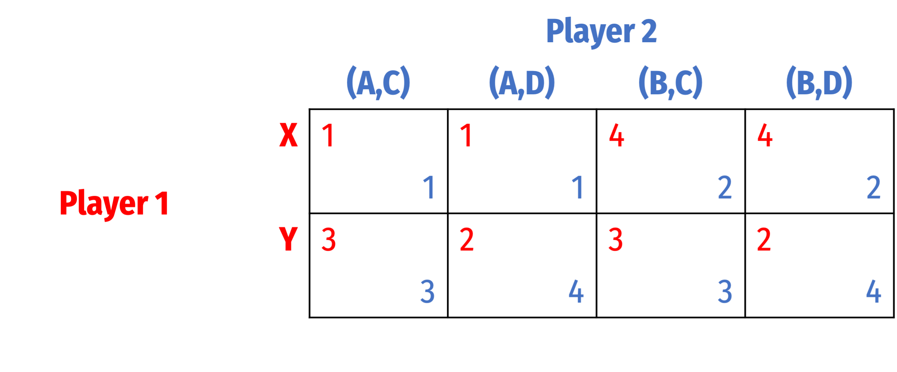
]
]

---

# Converting Between Sequential and Normal Form

.pull-left[

- Solve the normal form for Nash equilibria
]

.pull-right[
.center[


]
]

---

# Converting Between Sequential and Normal Form

.pull-left[

- Nash equilibria:
  1. {.red[Y], .blue[(A,D)]}
  2. {.red[X], .blue[(B,C)]}
  3. {.red[X], .blue[(B,D)]}
]

.pull-right[
.center[


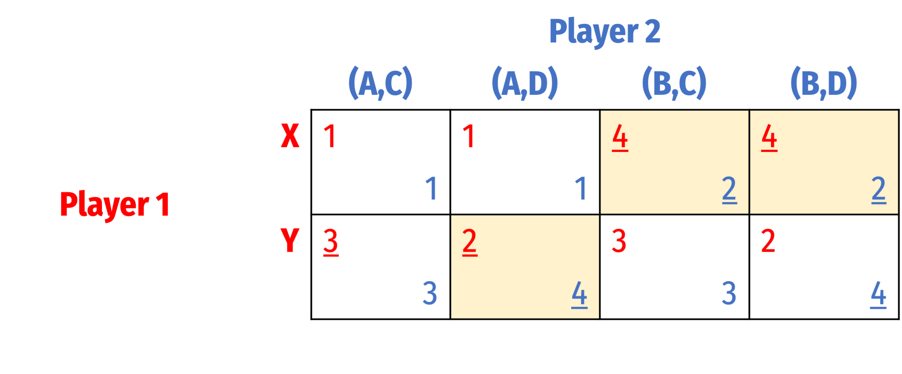
]
]

---

# Converting Between Sequential and Normal Form

.pull-left[

- Nash equilibria:
  1. {.red[Y], .blue[(A,D)]}
  2. {.red[X], .blue[(B,C)]}
  3. {.red[X], .blue[(B,D)]}

- But remember, this is a sequential game! Which of these Nash equilibria is .hi[sequentially-rational]?
]

.pull-right[
.center[


]
]

---

# Rollback Equilibrium

.pull-left[

- Solve for rollback equilibrium via backwards induction

- A process of considering .hi-purple[“sequential rationality”]:

> “If I play x, my opponent will respond with y; given their response, do I really want to play x? ...”

]

.pull-right[
.center[


]
]


---

# Converting Between Sequential and Normal Form

.pull-left[

- Nash equilibria:
  1. {.red[Y], .blue[(A,D)]}
  2. {.red[X], .blue[(B,C)]}
  3. {.red[X], .blue[(B,D)]}

- .hi-purple[Rollback equilibrium:] {.red[X], .blue[(B,D)]}
]

.pull-right[
.center[
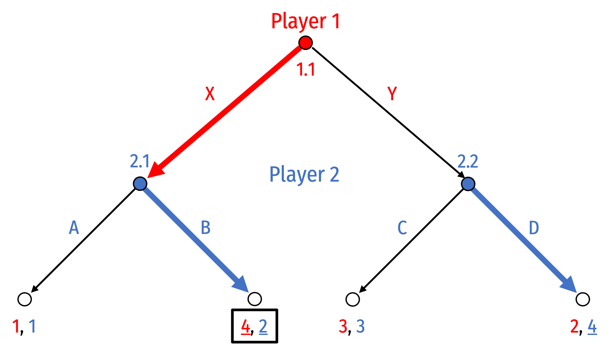


]
]

---

# Converting Between Sequential and Normal Form

.pull-left[

- Nash equilibria:
  1. {.red[Y], .blue[(A,D)]}
  2. {.red[X], .blue[(B,C)]}
  3. {.red[X], .blue[(B,D)]}

- Even though there are three Nash equilibria, only one is .hi-purple[subgame perfect]
  - .red[Player 1] and .blue[Player 2] are playing {.red[X], .blue[(B,D)]} respectively causes a .hi-turquoise[Nash equilibrium in .ul[every] subgame]
]

.pull-right[
.center[


]
]

---

# Converting Between Sequential and Normal Form

.pull-left[

- Nash equilibria:
  1. {.red[Y], .blue[(A,D)]}
  2. {.red[X], .blue[(B,C)]}
  3. {.red[X], .blue[(B,D)]}

.smallest[
- Consider the first NE: {.red[Y], .blue[(A,D)]}
  - Not on the equilibrium path of play
  - Not sequentially rational: if .red[Player 1] had played .red[X] (for whatever reason), .blue[Player 2] would want to switch from playing .blue[A] to playing .blue[B] at .blue[2.1]!
  - Thus, this strategy is not a NE in subgame initiated at node .blue[2.1] (.blue[Player 2] would want to change strategies)
]
]

.pull-right[
.center[
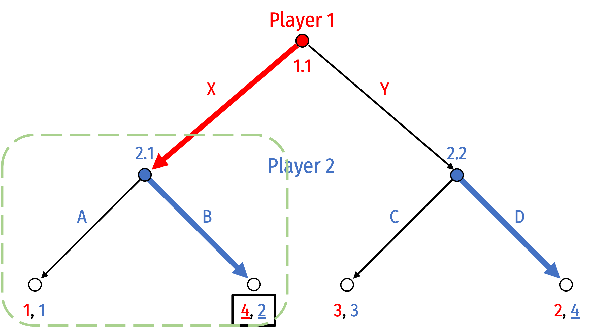


]
]

---

# Converting Between Sequential and Normal Form

.pull-left[

- Nash equilibria:
  1. {.red[Y], .blue[(A,D)]}
  2. {.red[X], .blue[(B,C)]}
  3. {.red[X], .blue[(B,D)]}

.smallest[
- Consider the second NE: {.red[X], .blue[(B,C)]}
  - Not on the equilibrium path of play
  - Not sequentially rational: if .red[Player 1] had played .red[Y] (for whatever reason), .blue[Player 2] would want to switch from playing .blue[C] to playing .blue[D] at .blue[2.2]!
  - Thus, this strategy is not a NE in subgame initiated at node .blue[2.2] (.blue[Player 2] would want to change strategies)
]
]


.pull-right[
.center[
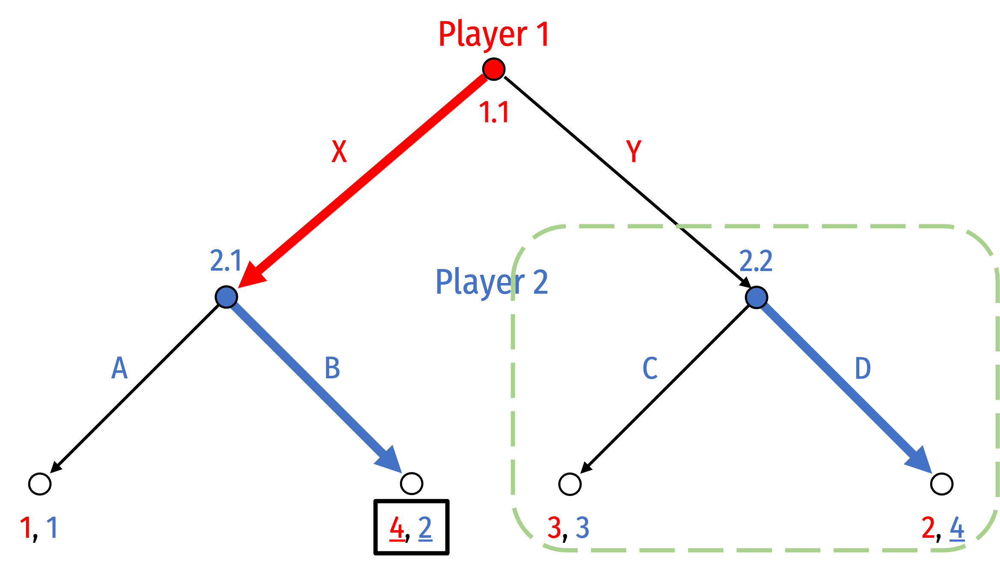


]
]

---

# Converting Between Sequential and Normal Form

.pull-left[

- Nash equilibria:
  1. {.red[Y], .blue[(A,D)]}
  2. {.red[X], .blue[(B,C)]}
  3. {.red[X], .blue[(B,D)]}

.smallest[
- Consider the third NE: {.red[X], .blue[(B,D)]}
  - On the equilibrium path of play
  - Sequentially rational: these strategies lead to a NE in *every* subgame!
  - Conveniently: .hi-turquoise[the “rollback equilibrium” is always subgame perfect]
]
]

.pull-right[
.center[
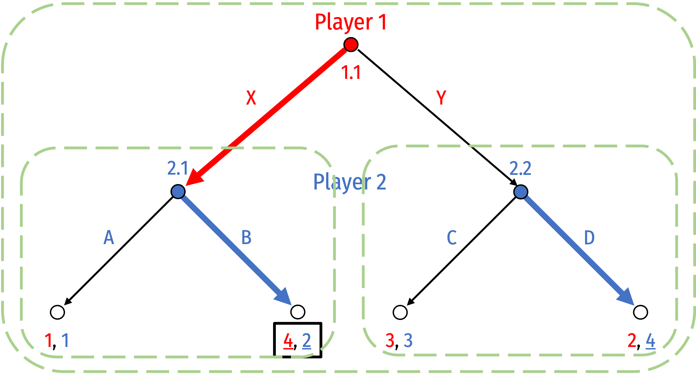


]
]

---

# Converting Between Sequential and Normal Form

.pull-left[

- Subgame perfection rules out .hi-purple[non-credible threats or promises]

- Depending on context, .blue[Player 2] might threaten/promise that they will play .blue[C] if .red[Player 1] plays .red[Y]
  - But if that subgame were reached, .blue[Player 2] would *not* play .blue[C], they would want to play .blue[D]!
  - i.e. not a credible claim
]

.pull-right[
.center[


]
]

---

class: inverse, center, middle

# Entry Game Example

---

# Entry Game: Extensive Form

.pull-left[

- Consider an .hi[Entry Game], a .hi-purple[sequential] game played between a potential .hi-red[Entrant] and an .hi-blue[Incumbent]
]

.pull-right[
.center[
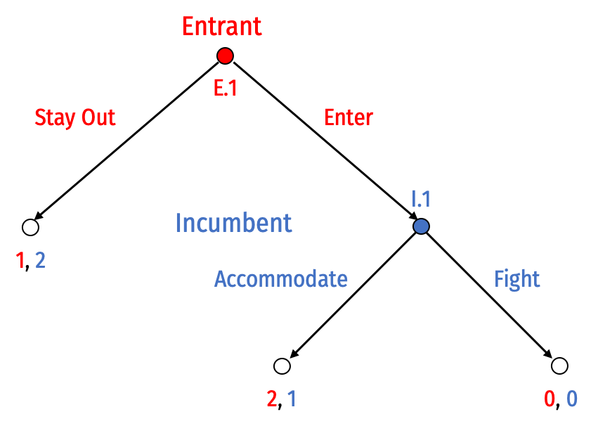
]

]


---

# Entry Game: (Pure) Strategies

.pull-left[

- .hi-red[Entrant] has 2 pure strategies:
  1. .red[Stay Out] at .red[E.1]
  2. .red[Enter] at .red[E.1]

- .hi-blue[Incumbent] has 2 pure strategies:
  1. .blue[Accommodate] at .blue[I.1]
  2. .blue[Fight] at .blue[I.1]

]

.pull-right[
.center[

]
]

---

# Entry Game: Backward Induction

.pull-left[

- .hi-purple[Rollback/Subgame Perfect Nash Equilibrium]:

.center[
(.hi-red[Enter], .hi-blue[Accommodate])
]
]

.pull-right[
.center[
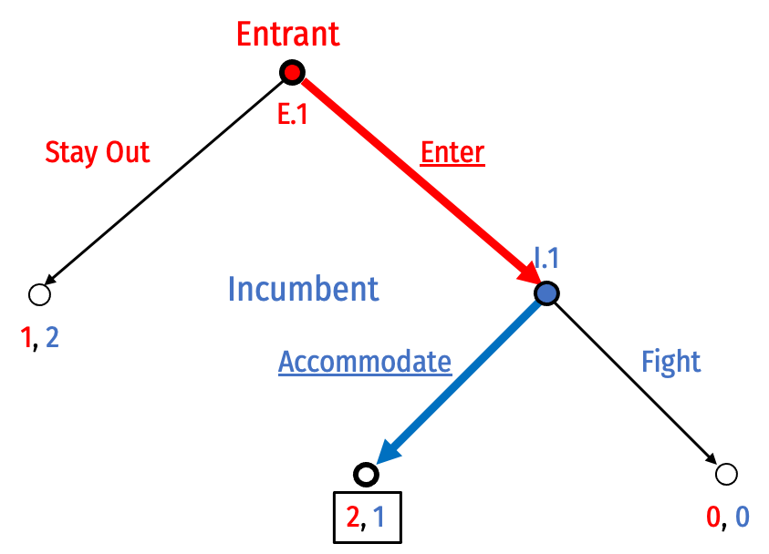
]
]


---

# Entry Game: Normal vs. Extensive Form

.pull-left[

- Convert this game to Normal form

- Note, if .hi-red[Entrant] plays .red[Stay Out], doesn't matter what .hi-blue[Incumbent] plays, payoffs are the same

- Solve this for Nash Equilibria...

]

.pull-right[
.center[
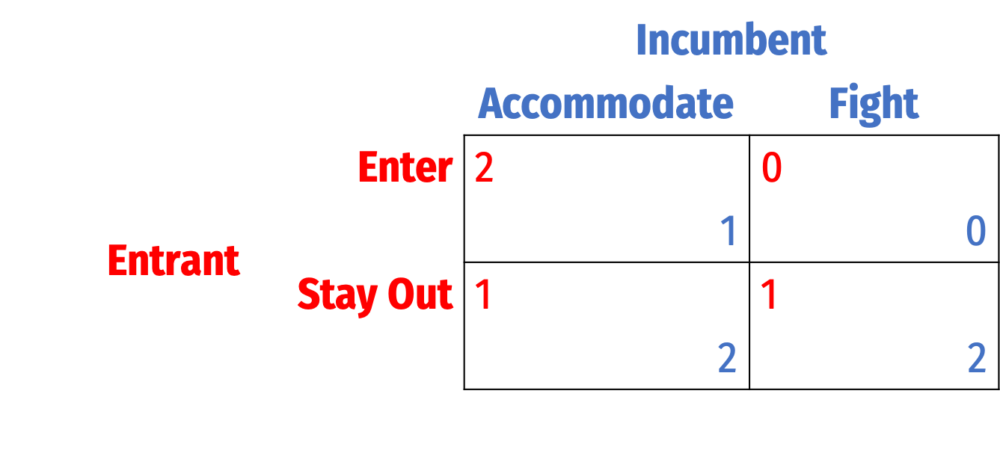
]
]

---

# Entry Game: Normal vs. Extensive Form

.pull-left[

- Two Nash Equilibria:
1. (.hi-red[Enter], .hi-blue[Accommodate])
2. (.hi-red[Stay Out], .hi-blue[Fight])

- But remember, we ignored the *sequential* nature of this game in normal form
  - Which Nash equilibrium is **sequentially rational?**
]

.pull-right[
.center[
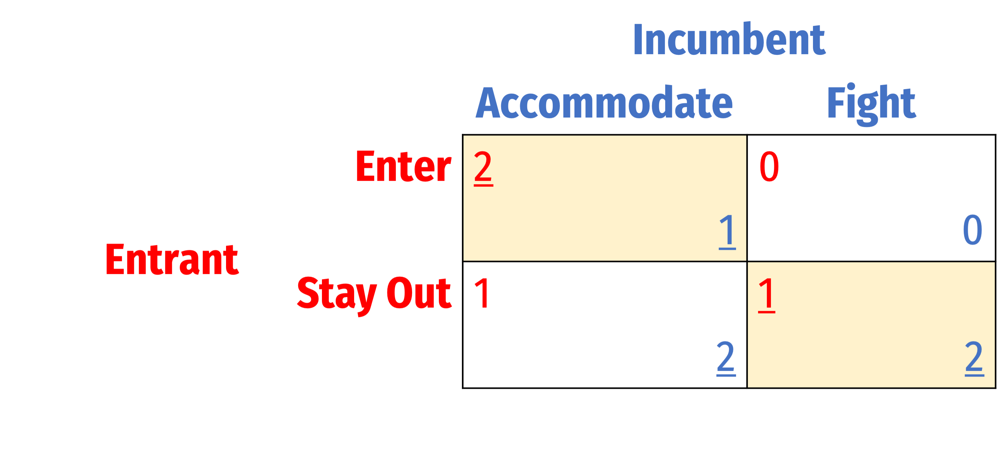
]
]

---

# Entry Game: Subgames

.pull-left[

1. Subgame initiated at decision node .hi-red[E.1] (i.e. the full game)
2. Subgame initiated at decision node .hi-blue[I.1]

]

.pull-right[
.center[
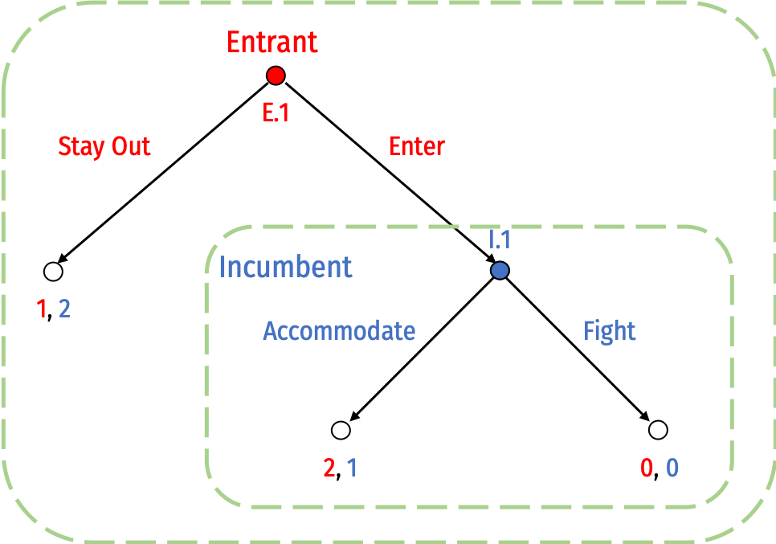
]
]

---

# Entry Game: Subgame Perfect Nash Equilibrium

.pull-left[

- Consider each subgame as a game itself and ignore the .hi-purple[“history”] of play that got a to that subgame
  - What is optimal to play in *that* subgame?

- Consider a set of strategies that is optimal for all players in *every* subgame it reaches

- That is a .hi[subgame perfect Nash equilibrium]

]

.pull-right[
.center[

]
]


---

# Entry Game: Subgame Perfect Nash Equilibrium

.pull-left[

- Recall our two Nash Equilibria from normal form: 
1. (.hi-red[Enter], .hi-blue[Accommodate])
2. (.hi-red[Stay Out], .hi-blue[Fight])

]

.pull-right[
.center[


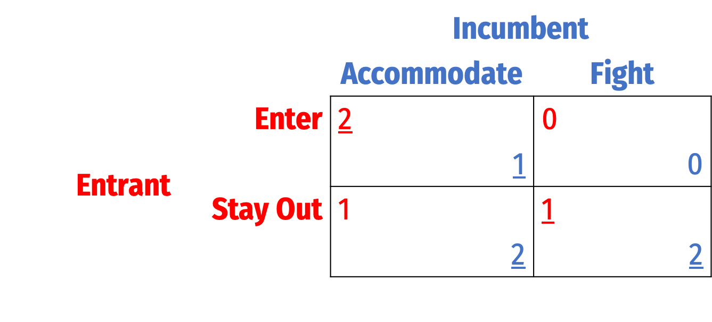

]
]


---

# Entry Game: Subgame Perfect Nash Equilibrium

.pull-left[

- Recall our two Nash Equilibria from normal form: 
1. (.hi-red[Enter], .hi-blue[Accommodate])
2. (.hi-red[Stay Out], .hi-blue[Fight])

- Consider the second set of strategies, where .hi-blue[Incumbent] chooses to .blue[Fight] at node .blue[I.1]

- What if for some reason, .hi-blue[Incumbent] is playing this strategy, and .hi-red[Entrant] unexpectedly plays .red[Enter]?
]

.pull-right[
.center[


]
]


---

# Entry Game: Subgame Perfect Nash Equilibrium

.pull-left[

- It's **not rational** for .hi-blue[Incumbent] to play .blue[Fight] if the game reaches .blue[I.1]!
  - Would want to switch to .blue[Accommodate]!

- .hi-blue[Incumbent] playing .hi-blue[Fight] at .blue[I.1] is **not a Nash Equilibrium in this subgame!**

- Thus, Nash Equilibrium (.hi-red[Stay Out], .hi-blue[Fight]) is **not sequentially rational**
  - It *is* still a Nash equilibrium!
]

.pull-right[
.center[


]
]

---

# Entry Game: Subgame Perfect Nash Equilibrium

.pull-left[

- Only (.hi-red[Enter], .hi-blue[Accommodate]) is a .hi-purple[Subgame Perfect Nash Equilibrium (SPNE)]

- These strategy profiles for each player constitute a Nash equilibrium in every possible subgame!

- Simple connection: rollback equilibrium is always SPNE!
]

.pull-right[
.center[


]
]

---

# Entry Game: SPNE and Credibility

.pull-left[

- Suppose before the game started, .hi-blue[Incumbent] announced to .hi-red[Entrant]

> “if you .red[Enter], I will .blue[Fight]!”

- This **threat** is .hi-purple[not credible] because playing .blue[Fight] in response to .red[Enter] is not rational!

- The strategy is not Subgame Perfect!

]

.pull-right[
.center[


]
]

---

class: inverse, center, middle

# Strategic Moves

---

# Strategic Moves AKA “Game Changers”

.pull-left[
.smallest[
- So far, assumed rules of the game are fixed

- In many strategic situations, players have incentives to try to affect the rules of the game for their own benefit
    - Order, available strategies, payoffs, repetition
    
- A .hi[strategic move] (“game changer”) is an action taken outside the rules an existing game by transforming it into a two-stage game
    - A strategic move is made in stage I (“pre-game” move)
    - A modified version of the original game is played in stage II
]
]

.pull-right[
.center[

]
]

---

# Types of Strategic Moves

.pull-left[
.smallest[
1. .hi[Threats]: if other players don’t choose your preferred move, you will play in a manner that will be bad for them (in second stage)
  - .hi-purple[Conditional] response to other players’ actions

2. .hi[Promises]: if other players choose your preferred move, you will play in a manner that will be good for them (in second stage)
  - .hi-purple[Conditional] response to other players’ actions

3. .hi[Commitments]: irreversibly limit your choice of action, .hi-purple[unconditional] on other players’ actions
]
]

.pull-right[
.center[

]
]

---

# Strategic Moves and Credibility

.pull-left[

- Key: .hi-turquoise[threats and promises are often costly if you must carry them out against your own interest!]

- If a threat works and elicits the desired behavior in others, no need to carry it out

- If a promise elicits the desired behavior in others, cost of performing the promise
]

.pull-right[
.center[

]
]

---

# Strategic Moves and Credibility

.pull-left[

- For a strategic move to work, it must be:
  - observable to all players
  - irreversible so that it alters other players’ expectations

- Other players must believe you will *actually do* in the second stage what you threaten/promise you will do during the first stage
  - .hi[Credibility] of strategic moves open to question
]

.pull-right[
.center[

]
]

---

# Strategic Moves and Credibility

.pull-left[
.smallest[
- Your parents probably (tried to) used strategic moves on you
  - “No dessert unless you eat your vegetables”
  - “We’ll buy you a new bike if you get a B GPA”
  
- You may have (rightly) questioned their credibility
  - Most parents *don’t actually want* to punish or discipline their kids (it’s painful *to the parents*)
  - (An empty) threat that changes their kid’s behavior is great, but costly if it actually has to be carried out
]
]
.pull-right[
.center[

]
]

---

# Non-Credibility AKA “Cheap Talk”

.pull-left[

- .hi-purple[“Talk is cheap”]
  - Low cost to making promises/threats you don’t intend to carry out

- Promises and threats .hi-turquoise[without commitment] will not change equilibrium behavior (with perfect information)

- If you try to bluff in poker, and your rivals know what cards you have, they will call your bluff

]

.pull-right[
.center[
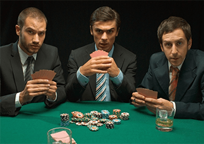

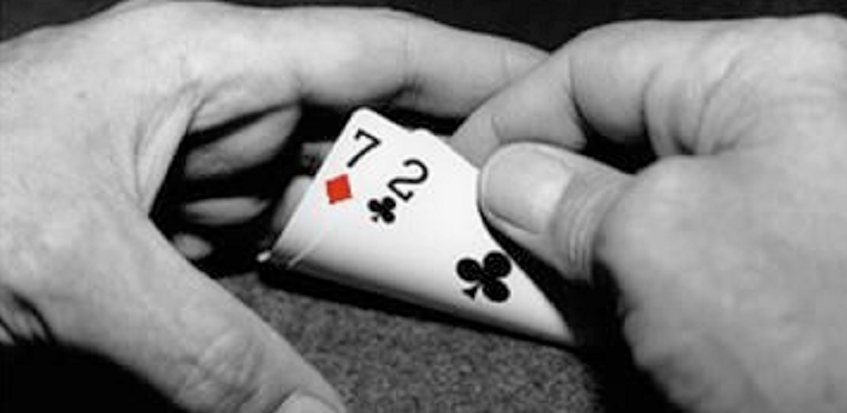
]
]

---

# Non-Credibility AKA “Cheap Talk”

.pull-left[
.smaller[
- Promises or threats must be .hi[incentive-compatible] to work
  - Threat/promise-maker must actually stand to benefit from performing the threat/promise or suffer from not performing it

- In game theory terms: strategy must be .hi-purple[subgame perfect]

- .hi-purple[Subgame perfection] rules out Nash equilibria relying upon non-credible threats and promises; keeps only behavior that is optimal under every circumstance!
]
]

.pull-right[
.center[


]
]

---

# Credible Commitment

.pull-left[
- Threats and promises can be .hi-purple[credible] with .hi[commitment]

- A .hi[commitment] changes the game in a way that forces you to carry out your promise or threat
  - tying your own hands makes you stronger!
]

.pull-right[
.center[


]
]

---

# Credible Commitment

.center[

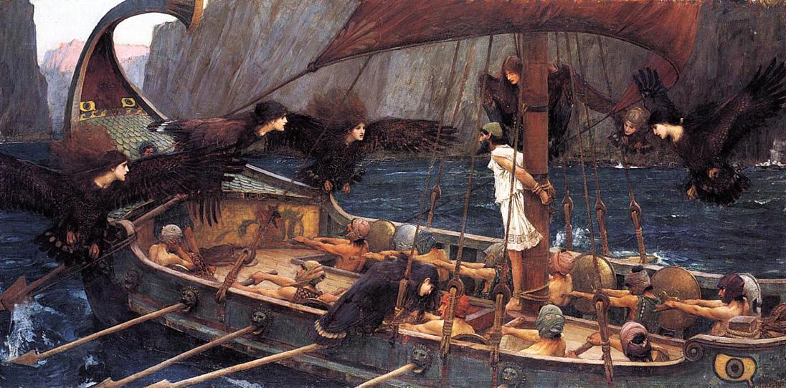

*Odysseus and the Sirens* by John William Waterhouse, Scene from Homer's *The Odyssey*

]