```{r setup, include=FALSE}
options(htmltools.dir.version = FALSE)
knitr::opts_chunk$set(echo=F,
                      message=F,
                      warning=F,
                      fig.retina = 3,
                      fig.align = "center")
library("tidyverse")
library("ggrepel")
library("fontawesome")
xaringanExtra::use_tile_view()
xaringanExtra::use_tachyons()
xaringanExtra::use_freezeframe()

update_geom_defaults("label", list(family = "Fira Sans Condensed"))
update_geom_defaults("text", list(family = "Fira Sans Condensed"))

set.seed(256)

theme_slides <- theme_light() + 
  theme(
    text = element_text(family = "Fira Sans", size = 24)
  )
```

class: inverse

# Outline

### [The Problem of Credible Commitment in Political Economy](#3)
### [Application I: How Medieval Guilds *Promoted* Trade](#9)
### [Application II: Market-Preserving Federalism](#27)
### [Application III: Rationalist Explanations for War](#27)

---

class: inverse, center, middle

# The Problem of Credible Commitment in Political Economy

---

# Thomas Hobbes, Game Theorist I

.left-column[
.center[


Thomas Hobbes

1588-1679
]
]

.right-column[

.smaller[
> "In [the state of nature], there is no place for Industry; because the fruit thereof is uncertain; and consequently no Culture of the Earth...no Knowledge of the face of the Earth; no account of Time; no Arts; no Letters; no Society; and which is worst of all, continuall feare, and danger of violent death; And the life of man, solitary, poore, nasty, brutish, and short, (Ch. XVIII).

]

.source[Hobbes, Thomas, 1651, [*Leviathan: Or the Matter, Forme and Power of a Commonwealth, Ecclesiasticall and Civil*](https://www.gutenberg.org/files/3207/3207-h/3207-h.htm)]

]

---

# Thomas Hobbes, Game Theorist II

.center[

]

---

# Thomas Hobbes, Game Theorist III

.left-column[
.center[


Thomas Hobbes

1588-1679
]
]

.right-column[

> "For the Lawes of Nature (as Justice, Equity, Modesty, Mercy, and (in summe) Doing To Others, As Wee Would Be Done To,) if themselves, without the terrour of some Power, to cause them to be observed, are contrary to our naturall Passions, that carry us to Partiality, Pride, Revenge, and the like. And .hi[Covenants, without the Sword, are but Words, and of no strength to secure a man at all], (Ch. XVIII).


.source[Hobbes, Thomas, 1651, [*Leviathan: Or the Matter, Forme and Power of a Commonwealth, Ecclesiasticall and Civil*](https://www.gutenberg.org/files/3207/3207-h/3207-h.htm)]

]

---

# The Hobbesian Dilemma 

.pull-left[
.smallest[
- Consider society, in general, a prisoner's dilemma for social cooperation or conflict:
  - $a$: everyone else obeys the law, but I don't
  - $b$: everyone obeys the law
  - $c$: no one obeys the law
  - $d$: I obey the law, but no one else does

- **Nash equilibrium**: everyone *defects*! 

- **Socially optimal equilibrium**: everyone *cooperates*

- Hobbes' insight: .hi-purple[no _individual_ has an incentive to cooperate when everyone defects!]
]
]

.pull-right[
.center[
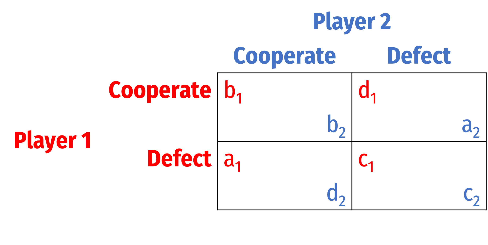

$a \succ b \succ c \succ d$
]
]

---

# The Hobbesian Solution I

.center[

]

---

# The Hobbesian Solution II

.pull-left[
.smallest[
- .hi-purple[The State is our commitment device]

- Citizens (in principle) sign a **social contract**, i.e. a "**constitution**" that *deliberately restricts* their liberties

- In each of our interests to give up some liberties that restrict the liberties of others (e.g. theft, violence)

- In exchange, we empower the State as our agent to punish those of us that fail to uphold the social contract

- .hi[Politics]: rules which we agree are legitimate, that determine an outcome for us all, even if we *disagree* (or are harmed by) with the outcome 
]
]

.pull-right[
.center[

]
]

---

# The State

.left-column[
.center[


Max Weber

1864-1920
]
]

.right-column[


> "[A] State is a human community that (successfully) claims the monopoly of the legitimate use of physical force within a given territory."

.source[Weber, Max, 1919, [*Politics as a Vocation*](http://anthropos-lab.net/wp/wp-content/uploads/2011/12/Weber-Politics-as-a-Vocation.pdf)]

]

---

# Madison's Paradox I

.left-column[
.center[


James Madison

1751-1836
]
]

.right-column[

> “If men were angels, no government would be nec- essary. If angels were to govern men, neither external nor internal controls on government would be necessary. In framing a government which is to be administered by men over men, the great difficulty lies in this: you must first enable the government to control the governed; and in the next place oblige it to control itself,” (Federalist 51).


.source[Hamilton, Madison, & Jay, 1788, [*The Federalist Papers*](https://avalon.law.yale.edu/18th_century/fed51.asp)]
]

---

# Madison's Paradox II

- .hi[Madison’s Paradox]: a State strong enough to protect rights is strong enough to violate them at its discretion

.center[
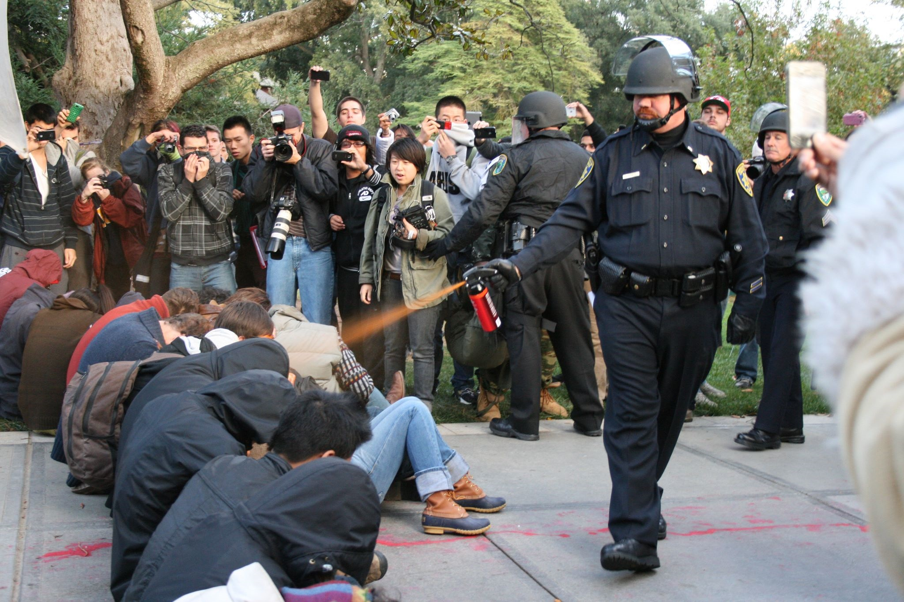
]

---

# Credible Commitment

.center[
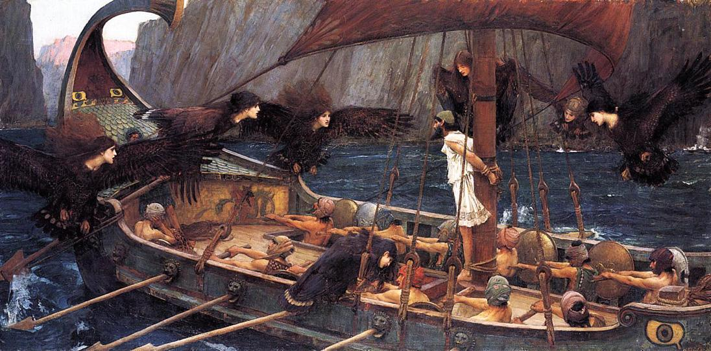

*Odysseus and the Sirens* by John William Waterhouse, Scene from Homer's *The Odyssey*

]

---

# Credible Commitment

.center[
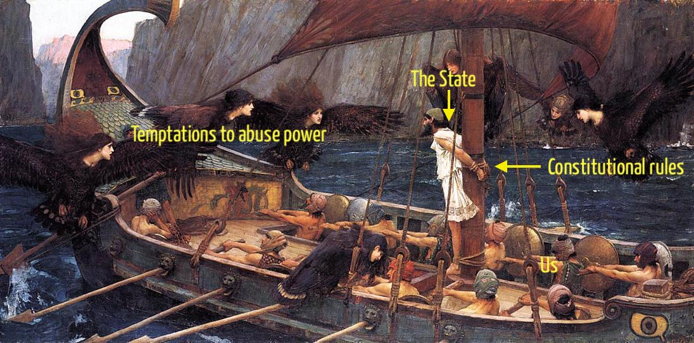

*Odysseus and the Sirens* by John William Waterhouse, Scene from Homer's *The Odyssey*

]

---

# Constitutions Are Not Self-Enforcing

.center[
<iframe width="980" height="550" src="https://www.youtube.com/embed/8afaQFLSTH4" title="YouTube video player" frameborder="0" allow="accelerometer; autoplay; clipboard-write; encrypted-media; gyroscope; picture-in-picture" allowfullscreen></iframe>
]

---

# Constitutions Are Not Self-Enforcing

.left-column[
.center[


George W. Bush

43rd President of the U.S.
]
]

.right-column[

> “Stop throwing the constitution in my face, the constitution is just a goddamn piece of paper!”

]

---

# Aside: Perhaps We Have a New Alternative

.pull-left[
.center[

]
]

.pull-right[
.center[
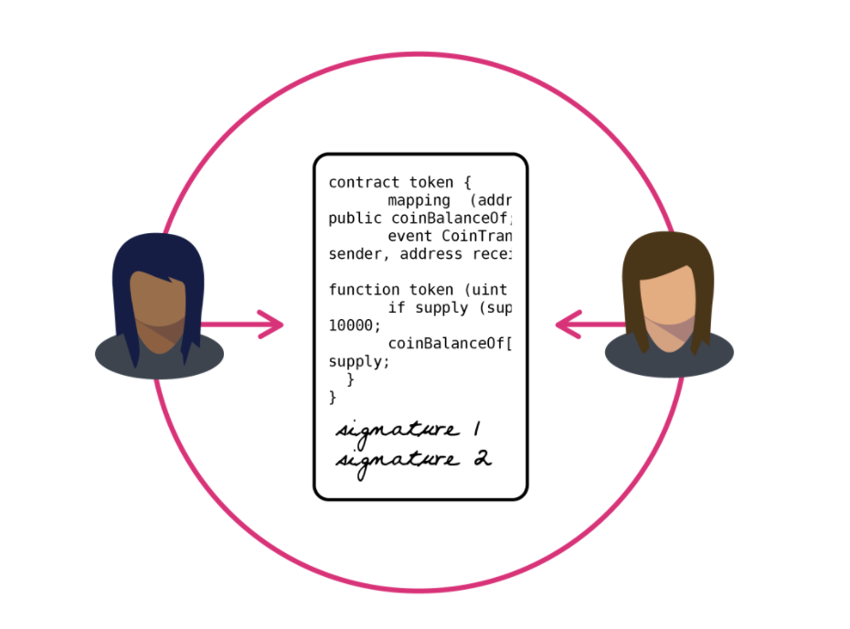
]
]

---

class: inverse, center, middle

# Application I: How Medieval Guilds *Promoted* Trade

---

class: inverse, center, middle

# The Commercial Revolution & Revivial of International Trade (c.1100-c.1300)

---

# The Revival of International Trade (c.1100) I

.center[
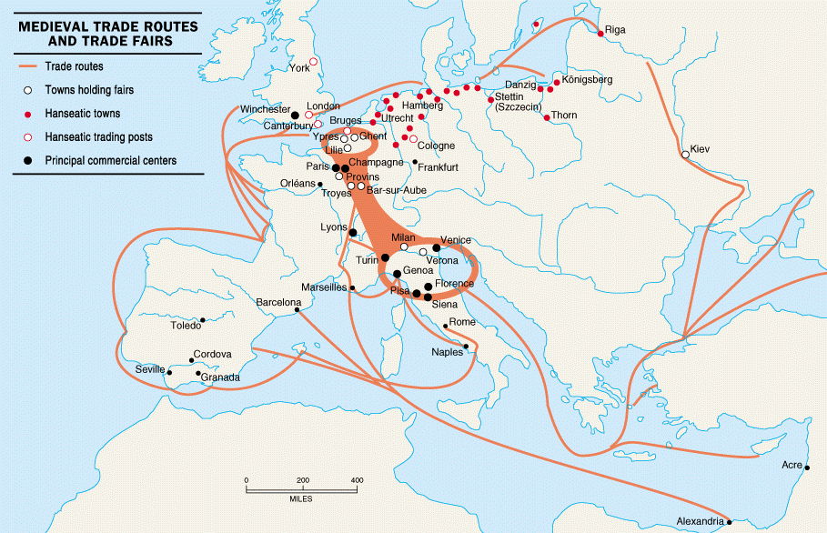
]

---

# The Commercial Revolution

.pull-left[

- Long distance trade in Medieval Europe based on exchange of goods brought from different parts of the world to central .hi[trade fairs]

.source[Milgrom, Paul R, Douglass C North, and Barry R Weingast, (1990), "The Role of Institutions in the Revival of Trade: The Law Merchant, Private Judges, and the Champagne Fairs," (Economics and Politics*2(1): 1-23]
]

.pull-right[
.center[

]
]

---

# Credible Commitments

.pull-left[
.smallest[
- .hi[Rulers] (kings, queens, emperor, lords) face certain incentives:
  - Trade is an attractive source of wealth (along with plundering and warfare)
  - Rulers have a strong incentive to create trading cities: potential .hi-purple[tax revenue]

- Often granted cities and merchants privileges and exemptions from feudal duties
  - Medieval towns as first proto-capitalist centers of specialization and trade 
]
]

.pull-right[
.center[
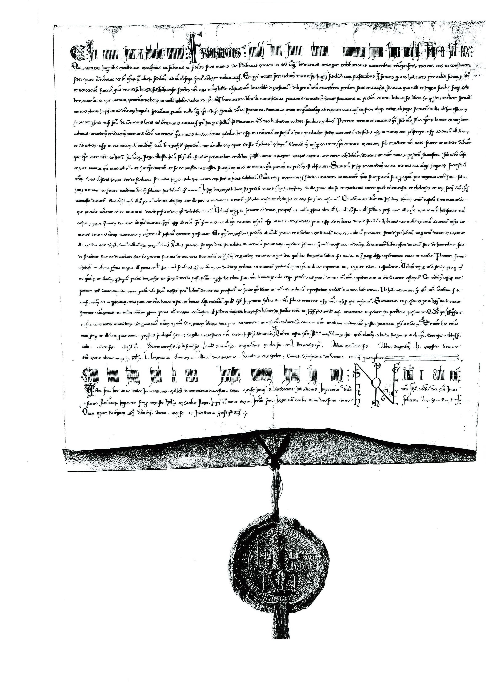
]
]

---

# Credible Commitments

.pull-left[
.smallest[
- Trade requires peace & stable property rights
  - Merchants, particularly **foreign** merchants, are easy pickings for a corrupt ruler

- After a ruler *promises* to protect trade, incentives arise for him/her to renege on promise! 
  - .hi-purple[How can rulers credibly commit to not confiscate the goods of foreigners?]

]
]

.pull-right[
.center[

]
]

---

# Credible Commitments

.pull-left[
.smallest[
- The.hi[“Commercial Revolution”] of 1100s-1200s
  - large increase in international trade
  - made possible by new institutions and shifting political power

1. Medieval guilds, leagues of city-states

2. Coalition and reputation system

3. Merchant law
]
]

.pull-right[
.center[
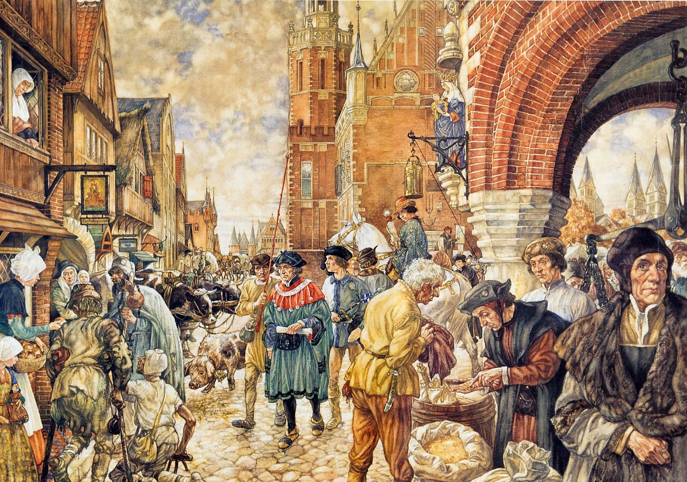
]
]

---


# The Role of Medieval Guilds in *Promoting* Trade

.pull-left[

- We often think of Medieval guilds as just monopolies or cartels meant to **restrict** trade
  - This is true

- But in a way they also **promoted** trade
  - Were set up by merchants to reduce transactions costs
  - Solved credible commitment problems for rulers

.source[Greif, Avner, Paul, Milgrom, and Barry Weingast, 1994, "Coordination, Commitment, and Enforcement: The Case of the Merchant Guild," *Journal of Political Economy* 102(4): 745-776]
]

.pull-right[
.center[

]

]

---

# The Hanseatic League

.center[
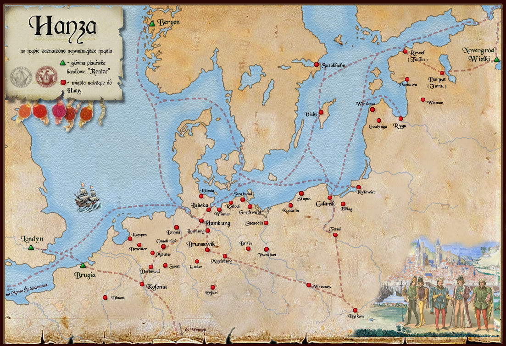

.smallest[
Most famous guild: Hanseatic League (German “Hansa”) of Northern Europe
]
]

---

# The Role of Medieval Guilds in *Promoting* Trade

.pull-left[

- Guilds were administrative bodies

- Ability to regulate trade within local region

- Guilds had chapters in each city, could gain access to all guild privileges abroad

- **Monitored** and provided **information** about merchant activity
  - Rulers (and merchants!) who cheated, broke promises, or were corrupt were widely publicized within guild
  
.source[Greif, Avner, Paul, Milgrom, and Barry Weingast, 1994, "Coordination, Commitment, and Enforcement: The Case of the Merchant Guild," *Journal of Political Economy* 102(4): 745-776]

]

.pull-right[
.center[
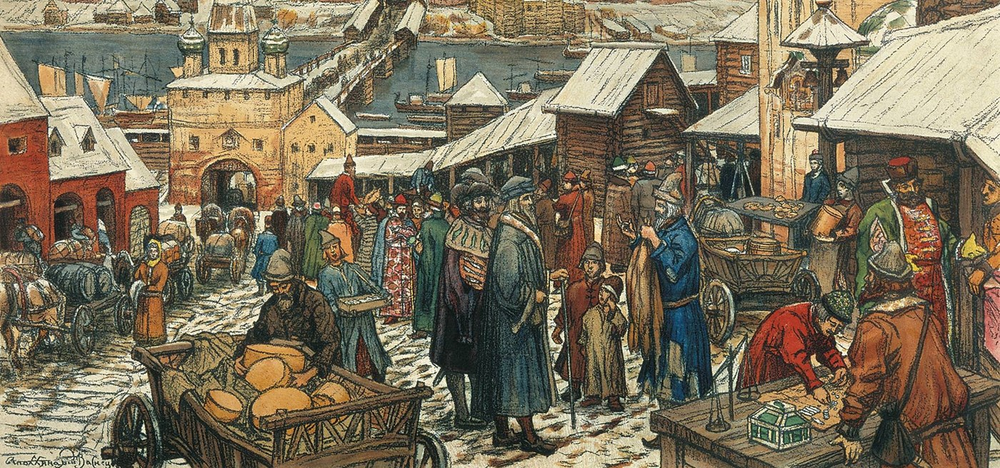
]

]

---

# The Role of Medieval Guilds in *Promoting* Trade

.pull-left[
.quitesmall[
- Guilds allowed merchants to .hi-purple[coordinate collective action] in punishing transgressors

- A .hi-purple[free rider problem] in punishment:
  - individual merchant doesn’t have incentive to punish
  - may have reason to get a corrupt bargain at expense of other merchants!

- Violating merchants would have their privileges revoked, or be expelled from guild

- Untrustworthy rulers would be .hi-purple[boycotted] by entire guild across Europe
  - Even a case of the Hanseatic League *going to war*!
  - 1358 Hansa embargo of Bruges

> “It was announced that any disobedience, whether by a town or an individual, was to be punished by perpetual exclusion from the Hansa”

]
]
.pull-right[
.center[

]

]

---

# The Role of Medieval Guilds in *Promoting* Trade

.pull-left[

- Threat of collective punishment enables rulers to .hi[credibly commit] to protect merchant rights
  - removes ruler’s temptation of a one-time expropriation
  - threatens infinite future punishment (think trigger strategy in game theory)

.source[Greif, Avner, Paul, Milgrom, and Barry Weingast, 1994, "Coordination, Commitment, and Enforcement: The Case of the Merchant Guild," *Journal of Political Economy* 102(4): 745-776]

]

.pull-right[
.center[

]

]

---

class: inverse, center, middle

# Application II: Market-Preserving Federalism

---

# Federalism

.left-column[
.center[

.smallest[
William H. Riker

1920-1993
]
]
]

.right-column[

> “A political system is .hi[federal] if is has *both*

> 1. A *hierarchy* of governments, each is autonomous in its own well-defined sphere of authority

> 2. The *autonomy* of each government is institutionalized in a manner that respect is *self-enforcing*”

Quoted in Weingast (1995) p.4

.source[Weingast, Barry R, 1995, "The Economic Role of Political Institutions: Market-Preserving Federalism and Economic Development," *Journal of Law, Economics, & Organization* 11(1): 1-31]

]

---

# Federalism: Necessary, but not Sufficient

.left-column[
.center[

]
]

.right-column[

- Argentina is a great example of what *not* to do, on paper, very decentralized

- Provinces have primary responsibility for education, health, poverty, housing, infrastructure, primary tax collection, etc

- But all provinces' tax revenues go to national government to be redistributed *back* to provinces
  - Most provinces finance less than 20% of their own spending

- What incentives does this create?

.source[Sanguinetti, Pablo and Mariano Tommasi, 2001, "Fiscal Federalism in Argentina: Policies, Politics, and Institutional Reform," *Journal of the Latin American and Caribbean Economic Association*]
]

---

# Federalism: Necessary, but not Sufficient

.left-column[
.center[

]
]

.right-column[

- Provincial governments spend *other people's money* but tax *their citizens* to fund *other* provinces!

- Thus, each province sets their spending high but taxes low

- Argentine federal government has repeatedly had to bail out provinces
  - Local governments face a "soft budget constraint"


.source[Sanguinetti, Pablo and Mariano Tommasi, 2001, "Fiscal Federalism in Argentina: Policies, Politics, and Institutional Reform," *Journal of the Latin American and Caribbean Economic Association*]
]
---

# Federalism: Necessary, but not Sufficient

.pull-left[
.center[

]
]

.pull-right[
.smaller[
- Federalism alone does not guarantee prosperity

- Tiebout competition unleashed only under certain circumstances

- Recall Madison's paradox and problem of credible commitment

- How do you get (subnational) governments to respect limitations put upon them?

- How can federalism be **self-enforcing** and **market-preserving**?
]
]

---

# *Market-Preserving* Federalism

.left-column[
.center[

.smallest[
Barry R. Weingast

1952-
]
]
]

.right-column[

In addition to Riker's definition, for federalism to be .hi-purple["market-preserving"], must also:

3) subnational governments have **primary regulatory responsibility** over the economy

4) a **common market** is ensured

5) lower governments face a **hard budget constraint**

.source[Weingast, Barry R, 1995, "The Economic Role of Political Institutions: Market-Preserving Federalism and Economic Development," *Journal of Law, Economics, & Organization* 11(1): 1-31]
]

---

# *Market-Preserving* Federalism

.pull-left[
.center[

]
]

.pull-right[

- National government's authority to intervene in economy must be limited (left primarily to States)

- States more subject to Tiebout competition than federal government
  - Credible threat of exit as constraint on State governments' fiscal and regulatory abuse, rent-seeking

- Congress passed 352 bills in 2013-2014, States passed over 45,000 ([Source](https://info.cq.com/resources/states-six-times-more-productive-than-congress/))


]

---

# *Market-Preserving* Federalism

.pull-left[
.center[

]
]

.pull-right[
.smallest[
- Constitution guarantees a common market, States cannot put up internal barriers or taxes against other States
  - Again, ensures Tiebout competition, freedom to relocate, limits rent-seeking

- Local governments must not be (even tacitly!) bailed out by federal government
  - Many U.S. States have **balanced budget requirements**
  - Federal bailouts would loosen fiscal discipline
]
]

---

# *Market-Preserving* Federalism: Game Theory

.left-column[
.center[

.smallest[
Barry R. Weingast

1952-
]
]
]

.right-column[

> "The fundamental political dilemma of an economic system is this: A government strong enough to protect property rights and enforce contracts is also strong enough to confis- cate the wealth of its citizens. Thriving markets require not only the appropriate system of property rights and a law of contracts, but .hi[a secure political foundation that limits the ability of the state to confiscate wealth]," (p.1)


.source[Weingast, Barry R, 1995, "The Economic Role of Political Institutions: Market-Preserving Federalism and Economic Development," *Journal of Law, Economics, & Organization* 11(1): 1-31]
]

---

# *Market-Preserving* Federalism: Game Theory

.left-column[
.center[

.smallest[
Barry R. Weingast

1952-
]
]
]

.right-column[

> "The answer concerns the design of political institutions that .hi[credibly commit] the state to preserving markets, that is, to limits on the future political discretion with respect to the economy that are in the interests of political officials to ob- serve...these limits must be .hi[self-enforcing]...political officials must have an incentive to abide by them," (p.2, emphasis in original).


.source[Weingast, Barry R, 1995, "The Economic Role of Political Institutions: Market-Preserving Federalism and Economic Development," *Journal of Law, Economics, & Organization* 11(1): 1-31]
]

---

# Weingast's Model: Legitimacy

.left-column[
.center[

.smallest[
Barry R. Weingast

1952-
]
]
]

.right-column[
.smallest[
- Citizens hold beliefs about appropriate bounds on government action
  - But heterogeneous: a *coordination problem* between citizens agreeing on what is legitimate
    - Even if citizens agree, what *actually happens* when government oversteps those bounds?

- Constraints only work if citizens react in concert against government's violations of those constraints!
  - Must hold sufficiently similar views
  - Citizens must punish government when it oversteps

]

.source[Weingast, Barry R, 1995, "The Economic Role of Political Institutions: Market-Preserving Federalism and Economic Development," *Journal of Law, Economics, & Organization* 11(1): 1-31]
]

---


# Weingast's Model: Legitimacy

.left-column[
.center[

.smallest[
Barry R. Weingast

1952-
]
]
]

.right-column[

> "In the language of game theory, we are searching for an equilibrium to a game in which the government has the opportunity to violate constraints but chooses not to" (p. 10)


.source[Weingast, Barry R, 1995, "The Economic Role of Political Institutions: Market-Preserving Federalism and Economic Development," *Journal of Law, Economics, & Organization* 11(1): 1-31]
]

---

# Weingast's Model: Game Setup

.left-column[
.center[

.smallest[
Barry R. Weingast

1952-
]
]
]

.right-column[
.smallest[
- Single sovereign, **S** and two groups of citizens, **A** and **B**
- **A** and **B** hold different views about the legitimate boundaries of **S**

- Sovereign needs the support of *at least* one group to maintain power

- Game moves as follows:
    1. **S** may decide to transgress against the rights of **A**, **B**, both, or neither
    2. **A** and **B** move simultaneously, may challenge or acquiesce to the sovereign
      - If both challenge, **S** is deposed
      - If only one challenges, (or neither), **S**'s transgression succeeds
]

.source[Weingast, Barry R, 1995, "The Economic Role of Political Institutions: Market-Preserving Federalism and Economic Development," *Journal of Law, Economics, & Organization* 11(1): 1-31]
]
---

# Weingast's Model: Game

.left-column[
.center[

.smallest[
Barry R. Weingast

1952-
]
]
]

.right-column[

.center[


]

.source[Weingast, Barry R, 1995, "The Economic Role of Political Institutions: Market-Preserving Federalism and Economic Development," *Journal of Law, Economics, & Organization* 11(1): 1-31]
]
---

# Weingast's Model: Game

.left-column[
.center[

.smallest[
Barry R. Weingast

1952-
]
]
]

.right-column[

.center[


]


.source[Weingast, Barry R, 1995, "The Economic Role of Political Institutions: Market-Preserving Federalism and Economic Development," *Journal of Law, Economics, & Organization* 11(1): 1-31]
]

---

# Weingast's Model: Results

.left-column[
.center[

]
]

.right-column[

- Need institutions to **coordinate** agreement on beliefs about what constitutes an infringement of rights

- Very long story short: **constitutions** (written, like the U.S. Constitution, or unwritten, like the U.K.) allow citizens to coordinate their beliefs to allow a sovereign to credibly commit to not overstepping bounds


.source[Weingast, Barry R, 1995, "The Economic Role of Political Institutions: Market-Preserving Federalism and Economic Development," *Journal of Law, Economics, & Organization* 11(1): 1-31]
]
---

# Weingast's Model: Results

.left-column[
.center[


]
]

.right-column[

- Local governments generate economic growth

- Leads to more local tax revenue, rents for officials

- Local governments have strong interest in preserving markets, preserves their own interests (tax revenue)


.source[Weingast, Barry R, 1995, "The Economic Role of Political Institutions: Market-Preserving Federalism and Economic Development," *Journal of Law, Economics, & Organization* 11(1): 1-31]
]

---

class: inverse, center, middle

# Application III: Rationalist Explanations for War

---

# Fearon’s Puzzle: Violence is Inefficient

.pull-left[

- Violence is always costly: reduces joint-income of parties
  - Transfer of resources to victor (not inefficient)
  - Deadweight loss: costs of investment in offense and defense (inefficient)
  - Some resources (and people) are also destroyed in the fighting

- Purely rational agents will choose conflict if $MB>MC$ *but*: a bargain is always preferable to conflict (cheaper)!
  - Even a bargain where a party loses significant resources $\succ$ warfare
  - Assuming parties bear the full cost of their actions

.source[Fearon, James, 1995, “Rationalist Explanations for War,” *International Organization* 49(3): 379-414]
]

.pull-right[
.center[
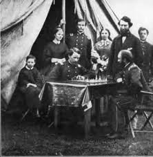
]
]

---

# Fearon’s Puzzle: Violence is Inefficient

.left-column[
.center[

.smallest[
James Fearon

1963-
]
]
]

.right-column[

> “As long as both sides suffer some costs for fighting, then war is always inefficient **ex post**—both sides would have been better off if they could have achieved the same final resolution without suffering the costs (or by paying lower costs). This is true even if the costs of fighting are small, or if one or both sides viewed the potential benefits as greater than the costs, since there are still costs. Unless states enjoy the activity of fighting for its own sake, as a consumption good, then war is inefficient **ex-post**,” (p.383).

.source[Fearon, James, 1995, “Rationalist Explanations for War,” *International Organization* 49(3): 379-414]
]

---

# Fearon’s Puzzle: Violence is Inefficient

.left-column[
.center[

.smallest[
James Fearon

1963-
]
]
]

.right-column[

> “The central question, then, is what prevents states in a dispute from reaching an **ex ante** agreement that avoids the costs they know will be paid **ex post** if they go to war?" Giving a rationalist explanation for war amounts to answering this question,” (p.383).

.source[Fearon, James, 1995, “Rationalist Explanations for War,” *International Organization* 49(3): 379-414]
]

---

# Explanations for War in Literature

.pull-left[
.smallest[
1. .hi-purple[Leaders/societies are irrational]
  - barbaric impulses, megalomania, overconfidence, bigotry, etc
  - overestimate own strength, underestimate opponents' strength
2. .hi-purple[Rational leaders do not internalize the costs of war]
  - a negative externality: leaders may start a war, but the soldiers and civilians bear the costs
  - wars are therefore over-produced 
3. If not 1-2, .hi-purple[it may still be rational for leaders to go to war under certain conditions]
  - This is Fearon's focus
]
]
.pull-right[
.center[

]
]

---

# Fearon’s Puzzle: Violence is Inefficient

.left-column[
.center[

.smallest[
James Fearon

1963-
]
]
]

.right-column[

> “The central question, then, is what prevents states in a dispute from reaching an **ex ante** agreement that avoids the costs they know will be paid **ex post** if they go to war?" Giving a rationalist explanation for war amounts to answering this question,” (p.383).

.source[Fearon, James, 1995, “Rationalist Explanations for War,” *International Organization* 49(3): 379-414]
]

---

# Fearon’s Puzzle: Violence is Inefficient

.left-column[
.center[

.smallest[
James Fearon

1963-
]
]
]

.right-column[

> “I propose that there are three defensible answers, which take the form of general mechanisms...In the first mechanism, rational leaders may be unable to locate a mutually preferable negotiated settlement due to .hi[private information about relative capabilities] or resolve .hi[incentives to misrepresent] such information...Second, rationally led states may be unable to arrange a settlement that both would prefer to war due to .hi[commitment problems], situations in which mutually preferable bargains are unattainable because one or more states would have an incentive to renege on the terms,” (p.381).

.source[Fearon, James, 1995, “Rationalist Explanations for War,” *International Organization* 49(3): 379-414]
]

---

# Rationalist Explanation I: Asymmetric Information

.pull-left[

- Rationalist cause for war: **asymmetric information**
  - parties do *not* know their relative strengths in violence potential
  - parties may know *own* military strength, but not opponents
  - have incentives to distort signals to other players 
]

.pull-right[
.center[
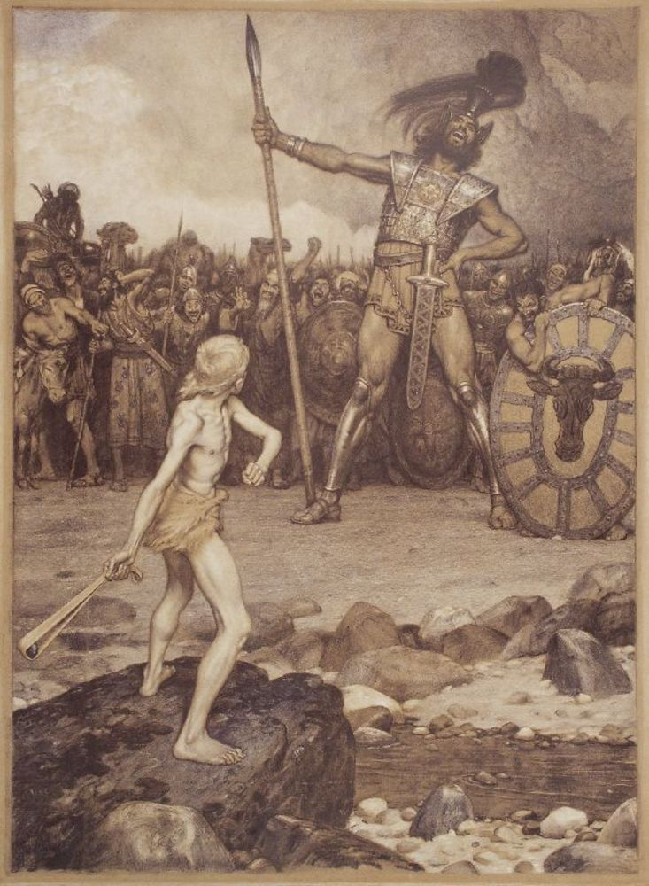
]
]

---

# Rationalist Explanation I: Asymmetric Information


.left-column[
.center[

.smallest[
James Fearon

1963-
]
]
]

.right-column[

> “As argued by John Harsanyi, if two rational agents have the same information about an uncertain event, then they should have the same beliefs about its likely outcome. The claim is that given identical information, truly rational agents should reason to the same conclusions about the probability of one uncertain outcome or another. Conflicting estimates should occur only if the agents have different (and so necessarily private) information,” (p.392).

.source[Fearon, James, 1995, “Rationalist Explanations for War,” *International Organization* 49(3): 379-414]
]

---

# Rationalist Explanation I: Asymmetric Information

.pull-left[
.center[

]
]

.pull-right[
.center[

]
]

.source[Allen, Douglas W., and Vera Lantinova, 2013, “The Ancient Olympics as a Signal of City-State Strength,” *Economics of Governance* 14: 23-44]

---

# Rationalist Explanation I: Asymmetric Information

.pull-left[
.center[

]
]

.pull-left[
.center[
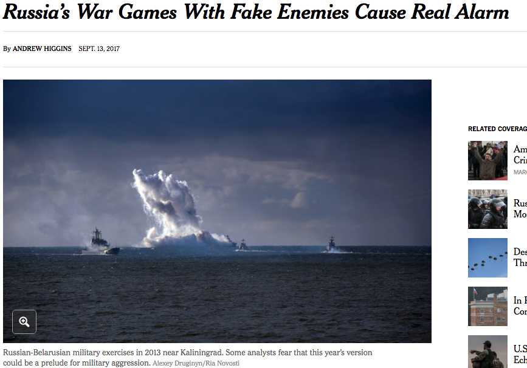
]
]

---

# Rationalist Explanation I: Asymmetric Information

.center[
<iframe width="980" height="550" src="https://www.youtube.com/embed/Wg0NHEufpk8" title="YouTube video player" frameborder="0" allow="accelerometer; autoplay; clipboard-write; encrypted-media; gyroscope; picture-in-picture" allowfullscreen></iframe>
]

---

# Explanation II: Credible Commitment Problems

.pull-left[

- Rationalist cause for war: **credible commitment problems**
  - there exists a mutually-agreeable bargain preferable to war by both parties
  - parties cannot trust each other to uphold it
  - expectations about shifts in relative strengths in future can incentivize a preemptive strike
]

.pull-right[
.center[

]
]

---

# Explanation II: Credible Commitment Problems

.left-column[
.center[

.smallest[
James Fearon

1963-
]
]
]

.right-column[

> “Consider the problem faced by two gunslingers with the following preferences. Each would most prefer to kill the other by stealth, facing no risk of retaliation, but each prefers that both live in peace to a gunfight in which each risks death. There is a bargain here that both sides prefer to "war"—namely, that each leaves the other alone-but without the enforcement capabilities of a third party, such as an effective sheriff, they may not be able to attain it. Given their preferences, neither person can credibly commit not to defect from the bargain by trying to shoot the other in the back,” (p.402).

.source[Fearon, James, 1995, “Rationalist Explanations for War,” *International Organization* 49(3): 379-414]
]

---

# Explanation II: Credible Commitment Problems

.left-column[
.center[

.smallest[
James Fearon

1963-
]
]
]

.right-column[

> “Note that no matter how far the shadow of the future extends, iteration (or repeat play) will not make cooperation possible in strategic situations of this sort. Because being the "sucker" here may mean being permanently eliminated, strategies of conditional cooperation such as tit-for-tat are infeasible,” (p.402).

.source[Fearon, James, 1995, “Rationalist Explanations for War,” *International Organization* 49(3): 379-414]
]

---

# Explanation II: Credible Commitment Problems

.left-column[
.center[

.smallest[
James Fearon

1963-
]
]
]

.right-column[

> “Preemptive war scenarios provide the analogy. If geography or military technology happened to create large first-strike or offensive advantages, then states might face the same problem as the gunslingers,” (p.402).

.source[Fearon, James, 1995, “Rationalist Explanations for War,” *International Organization* 49(3): 379-414]
]

---

# Explanation II: Credible Commitment Problems

.pull-left[
.smallest[
- As an example, suppose the Ancient Greek world is a pie worth 100

- If there is a war between Greek city states, the winner gets 100, the loser gets 0
]
]
.pull-right[
.center[

]
]

---

# Explanation II: Credible Commitment Problems

.pull-left[
.smallest[
- As an example, suppose the Ancient Greek world is a pie worth 100

- If there is a war between Greek city states, the winner gets 100, the loser gets 0
  - Fighting in a war costs 10
  
- Suppose .hi-red[Athens] and .hi-blue[Sparta] are equally powerful, $p=0.50$ chance each would win
]
]
.pull-right[
.center[
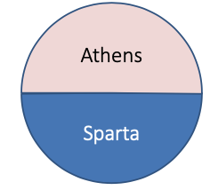
]
]

---

# Explanation II: Credible Commitment Problems

.pull-left[
.smallest[
- As an example, suppose the Ancient Greek world is a pie worth 100

- If there is a war between Greek city states, the winner gets 100, the loser gets 0
  - Fighting in a war costs 10

- Suppose .hi-red[Athens] and .hi-blue[Sparta] are equally powerful, $p=0.50$ chance each would win

$$\begin{align*}
E[War]&=[0.50(100)+0.5(0)]-10\\
&= [50]-10\\
&= 40\\ \end{align*}$$
]
]
.pull-right[
.center[

]
]

---

# Explanation II: Credible Commitment Problems

.pull-left[
.smallest[
- The expected value of fighting a war is 40

- This implies that .hi-red[Athens] (for example) would find any split greater than 40 preferable to war

- The cost of 10 to each side creates a **bargaining range** of 10+10 = 20 wide
  - .hi-red[Athens] makes an offer to .hi-blue[Sparta] of $40<x<60$ to prevent war

- Costly war provides incentives for a peaceful bargain

]
]
.pull-right[
.center[
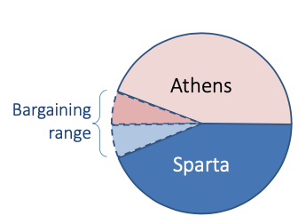
]
]

---

# Explanation II: Credible Commitment Problems

.pull-left[
.smallest[
- But suppose the balance of power is different, .hi-blue[Sparta] is more powerful $(p=0.75)$ chance of defeating Athens
  - War still costs each 10, plus the expected value of winning

- To prevent war, .hi-red[Athens] would have to give .hi-blue[Sparta] an offer of $65 < x < 85$

]
]
.pull-right[
.center[
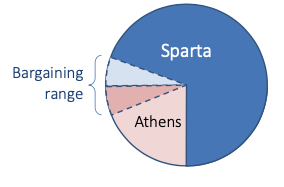
]
]

---

# Explanation II: Credible Commitment Problems

.pull-left[
.smallest[
- But further suppose that while this is the distribution of power *now*, .hi-red[Athens] is on the rise, and will (if unchecked), become the dominant power in the future

]
]
.pull-right[
.center[
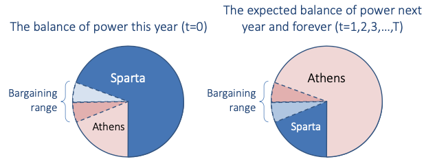
]
]

---

# Explanation II: Credible Commitment Problems

.pull-left[
.smallest[
- But further suppose that while this is the distribution of power *now*, .hi-red[Athens] is on the rise, and will (if unchecked), become the dominant power in the future

- .hi-blue[Sparta] has 75% chance to win the pie *now* and earn 100 forever (minus the war cost of 10)
  - If it peacefully negotiates with .hi-red[Athens], it expects to get 25 forever

- .hi-red[Athens] needs to compensate .hi-blue[Sparta] A LOT to buy off an attack
  - This amount surely exceeds .hi-red[Athens’] ability to pay now, .hi-purple[cannot credibly commit] to paying to prevent war in the future

]
]
.pull-right[
.center[

]
]

---

# Explanation II: Credible Commitment Problems

.left-column[
.center[

.smallest[
James Fearon

1963-
]
]
]

.right-column[

> “In words (roughly), if B's expected decline in military power is too large relative to B's costs for war, then state A's inability to commit to restrain its foreign policy demands after it gains power makes preventative attack rational for state B,” (p.402).

.source[Fearon, James, 1995, “Rationalist Explanations for War,” *International Organization* 49(3): 379-414]
]

---


# The Thucydides Trap

.left-column[

.center[


.smallest[
Thucydides
(c. 460 B.C.-- c. 400 B.C.)
]
]
]

.pull-right[

> "What made war inevitable was the growth of Athenian power and the fear which this caused in Sparta," *History of the Peloponnesian War*.


.center[

]
]

---

# The Thucydides Trap

.left-column[
.center[


Graham Allison

1940—
]
]

.right-column[

"In 12 of 16 past cases in which a rising power has confronted a ruling power, the result has been bloodshed."

.center[
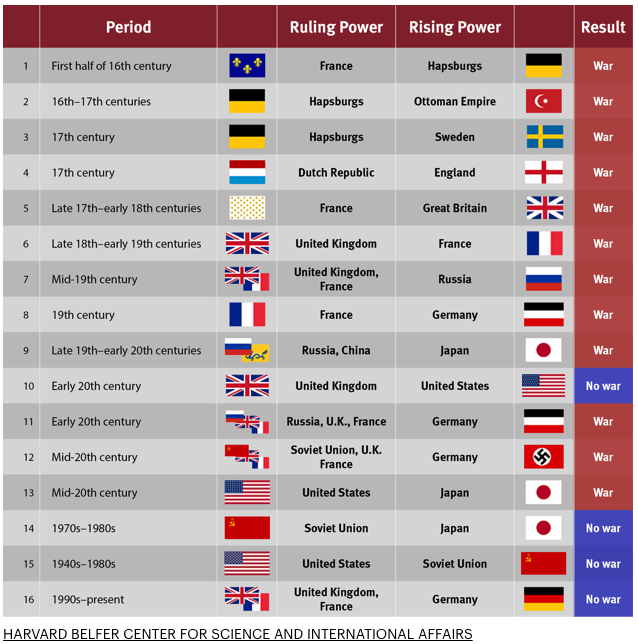
]

.source[Allison, Graham, 2015, [“The Thucydides Trap: Are the U.S. and China Headed for War?”](https://www.theatlantic.com/international/archive/2015/09/united-states-china-war-thucydides-trap/406756), *The Atlantic*]
]