```{r setup, include=FALSE}
options(htmltools.dir.version = FALSE)
knitr::opts_chunk$set(echo=F,
                      message=F,
                      warning=F,
                      fig.retina = 3,
                      fig.align = "center")
library("tidyverse")
library("ggrepel")
library("fontawesome")
xaringanExtra::use_tile_view()
xaringanExtra::use_tachyons()
xaringanExtra::use_freezeframe()

update_geom_defaults("label", list(family = "Fira Sans Condensed"))
update_geom_defaults("text", list(family = "Fira Sans Condensed"))

set.seed(256)

theme_slides <- theme_light() + 
  theme(
    text = element_text(family = "Fira Sans", size = 24)
  )
```

class: inverse

# Outline

### [Information in Games](#3)
### [Incomplete Information](#9)
### [Asymmetric Information](#27)
### [Example Simultaneous Bayesian Game & Bayesian Nash Equilibrium](#27)

---

class: inverse, center, middle

# Information in Games

---

# Information

.pull-left[

- .hi[Perfect information]: all players know the rules and all possible strategies, payoffs, and move history of other players 

- .hi-purple[Common knowledge] assumption: Player 1 knows that Player 2 knows that Player 1 knows that ... 
]

.pull-right[
.center[

]
]

---

# Information

.pull-left[

- .hi[Imperfect information]: players all know the game, but don't know what other players are choosing
  - .hi-purple[“Strategic uncertainty”]
  - Seen as simultaneous games
    
- .hi[Incomplete information]: players don't have all the information about the game
  - .hi-purple[“External uncertainty”]
  - Who the other players are, what payoffs are, etc.
]

.pull-right[
.center[

]
]

---

# Simultaneous Games and Imperfect Information

.pull-left[
- Let’s consider the simultaneous-move **Stag Hunt** in **strategic form**

- We can't model this as an *extensive form* game with perfect information
    - Each player doesn’t know what the other chose

]

.pull-right[
.center[
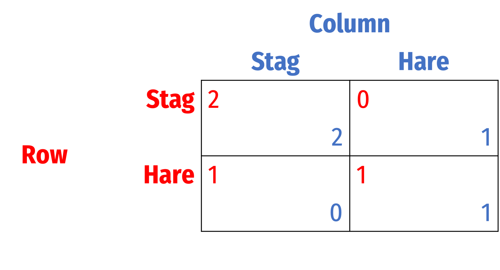
]
]

---

# Simultaneous Games and Imperfect Information

.pull-left[
- We *can* model it in **extensive form** with **imperfect information**
  - Let .red[Row] move first (order really doesn't matter with symmetric payoffs)

- .red[Row]’s move is hidden from .blue[Column]:
  - Can't distinguish between the **history** where .red[Row] chose .red[Stag] and the history where .red[Row] chose .red[Hare].

]

.pull-right[
.center[
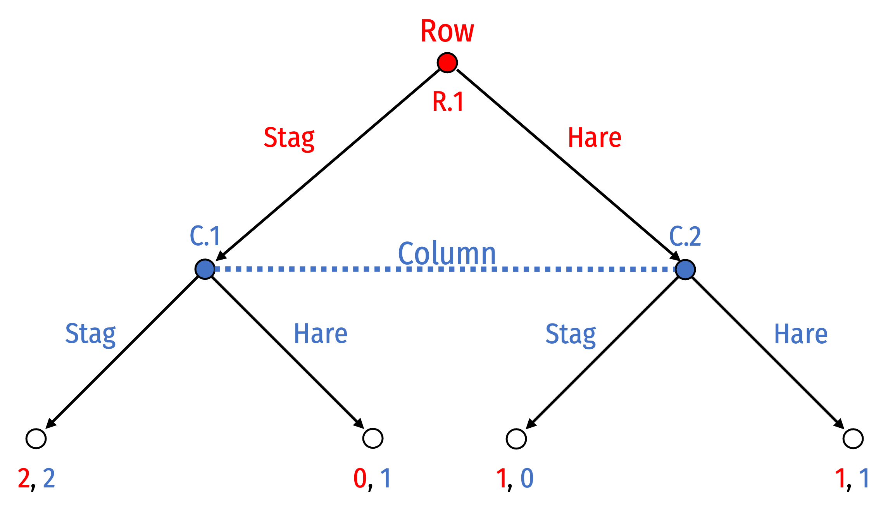
]
]

---

# Simultaneous Games and Info Sets

.pull-left[

- .hi-purple[Information set] (dotted line/oval connecting decision nodes) for .blue[Column] $\implies$ can’t distinguish between histories of .red[Stag] or .red[Hare]

- .blue[Column] doesn’t know if they are deciding at node .blue[C.1] or .blue[C.2] (whether .red[Row] has played .red[Stag] or .red[Hare])

]

.pull-right[
.center[

]
]

---

# Simultaneous Games and Info Sets

.pull-left[

- .hi-purple[Information set] (dotted line/oval connecting decision nodes) for .blue[Column] $\implies$ can’t distinguish between histories of .red[Stag] or .red[Hare]

- .blue[Column] doesn’t know if they are deciding at node .blue[C.1] or .blue[C.2] (whether .red[Row] has played .red[Stag] or .red[Hare])

]

.pull-right[
.center[
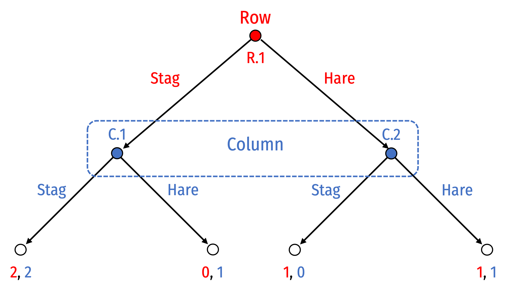
]
]

---

# Simultaneous Games: No Mover Advantage

.pull-left[
.center[

]
]

.pull-right[
.center[
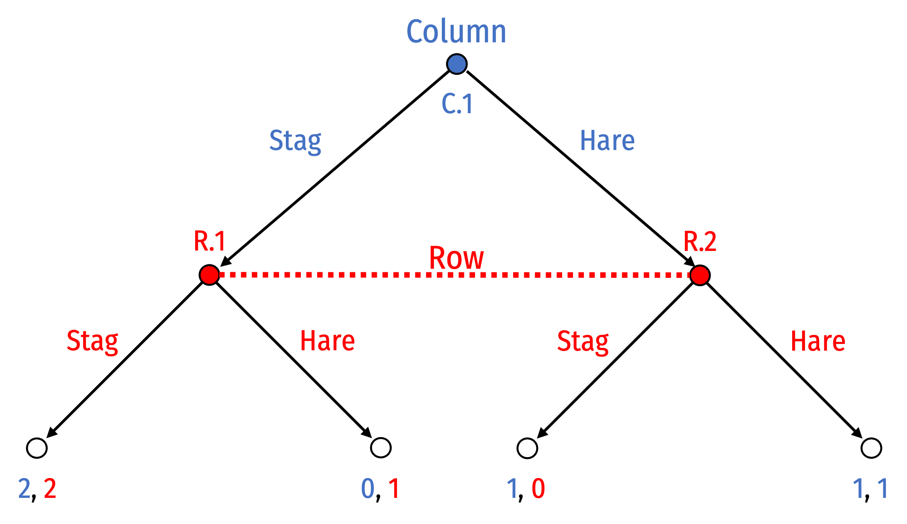
]
]

- Note changing who moves first here makes no difference on the game, since “second-mover” still does not know what “first-mover” chooses!

---

# Strategies and Information Sets

.pull-left[
- Strategies available to player within an information set must be the same across all decision nodes/histories

- If they are different, player can tell which history they are on given the unique strategies available to them
  - .blue[Column] would clearly know if they are at node .blue[C.1] or .blue[C.2] since strategies available are different!
]

.pull-right[
.center[
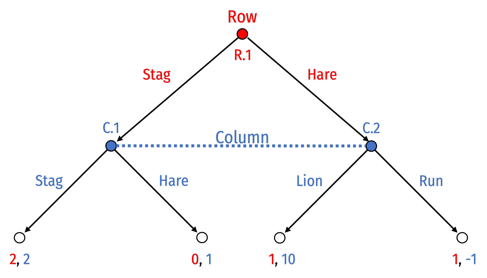

This is not a valid game
]
]

---

# Strategies and Information Sets

.pull-left[
- Furthermore, .blue[Column] must play the *same* strategy across the decision nodes 
  - (i.e. *always* .blue[Stag] or *always* .blue[Hunt]) at *both* (.blue[C.1] and .blue[C.2])
  - Can’t play (.blue[Stag], .blue[Hare]) or (.blue[Hare], .blue[Stag]) at .blue[(C.1,C.2)]

- Again, doesn’t know what decision node they are actually deciding at

]

.pull-right[
.center[

]
]

---


# Strategies and Information Sets

.pull-left[
- Clarify what we mean by .hi[strategy]: a complete plan of action of all the decisions a player will make at every possible **information set**
  - (rather than merely every decision node)

- Until now, information sets have consisted of a single decision node (“singleton”)
]

.pull-right[
.center[

]
]

---

# Perfect Information

.pull-left[
- We can now more precisely define .hi[perfect information]: no information sets contain multiple decision nodes (are all “singleton” nodes)

- Individual can differentiate between histories of game at each decision node
]

.pull-right[
.center[
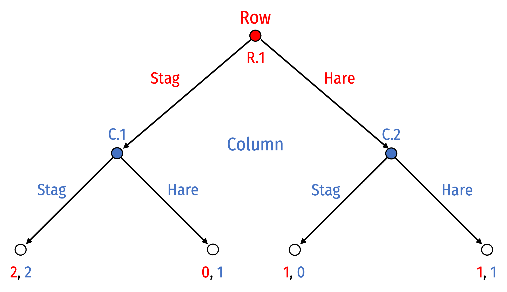
]
]

---

# Stag Hunt with Perfect Information

.pull-left[

- With **perfect information**, .blue[Column]’s strategies can be conditional on what .red[Row] plays
  1. .blue[(Stag, Stag)]
  2. .blue[(Stag, Hare)]
  3. .blue[(Hare, Stag)]
  4. .blue[(Hare, Hare)]

- Each information set is a singleton (i.e. nodes .blue[C.1] and .blue[C.2] each contain a separate information set)
]

.pull-right[
.center[


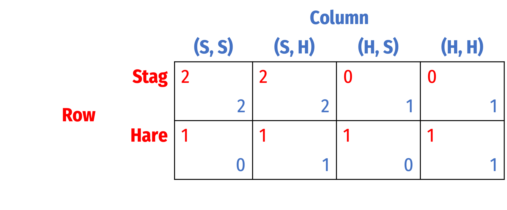
]
]
---

# Stag Hunt with Perfect Information

.pull-left[

- Using normal form, three Nash equilibria with **perfect information**:
1. {.red[Stag], .blue[(Stag, Stag)]}
2. {.red[Stag], .blue[(Stag, Hare)]}
3. {.red[Hare], .blue[(Hare, Hare)]}
]

.pull-right[
.center[


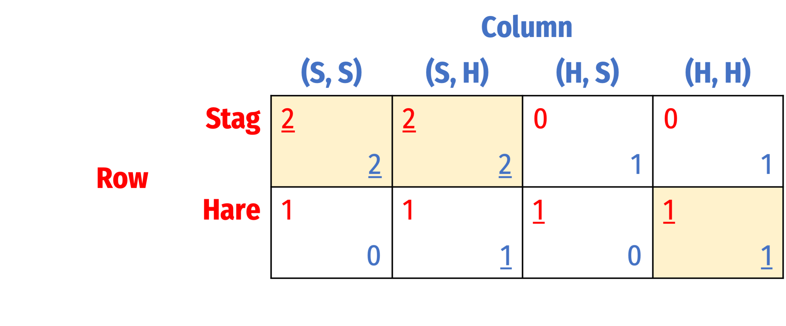
]
]

---

# Stag Hunt with Perfect Information

.pull-left[

- Using normal form, three Nash equilibria with **perfect information**:
1. {.red[Stag], .blue[(Stag, Stag)]}
2. **{.red[Stag], .blue[(Stag, Hare)]}**
3. {.red[Hare], .blue[(Hare, Hare)]}

- Only #2 {.red[Stag], .blue[(Stag, Hare)]} is .hi-purple[subgame perfect] 
]

.pull-right[
.center[
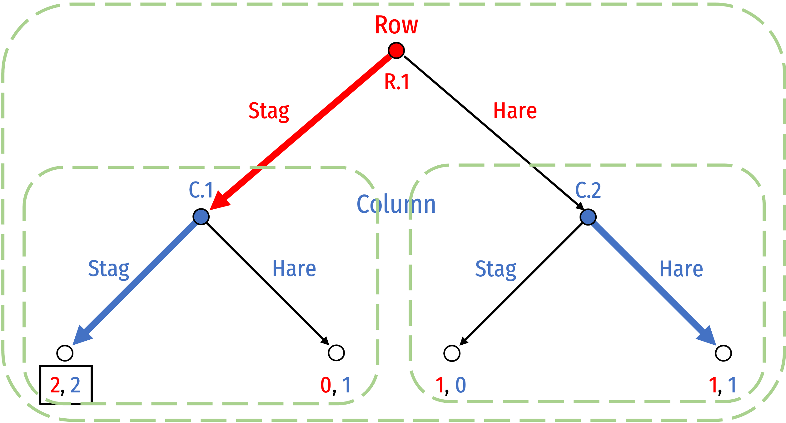

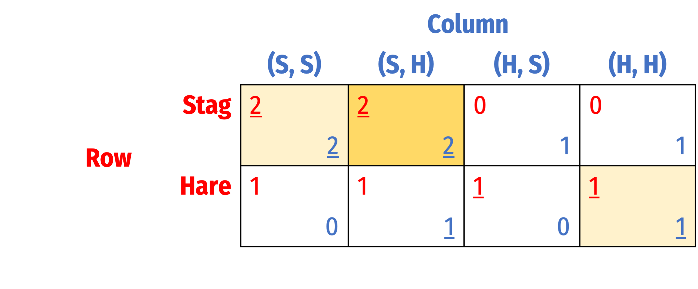
]
]

---

# Imperfect Information and Subgame Perfection

.pull-left[
.smallest[
- With .hi-purple[imperfect information], some information sets contain multiple decision nodes

- A subgame must contain all nodes in the information set, cannot “break” information sets
  - Nodes .blue[2.1] and .blue[2.2] do *not* initiate subgames (breaks information sets)
  - The *only* subgame possible is the overall game itself (contains all nodes in information set)
  
- We **cannot** use subgame perfection as a solution concept here
]
]

.pull-right[
.center[
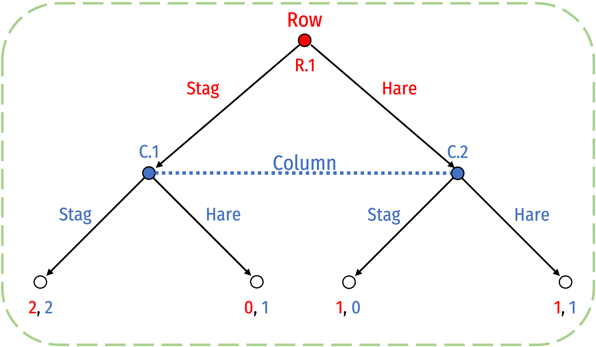
]
]

---

# Imperfect Info. May Imply A Simultaneous Game

.pull-left[

- .blue[Column] cannot play any *conditional* strategies depending on what .red[Row] does
  - Can’t know what .red[Row] will play!
  - Must choose an *unconditional* strategy to always play .blue[Stag] or .blue[Hare]
  
- All we can do is solve the game via strategic form as usual

]

.pull-right[
.center[
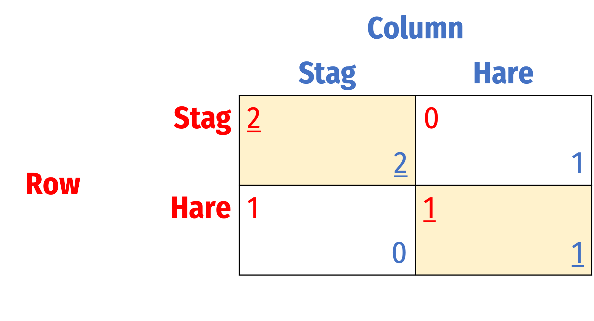
]
]

---

class: inverse, center, middle

# Incomplete Information

---

# Incomplete Information

.pull-left[
- Even in games with imperfect information (e.g. simultaneous games), we have assumed information was .hi-purple[complete]
  - Players know the rules, strategies available, and the payoffs to each player

- Source of uncertainty was .hi-purple[strategic]: players didn’t know the **history** of the game (moves made by other players)
]

.pull-right[
.center[

]
]

---

# Incomplete Information

.pull-left[
- Now consider games with .hi[incomplete information]
  - Players don’t know something about the game
  - Common example: what the payoffs to the other player are (but know your own)

- Textbook calls this .hi-purple[external uncertainty]: the game is not fully clear due to some undetermined external factors 
]

.pull-right[
.center[

]
]

---

# External Uncertainty: Playing with Nature

.pull-left[
- We can deal with .hi-purple[external uncertainty] by including **Nature** as a player

- **Nature** has no strategic interest in the outcomes (has no payoff and no objectives)

- Really just a metaphor for rolling (possibly weighted) dice
]

.pull-right[
.center[

]
]

---

# External Uncertainty: Simple Example

.pull-left[

- Consider a .red[Farmer] who (ignoring competition) must determine what crops to plant: .red[Beans], which do better in dry seasons; or .red[Rice] which does better in wet seasons

- Let **Nature** decide what the weather this season will be
  - With some probability $p$, **Nature** will “choose” a **wet** season

- .red[Farmer] can’t know what **Nature** chose
]

.pull-right[
.center[
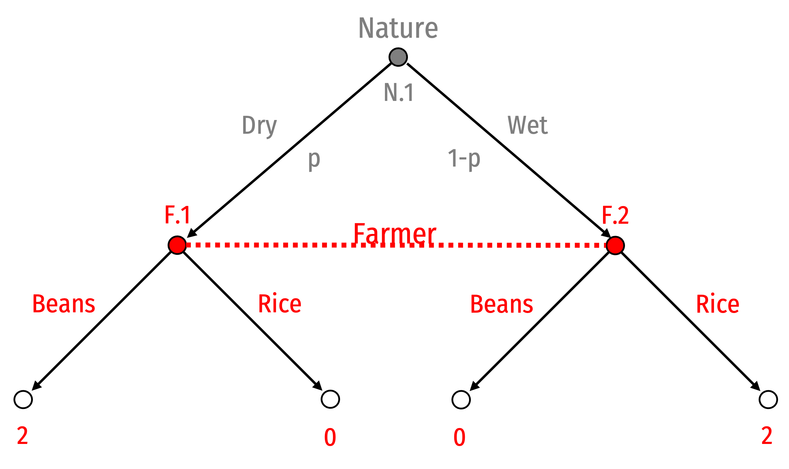
]
]

---

# External Uncertainty: Simple Example

.pull-left[

- .red[Farmer] must maximize **expected payoff**

- Consider a mixed strategy “against” **Nature**

]

.pull-right[
.center[
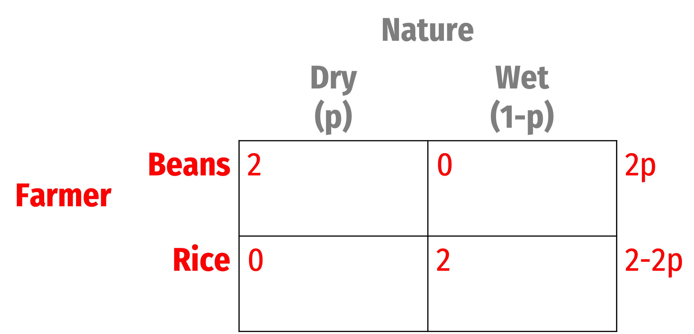
]
]

---

# External Uncertainty: Simple Example

.pull-left[

- .red[Farmer] must maximize **expected payoff**

- Consider a mixed strategy “against” **Nature**

$$\begin{align*}
E[\color{red}{Beans}]&=E[\color{red}{Rice}] \\
2p &= 2-2p\\
p^\star &= 0.50 \\
\end{align*}$$

- If $p>0.50$, .red[Farmer] should plant .red[Rice]
- If $p<0.50$, .red[Farmer] should plant .red[Beans]

]

.pull-right[
.center[

]
]

---
# External Uncertainty: Simple Example

.pull-left[

- Now suppose .red[Farmer] can estimate (based on experience, forecasts, etc) $p$ to be 0.40

- Now .red[Farmer] has a pure strategy “against” **Nature**

$$\begin{align*}
E[\color{red}{Beans}]&<E[\color{red}{Rice}] \\
(0.40)2+(0.60)0+ &< (0.40)0+(0.60)2\\
0.80 < 1.20 \\
\end{align*}$$

- Definitely plant .red[Rice]

]

.pull-right[
.center[
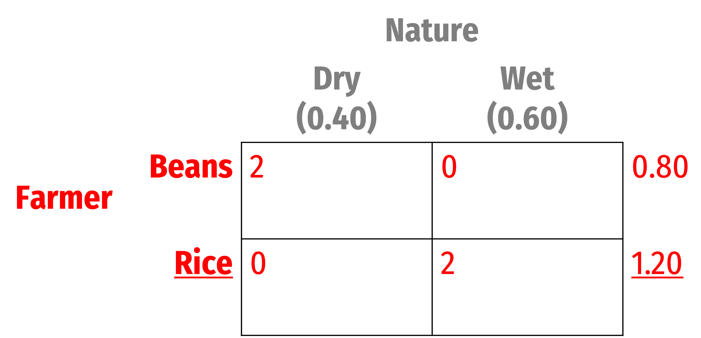
]
]

---

# External Uncertainty: Simple Example

.pull-left[

- Key here is .red[Farmer]’s .hi-purple[beliefs] about $p$

]

.pull-right[
.center[

]
]

---

class: inverse, center, middle

# Asymmetric Information & Simultaneous Bayesian Games

---

# Asymmetric Information

.pull-left[
- A particular type of incomplete information is .hi[asymmetric information], where players might not know all relevant information about others
  - Other player’s strategies, payoffs, preferences, or “type”

- Typically, one player has important .hi-purple[private information] about themself that other players are not privy to
  - e.g. .blue[Player 2] knows their “type” but .red[Player 1] does not know .blue[Player 2]’s type
]

.pull-right[
.center[

]
]

---

# Asymmetric Information

.left-column[
.center[
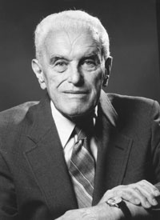
.smallest[
John C. Harsanyi

1920—2000

Economics Nobel 1994
]
]
]

.right-column[

.smallest[
> “[T]he original game can be replaced by a game where nature first conducts a lottery in  accordance with the basic probablity distribution, and the outcome of this lottery will  decide which particular subgame will be played, i.e., what the actual values of the relevant parameters will be in the game. Yet each player will receive only partial
information about the outcome of the lottery, and about the values of these parameters,” (p.159).

]
.source[Harsanyi, John C, 1976, “Games with Incomplete Information Played by ‘Bayesian’ Players I-III, Part I: The Basic Model,” *Management Science* 14(3): 159—182]
]

---

# Asymmetric Information

.left-column[
.center[

.smallest[
John C. Harsanyi

1920—2000

Economics Nobel 1994
]
]
]

.right-column[

.smallest[
> “In such a game player 1's strategy choice will depend on what he expects (or believes) to be player 2's payoff function `\\(U_2\\)`, as the nature of the latter will be an important detemunant of player 2's behavior in the game...If we follow the Bayesian approach and represent the players' expectations or beliefs by subjective probability distributions, then player 1's first-order expectation will have the nature of a subjective probability distribution `\\(P_1^1(U_2)\\)` over all alternative payoff functions `\\(U_2\\)` that player 2 may possibly have. Likewise, player 2's first-order  expectation will be a subjective probability distribution `\\(P_2^1(U_1)\\)` over all alternative payoff functions `\\(U_1\\)` that  player 1 may possibly have,” (pp.163—164).

]
.source[Harsanyi, John C, 1976, “Games with Incomplete Information Played by ‘Bayesian’ Players I-III, Part I: The Basic Model,” *Management Science* 14(3): 159—182]
]

---

# Asymmetric Information

.left-column[
.center[

.smallest[
John C. Harsanyi

1920—2000

Economics Nobel 1994
]
]
]

.right-column[

.smallest[

> “The purpose of this paper is to suggest an alternative approach to the analysis of games with incomplete information. This approach will be based on constructing, for any given game [of incomplete information], some game [of complete information] game-theoretically equivalent to [the first game].” (pp.164—165).

> “Thus, our approach will basically amount to replacing a game `\\(G\\)` involving incomplete information, by a new game `\\(G^\star\\)` which involves complete but imperfect information, yet which is, as we shall argue, essentially equivalent to `\\(G\\)` from a game-theoretical point of view,” (p.166).

]
.source[Harsanyi, John C, 1976, “Games with Incomplete Information Played by ‘Bayesian’ Players I-III, Part I: The Basic Model,” *Management Science* 14(3): 159—182]
]

---

# Asymmetric Information

.left-column[
.center[

.smallest[
John C. Harsanyi

1920—2000

Economics Nobel 1994
]
]
]

.right-column[

.smallest[

> “Accordingly, we define a [game of incomplete information] `\\(G\\)` where every player `\\(j\\)` *knows* the strategy spaces `\\(S_i\\)` of all players `\\(i=1, \cdots, j, \cdots n\\)` but where, in general, he does *not* know the payoff functions `\\(U_i\\)` of these players `\\(i=1, \cdots, j, \cdots n\\)`,” (p.166).

]
.source[Harsanyi, John C, 1976, “Games with Incomplete Information Played by ‘Bayesian’ Players I-III, Part I: The Basic Model,” *Management Science* 14(3): 159—182]
]

---


# Asymmetric Information

.pull-left[
.smallest[
- Players have .hi-purple[beliefs] about other players’ strategies & payoffs according to a probability distribution
  - Harsanyi shows it’s sufficient to assume players have a “type”

- Shows that for every game of incomplete information, there are equivalent (sub-)games with complete (but imperfect) information

- “Bayesian” since players assumed to update their beliefs according to Bayes’ rule (more on that next time)
]
]

.pull-right[
.center[

]
]

---

# Asymmetric Information

.pull-left[

- Until now, our definition of a game (with complete information) has consisted of:

1. Players
2. Strategies
3. Payoffs (jointly determined by players’ chosen strategies)
]

.pull-right[
.center[

]
]
---

# Asymmetric Information

.pull-left[

- With a game of *incomplete* information a game consists of:

1. Players
  - **Types of players**
  - **Common prior beliefs about players**
2. Strategies
  - Strategies **conditioned on beliefs** about player types
3. Payoffs (jointly determined by players’ chosen strategies)
  - **Payoffs depend on types**
]

.pull-right[
.center[

]
]

---

# Bayesian Simultaneous Games

.pull-left[

- A new class of .hi[Bayesian games] due to the role of information and beliefs

- We will consider simultaneous games first, then sequential games later

- .hi-purple[Bayesian Nash equilibrium (BNE)]: set of strategies, one for each (**type** of) player where no (**type** of) player wants to change given what the others are doing
  - i.e. each (**type** of) player is playing a best response
]

.pull-right[
.center[

]
]

---

# Bayesian Nash Equilibria

.pull-left[

- Two categories of equilibria in Bayesian games (with different players)

1. .hi-purple[Pooling equilibrium]: all types of players play the **same** strategy
2. .hi-purple[Separating equilibrium]: different types of players play **different** strategies
]

.pull-right[
.center[

]
]

---

# Bayesian Game Example

.pull-left[
.smallest[
- .red[Rowena] and .blue[Colin] play where they can each **Cooperate** or **Defect**

- Suppose .blue[Colin] could be one of two types:
  - **Prisoners’ Dilemma**-type payoffs: 
  
  (.red[C], .blue[D]) $\succ$ (.red[C], .blue[C]) $\succ$ (.red[D], .blue[D]) $\succ$ (.red[D], .blue[C])
  - **Stag Hunt**-type payoffs: 
  
  (.red[C], .blue[C]) $\succ$ (.red[D], .blue[D]) $\sim$ (.red[C], .blue[D]) $\succ$ (.red[D], .blue[C])

- .red[Rowena] has **Stag Hunt**-type payoffs 

(.red[C], .blue[C]) $\succ$ (.red[D], .blue[D]) $\sim$ (.red[D], .blue[C]) $\succ$ (.red[C], .blue[D])
]
]
.pull-right[
.center[
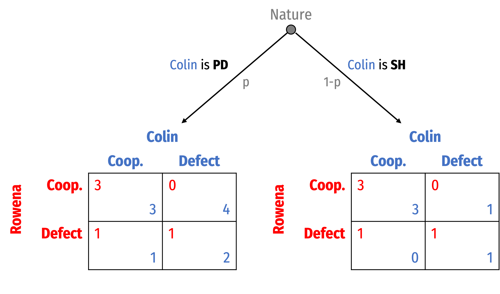
]
]

---

# Interpreting Nature in the Example

.pull-left[
.smallest[
1. The identity of the other player is known, but .hi-turquoise[their preferences are unknown]
  - .red[Rowena] know she is playing with .blue[Colin], but doesn’t know if he has PD or SH preferences
  - **Nature** whispers to .blue[Colin] his type, and .red[Rowena] has to figure it out

2. Nature selects .blue[Colin] from a population of .hi-turquoise[potential player types]
  - .red[Rowena] knows she will play with another player, but doesn’t know if s/he is playing PD or SH, **Nature** decides
]
]

.pull-right[
.center[

]
]

---

# Bayesian Game Example

.pull-left[
.smallest[
- .red[Rowena] must choose between two strategies, .red[Cooperate] or .red[Defect]

]
]
.pull-right[
.center[

]
]

---

# Bayesian Game Example

.pull-left[
.smallest[
- .red[Rowena] must choose between two strategies, .red[Cooperate] or .red[Defect]

- If she plays .red[Cooperate]
  - A .blue[**SH**-type Colin] will want to .blue[Cooperate], both get 3
  - A .blue[**PD**-type Colin] will want to .blue[Defect], giving her 1

- .red[Rowena] will have to consider her own **expected payoff** of playing each strategy against both types of .blue[Colin]
  - Depends on her beliefs about $p$!

]
]
.pull-right[
.center[

]
]

---

# Bayesian Game Example

.pull-left[

- Simple example, suppose (she believes) $p=1.00$, .red[Rowena] is for sure playing against a .blue[**PD**-type Colin]

- Game simplifies to a game of .hi-purple[complete imperfect] information

- .hi-purple[Pure strategy Nash equilibrium]: (.red[Defect], .blue[Defect])
  - .blue[Colin] has dominant strategy to .blue[Defect]
  - .red[Rowena]’s best response is to .red[Defect]
]

.pull-right[
.center[
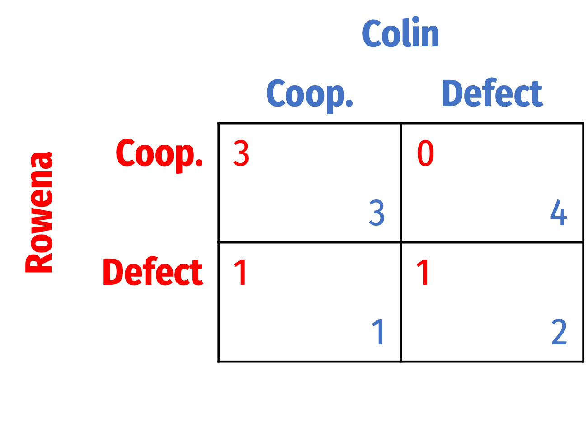
]
]

---

# Exploring BNE in Bayesian Game Example

.pull-left[

- Different *potential* .hi[Bayesian Nash equilibrium (BNE)]:

1) .hi-purple[Pooling equilibria]: both types of .blue[Colin] play the same strategy
  - **Scenario I**: .blue[Colin-types] both .blue[Cooperate]
  - **Scenario II**: .blue[Colin-types] both .blue[Defect]

]

.pull-right[
.center[

]
]

---

# Exploring BNE in Bayesian Game Example

.pull-left[

- Different *potential* .hi[Bayesian Nash equilibrium (BNE)]:

2) .hi-purple[Separating equilibria]: each type of .blue[Colin] plays a different strategy
  - **Scenario III**: .blue[PD-type Colin] plays .blue[Cooperate]; .blue[SH-type Colin] plays .blue[Defect]
  - **Scenario IV**: .blue[PD-type Colin] plays .blue[Defect]; .blue[SH-type Colin] plays .blue[Cooperate]
]

.pull-right[
.center[

]
]

---

# Pooling Eq. I: Both Types Cooperate (?)

.pull-left[

- .hi-purple[Pooling equilibrium I]: both .blue[Colin-types] play .blue[Cooperate], i.e. .blue[(C,C)]

- ❌ This is **impossible**: .blue[PD-type Colin] has a dominant strategy to .blue[Defect]
  - Would switch from .blue[Cooperate] to .blue[Defect]
]

.pull-right[
.center[

]
]

---

# Pooling Eq. II: Both Types Defect (?)

.pull-left[

- .hi-purple[Pooling equilibrium II]: both .blue[Colin-types] play .blue[Defect], i.e. .blue[(D,D)]

- .red[Rowena] maximizes her *expected* payoff against unknown .blue[Colin-type] playing .blue[Defect]
]

.pull-right[
.center[

]
]

---

# Pooling Eq. II: Both Types Defect (?)

.pull-left[

- .hi-purple[Pooling equilibrium II]: both .blue[Colin-types] play .blue[Defect],  i.e. .blue[(D,D)]

- .red[Rowena] maximizes her *expected* payoff against unknown .blue[Colin-type] playing .blue[Defect]

$$\begin{align*}
E[\color{red}{Cooperate}] &= \color{red}{0}p+\color{red}{0}(1-p)\\
E[\color{red}{Cooperate}] &= \color{red}{0}\\
\end{align*}$$

]

.pull-right[
.center[

]
]

---

# Pooling Eq. II: Both Types Defect (?)

.pull-left[

- .hi-purple[Pooling equilibrium II]: both .blue[Colin-types] play .blue[Defect], i.e. .blue[(D,D)]

- .red[Rowena] maximizes her *expected* payoff against unknown .blue[Colin-type] playing .blue[Defect]

$$\begin{align*}
E[\color{red}{Cooperate}] &= \color{red}{0}p+\color{red}{0}(1-p)\\
E[\color{red}{Cooperate}] &= \color{red}{0}\\
\end{align*}$$

$$\begin{align*}
E[\color{red}{Defect}] &= \color{red}{1}p+\color{red}{1}(1-p)\\
E[\color{red}{Defect}] &= \color{red}{1}\\
\end{align*}$$

- .red[Rowena] will always play .red[Defect]
]

.pull-right[
.center[

]
]

---

# Pooling Eq. II: Both Types Defect (?)

.pull-left[

- .hi-purple[Pooling equilibrium II]: both .blue[Colin-types] play .blue[Defect]. i.e. .blue[(D,D)]

- ✅ This is a valid .hi-purple[Bayesian Nash Equilibrium]: {.red[Defect], .blue[(Defect, Defect)]}
  - Where .blue[Colin]’s strategies are denoted for (.blue[PH-type Colin], .blue[SH-type Colin])
]

.pull-right[
.center[

]
]

---

# Separating Eq. I: PD-Type Coops; SH-Type Defects (?)

.pull-left[

- .hi-purple[Separating equilibrium I]: .blue[PD-type Colin] plays .blue[Cooperate]; .blue[SH-type Colin] plays .blue[Defect], i.e. .blue[(C,D)]

]

.pull-right[
.center[

]
]

---

# Separating Eq. I: PD-Type Coops; SH-Type Defects (?)

.pull-left[

- .hi-purple[Separating equilibrium I]: .blue[PD-type Colin] plays .blue[Cooperate]; .blue[SH-type Colin] plays .blue[Defect], i.e. .blue[(C,D)]

- ❌ This is **impossible**: .blue[PD-type Colin] has a dominant strategy to .blue[Defect]
  - Would switch from .blue[Cooperate] to .blue[Defect]
]

.pull-right[
.center[

]
]

---

# Separating Eq. II: PD-Type Defects; SH-Type Coops. (?)

.pull-left[

- .hi-purple[Separating equilibrium II]: .blue[PD-type Colin] plays .blue[Defect]; .blue[SH-type Colin] plays .blue[Cooperate], i.e. .blue[(D,C)]

- .red[Rowena] maximizes her *expected* payoff against unknown .blue[Colin-type]:
]

.pull-right[
.center[

]
]

---

# Separating Eq. II: PD-Type Defects; SH-Type Coops. (?)

.pull-left[

- .hi-purple[Separating equilibrium II]: .blue[PD-type Colin] plays .blue[Defect]; .blue[SH-type Colin] plays .blue[Cooperate], i.e. .blue[(D,C)]

- .red[Rowena] maximizes her *expected* payoff against unknown .blue[Colin-type]:

$$\begin{align*}
E[\color{red}{Cooperate}] &= \color{red}{0}p+\color{red}{3}(1-p)\\
E[\color{red}{Cooperate}] &= \color{red}{3-3p}\\
\end{align*}$$

]

.pull-right[
.center[

]
]

---

# Separating Eq. II: PD-Type Defects; SH-Type Coops. (?)

.pull-left[

- .hi-purple[Separating equilibrium II]: .blue[PD-type Colin] plays .blue[Defect]; .blue[SH-type Colin] plays .blue[Cooperate], i.e. .blue[(D,C)]

- .red[Rowena] maximizes her *expected* payoff against unknown .blue[Colin-type]:

$$\begin{align*}
E[\color{red}{Cooperate}] &= \color{red}{0}p+\color{red}{3}(1-p)\\
E[\color{red}{Cooperate}] &= \color{red}{3-3p}\\
\end{align*}$$

$$\begin{align*}
E[\color{red}{Defect}] &= \color{red}{1}p+\color{red}{1}(1-p)\\
E[\color{red}{Defect}] &= \color{red}{1}\\
\end{align*}$$

]

.pull-right[
.center[

]
]

---

# Separating Eq. II: PD-Type Defects; SH-Type Coops. (?)

.pull-left[

- .hi-purple[Separating equilibrium II]: .blue[PD-type Colin] plays .blue[Defect]; .blue[SH-type Colin] plays .blue[Cooperate], i.e. .blue[(D,C)]

- .red[Rowena] maximizes her *expected* payoff against unknown .blue[Colin-type]:

$$\begin{align*}
E[\color{red}{Cooperate}] &= E[\color{red}{Defect}]\\
\color{red}{3-3p} &= \color{red}{1}\\
p &= \frac{2}{3}\\
\end{align*}$$

]

.pull-right[
.center[

]
]

---

# Separating Eq. II: PD-Type Defects; SH-Type Coops. (?)

.pull-left[

- .hi-purple[Separating equilibrium II]: .blue[PD-type Colin] plays .blue[Defect]; .blue[SH-type Colin] plays .blue[Cooperate], i.e. .blue[(D,C)]

- When $p>\frac{2}{3}$, .red[Rowena] should play .red[Defect] ✅
- When $p<\frac{2}{3}$, .red[Rowena] should play .red[Cooperate]
  - Here, a .blue[SH-type Colin] would want to switch from .blue[Cooperate] to .blue[Defect]; this would not be a BNE ❌

]

.pull-right[
.center[

]
]

---

# Bayesian Nash Equilibria

.pull-left[
- Our two possible .hi-purple[Bayesian Nash equilibria (BNE)]:

1. {.red[Defect], .blue[(Defect, Defect)]}, a .hi-turquoise[pooling equilibrium]

2. {.red[Defect], .blue[(Cooperate, Defect)]}, a .hi-turquoise[separating equilibrium], if $p>\frac{2}{3}$
  - If $p<\frac{2}{3}$, no equilibrium

- Note that these depend on .red[Rowena]’s .hi-purple[beliefs] about $p$!
  - Next...why these are **Bayesian** games
]
.pull-right[
.center[

]
]
