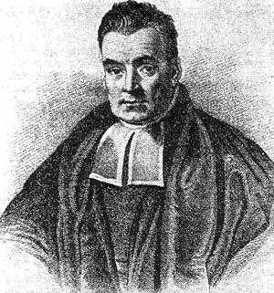
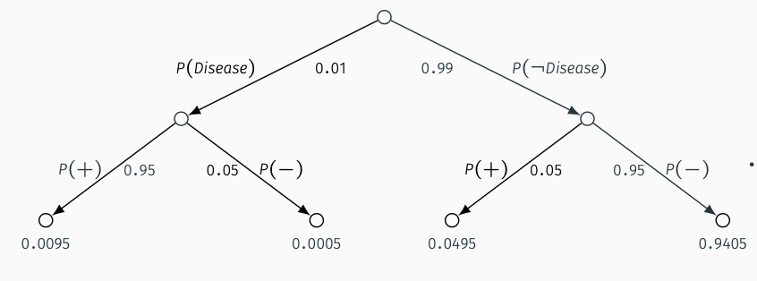
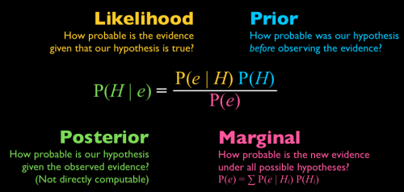

```{r setup, include=FALSE}
options(htmltools.dir.version = FALSE)
knitr::opts_chunk$set(echo=F,
                      message=F,
                      warning=F,
                      fig.retina = 3,
                      fig.align = "center")
library("tidyverse")
library("ggrepel")
library("fontawesome")
xaringanExtra::use_tile_view()
xaringanExtra::use_tachyons()
xaringanExtra::use_freezeframe()

update_geom_defaults("label", list(family = "Fira Sans Condensed"))
update_geom_defaults("text", list(family = "Fira Sans Condensed"))

set.seed(256)

theme_slides <- theme_light() + 
  theme(
    text = element_text(family = "Fira Sans", size = 24)
  )
```

class: inverse

# Outline

### [Bayesian Statistics](#3)
### [Bayes’ Rule Example](#18)

---

class: inverse, center, middle

# Bayesian Statistics

---

# Bayesian Statistics

.pull-left[
.smallest[
- Most people’s understanding & intuitions of probability are about the **objective** .hi[frequency] of events occurring
  - “If I flip a fair coin many times, the probability of Heads is 0.50”
  - “If this election were repeated many times, the probability of Biden winning is 0.60”

- This is known as the .hi[“frequentist”] interpretation of probability
  - And is almost entirely the only thing taught to students (because it’s easier to explain)
]
]
.pull-right[
.center[

]
]

---

# Bayesian Statistics

.pull-left[
.smallest[
- Another valid (competing) interpretation is probability represents our **subjective** .hi[belief] about an event
  - “I am 50% certain the next coin flip will be Heads”
  - “I am 60% certain that Biden will win the election”
  - This is particularly useful for **unique** events (that occur once...and really, isn’t that every event in the real world?)

- This is known as the .hi[“Bayesian”] interpretation of probability
]
]

.pull-right[
.center[

]
]

---
# Bayesian Statistics

.pull-left[

- In .hi-purple[Bayesian statistics], probability measures the degree of certainty about an event
  - Beliefs range from impossible $(p=0)$ to certain $(p=1)$

- This conditions probability on your **beliefs** about an event
]

.pull-right[
.center[


.smallest[
Rev. Thomas Bayes

1702—1761
]
]
]

---

# Bayesian Statistics

.pull-left[
.quitesmall[
- The bread and butter of thinking like a Bayesian is .hi-purple[updating your beliefs in response to new evidence]
  - You have some .hi[prior] belief about something
  - New evidence should **update** your belief (level of certainty) about it
  - Updated belief known as your .hi[posterior] belief

- Your beliefs are *completely* determined by the latest evidence, new evidence just *slightly* changes your beliefs, proportionate to how compelling the evidence is

- .hi-purple[This is fundamental to modern science and having rational beliefs]
  - And some mathematicians will tell you, the *proper* use of statistics
]
]

.pull-right[
.center[


]
]

---

# Bayesian Statistics Examples

.pull-left[
.smaller[
1. You are a bartender. If the next person that walks in is wearing a kilt, what is the probability s/he wants to order Scotch?

2. What is the probability that someone has watched the superbowl? What if you know that persoon is a man?

3. You are a policymaker deciding foreign policy, and get a new intelligence report.

4. You are trying to buy a home and make an offer, which the seller declines.
]
]
.pull-right[
.center[

]
]

.pull-right[
.center[


]
]

---

# Conditional Probability

.pull-left[
.smallest[
- All of this revolves around .hi-purple[conditional probability]: the probability of some event $B$ occurring, given that event $A$ has already occurred

$$P(B|A) = \frac{P(A \text{ and } B)}{P(A)}$$
- $P(B|A)$: “Probability of $B$ given $A$”
]
]
.pull-right[
.center[

]
]

---

# Conditional Probability

.pull-left[
.smallest[
- All of this revolves around .hi-purple[conditional probability]: the probability of some event $B$ occurring, given that event $A$ has already occurred

$$P(B|A) = \frac{P(A \text{ and } B)}{P(A)}$$

- If we know $A$ has occurred, $P(A)>0$, and then every outcome that is $\neg A$ (“not A”) cannot occur $(P(\neg A)=0)$
]
]
.pull-right[
```{r}
library(ggforce)
venn_gen_colors <-c("red")
venn_gen_df <-tibble(
  x = c(0),
  y = c(0),
  r = c(0.75),
  l = c("A"),
  xl = c(0),
  yl = c(0,0),
)

ggplot(data = venn_gen_df)+
  aes(x0 = x,
      y0 = y,
      r = r,
      fill = l,
      color = l)+
    annotate(geom = "rect", xmin = -2, xmax = 2, ymin = -2, ymax = 2, size = 0.5, fill = "gray", alpha = 0.5)+
  geom_circle(
      alpha = 0.3, size = 0.75)+
  geom_text(aes(x = xl, y = yl, label = l), size = 9, family = "Fira Sans Book", parse = F)+
    annotate(geom = "rect", xmin = -2, xmax = 2, ymin = -2, ymax = 2, size = 0.5, color = "black", fill = NA)+
  theme_void()+
  theme(legend.position = "none")+
  scale_fill_manual(values = venn_gen_colors)+
  scale_color_manual(values = venn_gen_colors)+
  scale_x_continuous(limits = c(-2.5,2.5),
                     expand = c(0,0))+
  scale_y_continuous(limits = c(-2.5,2.5),
                     expand = c(0,0))+

  annotate(x = -1.5, y = 1.75, label = expression("Not A"), geom = "text", size = 7, family = "Fira Sans Book")+
  coord_equal()
```

]

---

# Conditional Probability

.pull-left[
.smallest[
- All of this revolves around .hi-purple[conditional probability]: the probability of some event $B$ occurring, given that event $A$ has already occurred

$$P(B|A) = \frac{P(A \text{ and } B)}{P(A)}$$
]
]
.pull-right[
```{r}
library(ggforce)
venn_gen_colors <-c("red","blue")
venn_gen_df <-tibble(
  x = c(-0.5,0.5),
  y = c(0,0),
  r = c(0.75,0.75),
  l = c("A","B"),
  xl = c(-0.5,0.5),
  yl = c(0,0),
)

ggplot(data = venn_gen_df)+
  aes(x0 = x,
      y0 = y,
      r = r,
      fill = l,
      color = l)+
  geom_circle(
      alpha = 0.3, size = 0.75)+
  geom_text(aes(x = xl, y = yl, label = l), size = 9, family = "Fira Sans Book", parse = F)+
    annotate(geom = "rect", xmin = -2, xmax = 2, ymin = -2, ymax = 2, size = 0.5, color = "black", fill = NA)+
  theme_void()+
  theme(legend.position = "none")+
  scale_fill_manual(values = venn_gen_colors)+
  scale_color_manual(values = venn_gen_colors)+
  scale_x_continuous(limits = c(-2.5,2.5),
                     expand = c(0,0))+
  scale_y_continuous(limits = c(-2.5,2.5),
                     expand = c(0,0))+
  annotate(x = -1.75, y = 1.75, label = "S", geom = "text", size = 7, family = "Fira Sans Book")+
  annotate(x = 0, y = 0, label = "A and B", geom = "text", size = 3, family = "Fira Sans Book")+
  coord_equal()
```

]

---

# Conditional Probability

.pull-left[
.smallest[
- All of this revolves around .hi-purple[conditional probability]: the probability of some event $B$ occurring, given that event $A$ has already occurred

$$P(B|A) = \frac{P(A \text{ and } B)}{P(A)}$$

- If we know $A$ has occurred, $P(A)>0$, and then every outcome that is $\neg A$ (“not A”) cannot occur $(P(\neg A)=0)$
  - The only part of $B$ which can occur if $A$ has occurred is $A$ and $B$
  - Since the sample space $S$ must equal 1, we’ve reduced the sample space to $A$, so we must rescale by $\frac{1}{P(A)}$
]
]
.pull-right[
```{r}
library(ggforce)
venn_gen_colors <-c("red","blue")
venn_gen_df <-tibble(
  x = c(-0.5,0.5),
  y = c(0,0),
  r = c(0.75,0.75),
  l = c("A","B"),
  xl = c(-0.5,0.5),
  yl = c(0,0),
)

p<-ggplot(data = venn_gen_df)+
  aes(x0 = x,
      y0 = y,
      r = r,
      fill = l,
      color = l)+
  geom_circle(
      alpha = 0.3, size = 0.75)+
  geom_text(aes(x = xl, y = yl, label = l), size = 9, family = "Fira Sans Book", parse = F)+
    annotate(geom = "rect", xmin = -2, xmax = 2, ymin = -2, ymax = 2, size = 0.5, color = "black", fill = NA)+
  theme_void()+
  theme(legend.position = "none")+
  scale_fill_manual(values = venn_gen_colors)+
  scale_color_manual(values = venn_gen_colors)+
  scale_x_continuous(limits = c(-2.5,2.5),
                     expand = c(0,0))+
  scale_y_continuous(limits = c(-2.5,2.5),
                     expand = c(0,0))+
  annotate(x = -1.75, y = 1.75, label = "S", geom = "text", size = 7, family = "Fira Sans Book")+
  annotate(x = 0, y = 0, label = "A and B", geom = "text", size = 3, family = "Fira Sans Book")+
  coord_equal()
p
```

]

---

# Conditional Probability

.pull-left[

$$P(B|A) = \frac{P(A \text{ and } B)}{P(A)}$$

- If events $A$ and $B$ were .hi-turquoise[independent], then the probability $P(A$ and $B)$ happening would be just $P(A) \times P(B)$
  - $P(A|B) = P(A)$
  - $P(B|A) = P(B)$

]

.pull-right[
```{r}
venn_gen_df_ind <-tibble(
  x = c(-0.5,0.5),
  y = c(0,0),
  r = c(0.45,0.45),
  l = c("A","B"),
  xl = c(-0.5,0.5),
  yl = c(0,0),
)

ggplot(data = venn_gen_df_ind)+
  aes(x0 = x,
      y0 = y,
      r = r,
      fill = l,
      color = l)+
  geom_circle(
      alpha = 0.3, size = 0.75)+
  geom_text(aes(x = xl, y = yl, label = l), size = 9, family = "Fira Sans Book", parse = F)+
    annotate(geom = "rect", xmin = -2, xmax = 2, ymin = -2, ymax = 2, size = 0.5, color = "black", fill = NA)+
  theme_void()+
  theme(legend.position = "none")+
  scale_fill_manual(values = venn_gen_colors)+
  scale_color_manual(values = venn_gen_colors)+
  scale_x_continuous(limits = c(-2.5,2.5),
                     expand = c(0,0))+
  scale_y_continuous(limits = c(-2.5,2.5),
                     expand = c(0,0))+
  annotate(x = -1.75, y = 1.75, label = "S", geom = "text", size = 7, family = "Fira Sans Book")+
  coord_equal()
```

]

---

# Conditional Probability

.pull-left[

$$P(B|A) = \frac{P(A \text{ and } B)}{P(A)}$$

- But if they are *not* independent, it’s $P(A \text{ and } B) = P(A) \times P(B|A)$
  - (Just multiplying both sides above by the denominator, $P(A))$
]

.pull-right[
```{r}
p
```

]

---

# Conditional Probability and Bayes’ Rule

.pull-left[
.smallest[
- Bayes realized that the conditional probabilities of two non-independent events are proportionately related

$$\color{green}{P(B|A)} = \frac{P(A \text{ and } B)}{\color{red}{P(A)}}$$
$$\color{orange}{P(A|B)} = \frac{P(A \text{ and } B)}{\color{blue}{P(B)}}$$
]
]

.pull-right[
```{r}
p
```

]

---

# Conditional Probability and Bayes’ Rule

.pull-left[
.smallest[
- Bayes realized that the conditional probabilities of two non-independent events are proportionately related

$$\color{green}{P(B|A)} = \frac{P(A \text{ and } B)}{\color{red}{P(A)}}$$
$$\color{orange}{P(A|B)} = \frac{P(A \text{ and } B)}{\color{blue}{P(B)}}$$

$$\color{orange}{P(A|B)}\color{blue}{P(B)} = P(A \text{ and }B) = \color{green}{P(B|A)}\color{red}{P(A)}$$
]]

.pull-right[
```{r}
p
```

]

---

# Conditional Probability and Bayes’ Rule

.pull-left[
.smallest[
- Bayes realized that the conditional probabilities of two non-independent events are proportionately related

$$\color{green}{P(B|A)} = \frac{P(A \text{ and } B)}{\color{red}{P(A)}}$$
$$\color{orange}{P(A|B)} = \frac{P(A \text{ and } B)}{\color{blue}{P(B)}}$$

$$\color{orange}{P(A|B)}\color{blue}{P(B)} = P(A \text{ and }B) = \color{green}{P(B|A)}\color{red}{P(A)}$$
- If you divide everything by .blue[P(B)], you get....hi[Bayes’ rule]:
$$\color{purple}{P(A|B)} = \frac{\color{magenta}{P(B|A)}\color{red}{P(A)}}{\color{blue}{P(B)}}$$
]
]

.pull-right[
```{r}
p
```

]

---

class: inverse, center, middle

# Bayes’ Rule Example

---

# Bayes’ Rule Example

.pull-left[
.quitesmall[
.content-box-green[
.hi-green[Example]: Suppose 1% of the population has a rare disease. A test that can diagnose the disease is 95% accurate. What is the probability that a person who takes the test and comes back positive has the disease?
]

- What would you guess the probability is?
]
]

.pull-right[
.center[

]
]

---

# Bayes’ Rule Example

.pull-left[
.quitesmall[
.content-box-green[
.hi-green[Example]: Suppose 1% of the population has a rare disease. A test that can diagnose the disease is 95% accurate. What is the probability that a person who takes the test and comes back positive has the disease?
]
]

.quitesmall[
- $P(\text{Disease}) = 0.01$

- $P(+|\text{Disease}) =0.95 = P(-|\neg \text{Disease})$

- We know $P(+|\text{Disease})$ but want to know $P(\text{Disease}|+)$
  - **These are not the same thing!**
  - Related by Bayes’ Rule:

$$P(\text{Disease}|+)=\frac{P(+|\text{Disease})P(\text{Disease})}{P(+)}$$

]
]

.pull-right[
.center[

]
]

---

# Bayes’ Rule Example

.pull-left[
- $P(\text{Disease}) = 0.01$
- $P(+|\text{Disease}) =0.95 = P(-|\neg \text{Disease})$

$$P(\text{Disease}|+)=\frac{P(+|\text{Disease})P(\text{Disease})}{P(+)}$$

- What is $P(+)$??
]

.pull-right[
.center[

]
]

---

# Bayes’ Rule Example

.pull-left[

- What is the total probability of $B$ in the diagram?

$$\begin{align*}P(B)&=P(B \text{ and } A)+P(B \text{ and } \neg A)\\
&=P(B|A)P(A)+P(B|\neg A)P(\neg A) \\ \end{align*}$$

- This is known as the law of total probability
]

.pull-right[
```{r, message = F, warning = F}
venn_gen_colors <-c("red","blue")
venn_gen_df <-tibble(
  x = c(-0.5,0.5),
  y = c(0,0),
  r = c(0.75,0.75),
  l = c("A","B"),
  xl = c(-0.5,0.5),
  yl = c(0,0),
)

p2<-ggplot(data = venn_gen_df)+
  aes(x0 = x,
      y0 = y,
      r = r,
      fill = l,
      color = l)+
  geom_circle(
      alpha = 0.3, size = 0.75)+
  geom_text(aes(x = xl, y = yl, label = l), size = 9, family = "Fira Sans Book", parse = F)+
    annotate(geom = "rect", xmin = -2, xmax = 2, ymin = -2, ymax = 2, size = 0.5, color = "black", fill = NA)+
  theme_void()+
  theme(legend.position = "none")+
  scale_fill_manual(values = venn_gen_colors)+
  scale_color_manual(values = venn_gen_colors)+
  scale_x_continuous(limits = c(-2.5,2.5),
                     expand = c(0,0))+
  scale_y_continuous(limits = c(-2.5,2.5),
                     expand = c(0,0))+
  annotate(x = -1.75, y = 1.75, label = "S", geom = "text", size = 7, family = "Fira Sans Book")+
  annotate(x = 0, y = 0, label = "B and A", geom = "text", size = 3, family = "Fira Sans Book")+
  annotate(x = 0.9, y = 0, label = "B and \n not A", geom = "text", size = 3, family = "Fira Sans Book")+
  coord_equal()

p2
```

]

---

# Bayes’ Rule Example: Aside

.pull-left[

- Because we usually have to figure out $P(B)$  (the denominator), Bayes’ rule is often expanded to 

$$P(B|A)=\frac{P(A|B)P(A)}{P(B|A)P(A)+P(B|\neg A)P(\neg A)}$$

- Assuming there are two possibilities $(A$ and $\neg A)$, e.g. True or False
]

.pull-right[
```{r}
p2
```

]

---

# Bayes’ Rule Example: Aside

.pull-left[

- If there are more than two possibilities, you can further expand it to $\displaystyle\sum^n_{i=1}P(B|A_i)P(A_i)$ for $n$ number of possible alternatives to $A$
]

.pull-right[
```{r}
library(ggforce)
venn_gen_colors <-c("red","blue", "purple", "green","orange","yellow")
venn_gen_df <-tibble(
  x = c(-0.5,0.5,0.25,0.75,0.25,0.75),
  y = c(0,0,1,1,-1,-1),
  r = c(0.75,0.75,0.75,0.75,0.75,0.75),
  l = c("A","B","C","D","E","F"),
  xl = c(-0.5,0.5,0.25,0.75,0.25,0.75),
  yl = c(0,0,1,1,-1,-1),
)

ggplot(data = venn_gen_df)+
  aes(x0 = x,
      y0 = y,
      r = r,
      fill = l,
      color = l)+
  geom_circle(
      alpha = 0.3, size = 0.75)+
  geom_text(aes(x = xl, y = yl, label = l), size = 9, family = "Fira Sans Book", parse = F)+
    annotate(geom = "rect", xmin = -2, xmax = 2, ymin = -2, ymax = 2, size = 0.5, color = "black", fill = NA)+
  theme_void()+
  theme(legend.position = "none")+
  scale_fill_manual(values = venn_gen_colors)+
  scale_color_manual(values = venn_gen_colors)+
  scale_x_continuous(limits = c(-2.5,2.5),
                     expand = c(0,0))+
  scale_y_continuous(limits = c(-2.5,2.5),
                     expand = c(0,0))+
  annotate(x = -1.75, y = 1.75, label = "S", geom = "text", size = 7, family = "Fira Sans Book")+
  coord_equal()
```

]

---

# Bayes’ Rule Example

.pull-left[
.smallest[
- What is the total probability of $+$?

$$\begin{align*}P(+)&=P(+ \text{ and Disease})+P(+ \text{ and } \neg \text{ Disease})\\
&=P(+|\text{Disease})P(\text{Disease})+P(+|\neg \text{Disease})P(\neg \text{Disease}) \\ \end{align*}$$

- $P(\text{Disease}) = 0.01$
- $P(+|\text{Disease}) =0.95$

]
]

.pull-right[
```{r}
library(ggforce)
venn_gen_colors <-c("red","blue")
venn_gen_df <-tibble(
  x = c(-0.5,0.5),
  y = c(0,0),
  r = c(0.75,0.75),
  l = c("Disease","Positive"),
  xl = c(-0.5,0.5),
  yl = c(0,0),
)

p3<-ggplot(data = venn_gen_df)+
  aes(x0 = x,
      y0 = y,
      r = r,
      fill = l,
      color = l)+
  geom_circle(
      alpha = 0.3, size = 0.75)+
  geom_text(aes(x = xl, y = yl, label = l), size = 4, family = "Fira Sans Book", parse = F)+
    annotate(geom = "rect", xmin = -2, xmax = 2, ymin = -2, ymax = 2, size = 0.5, color = "black", fill = NA)+
  theme_void()+
  theme(legend.position = "none")+
  scale_fill_manual(values = venn_gen_colors)+
  scale_color_manual(values = venn_gen_colors)+
  scale_x_continuous(limits = c(-2.5,2.5),
                     expand = c(0,0))+
  scale_y_continuous(limits = c(-2.5,2.5),
                     expand = c(0,0))+
  annotate(x = -1.75, y = 1.75, label = "S", geom = "text", size = 7, family = "Fira Sans Book")+
  annotate(x = 0, y = 0, label = "Positive and \n Disease", geom = "text", size = 2, family = "Fira Sans Book")+
  annotate(x = 0.9, y = 0, label = "Positive and \n not Disease", geom = "text", size = 2, family = "Fira Sans Book")+
  coord_equal()
p3
```

]

---

# Bayes’ Rule Example

.pull-left[
.smallest[
- What is the total probability of $+$?

$$\begin{align*}P(+)&=P(+ \text{ and Disease})+P(+ \text{ and } \neg \text{ Disease})\\
&=P(+|\text{Disease})P(\text{Disease})+P(+|\neg \text{Disease})P(\neg \text{Disease}) \\ \end{align*}$$

- $P(\text{Disease}) = 0.01$
- $P(+|\text{Disease}) =0.95$

$$P(+)=0.95(0.01)+0.05(0.99)=0.0590$$
]
]

.pull-right[
```{r}
p3
```

]

---

# Bayes’ Rule Example

.pull-left[

|    | Disease | $\neg$ Disease | Total |
|----|---------|----------------|-------|
| +  | 0.0095  | 0.0495 | **0.0590** |
| -  | 0.0005  | 0.9405 | 0.9410 |
| Total | 0.0100 | 0.9900 | 1.0000 |

]

.pull-right[
.center[

]
]

---

# Bayes’ Rule Example

.pull-left[
.smallest[
- $P(\text{Disease}) = 0.01$
- $P(+|\text{Disease}) =0.95 = P(-|\neg \text{Disease})=0.95$
- $P(+)=0.0590$

]
]
.pull-right[
.center[

]
]

---

# Bayes’ Rule Example

.pull-left[
.smallest[
- $P(\text{Disease}) = 0.01$
- $P(+|\text{Disease}) =0.95 = P(-|\neg \text{Disease})=0.95$
- $P(+)=0.0590$

$$\begin{align*}P(\text{Disease}|+)&=\frac{P(+|\text{Disease})P(\text{Disease})}{P(+)}\\ \end{align*}$$
]
]

.pull-right[
.center[

]
]

---

# Bayes’ Rule Example

.pull-left[
.smallest[
- $P(\text{Disease}) = 0.01$
- $P(+|\text{Disease}) =0.95 = P(-|\neg \text{Disease})=0.95$
- $P(+)=0.0590$

$$\begin{align*}P(\text{Disease}|+)&=\frac{P(+|\text{Disease})P(\text{Disease})}{P(+)}\\ P(\text{Disease}|+)&=\frac{0.95 \times 0.01}{0.0590}\\
&= 0.16 \\\end{align*}$$

- The probability you have the disease is only 16%!
  - Most people vastly overestimate because they forget the base rate of the disease, $P(\text{Disease})$ is so low (1%)!
]
]
.pull-right[
.center[

]
]

---

# Bayes’ Rule and Bayesian Updating

.pull-left[
- Bayes Rule tells us how we should update our beliefs given new evidence

.center[

]
]

.pull-right[
.center[

]
]