```{r setup, include=FALSE}
options(htmltools.dir.version = FALSE)
knitr::opts_chunk$set(echo=F,
                      message=F,
                      warning=F,
                      fig.retina = 3,
                      fig.align = "center")
library("tidyverse")
library("ggrepel")
library("fontawesome")
xaringanExtra::use_tile_view()
xaringanExtra::use_tachyons()
xaringanExtra::use_freezeframe()

update_geom_defaults("label", list(family = "Fira Sans Condensed"))
update_geom_defaults("text", list(family = "Fira Sans Condensed"))

set.seed(256)

theme_slides <- theme_light() + 
  theme(
    text = element_text(family = "Fira Sans", size = 24)
  )
```

class: inverse

# Outline

### [Sequential Bayesian Games](#3)
### [Screening Games](#12)
### [Signaling Example I: Akerlof (1970) — The Market for Lemons](#20)
### [Signaling Example II: Spence (1973) Job-Market Signaling](#51)
### [Signaling Example III: Leeson (2012) Ordeals](#73)

---

class: inverse, center, middle

# Sequential Bayesian Games

---

# Equilibrium in Sequential Bayesian Games

.pull-left[
.smallest[
- We looked at a simultaneous game of incomplete information

- Now let's look at some common models of sequential games with incomplete information, and some famous applications

- Again, typically assume that .blue[Player 2] has private information about their “type,” that .red[Player 1] does not know
]
]
.pull-right[
.center[

]
]

---

# Equilibrium in Sequential Bayesian Games

.pull-left[
.smallest[
- We needed Bayes’ Rule because we will use it to describe how rational players .hi-purple[update their beliefs] (about others’ type) when presented with new evidence (i.e., the other player makes a move)

- Players share common (prior) belief about likelihood of encountering a player-type $(p)$

- .blue[Informed player] with private information (their type) will make a move, .red[uninformed player] will **update** their belief about .blue[that player]’s type
]
]
.pull-right[
.center[

]
]

---
# Our Previous Bayesian Example as a Signalling Game

.pull-left[
.smallest[
- Consider our previous game in sequential form

- A .hi[signalling game] where .blue[Colin] moves first

- .red[Rowena] observes .blue[Colin]'s move (.blue[Cooperate] or .blue[Defect]), but does not know which type .blue[Colin] is (and thus, the consequences of her own move)

- We could again find what conditions lead to valid .hi-purple[pooling equilibria] and .hi-purple[separating equilibria]
    - But I'd rather focus on applications of these famous models
]
]
.pull-right[
.center[
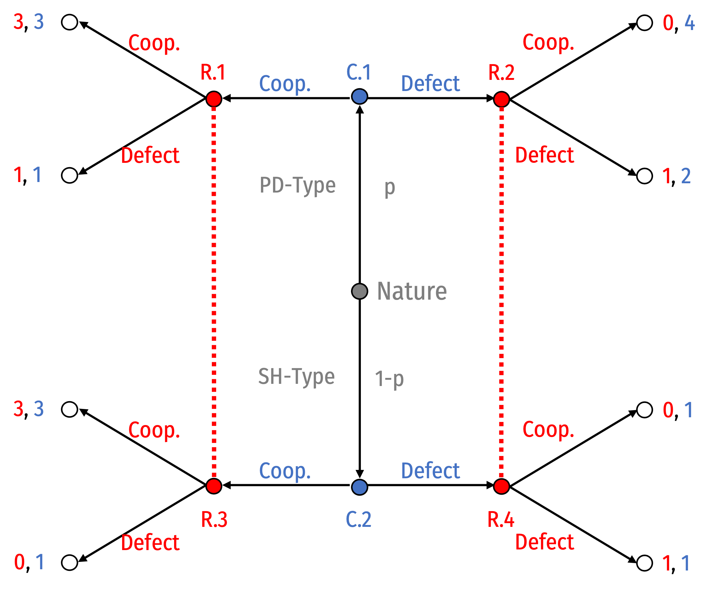
]
]

---

# Our Previous Bayesian Example as a Signalling Game

.pull-left[
.smallest[
- Essentially, .blue[Colin] makes a move, either .blue[Cooperate] or .blue[Defect]

- .red[Rowena]’s prior beliefs about .blue[Colin]’s type $(p)$ get updated based on .blue[Colin]’s move

- Then .red[Rowena] must decide how to respond, given her (updated) posterior belief about .blue[Colin]’s type
]
]
.pull-right[
.center[

]
]

---

# Perfect Bayesian Nash Equilibrium (PBNE)

.pull-left[
.smallest[
- A possible solution for a sequential game with incomplete (asymmetric) information is known as an .hi[assessment] which has **two parts**:

1. A .hi-purple[behavioral strategy profile]: complete plan of action for each player about how to play at each information set

2. A .hi-purple[belief system]: probability distribution over nodes in each information set
  - estimate how likely a player is a particular type, **given** their action
]
]
.pull-right[
.center[

]
]

---

# Perfect Bayesian Nash Equilibrium (PBNE)

.pull-left[
.smallest[
- An assessment is a .hi[Perfect Bayesian Nash Equilibrium (PBNE)] if it fits both conditions:

1. .hi-purple[Sequentially rational] — i.e. credible & survives backwards induction
  - at each information set, strategies are optimal given beliefs
2. It is .hi-purple[consistent with Bayes’ Rule] 
  - beliefs are updated by Bayes' Rule wherever possible
  ]

.quitesmall[
> “given the other player has played X, how likely are they type I?”
  
]

.smallest[
- The analog of .hi[subgame perfect Nash equilibrium], but with incomplete information
]
]
.pull-right[
.center[

]
]

---

# Signaling vs. Screening Games

.pull-left[
.smallest[
- Used to explore the economic problem of .hi-purple[adverse selection]: informed players exploit uninformed players 
  - Again, one player has private information (their type), the other doesn’t know

- Let .red[Player 1] be the .red[“uninformed player”]

- .blue[Player 2] be the .blue[“informed player”] with private information about their **type**
]
]
.pull-right[
.center[

]
]

---


# Signaling vs. Screening Games

.pull-left[
.smallest[
- Two types of sequential games with adverse selection:

1. .hi[Screening games]: .red[uninformed player] moves first
  - Will try to *determine* what type the *other* player is
  - Offer options where .blue[informed players] can *self-select* and reveal their type

2. .hi[Signaling games]: .blue[informed player] moves first
  - Will try to *signal* their type to .red[uninformed player]
  - But “bad”-types also want to *signal* they are “good”-types!

]
]
.pull-right[
.center[

]
]

---

class: inverse, center, middle

# Screening Games

---

# A Biblical Example of Screening

.left-column[
.center[

]
]

.right-column[

.quitesmall[
> One day two women came to King Solomon, and one of them said: 

> Your Majesty, this woman and I live in the same house. Not long ago my baby was born at home, and three days later her baby was born. Nobody else was there with us.

> One night while we were all asleep, she rolled over on her baby, and he died. Then while I was still asleep, she got up and took my son out of my bed. She put him in her bed, then she put her dead baby next to me.

> In the morning when I got up to feed my son, I saw that he was dead. But when I looked at him in the light, I knew he wasn’t my son.

> "No!" the other woman shouted. "He was your son. My baby is alive!"

> "The dead baby is yours," the first woman yelled. "Mine is alive!"

.source[[1 Kings 3:16-27](https://www.biblegateway.com/passage/?search=1+Kings+3%3A16-28&version=CEV)]

]
]

---

# A Biblical Example of Screening

.left-column[
.center[

]
]

.right-column[

.quitesmall[
> They argued back and forth in front of Solomon, until finally he said, "Both of you say this live baby is yours. Someone bring me a sword."

> A sword was brought, and Solomon ordered, "Cut the baby in half! That way each of you can have part of him."

> "Please don’t kill my son," the baby’s mother screamed. "Your Majesty, I love him very much, but give him to her. Just don’t kill him."

> The other woman shouted, "Go ahead and cut him in half. Then neither of us will have the baby."

> Solomon said, "Don’t kill the baby." Then he pointed to the first woman, "She is his real mother. Give the baby to her."

.source[[1 Kings 3:16-27](https://www.biblegateway.com/passage/?search=1+Kings+3%3A16-28&version=CEV)]

]
]

---

# A Modern Example of Screening

.pull-left[
.center[

]
]

.pull-right[
.center[
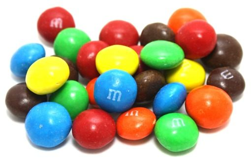
]
]

---

# Screening to Mitigate Adverse Selection

.pull-left[
.center[

]
]

.pull-right[
.center[

]
]

---

# Price Discrimination to Mitigate Adverse Selection

.pull-left[
- .hi[2<sup>nd</sup>-degree price discrimination]: .red[seller] doesn’t know what type of .blue[buyer] they are selling to (.blue[low/elastic] vs. .blue[high/inelastic] willingness to pay)

- If it knew, it could offer different customers different prices based on some observable characteristic (1<sup>st</sup>- and 3<sup>rd</sup>-degree PD)

]

.pull-right[
.center[
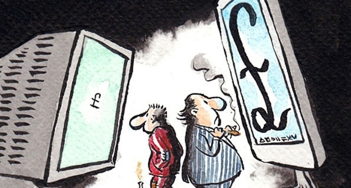
]
]

---

# Price Discrimination to Mitigate Adverse Selection

.pull-left[

- Common example: block pricing & quantity discounts
  - Firm offers different prices for different quantities     of the good
  - Charge customers that buy larger quantities a lower price per unit
  - Must be .hi[incentive—compatible]: low-volume customers must want to pay the higher price for fewer than the discounted price for more


]

.pull-right[
.center[

]
]


---

# Price Discrimination to Mitigate Adverse Selection

.pull-left[
- Common example: versioning
  - Firm offers different prices for different qualities of the good
  - Charge customers that higher price for higher quality
  - Must be .hi[incentive—compatible]: high-WTP/inelastic customers must want to pay the higher price instead of the discounted price

.quitesmall[
> “What the company is trying to do is to prevent the passengers who can pay the second class fare from traveling third class; It hits the poor, not because it wants to hurt them, but to frighten the rich.” — Jules Dupuit, 1849

]

]

.pull-right[
.center[
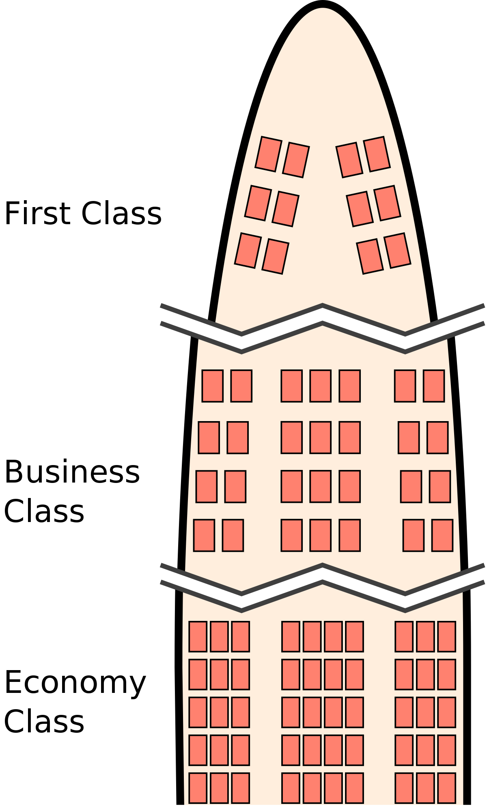
]
]

---

class: inverse, center, middle

# Signaling Example I: Akerlof (1970) — The Market for Lemons

---

# The Market for Lemons

.pull-left[
.smallest[
- Consider the used car market

- Two types of used cars
  - “Lemon”: low-quality car
  - “Peach”: high-quality car

- Suppose .red[you], the .red[buyer] value a peach at $H$ and a lemon at $L$ dollars

- .red[You] cannot tell a good car from a bad one, but believe some fraction $q$ of cars are Peaches
]
]

.pull-right[
.center[
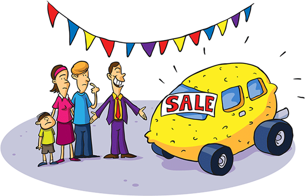
]
]

.source[Akerlof, George A, 1970, “The Market for 'Lemons': Quality Uncertainty and the Market Mechanism,” *Quarterly Journal of Economics* 84(3): 488-500]
---

# The Market for Lemons

.pull-left[
- Suppose a particular car has an asking price of $p$

- The .blue[dealer] knows the quality of the car, but .red[you] do not

- A bad car needs additional work, costing $c$, to make it better

- The .blue[dealer] decides whether or not to put a car on sale, then .red[you] decide whether or not to buy
- Let $H > p > L$

]

.pull-right[
.center[

]
]

.source[Akerlof, George A, 1970, “The Market for 'Lemons': Quality Uncertainty and the Market Mechanism,” *Quarterly Journal of Economics* 84(3): 488-500]

---

# The Market for Lemons

.pull-left[
- **Nature** decides whether .blue[Dealer] has a **good** car $(q)$ or **bad** car $(1-q)$

- Note .red[your information set]:
  - .red[You] are unable to determine if a .blue[Dealer] choosing to .blue[Offer] a good or bad car
]

.pull-right[
.center[
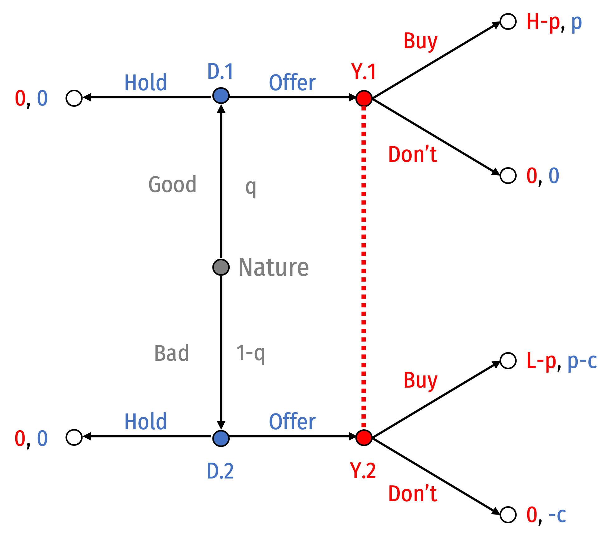
]
]

.source[Akerlof, George A, 1970, “The Market for 'Lemons': Quality Uncertainty and the Market Mechanism,” *Quarterly Journal of Economics* 84(3): 488-500]

---

# The Market for Lemons

.pull-left[
.smallest[
- Now let’s search for .hi[Perfect Bayesian Nash equilibria (PBNE)]

- Solve for conditions under which the following could be PBNE:
  1. .hi-purple[Pooling eq. I]: Both Types of .blue[Dealer] Offer
  2. .hi-purple[Pooling eq. II]: Both Types of .blue[Dealer] Hold
  3. .hi-purple[Separating eq. I]: .blue[Good]: Offer and .blue[Bad]: Don't
  4. .hi-purple[Separating eq. II]: .blue[Good]: Don't and .blue[Bad]: Hold

]
]
.pull-right[
.center[

]
]

.source[Akerlof, George A, 1970, “The Market for 'Lemons': Quality Uncertainty and the Market Mechanism,” *Quarterly Journal of Economics* 84(3): 488-500]

---

# Pooling Scenario I: Both Types of Dealer Offer

.pull-left[
.smallest[
- Suppose **both types of Dealer offer**
- Bayes' Rule implies:

]
]
.pull-right[
.center[
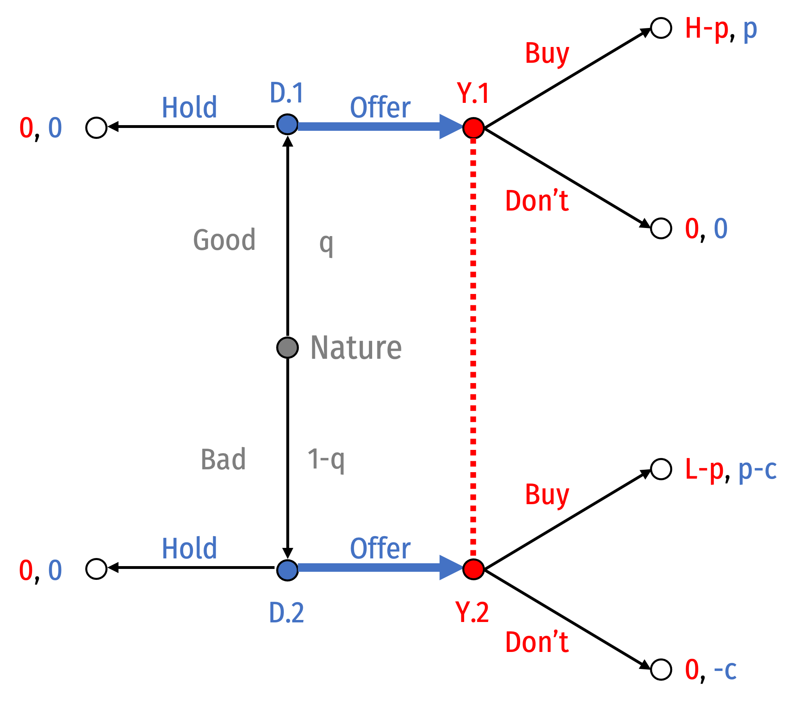
]
]

.source[Akerlof, George A, 1970, “The Market for 'Lemons': Quality Uncertainty and the Market Mechanism,” *Quarterly Journal of Economics* 84(3): 488-500]

---

# Pooling Scenario I: Both Types of Dealer Offer

.pull-left[
.smallest[
- Suppose **both types of Dealer offer**
- Bayes' Rule implies:

$$\begin{align*}
P(\text{good|offer})&= \frac{P(\text{offer|good})P(\text{good})}{P(\text{offer})}
\end{align*}$$

]
]
.pull-right[
.center[

]
]

.source[Akerlof, George A, 1970, “The Market for 'Lemons': Quality Uncertainty and the Market Mechanism,” *Quarterly Journal of Economics* 84(3): 488-500]

---

# Pooling Scenario I: Both Types of Dealer Offer

.pull-left[
.smallest[
- Suppose **both types of Dealer offer**
- Bayes' Rule implies:

$$\begin{align*}
P(\text{good|offer})&= \frac{P(\text{offer|good})P(\text{good})}{P(\text{offer})} \\
P(\text{good|offer})&= \frac{P(\text{offer|good})P(\text{good})}{P(\text{offer|good})P(\text{good})+P(\text{offer|bad})P(\text{bad})} \\
\end{align*}$$

]
]
.pull-right[
.center[

]
]

.source[Akerlof, George A, 1970, “The Market for 'Lemons': Quality Uncertainty and the Market Mechanism,” *Quarterly Journal of Economics* 84(3): 488-500]

---

# Pooling Scenario I: Both Types of Dealer Offer

.pull-left[
.smallest[
- Suppose **both types of Dealer offer**
- Bayes' Rule implies:

$$\begin{align*}
P(\text{good|offer})&= \frac{P(\text{offer|good})P(\text{good})}{P(\text{offer})} \\
P(\text{good|offer})&= \frac{P(\text{offer|good})P(\text{good})}{P(\text{offer|good})P(\text{good})+P(\text{offer|bad})P(\text{bad})} \\
P(\text{good|offer})&= \frac{1 \times q}{1 \times q + 1 (1-q)}\\
\end{align*}$$

]
]
.pull-right[
.center[

]
]

.source[Akerlof, George A, 1970, “The Market for 'Lemons': Quality Uncertainty and the Market Mechanism,” *Quarterly Journal of Economics* 84(3): 488-500]

---

# Pooling Scenario I: Both Types of Dealer Offer

.pull-left[
.smallest[
- Suppose **both types of Dealer offer**
- Bayes' Rule implies:

$$\begin{align*}
P(\text{good|offer})&= \frac{P(\text{offer|good})P(\text{good})}{P(\text{offer})} \\
P(\text{good|offer})&= \frac{P(\text{offer|good})P(\text{good})}{P(\text{offer|good})P(\text{good})+P(\text{offer|bad})P(\text{bad})} \\
P(\text{good|offer})&= \frac{1 \times q}{1 \times q + 1 (1-q)}\\
P(\text{good|offer})&= q\\
\end{align*}$$

- Since both .blue[dealers] offer, so the probability that an .blue[offer] is good is $q$! 

]
]
.pull-right[
.center[

]
]

.source[Akerlof, George A, 1970, “The Market for 'Lemons': Quality Uncertainty and the Market Mechanism,” *Quarterly Journal of Economics* 84(3): 488-500]

---

# Pooling Scenario I: Both Types of Dealer Offer

.pull-left[
.smallest[
- Suppose **both types of Dealer offer**

- The probability that an .blue[offer] is good is $q$

- If you buy a car based on your beliefs, your expected payoff is:

$\color{red}{E[Buy]}=q(\color{red}{H-p}) + (1-q)(\color{red}{L-p})$

]
]
.pull-right[
.center[

]
]

.source[Akerlof, George A, 1970, “The Market for 'Lemons': Quality Uncertainty and the Market Mechanism,” *Quarterly Journal of Economics* 84(3): 488-500]

---

# Pooling Scenario I: Both Types of Dealer Offer

.pull-left[
.smallest[
- Suppose **both types of Dealer offer**

- The probability that an .blue[offer] is good is $q$

- If you buy a car based on your beliefs, your expected payoff is:

$\color{red}{E[Buy]}=q(\color{red}{H-p}) + (1-q)(\color{red}{L-p})$

- Sequential rationality for .red[You]: .red[Buy] if $\color{red}{E[Buy]}>0$

]
]
.pull-right[
.center[
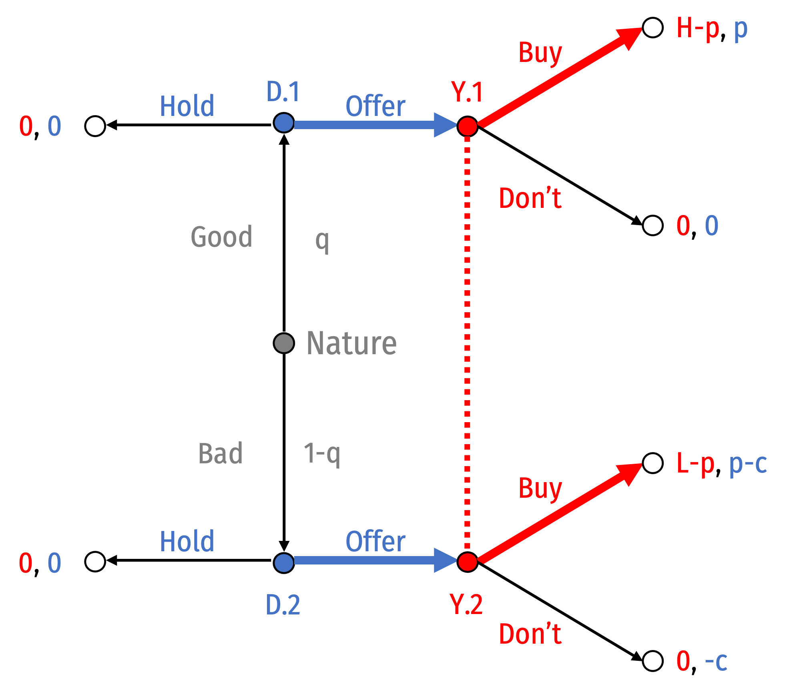
]
]

.source[Akerlof, George A, 1970, “The Market for 'Lemons': Quality Uncertainty and the Market Mechanism,” *Quarterly Journal of Economics* 84(3): 488-500]

---

# Pooling Scenario I: Both Types of Dealer Offer

.pull-left[
.smallest[
- Suppose **both types of Dealer offer**

- The probability that an .blue[offer] is good is $q$

- If you buy a car based on your beliefs, your expected payoff is:

$\color{red}{E[Buy]}=q(\color{red}{H-p}) + (1-q)(\color{red}{L-p})$

- Sequential rationality for .red[You]: .red[Buy] if $\color{red}{E[Buy]}>0$

- Sequential rationality for .blue[Dealer]: .blue[Offer] if $\color{blue}{p > c}$

]
]
.pull-right[
.center[

]
]

.source[Akerlof, George A, 1970, “The Market for 'Lemons': Quality Uncertainty and the Market Mechanism,” *Quarterly Journal of Economics* 84(3): 488-500]

---

# Pooling Scenario I: Both Types of Dealer Offer

.pull-left[
.smallest[
- Suppose **both types of Dealer offer**

- If $p > c$ and $E[Buy]>0$, the following is a .hi-purple[PBNE]:
  - **Behavioral strategy**: {.red[Buy], .blue[(Good: Offer, Bad: Offer)]}
  - **Belief system**: $P(\text{good|offer})=q$

]
]
.pull-right[
.center[

]
]

.source[Akerlof, George A, 1970, “The Market for 'Lemons': Quality Uncertainty and the Market Mechanism,” *Quarterly Journal of Economics* 84(3): 488-500]

---

# Pooling Equilibrium II: Both Types of Dealer Hold

.pull-left[
- Suppose **both types of Dealer hold**

]

.pull-right[
.center[
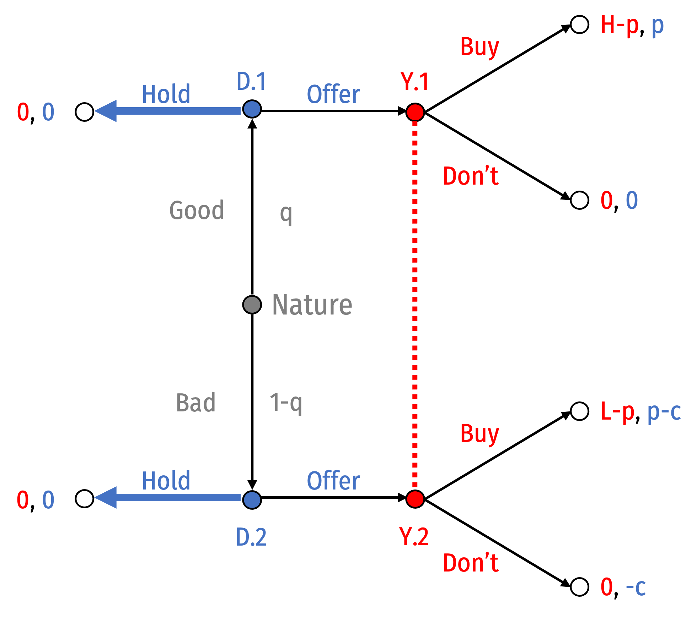
]
]

.source[Akerlof, George A, 1970, “The Market for 'Lemons': Quality Uncertainty and the Market Mechanism,” *Quarterly Journal of Economics* 84(3): 488-500]

---

# Pooling Equilibrium II: Both Types of Dealer Hold

.pull-left[
- Suppose **both types of Dealer hold**

- For this to be sequentially rational, .red[You] must always .red[Not Buy]
  - Otherwise, .blue[Good Dealer] would want to .blue[Offer]

- Under what beliefs would you choose .red[Don’t]? Your information set is never reached, so

]

.pull-right[
.center[
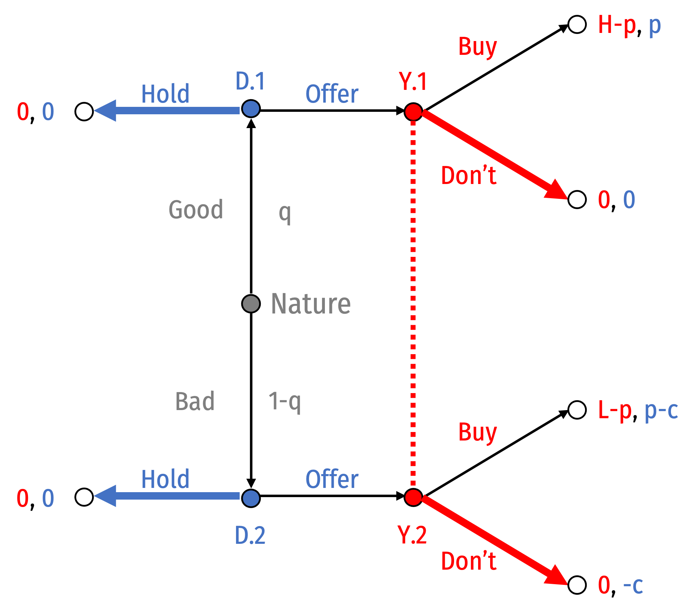
]
]

.source[Akerlof, George A, 1970, “The Market for 'Lemons': Quality Uncertainty and the Market Mechanism,” *Quarterly Journal of Economics* 84(3): 488-500]

---

# Pooling Equilibrium II: Both Types of Dealer Hold

.pull-left[
- Suppose **both types of Dealer hold**

- For this to be sequentially rational, .red[You] must always .red[Not Buy]
  - Otherwise, .blue[Good Dealer] would want to .blue[Offer]

- Under what beliefs would you choose .red[Don’t]? Your information set is never reached, so
$$p(\text{Good|Offer})=0$$

]

.pull-right[
.center[

]
]

.source[Akerlof, George A, 1970, “The Market for 'Lemons': Quality Uncertainty and the Market Mechanism,” *Quarterly Journal of Economics* 84(3): 488-500]

---

# Pooling Equilibrium II: Both Types of Dealer Hold

.pull-left[
- Suppose **both types of Dealer hold**

- The following is a .hi-purple[PBNE]:
  - **Behavioral strategy**: {.red[Don't], .blue[(Good: Hold, Bad: Hold)]}
  - **Belief system**: $P(\text{good|offer})=0$

- A .hi[market failure]: the .hi-purple[market unravels] because of a few lemons
]

.pull-right[
.center[

]
]

.source[Akerlof, George A, 1970, “The Market for 'Lemons': Quality Uncertainty and the Market Mechanism,” *Quarterly Journal of Economics* 84(3): 488-500]

---

# Separating Equilibrium I: Good: Offer; Bad: Hold

.pull-left[
- Suppose **Good Dealers offer and Bad Dealers hold**


]

.pull-right[
.center[
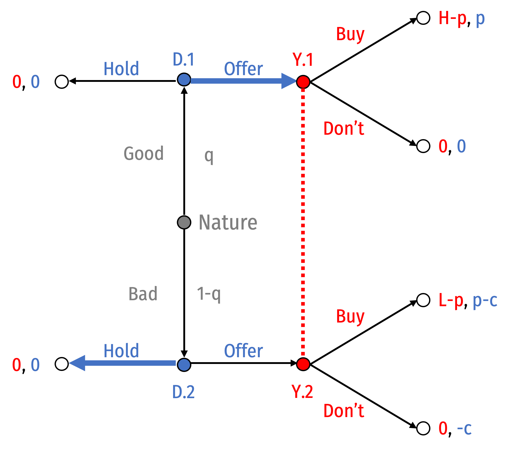
]
]

.source[Akerlof, George A, 1970, “The Market for 'Lemons': Quality Uncertainty and the Market Mechanism,” *Quarterly Journal of Economics* 84(3): 488-500]

---

# Separating Equilibrium I: Good: Offer; Bad: Hold

.pull-left[
- Suppose **Good Dealers offer and Bad Dealers hold**

- Bayes’ Law would imply your beliefs must be:
$$P(\text{Good|Offer})=1$$


]

.pull-right[
.center[

]
]

.source[Akerlof, George A, 1970, “The Market for 'Lemons': Quality Uncertainty and the Market Mechanism,” *Quarterly Journal of Economics* 84(3): 488-500]

---

# Separating Equilibrium I: Good: Offer; Bad: Hold

.pull-left[
- Suppose **Good Dealers offer and Bad Dealers hold**

- Bayes’ Law would imply your beliefs must be:
$$P(\text{Good|Offer})=1$$

- .red[You buy] if any type of .blue[Dealer offers]

- .blue[Good Dealer] wants to .blue[Offer] since .red[You] will .red[Buy]

- .blue[Bad Dealer] will .red[Hold] if $p<c$

]

.pull-right[
.center[
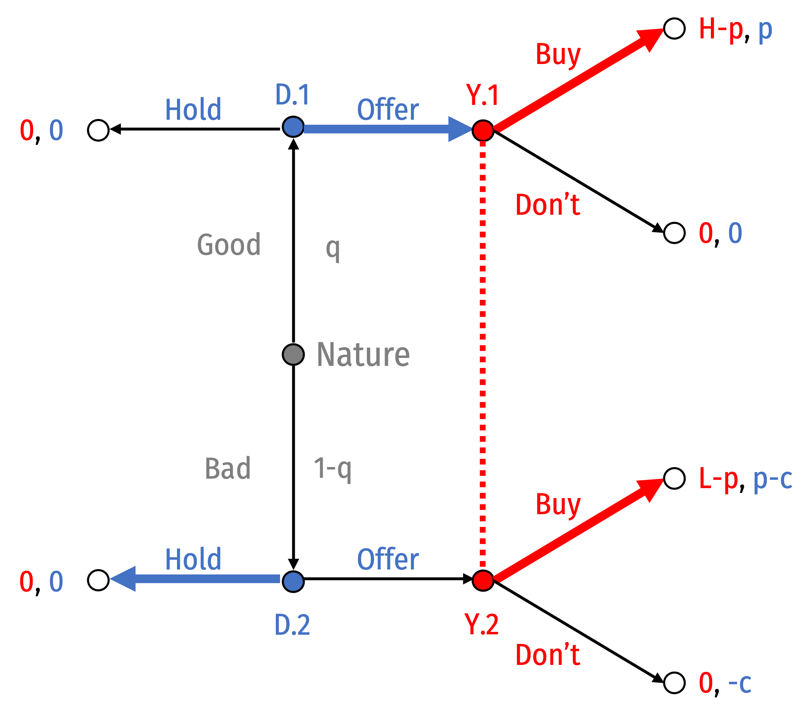
]
]

.source[Akerlof, George A, 1970, “The Market for 'Lemons': Quality Uncertainty and the Market Mechanism,” *Quarterly Journal of Economics* 84(3): 488-500]

---

# Separating Equilibrium I: Good: Offer; Bad: Hold

.pull-left[
- Suppose **Good Dealers offer and Bad Dealers hold**

- The following is a .hi-purple[PBNE]:
  - **Behavioral strategy**: {.red[Buy], .blue[(Good: Offer, Bad: Hold)]}
  - **Belief system**: $P(\text{good|offer})=0$

- This is the important PBNE, we will return to it
]

.pull-right[
.center[

]
]

.source[Akerlof, George A, 1970, “The Market for 'Lemons': Quality Uncertainty and the Market Mechanism,” *Quarterly Journal of Economics* 84(3): 488-500]

---

# Separating Equilibrium II: Good: Hold; Bad: Offer

.pull-left[
- Suppose **Good Dealers hold and Bad Dealers offer**

]

.pull-right[
.center[
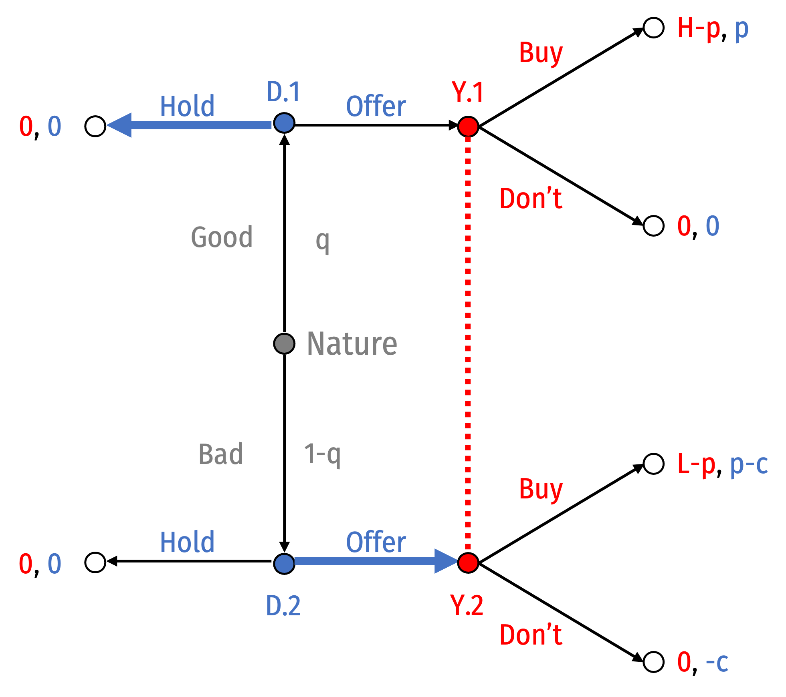
]
]

.source[Akerlof, George A, 1970, “The Market for 'Lemons': Quality Uncertainty and the Market Mechanism,” *Quarterly Journal of Economics* 84(3): 488-500]

---

# Separating Equilibrium II: Good: Hold; Bad: Offer

.pull-left[
- Suppose **Good Dealers hold and Bad Dealers offer**

- Bayes’ Law would imply your beliefs:
$$P(\text{Good|Offer})=0$$

]

.pull-right[
.center[

]
]

.source[Akerlof, George A, 1970, “The Market for 'Lemons': Quality Uncertainty and the Market Mechanism,” *Quarterly Journal of Economics* 84(3): 488-500]

---

# Separating Equilibrium II: Good: Hold; Bad: Offer

.pull-left[
- Suppose **Good Dealers hold and Bad Dealers offer**

- Bayes’ Law would imply your beliefs:
$$P(\text{Good|Offer})=0$$

- .red[You Don't Buy] if any .blue[Dealer Offers]
  - .blue[Good Dealer] wants to .blue[Hold] since .red[You Don't Buy]
  - .blue[Bad Dealer] would want to **switch** to .blue[Hold] since .red[You Don't Buy]  
]

.pull-right[
.center[
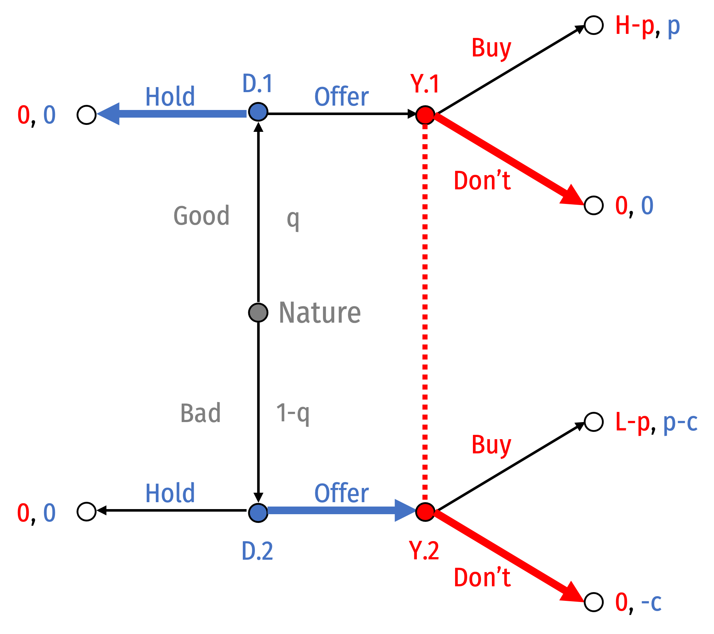
]
]

.source[Akerlof, George A, 1970, “The Market for 'Lemons': Quality Uncertainty and the Market Mechanism,” *Quarterly Journal of Economics* 84(3): 488-500]

---

# Separating Equilibrium II: Good: Hold; Bad: Offer

.pull-left[
- Suppose **Good Dealers hold and Bad Dealers offer**

- Bayes’ Law would imply your beliefs:
$$P(\text{Good|Offer})=0$$

- .red[You Don't Buy] if any .blue[Dealer Offers]
  - .blue[Good Dealer] wants to .blue[Hold] since .red[You Don't Buy]
  - .blue[Bad Dealer] would want to **switch** to .blue[Hold] since .red[You Don't Buy]
]

.pull-right[
.center[

]
]

.source[Akerlof, George A, 1970, “The Market for 'Lemons': Quality Uncertainty and the Market Mechanism,” *Quarterly Journal of Economics* 84(3): 488-500]

---

# Separating Equilibrium II: Good: Hold; Bad: Offer

.pull-left[
- Suppose **Good Dealers hold and Bad Dealers offer**

- There is **no PBNE** where {.blue[(Good: Bad, Bad: Offer)]}
]

.pull-right[
.center[

]
]

.source[Akerlof, George A, 1970, “The Market for 'Lemons': Quality Uncertainty and the Market Mechanism,” *Quarterly Journal of Economics* 84(3): 488-500]

---

# The Market for Lemons

.pull-left[
.quitesmall[
- Conditions under which the following could be PBNE:

1. .hi-purple[Pooling eq. I]: Both Types of .blue[Dealer] Offer
  - .red[You Buy]
  - When $p<c$, $E[Buy]>0$, and $P(\text{Good|Offer})=1$

2. .hi-purple[Pooling eq. II]: Both Types of .blue[Dealer] Hold
  - .red[You Don't Buy]
  - When $P(\text{Good|Offer})=0$

3. .hi-purple[Separating eq. I]: .blue[Good]: Offer and .blue[Bad]: Don't
  - .red[You Buy]
  - When $c>p$, $P(\text{Good|Offer})=1$

4. .hi-purple[Separating eq. II]: .blue[Good]: Don't and .blue[Bad]: Hold
  - Impossible

]
]
.pull-right[
.center[

]
]

.source[Akerlof, George A, 1970, “The Market for 'Lemons': Quality Uncertainty and the Market Mechanism,” *Quarterly Journal of Economics* 84(3): 488-500]

---

# The Market for Lemons

.pull-left[
- The desirable separating equilibrium (.blue[Good Dealers offer]; .blue[Bad Dealers hold]) is achieved via a **costly** .hi[signal]
  - If $p<c$, .blue[Dealers] will only offer cars if they are **good**
  - Too costly for a **bad** .blue[dealer] to offer a car

- In real life markets:
  - CarFax
  - Warranties
]

.pull-right[
.center[


]
]

---

# Market-Solutions to Asymmetric Info

.left-column[
.center[

.smallest[
George Akerlof

1940—

Economics Nobel 2001
]
]
]

.right-column[
.smallest[
> “Numerous institutions arise to counteract the effects of quality uncertainty. One obvious institution is guarantees. Most consumer durables carry guarantees to ensure the buyer of some normal expected quality. One natural result of our model is that the risk is borne by the seller rather than by the buyer,” (p. 499).

> “A second example of an institution which counteracts the effects of quality uncertainty is the brand-name good. Brand names not only indicate quality but also give the consumer a means of retaliation if the quality does not meet expectations,” (pp.499-500).

]
.source[Akerlof, George A, 1970, “The Market for 'Lemons': Quality Uncertainty and the Market Mechanism,” *Quarterly Journal of Economics* 84(3): 488-500]

]

---

# Market-Solutions to Asymmetric Info

.left-column[
.center[

.smallest[
George Akerlof

1940—

Economics Nobel 2001
]
]
]

.right-column[
> “Chains - such as hotel chains or restaurant chains - are similar to brand names, (p.500)

> “Licensing practices also reduce quality uncertainty,” (p.500).


.source[Akerlof, George A, 1970, “The Market for 'Lemons': Quality Uncertainty and the Market Mechanism,” *Quarterly Journal of Economics* 84(3): 488-500]

]

---

class: inverse, center, middle

# Signaling Example II: Spence (1973) Job-Market Signaling

---

# The Economics of Higher Education

.pull-left[
.smaller[
- Workers with more education earn higher wages, the question is *why*: 

- .hi-purple[Human capital theory]
  - on the margin, higher education increases workers' productivity
  - workers with more education *become* more productive
  - workers weigh MB and MC of buying additional amounts of education

]
]
.pull-right[
.center[

]
]

---

# The Economics of Higher Education

.pull-left[
.smaller[
- Workers with more education earn higher wages, the question is *why*: 

- .hi-purple[Signaling theory]
  - on the margin, higher education *does not* increase workers' productivity
  - obtaining higher education *signals* (pre-existing) ability
  - only workers with already-high ability get higher education

]
]
.pull-right[
.center[

]
]

---

# Job Market Signalling

.left-column[
.center[

.smallest[
A. Michael Spence

1943—

Economics Nobel 2001
]
]
]

.right-column[

> “To hire someone, then, is frequently to purchase a lottery. In what follows, I shall assume the employer pays the certain monetary equivalent of the lottery to the individual as wage. If he is risk-neutral, the wage is taken to be the individual's marginal contribution to the hiring organization.

.source[Spence, A Michael, 1973, “Job Market Signaling” *Quarterly Journal of Economics* 87(3): 355-374]
]

---


# Job Market Signalling

.left-column[
.center[

.smallest[
A. Michael Spence

1943—

Economics Nobel 2001
]
]
]

.right-column[

.quitesmall[
> “Primary interest attaches to how the employer perceives the lottery, for it is these perceptions that determine the wages he offers to pay. We have stipulated that the employer cannot directly observe the marginal product prior to hiring. What he does observe is a plethora of personal data in the form of observable characteristics and attributes of the individual, and it is these that must ultimately determine his assessment of the lottery he is buying. (The image that the individual presents includes education, previous work, race, sex, criminal and service records, and a host of other data.) This essay is about the endogenous market process whereby the employer requires (and the individual transmits) information about the potential employee, which ultimately determines the implicit lottery involved in hiring, the offered wages, and in the end the allocation of jobs to people and people to jobs in the market,” (pp.356-357).

]


.source[Spence, A Michael, 1973, “Job Market Signaling” *Quarterly Journal of Economics* 87(3): 355-374]

]

---


# Job Market Signalling

.left-column[
.center[

.smallest[
A. Michael Spence

1943—

Economics Nobel 2001
]
]
]

.right-column[

.smallest[
> “Of those observable, personal attributes that collectively constitute the image the job applicant presents, some are immutably fixed, while others are alterable. For example, education is something that the individual can invest in at some cost in terms of time and money. On the other hand, race and sex are not generally thought to be alterable. I shall refer to observable, unalterable attributes as indices, reserving the term signals for those observable characteristics attached to the individual that are subject to maniplllation by him. Some attributes, like age, do change, but not at the discretion of the individual. In my terms, these are indices,” (pp.357).

]
.source[Spence, A Michael, 1973, “Job Market Signaling” *Quarterly Journal of Economics* 87(3): 355-374]

]

---

# Job Market Signalling

.left-column[
.center[

.smallest[
A. Michael Spence

1943—

Economics Nobel 2001
]
]
]

.right-column[

.smallest[

> “Signals, on the other hand, are alterable and therefore potentially subject to manipulation by the job applicant. Of course, there may be costs of making these adjustments. Education, for example, is costly. We refer to these costs as signaling costs. Notice that the individual, in acquiring an education, need not think of himself as signaling. He will invest in education if there is sufficient return as defined by the offered wage sched~le.I~ndividuals, then, are assumed to select signals (for the most part, I shall talk in terms of education) so as to maximize the difference between offered wages and signaling costs,” (357).
]


.source[Spence, A Michael, 1973, “Job Market Signaling” *Quarterly Journal of Economics* 87(3): 355-374]

]
---

# Spence’s Model

.pull-left[

- A very simple numerical example

- Two groups I (low-ability) and II (high-ability) with different marginal products that firms cannot directly observe
  - Group I is $q_1$ fraction of population

- Each can choose to get $y$ amount of education which costs $y$ to Group I, $\frac{y}{2}$ to Group II
]

.pull-right[
.center[
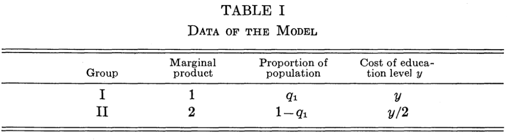
]
]

---

# Spence’s Model

.pull-left[

- Assume labor markets are competitive
  - A worker's wage is equal to their expected output

- .hi-turquoise[If employers could know a worker’s ability:]
  - Wages would then be:
    - $1$ for Group I (low ability)
    - $2$ for Group II (high ability)

- In this scenario, nobody gets any education!
  - Best outcome for high ability workers (Group II)

]

.pull-right[
.center[

]
]

---

# Spence’s Model


.pull-left[

- .hi-turquoise[If employers *cannot* determine a worker’s ability:]

- Firm would have to offer expected marginal product to all workers:

$$\begin{align*}
E[W]&=1(q_1)+2(1-q_1)\\
E[W]&=2-q_1\\ \end{align*}$$
]

.pull-right[
.center[

]
]

---

# Spence’s Model

.pull-left[

- .hi-turquoise[If firms could (*only*) observe a worker's education level:]
  - Wages only depend on level of education

- To offer a wage, firms must form **beliefs** about workers’ ability (given their education level)

]

.pull-right[
.center[

]
]


---

# Spence’s Model

.pull-left[
.smallest[
- Suppose firms believe there is some amount of education $y^\star$ such that if:
  - a worker has *less than* $y^\star$ education, they are low ability (Group I), thus firm offers them wage of 1
  - a worker has *at least* $y^\star$ education, they are high ability (Group II), thus firm offers them wage of 2
]
]

.pull-right[
.center[
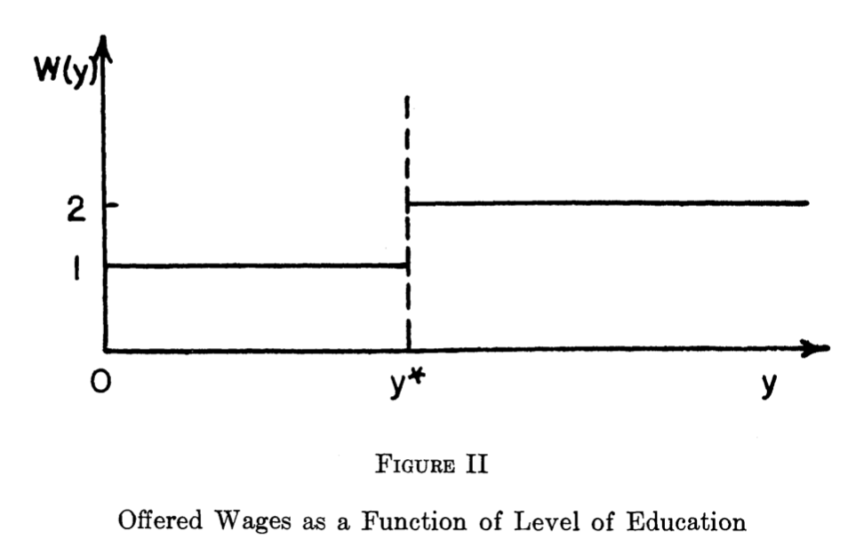
]
]

---

# Spence’s Model

.pull-left[
.smallest[
- Suppose firms believe there is some amount of education $y^\star$ such that if:
  - a worker has *less than* $y^\star$ education, they are low ability (Group I) 
  - a worker has *at least* $y^\star$ education, they are high ability (Group II)

- Then Group I will get no education $y=0$ (so long as $2-y^\star <1)$, and Group II will get $y^\star$ education (so long as $2-\frac{y^\star}{2} > 1)$

- This .hi[signalling equilibrium] occurs when $1<y^*<2$
]
]

.pull-right[
.center[
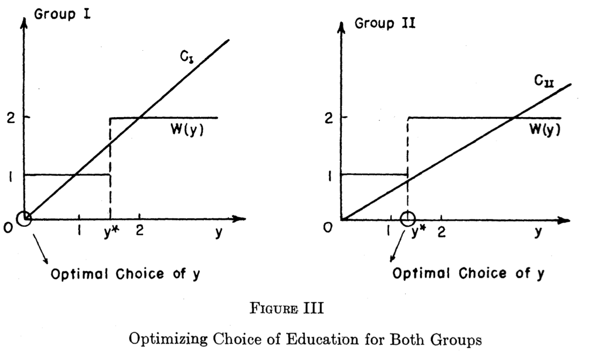
]
]

---

# Spence’s Model

.left-column[
.center[

.smallest[
A. Michael Spence

1943—

Economics Nobel 2001
]
]
]

.right-column[

.smallest[

> “Increases in the level of $y^\star$ hurt Group II, while, at the same time, members of Group I are unaffected. Group I is worse off than it was with no signaling at all. For if no signaling takes place, each person is paid his unconditional expected marginal product, which is just $[2-q_1]$. Group II may also be worse off than it was with no signaling. Assume that the proportion of people in Group I is 0.5. Since $y^\star >1$ and the net return to the member of Group I1 is $2-\frac{^\star}{2}$, in equilibrium his net return must be below 1.5, the no-signaling wage. Thus, everyone would prefer a situation in which there is no signaling,” (p.364).

]


.source[Spence, A Michael, 1973, “Job Market Signaling” *Quarterly Journal of Economics* 87(3): 355-374]

]
---

# Spence’s Model

.left-column[
.center[

.smallest[
A. Michael Spence

1943—

Economics Nobel 2001
]
]
]

.right-column[

.smallest[

> “Given the signaling equilibrium, the education level $y^\star$, which defines the equilibrium, is an entrance requirement or prerequisite for the high-salary job - or so it would appear from the outside. From the point of view of the individual, it is a prerequisite that has its source in a signaling game. Looked at from the outside, education might appear to be productive. It is productive for the individual, but, in this example, it does not increase his real marginal product at all,” (p.364).

]


.source[Spence, A Michael, 1973, “Job Market Signaling” *Quarterly Journal of Economics* 87(3): 355-374]

]

---

# Essence of the Signaling Model of Education

.pull-left[
- Suppose there are two types of workers:
  - H: high ability, in proportion $q$
  - L: low ability, in proportion $1-q$

- Workers output (productivity) is equal to
  - $H$ if high ability
  - $L$ if low ability
]

.pull-right[
.center[

]
]

---

# Essence of the Signaling Model of Education

.pull-left[
- Workers choose to get (high) education or no (low) education
  - Low education costs nothing
  - High education costs:
      - $c_H$ to high ability worker
      - $c_L$ to low ability worker

- Education has **no impact** on worker's output (productivity)!
]

.pull-right[
.center[

]
]

---

# Essence of the Signaling Model of Education

.pull-left[
- Assume labor markets are competitive
  - A worker's wage is equal to their expected output

- .hi-turquoise[If employers could know a worker’s ability:]
  - Wages would then be:
    - $w_H=H$ for high ability
    - $w_L=L$ for low ability

- In this scenario, nobody gets any education!
  - Best outcome for High ability workers

]

.pull-right[
.center[

]
]

---

# Essence of the Signaling Model of Education

.pull-left[
.smallest[
- .hi-turquoise[If employers could *only* observe a worker's education level:]
  - Wages only depend on level of education

- To offer a wage, employers must form **beliefs** about workers’ ability (given their education level)
]
]

.pull-right[
.center[

]
]

---

# Essence of the Signaling Model of Education

.pull-left[
.smallest[
- Consider the conditions for one .hi-purple[separating equilibrium] where:
  - high-ability workers acquire (more) education
  - low-ability workers acquire no (or less) education

- Employers offer wages:
  - $w_H=H$
  - $w_L=L$

- Employer beliefs: 
  - $P(\text{High Ability}|\text{Education})=1$
  - $P(\text{Low Ability}|\text{No Education})=1$

]
]

.pull-right[
.center[

]
]

---

# Essence of the Signaling Model of Education

.pull-left[
.smallest[

- High-ability workers: choose to get Education if $H-c_H>L$
- Low-ability workers: choose to get No Education if $L>H-c_L$

- Main condition: $c_H < H-L < c_L$

]
]

.pull-right[
.center[

]
]

---
# Essence of the Signaling Model of Education

.pull-left[
.smallest[
- Higher education contributes nothing to productivity, but is *more* costly for low ability workers
    - High ability workers incur the cost of high education **just to signal they are high ability**
    - Low ability workers cannot afford to incur the cost, and don't get high education

- In signalling equilibrium, high ability workers are worse off by $c_H$

]
]

.pull-right[
.center[
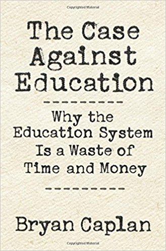
]
]

---

class: inverse, center, middle

# Signaling Example III: Leeson (2012) Ordeals

---

# Obligatory

.center[
<iframe width="980" height="550" src="https://www.youtube.com/embed/zrzMhU_4m-g" title="YouTube video player" frameborder="0" allow="accelerometer; autoplay; clipboard-write; encrypted-media; gyroscope; picture-in-picture" allowfullscreen></iframe>
]

---

# Ordeals

.left-column[
.center[


.smallest[
Peter Leeson

1979—
]
]
]

.right-column[

.smaller[
> “For 400 years the most sophisticated persons in Europe decided difficult criminal cases by asking the defendant to thrust his arm into a cauldron of boiling water and fish out a ring. If his arm was unharmed, he was exonerated. If not, he was convicted. Alternatively, a priest dunked the defendant in a pool. Sinking proved his innocence; floating proved his guilt. People called these trials ordeals. No one alive today believes ordeals were a good way to decide defendants’ guilt. But maybe they should....hi[Medieval judicial ordeals achieved what they sought: a way of accurately assigning guilt and innocent where traditional means couldn’t].”

]

.source[Leeson, Peter T, 2012, “Ordeals,” *Journal of Law and Economics* 55: 691—714]
]

---

# Ordeals: *Why* They Worked

.pull-left[

- Ordeals were only used when there was uncertainty about a person's innocence or guilt

- Obvious cases were settled with evidence and witnesses 

]

.pull-right[
.center[
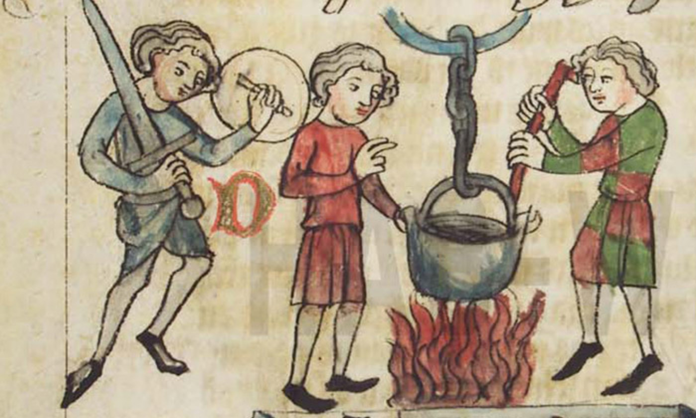
]
]

---

# Ordeals: *Why* They Worked

.pull-left[

- .blue[Accused] is either Innocent (with probability $p)$ or Guilty
  - Choice is a **message** to .red[Priest]: .blue[Undergo] or .blue[Refuse] an ordeal

- .red[Priest] observes choice, but does not know *true* innocence or guilt

- Must find a signal such that payoffs create a .hi[separating equilibrium] where (.blue[Innocent: Undergo], .blue[Guilty: refuse]) 

]

.pull-right[
.center[
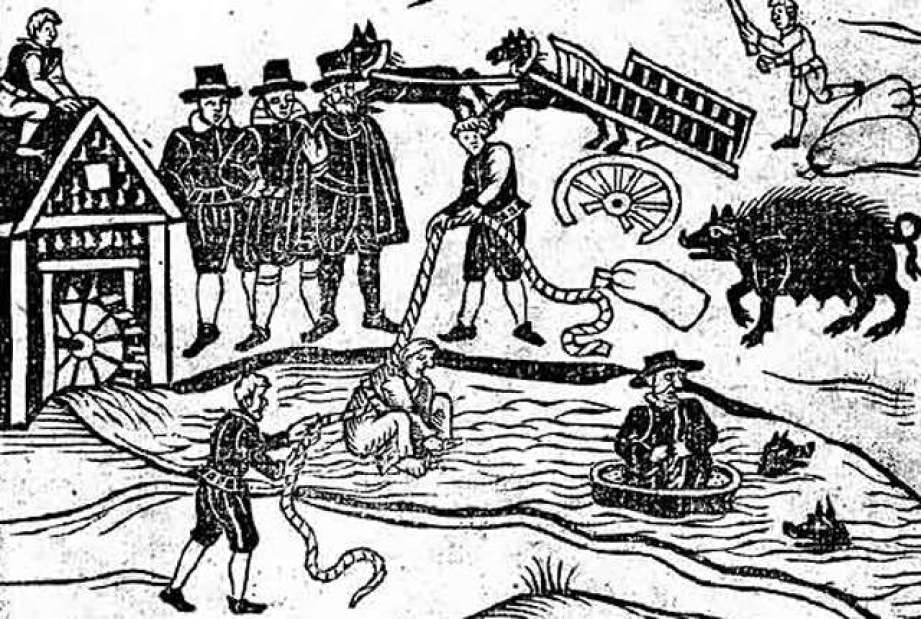
]
]

---

# Ordeals: The Law and Economics of Superstition

.pull-left[

- Ordeals “worked” because of .hi-purple[iudecium Dei]: God would protect the truly innocent and expose the guilty during the ordeal
  - Specifically, worked because of people’s *believeds* in *iudecium Dei*

- Priests didn’t *actually* leave it in God's hands, but cleverly leveraged people's belief in *iudecium Dei*

]

.pull-right[
.center[

]
]

---

# Ordeals: The Law and Economics of Superstition

.pull-left[

- If people believe in *iudecium Dei*

- and .blue[Accused] ranks payoffs:
    1. Truly innocent: Undergo and pass
    2. Truly guilty: Refuse and confess
    3. Truly innocent: Refuse
    4. Truly guilty: Undergo and fail

- Then .red[Priest]’s updated beliefs are:
  - $p(Innocent|Undergo) = 1$
  - $p(Guilty|Refuse) = 1$

]

.pull-right[
.center[

]
]

---

# Ordeals: The Law and Economics of Superstition

.pull-left[

- Conditional on observing the .blue[Accused]’s decision to undertake ordeal, .red[Priest] knows person is (very probably) innocent
  
- .blue[Priest] rigs the Ordeal so the accused "miraculously" passes it

- Events were religious, sanctimonious, ritualized, .red[Priest] had lots of (trusted) discretion

]

.pull-right[
.center[

]
]

---

# Ordeals: The Law and Economics of Superstition

.pull-left[
.smallest[
- Ordeals *only* work for people who believe in *iudicium Dei*
  - Reserved for the most difficult cases with no evidence or witnesses

- What about “skeptics”?
  - Priest had to let a proportion of those undertaking ordeal fail them (even if they were innocent!)
  - Maintains an equilibrium of belief in *iudicium Dei*

- *Known* non-believers (or non-Christians) were *not* presented with Ordeals as an option
]
]

.pull-right[
.center[

]
]

---

# Ordeals: The Law and Economics of Superstition

.pull-left[
- In 1215, Fourth Lateran Council rejects the legitimacy of judicial ordeals, banned priests from administering them
  - Belief in *iudicium Dei* evaporates
  - Ordeals would no longer work — requires the superstition as sorting mechanism

- Today we have technology that can accurately separate innocence and guilt in very hard cases (e.g. DNA evidence)  

]

.pull-right[
.center[

]
]

---

# Ordeals

.left-column[
.center[


.smallest[
Peter Leeson

1979—
]
]
]

.right-column[

.smallest[
> “Though rooted in superstition, judicial ordeals weren’t irrational. Expecting to emerge from ordeals unscathed and exonerated, innocent persons found it cheaper to undergo ordeals than to decline them. Expecting to emerge...boiled, burned, or wet and naked and condemned, guilty persons found it cheaper to decline ordeals than to undergo them. [Priests] knew that only innocent persons would want to undergo ordeals...[and] exonerated probands whenever they could. Medieval judicial ordeals achieved what they sought: they accurately assigned guilt and innocence where traditional means couldn’t.”

]

.source[Leeson, Peter T, 2012, “Ordeals,” *Journal of Law and Economics* 55: 691—714]
]

---
# The Law and Economics of Superstitution: Persistance

.center[

]

---

# The Law and Economics of Superstitution: Persistance

.center[
<iframe width="980" height="550" src="https://www.youtube.com/embed/rN7pkFNEg5c" title="YouTube video player" frameborder="0" allow="accelerometer; autoplay; clipboard-write; encrypted-media; gyroscope; picture-in-picture" allowfullscreen></iframe>
]

---

class: inverse, center, middle

# Signaling Takeaways

---

# Signalling in Biology

.pull-left[

- The peacock's famous tail is a quintessential example

- Why do we observe traits in species that *reduce* fitness?
  - Because they are costly signals!

- .hi-purple[Handicap Principle]: reliable signals **must be costly** to the signaler such that it is prohibitively costly for a weaker individual

.source[Zahavi, A, 1975, “Mate selection - a selection for a handicap,” *Journal of Theoretical Biology*

Grafen, A, 1990, “Biological signals as handicaps,” *Journal of Theoretical Biology*]
]

.pull-right[
.center[

]
]

---

# Sustaining Cooperation: Signaling vs. Reputation

.pull-left[

- (Credible) signals and reputation both encourage cooperation, but via different mechanisms

- Reputation is an **ex post** enforcement mechanism for cooperation
> “If you cheat, then I will sever our existing relationship in the future and tell all my friends not to trust you”
  - .hi-purple[Folk theorem] requires repeat interaction and high discount rates
  - Limited to your social network, where you can spread the word]

.pull-right[
.center[

]
]

---

# Sustaining Cooperation: Signaling vs. Reputation

.pull-left[

- Signaling is an **ex ante** *commitment*
>“I, a stranger, am demonstrating to you before we establish a relationship that I am trustworthy”*

- A *good* (credible) signal:
  - Must be costly, not free
  - But more costly for “bad” type than “good” type
    
- A *bad* (non-credible) signal: 
  - May be free
  - Or may have same cost for all types 

.pull-right[
.center[

]
]

---

# Sustaining Cooperation: Signaling vs. Reputation

.pull-left[
.center[

]
]

.pull-right[
.center[

]
]
