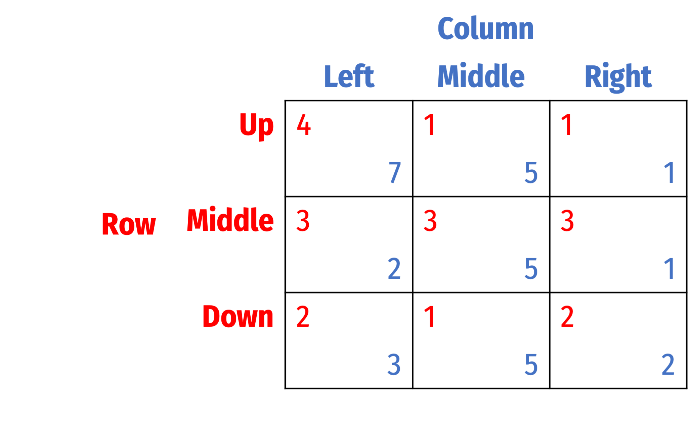
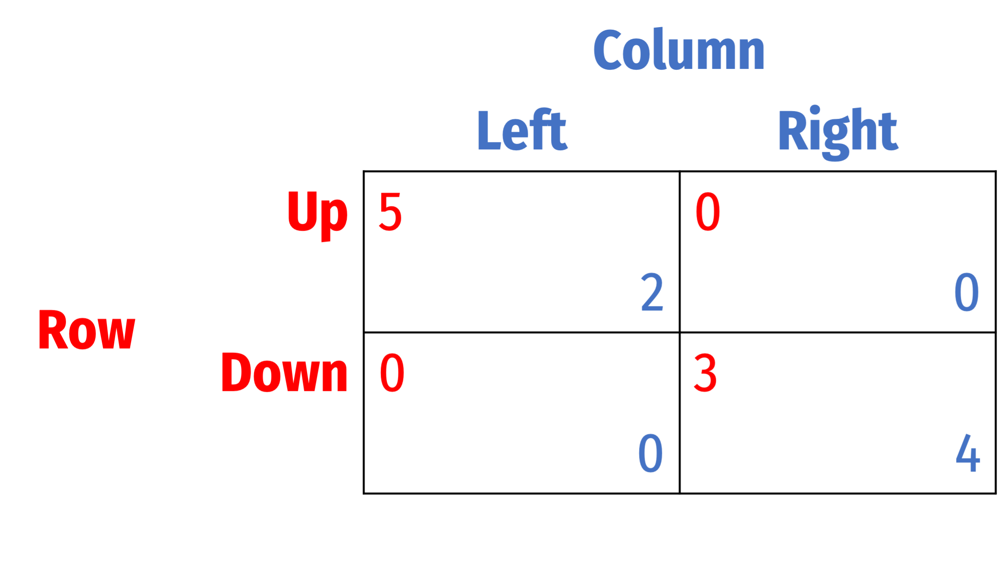

```{r setup, include=FALSE}
options(htmltools.dir.version = FALSE)
knitr::opts_chunk$set(echo=F,
                      message=F,
                      warning=F,
                      fig.retina = 3,
                      fig.align = "center")
library("tidyverse")
library("ggrepel")
library("fontawesome")
xaringanExtra::use_tile_view()
xaringanExtra::use_tachyons()
xaringanExtra::use_freezeframe()

update_geom_defaults("label", list(family = "Fira Sans Condensed"))
update_geom_defaults("text", list(family = "Fira Sans Condensed"))

set.seed(256)

theme_slides <- theme_light() + 
  theme(
    text = element_text(family = "Fira Sans", size = 24)
  )
```

# Midterm Exam — Logistics

- On Blackboard
- Open book/notes/website

---

# Midterm Exam

- Less than 10 questions
- A few short answer (concepts or explanation)
- A few problems (like HWs and in-class problems)
- Bonus questions
- I will add your bonus points from the Grade Game from our 1^st^ class
- You can bring a calculator, but I will try to keep numbers simple

---

# Major Concepts I

- Sequential Games
    - game trees
    - strategy
    - rollback equilibrium
    - order advantages
- Simultaneous Games
    - Nash equilibrium (detection):
        - Successive elimination of dominated strategies
        - Best response
    - Nash equilibrium refinements:
        - Focal points
        - Pareto efficiency
        - Payoff dominance
        - Risk dominance
        - Rationalizability

---

# Major Concepts II

- Types of Games:
    - Constant sum game
    - Prisoners' dilemma
    - Coordination games:
        - (Pure) Coordination
        - Assurance (Stag Hunt)
        - Battle of the Sexes
        - Chicken (Hawk-Dove)

---

# Major Concepts III

- Economics of oligopoly
    - Oligopoly as prisoners' dilemma
    - Cartels
        - problems and mechanisms to overcome
    - Bertrand competition
    - Cournot competition (and collusion)
    - Stackelberg competition
    - Contestable markets
- Mixed strategies
    - Opponent indifference principle

---

# Don't Worry About

- Harder questions on HWs/in class (meant to challenge you in low-stakes environment):
  - Cournot competition with $n>2$ firms
  - Mixed strategies for $>2$ strategies (e.g. Rock-Paper-Scissors)

---

class: inverse, center, middle

# Review Questions

---

# Question 1

- Name several different refinements of Nash equilibrium.

---

# Question 2

- Explain the differences between the three different models of oligopoly.

--

- Which is most/least profitable to each firm?

---

# Question 3

- What is the Nash equilibrium of a contestable market? What conditions are required for a market to be contestable?

---

# Question 4

- Name the four types of coordination games and describe the major features of each. 

---

# Question 5

- Explain the differences between a *prisoners' dilemma* and a *stag hunt.*

You can draw example payoff tables, and let each player choose between "Cooperate" and "Defect" for each game. 

---

# Question 6

.pull-left[

- Consider the game to the right:
- Find all Nash equilibria
- Which is/are Pareto efficient?
- Which is/are payoff dominant?
- Which is/are risk dominant? 
- Which outcome/s is/are rationalizable?

]

.pull-right[
.center[

]
]

---

# Question 7

- Two firms are competing simultaneously over quantity, have constant marginal costs of \$0, and share the market demand

$$\begin{align*}
p&=12-Q\\
Q&=q_1+q_2\\
\end{align*}$$

- Find the Cournot-Nash equilibrium profit for each firm.

---

# Question 8

.pull-left[

- Find all Nash equilibria (in pure and mixed strategies) for the following game:

]

.pull-right[
.center[

]
]